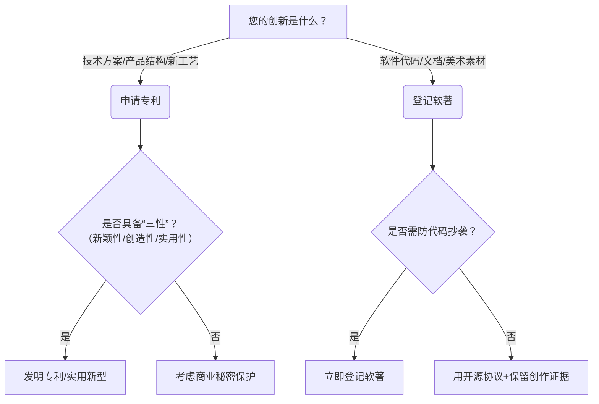

# 专利与软著

以下是关于**专利**与**软件著作权（软著）** 的核心区别及申请指南，结合**2026年最新政策**整理，助您高效保护创新成果：

---

### **一、本质区别**
| **维度**   | **专利**                | **软件著作权（软著）**         |
|----------|-----------------------|-----------------------|
| **保护对象** | 技术方案（发明/实用新型/外观设计）    | **代码的表达形式**（源代码、文档）   |
| **保护核心** | **技术思想**（解决什么问题、如何实现） | **代码原创性**（不保护算法/功能逻辑） |
| **审查方式** | 需实质审查（发明）/初步审查（实用新型）  | **形式审查**（仅核对材料完整性）    |
| **保护期**  | 发明20年/实用新型10年/外观15年   | **作者终身+50年**（法人作品50年） |
| **维权关键** | 证明技术被他人**未经许可使用**     | 证明代码被**直接复制**         |

> 💡 **典型案例**：
> - 为APP的**图像识别算法**申请**发明专利**（保护技术思想）；
> - 为APP的**源代码**登记**软著**（防盗用代码）；
> - 若APP有独特**交互界面**，可申请**外观设计专利**（2025年新规：GUI界面已明确纳入保护）。

---

### **二、2026年申请关键变化**
#### **专利**
1. **AI相关发明**（2025新规）：
  - 纯AI算法**不可专利**，但若与**具体工业场景结合**（如“AI+医疗影像诊断设备”），可申请发明专利。
  - 需在说明书中**明确技术效果**（例：“将诊断准确率提升15%”）。
2. **优先审查**：
  - 绿色技术/芯片/生物医药领域专利，审查周期**压缩至3-6个月**（2026年试点扩大）。

#### **软著**
1. **登记效率**：
  - 全国软著登记中心推行**AI自动核验**，普通件**7个工作日内**下发证书（2026年1月起实施）。
2. **登记材料简化**：
  - **不再强制要求**提交全部源代码，前30页+后30页（每页50行）即可，核心模块可申请**保密处理**。

---

### **三、如何选择？—— 决策树**

> ⚠️ **避坑提醒**：
> - **软著≠专利**：他人用不同代码实现相同功能，不侵犯软著（但可能侵犯专利）；
> - **发表后再申请专利**：论文/产品上线公开后，**6个月内**需提出专利申请（中国宽限期），否则丧失新颖性！

---

### **四、成本与周期（2026年标准）**
| **类型**   | 官费（人民币） | 代理费         | 周期        | 加急渠道          |
|----------|---------|-------------|-----------|---------------|
| **发明专利** | 3450元   | 8000~15000元 | 1.5~3年    | 优先审查（需符合产业政策） |
| **实用新型** | 500元    | 2000~5000元  | 3~8个月     | 无加急           |
| **软著登记** | 300元    | 500~1500元   | **7-15天** | 电子认证+加急通道（3天） |

> 💡 **省钱技巧**：
> - 个人申请软著官费减免85%（需提供身份证+创作说明）；
> - 高校/科研机构职务发明，专利年费**连续5年减免70%**（2026年科技部新政策）。

---

### **五、行动建议**
1. **代码类创新**：  
   → **先登记软著**（快速确权），**再评估专利**（保护核心算法）；
2. **硬件+软件结合**：  
   → 为硬件申请**实用新型**，为控制算法申请**发明专利**，代码登记**软著**；
3. **紧急保护**：  
   → 软著加急登记（3天拿证） + 全球专利PPH加速（中美欧日韩联动）。

**官方渠道**：
- 专利：[国家知识产权局专利业务办理系统](http://cponline.cnipa.gov.cn)
- 软著：[中国版权保护中心](http://www.ccopyright.com.cn) → 2026年新增“AI辅助登记”入口

> 🌟 **2026新趋势**：国家推动“专利+软著”打包审查（试点地区：北京/上海/深圳），企业可同步提交材料，审查周期缩短40%。

如需具体领域策略（如AI、区块链、医疗器械软件），欢迎补充细节，我将提供定制方案！ 🔐