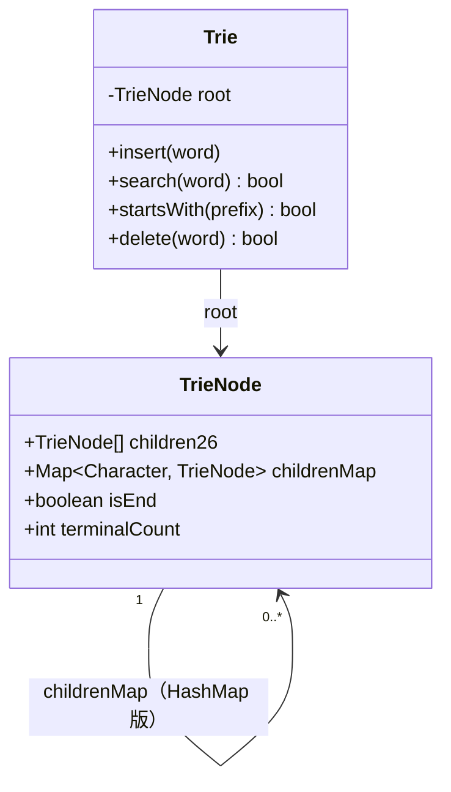
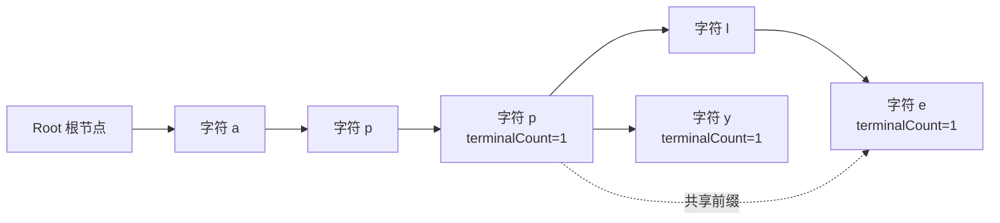

<!--module:
  parent: algorithms/string-algorithms
  slug: 02.computer-basics/02-algorithms/string-algorithms/01-trie-data-structure
  type: topic
  category: Trie 字典树
  summary: Trie 数据结构 —— Java 数组实现 + HashMap 实现 + 自动补全实战
-->

# Trie（字典树）· 完整实现

> **一句话**：Trie 是**为前缀查询优化的树**——插入 / 查 O(len)，与字典大小无关。Java 实现 50 行（数组版）或 80 行（HashMap 版）。

← [返回: 字符串算法](../README.md) | [返回: 算法](../README.md) | [返回: 计算机基础](../../README.md)

---

## Trie 节点设计
### 1.1 数组实现（紧凑 + 快速）

```java
class TrieNode {
    // 子节点（26 个英文字母 / 数组下标表示字符）
    TrieNode[] children = new TrieNode[26];
    // 是否单词结尾
    boolean isEnd = false;
}
```

**优点**：访问 O(1) 数组下标，速度最快
**缺点**：固定字符集（修改字符集需重写）

### 1.2 HashMap 实现（灵活）

```java
class TrieNode {
    Map<Character, TrieNode> children = new HashMap<>();
    boolean isEnd = false;
}
```

**优点**：支持任意字符集（中文 / Unicode）
**缺点**：HashMap 访问稍慢

### 1.3 紧凑版（生产推荐）

```java
class TrieNode {
    Map<Character, TrieNode> children = new HashMap<>();
    boolean isEnd;
    // 计数（统计频次 / 自动补全排序用）
    int count;
}
```

### 1.4 节点结构图：共享前缀如何落到节点

Trie 的根节点不代表任何字符，只负责保存第一层入口；真正的单词从根向下的一条路径表示。`isEnd` 必须放在节点上，而不是边上，因为 `app` 既可能是完整单词，也可能只是 `apple` 的前缀。



> `children26` 与 `childrenMap` 是两种互斥的子节点表示，不应在同一个生产节点里同时分配。`terminalCount` 比单独的 `isEnd` 多表达一层语义：重复插入同一个词时可以按次数删除；`terminalCount > 0` 等价于 `isEnd = true`。



上图插入 `app`、`apple`、`apply` 后，`app` 节点同时是一个终点和两个更长单词的分叉点。查询 `app` 不能因为它还有子节点就返回 false；删除 `app` 也不能把 `a-p-p` 节点直接剪掉，否则会误删 `apple` 和 `apply`。

| 选择 | 子节点表达 | 单次转移 | 空间特征 | 适合场景 |
|------|-----------|---------|---------|----------|
| 数组版 | `children[26]`，字符映射到 `0..25` | O(1) | 每个节点预留 26 个引用，稀疏节点浪费明显 | 仅小写英文、极致吞吐、AC 自动机 |
| HashMap 版 | `Map<Character, Node>` | 平均 O(1) | 只为实际存在的边分配，节点对象和哈希表有额外开销 | 中文、Unicode、字符集动态变化 |
| 压缩版 | radix edge / Double-Array Trie | 近似 O(1) | 合并单分支路径，构建复杂但内存更低 | 只读大词典、服务启动后不频繁修改 |

一个容易忽略的空间公式是：数组版空间约为 `节点数 × 26 × 引用大小`，并不是 `词条总长度`；HashMap 版空间约为“实际边数 + 每个节点的对象/桶开销”。因此“数组访问快”不等于“数组版总是更省内存”。

---

## Trie 完整实现（HashMap 版 / Java）
```java
public class Trie {
    private TrieNode root = new TrieNode();
    
    /** 插入 */
    public void insert(String word) {
        TrieNode node = root;
        for (char c : word.toCharArray()) {
            node.children.putIfAbsent(c, new TrieNode());
            node = node.children.get(c);
        }
        node.isEnd = true;
        node.count++;
    }
    
    /** 查询精确词是否存在 */
    public boolean search(String word) {
        TrieNode node = root;
        for (char c : word.toCharArray()) {
            node = node.children.get(c);
            if (node == null) return false;
        }
        return node.isEnd;
    }
    
    /** 前缀匹配（是否存在以 prefix 开头的词）*/
    public boolean startsWith(String prefix) {
        TrieNode node = root;
        for (char c : prefix.toCharArray()) {
            node = node.children.get(c);
            if (node == null) return false;
        }
        return true;
    }
    
    /** 前缀查询所有词（自动补全用）*/
    public List<String> getWordsWithPrefix(String prefix) {
        List<String> result = new ArrayList<>();
        TrieNode node = root;
        for (char c : prefix.toCharArray()) {
            node = node.children.get(c);
            if (node == null) return result;
        }
        // DFS 收集所有以 prefix 开头的词
        dfs(node, prefix, result);
        return result;
    }
    
    private void dfs(TrieNode node, String path, List<String> result) {
        if (node.isEnd) {
            result.add(path);
        }
        for (Map.Entry<Character, TrieNode> e : node.children.entrySet()) {
            dfs(e.getValue(), path + e.getKey(), result);
        }
    }
}
```

---

## 数组版 vs HashMap 版：Java / Python 完整实现
前面的节点片段只展示了字段；下面的 4 个实现都包含插入、精确查询、前缀查询、删除一次和前缀枚举，可以直接复制运行。实现统一采用两个计数：

- `terminalCount`：该节点作为完整单词结尾的次数。重复插入不会创建重复节点，但会增加这个计数。
- `passCount`：有多少次插入的单词经过该节点。删除一次时沿路径递减，只有 `passCount == 0` 且不是单词结尾的节点才允许回收。

本节约定：`null` / `None` 视为非法输入并抛异常；空字符串是合法单词，存放在 root 的 `terminalCount` 中；`startsWith("")` 按数学定义返回 `true`，因为空串是所有字符串的前缀。业务若不允许空词，应在 API 边界统一拒绝，不要让四个实现各自采用不同策略。

### 3.1 Java 数组版：固定 26 个小写英文字母

数组版以 `c - 'a'` 完成字符到槽位的映射。`checkIndex` 是边界的一部分：不校验字符就会把大写字母、数字或中文映射到错误下标，甚至触发 `ArrayIndexOutOfBoundsException`。

```java
import java.util.ArrayList;
import java.util.List;
import java.util.Objects;

public final class ArrayTrie implements TrieApi {
    private static final class Node {
        private final Node[] children = new Node[26];
        private int terminalCount;
        private int passCount;
    }

    private final Node root = new Node();

    private static int checkIndex(char c) {
        if (c < 'a' || c > 'z') {
            throw new IllegalArgumentException(
                "ArrayTrie only accepts lowercase a-z: " + c);
        }
        return c - 'a';
    }

    public void insert(String word) {
        Objects.requireNonNull(word, "word");
        Node node = root;
        node.passCount++;
        for (int i = 0; i < word.length(); i++) {
            int index = checkIndex(word.charAt(i));
            if (node.children[index] == null) {
                node.children[index] = new Node();
            }
            node = node.children[index];
            node.passCount++;
        }
        node.terminalCount++;
    }

    public boolean search(String word) {
        Node node = find(word);
        return node != null && node.terminalCount > 0;
    }

    public boolean startsWith(String prefix) {
        Objects.requireNonNull(prefix, "prefix");
        return prefix.isEmpty() || find(prefix) != null;
    }

    private Node find(String text) {
        Objects.requireNonNull(text, "text");
        Node node = root;
        for (int i = 0; i < text.length(); i++) {
            int index = checkIndex(text.charAt(i));
            node = node.children[index];
            if (node == null) return null;
        }
        return node;
    }

    /** 删除一次插入；同一个词插入两次时第一次删除后仍可 search。 */
    public boolean delete(String word) {
        Objects.requireNonNull(word, "word");
        List<Node> path = new ArrayList<>();
        path.add(root);
        Node node = root;
        for (int i = 0; i < word.length(); i++) {
            int index = checkIndex(word.charAt(i));
            node = node.children[index];
            if (node == null) return false;
            path.add(node);
        }
        if (node.terminalCount == 0) return false;

        node.terminalCount--;
        for (Node visited : path) visited.passCount--;

        // 从叶子向上剪枝；共享前缀仍被其他词引用时不会误删。
        for (int i = word.length() - 1; i >= 0; i--) {
            Node parent = path.get(i);
            int index = checkIndex(word.charAt(i));
            Node child = parent.children[index];
            if (child.passCount == 0 && child.terminalCount == 0) {
                parent.children[index] = null;
            } else {
                break;
            }
        }
        return true;
    }

    public List<String> wordsWithPrefix(String prefix) {
        Objects.requireNonNull(prefix, "prefix");
        Node start = find(prefix);
        List<String> result = new ArrayList<>();
        if (start == null) return result;
        dfs(start, new StringBuilder(prefix), result);
        return result;
    }

    private void dfs(Node node, StringBuilder word, List<String> result) {
        if (node.terminalCount > 0) result.add(word.toString());
        for (int i = 0; i < 26; i++) {
            if (node.children[i] == null) continue;
            word.append((char) ('a' + i));
            dfs(node.children[i], word, result);
            word.deleteCharAt(word.length() - 1);
        }
    }
}
```

**数组版读代码要点**：`passCount` 不是为了查询精确词而存在，而是为了安全删除和统计前缀词数；如果只需要静态字典的 `search` / `startsWith`，可以删掉计数，把节点进一步压缩。上面的 DFS 按 `a..z` 扫描，因此结果天然是字典序；若改成 HashMap，遍历顺序默认不应当被当作业务排序。

### 3.2 Java HashMap 版：支持动态字符集

HashMap 版不把字符集写死在节点中。它支持中文、数字和符号，但 Java 的 `char` 是 UTF-16 code unit；若要把一个 Unicode code point（例如部分 emoji）视为一个字符，应改用 `codePoints()` 并把 key 改为 `Integer`，不能误以为 `char` 永远等于用户看到的一个字符。

```java
import java.util.ArrayList;
import java.util.HashMap;
import java.util.List;
import java.util.Map;
import java.util.Objects;

public final class MapTrie implements TrieApi {
    private static final class Node {
        private final Map<Character, Node> children = new HashMap<>();
        private int terminalCount;
        private int passCount;
    }

    private final Node root = new Node();

    public void insert(String word) {
        Objects.requireNonNull(word, "word");
        Node node = root;
        node.passCount++;
        for (int i = 0; i < word.length(); i++) {
            char c = word.charAt(i);
            node = node.children.computeIfAbsent(c, ignored -> new Node());
            node.passCount++;
        }
        node.terminalCount++;
    }

    public boolean search(String word) {
        Node node = find(word);
        return node != null && node.terminalCount > 0;
    }

    public boolean startsWith(String prefix) {
        Objects.requireNonNull(prefix, "prefix");
        return prefix.isEmpty() || find(prefix) != null;
    }

    private Node find(String text) {
        Objects.requireNonNull(text, "text");
        Node node = root;
        for (int i = 0; i < text.length(); i++) {
            node = node.children.get(text.charAt(i));
            if (node == null) return null;
        }
        return node;
    }

    public boolean delete(String word) {
        Objects.requireNonNull(word, "word");
        List<Node> path = new ArrayList<>();
        path.add(root);
        Node node = root;
        for (int i = 0; i < word.length(); i++) {
            node = node.children.get(word.charAt(i));
            if (node == null) return false;
            path.add(node);
        }
        if (node.terminalCount == 0) return false;

        node.terminalCount--;
        for (Node visited : path) visited.passCount--;
        for (int i = word.length() - 1; i >= 0; i--) {
            Node parent = path.get(i);
            char c = word.charAt(i);
            Node child = parent.children.get(c);
            if (child.passCount == 0 && child.terminalCount == 0) {
                parent.children.remove(c);
            } else {
                break;
            }
        }
        return true;
    }

    public List<String> wordsWithPrefix(String prefix) {
        Objects.requireNonNull(prefix, "prefix");
        Node start = find(prefix);
        List<String> result = new ArrayList<>();
        if (start == null) return result;
        dfs(start, new StringBuilder(prefix), result);
        return result;
    }

    private void dfs(Node node, StringBuilder word, List<String> result) {
        if (node.terminalCount > 0) result.add(word.toString());
        for (Map.Entry<Character, Node> entry : node.children.entrySet()) {
            word.append(entry.getKey());
            dfs(entry.getValue(), word, result);
            word.deleteCharAt(word.length() - 1);
        }
    }
}
```

### 3.3 Python 数组版：同一套语义

Python 版本使用 `list[Node | None]` 模拟 26 个指针。类型标注需要 Python 3.10+；若项目版本更低，可删去联合类型标注，不影响算法。数组版仍然只接受 `a-z`，所以中文输入应主动报错，而不是静默丢失。

```python
from __future__ import annotations


class ArrayTrie:
    class _Node:
        def __init__(self) -> None:
            self.children: list[ArrayTrie._Node | None] = [None] * 26
            self.terminal_count = 0
            self.pass_count = 0

    def __init__(self) -> None:
        self.root = self._Node()

    @staticmethod
    def _index(ch: str) -> int:
        if not ('a' <= ch <= 'z'):
            raise ValueError(f"ArrayTrie only accepts lowercase a-z: {ch!r}")
        return ord(ch) - ord('a')

    def insert(self, word: str) -> None:
        if word is None:
            raise TypeError("word must not be None")
        node = self.root
        node.pass_count += 1
        for ch in word:
            index = self._index(ch)
            if node.children[index] is None:
                node.children[index] = self._Node()
            node = node.children[index]
            node.pass_count += 1
        node.terminal_count += 1

    def _find(self, text: str) -> _Node | None:
        node = self.root
        for ch in text:
            node = node.children[self._index(ch)]
            if node is None:
                return None
        return node

    def search(self, word: str) -> bool:
        node = self._find(word)
        return node is not None and node.terminal_count > 0

    def starts_with(self, prefix: str) -> bool:
        return prefix == "" or self._find(prefix) is not None

    def delete(self, word: str) -> bool:
        path = [self.root]
        node = self.root
        for ch in word:
            node = node.children[self._index(ch)]
            if node is None:
                return False
            path.append(node)
        if node.terminal_count == 0:
            return False
        node.terminal_count -= 1
        for visited in path:
            visited.pass_count -= 1
        for position in range(len(word) - 1, -1, -1):
            parent = path[position]
            index = self._index(word[position])
            child = parent.children[index]
            if child.pass_count == 0 and child.terminal_count == 0:
                parent.children[index] = None
            else:
                break
        return True

    def words_with_prefix(self, prefix: str) -> list[str]:
        start = self._find(prefix)
        result: list[str] = []
        if start is None:
            return result
        buffer = list(prefix)

        def dfs(node: ArrayTrie._Node) -> None:
            if node.terminal_count > 0:
                result.append(''.join(buffer))
            for index, child in enumerate(node.children):
                if child is not None:
                    buffer.append(chr(ord('a') + index))
                    dfs(child)
                    buffer.pop()

        dfs(start)
        return result
```

### 3.4 Python HashMap 版：`dict` 只保存实际存在的边

```python
from __future__ import annotations


class MapTrie:
    class _Node:
        def __init__(self) -> None:
            self.children: dict[str, MapTrie._Node] = {}
            self.terminal_count = 0
            self.pass_count = 0

    def __init__(self) -> None:
        self.root = self._Node()

    def insert(self, word: str) -> None:
        if word is None:
            raise TypeError("word must not be None")
        node = self.root
        node.pass_count += 1
        for ch in word:
            node = node.children.setdefault(ch, self._Node())
            node.pass_count += 1
        node.terminal_count += 1

    def _find(self, text: str) -> _Node | None:
        node = self.root
        for ch in text:
            node = node.children.get(ch)
            if node is None:
                return None
        return node

    def search(self, word: str) -> bool:
        node = self._find(word)
        return node is not None and node.terminal_count > 0

    def starts_with(self, prefix: str) -> bool:
        return prefix == "" or self._find(prefix) is not None

    def delete(self, word: str) -> bool:
        path = [self.root]
        node = self.root
        for ch in word:
            node = node.children.get(ch)
            if node is None:
                return False
            path.append(node)
        if node.terminal_count == 0:
            return False
        node.terminal_count -= 1
        for visited in path:
            visited.pass_count -= 1
        for position in range(len(word) - 1, -1, -1):
            parent = path[position]
            ch = word[position]
            child = parent.children[ch]
            if child.pass_count == 0 and child.terminal_count == 0:
                del parent.children[ch]
            else:
                break
        return True

    def words_with_prefix(self, prefix: str) -> list[str]:
        start = self._find(prefix)
        result: list[str] = []
        if start is None:
            return result
        buffer = list(prefix)

        def dfs(node: MapTrie._Node) -> None:
            if node.terminal_count > 0:
                result.append(''.join(buffer))
            for ch, child in node.children.items():
                buffer.append(ch)
                dfs(child)
                buffer.pop()

        dfs(start)
        return result
```

### 3.5 两种实现的选型与复杂度对照

| 维度 | 数组版 | HashMap 版 |
|------|--------|------------|
| 字符集 | 代码固定 `a-z`，扩展需改映射和数组大小 | `Character` / Python `str`，自然支持中文和动态字符 |
| 单字符转移 | 严格 O(1)，一次下标访问 | 平均 O(1)，哈希、桶和装箱有常数开销 |
| 插入 / 精确查询 | O(L) | 平均 O(L) |
| 删除一次 | O(L)，另加 O(L) 回收路径 | 平均 O(L)，另加 O(L) 删除边 |
| 前缀枚举 | O(P + K)，P 为前缀长度，K 为输出节点数 | 平均 O(P + K)，遍历顺序不保证字典序 |
| 节点额外空间 | 每个节点 26 个引用，即使为空也占位 | 只存实际边，但每个 Map 有对象/桶开销 |
| 典型选择 | 小写词典、AC 自动机、极致低延迟 | 中文、Unicode、配置可变、快速迭代 |

这里的 `L` 是输入字符串长度，`K` 是输出词条总长度级别，而不是仅仅“词条数量”：自动补全输出 10 万个长词时，算法不可能少于构造这些结果的成本。若词典只读，可以把节点编号化、使用 Double-Array Trie 或 LOUDS；若词典频繁写入，先用 HashMap 版验证功能，再针对 profile 结果优化，避免过早压缩导致维护成本上升。

---

## 边界测试用例：先定义语义，再验证删除
Trie 的 bug 通常不在“沿边走”这条主路径，而在 root、终点标记、重复计数和删除剪枝。下面的测试约定与四个实现保持一致：空串合法；重复插入两次需要删除两次才消失；删除不存在的词返回 `false` 且不能改变其他词；前缀枚举不应返回前缀之外的词。

### 4.1 五类必测边界

| 类别 | 输入 | 预期 | 容易写错的实现 |
|------|------|------|----------------|
| 空字符串 | `insert("")`、`search("")`、`startsWith("")`、`delete("")` | root 的终点计数变化；空前缀永远为 true；删除一次只减少一次 | 直接 `word.charAt(0)`，或把空串当成“无效词”但没有在 API 说明 |
| 单字符 | `"a"`、`"中"` | 数组版 `a` 可用；HashMap 版中文可用；删除后不影响同前缀长词 | 删除时把 root 或共享节点一起删掉 |
| 重复插入 | `insert("app")` 两次，再 `delete("app")` 一次 | 第一次删除后 `search("app") == true`，第二次才为 false；`apple` 始终存在 | 只用 `boolean isEnd`，无法表达多次插入 |
| 删除不存在 | 删除未插入词、已删除词、存在词的非终点前缀 | 返回 false，树和其他查询结果完全不变 | 先无条件递减 `passCount`，造成计数为负或误剪枝 |
| 超大词典 | 10 万至 100 万词、长公共前缀与高度稀疏词混合 | 正确性不变；记录节点数、堆内存、构建耗时；必要时换压缩 Trie | 数组版每节点 26 槽导致内存爆炸；DFS 一次性返回海量结果 |

再补三类线上经常出现的输入：

- **非 ASCII 字符**：数组版应明确抛 `IllegalArgumentException` / `ValueError`；HashMap 版可以接受中文，但需要统一大小写、Unicode 规范化和空白策略。
- **超长词**：例如长度 1、10、10 万的单词，验证递归 DFS 不会因为 Java/Python 调用栈溢出；生产代码可改显式栈。
- **前缀关系**：先插入 `a`、`ab`、`abc`，按逆序删除，确认每次只移除一个终点；再按正序删除，确认共享节点只在最后一个引用消失时回收。

### 4.2 Java 参数化测试示例（JUnit 5）

数组版和 HashMap 版都应跑同一组契约测试，避免“一个实现修了边界，另一个实现仍有旧语义”。下面用工厂注入被测实现；两个 Trie 都实现相同的 5 个公开方法即可复用。

```java
import static org.junit.jupiter.api.Assertions.*;
import java.util.ArrayList;
import java.util.List;
import java.util.function.Supplier;
import org.junit.jupiter.params.ParameterizedTest;
import org.junit.jupiter.params.provider.MethodSource;
import java.util.stream.Stream;

interface TrieApi {
    void insert(String word);
    boolean search(String word);
    boolean startsWith(String prefix);
    boolean delete(String word);
    List<String> wordsWithPrefix(String prefix);
}

class TrieContractTest {
    static Stream<Supplier<TrieApi>> implementations() {
        return Stream.of(ArrayTrie::new, MapTrie::new);
    }

    @ParameterizedTest
    @MethodSource("implementations")
    void emptyStringIsARealWord(Supplier<TrieApi> factory) {
        TrieApi trie = factory.get();
        assertTrue(trie.startsWith(""));
        assertFalse(trie.search(""));
        trie.insert("");
        assertTrue(trie.search(""));
        assertTrue(trie.delete(""));
        assertFalse(trie.search(""));
        assertFalse(trie.delete(""));
    }

    @ParameterizedTest
    @MethodSource("implementations")
    void duplicateInsertRequiresDuplicateDelete(Supplier<TrieApi> factory) {
        TrieApi trie = factory.get();
        trie.insert("app");
        trie.insert("app");
        trie.insert("apple");
        assertTrue(trie.delete("app"));
        assertTrue(trie.search("app"));
        assertTrue(trie.search("apple"));
        assertTrue(trie.delete("app"));
        assertFalse(trie.search("app"));
        assertTrue(trie.search("apple"));
    }

    @ParameterizedTest
    @MethodSource("implementations")
    void deletingMissingWordDoesNotMutateTheTrie(Supplier<TrieApi> factory) {
        TrieApi trie = factory.get();
        trie.insert("cat");
        assertFalse(trie.delete("car"));
        assertTrue(trie.search("cat"));
        assertTrue(trie.startsWith("ca"));
        assertTrue(trie.delete("cat"));
        assertFalse(trie.delete("cat"));
    }

    @ParameterizedTest
    @MethodSource("implementations")
    void prefixAndSingleCharacterCases(Supplier<TrieApi> factory) {
        TrieApi trie = factory.get();
        trie.insert("a");
        trie.insert("ab");
        assertTrue(trie.search("a"));
        assertTrue(trie.startsWith("a"));
        assertEquals(List.of("a", "ab"), trie.wordsWithPrefix("a"));
        assertTrue(trie.delete("a"));
        assertFalse(trie.search("a"));
        assertTrue(trie.search("ab"));
    }
}
```

> 示例中的 `TrieApi` 是测试契约接口，而不是额外的第三套实现；如果现有类尚未 `implements TrieApi`，把 `Supplier<Object>` 改为两个独立的 `@MethodSource`，或为四个实现补一个只含 `insert/search/startsWith/delete/wordsWithPrefix` 的接口即可。测试重点是语义复用，不是框架样板。

### 4.3 Python `pytest` 参数化测试示例

```python
import pytest

from trie import ArrayTrie, MapTrie


@pytest.fixture(params=[ArrayTrie, MapTrie])
def trie(request):
    return request.param()


def test_empty_string(trie):
    assert trie.starts_with("")
    assert not trie.search("")
    trie.insert("")
    assert trie.search("")
    assert trie.delete("")
    assert not trie.search("")
    assert not trie.delete("")


def test_duplicate_insert_and_delete(trie):
    trie.insert("app")
    trie.insert("app")
    trie.insert("apple")
    assert trie.delete("app")
    assert trie.search("app")
    assert trie.search("apple")
    assert trie.delete("app")
    assert not trie.search("app")
    assert trie.search("apple")


def test_delete_missing_is_noop(trie):
    trie.insert("cat")
    assert not trie.delete("car")
    assert trie.search("cat")
    assert trie.starts_with("ca")
    assert trie.delete("cat") is True  # 第一次删除应成功
    assert trie.delete("cat") is False # 第二次删除应失败


def test_single_character_and_prefix_results(trie):
    trie.insert("a")
    trie.insert("ab")
    assert trie.words_with_prefix("a") == ["a", "ab"]
    assert trie.delete("a")
    assert not trie.search("a")
    assert trie.search("ab")


def test_array_version_rejects_unsupported_charset():
    with pytest.raises(ValueError):
        ArrayTrie().insert("中文")
    assert MapTrie().search("中文") is False
```

上面的 `test_delete_missing_is_noop` 有意先删除一次再删第二次，验证“删除存在词”和“删除不存在词”两个分支；如果希望断言更直观，可以拆成 `assert trie.delete("cat") is True` 与 `assert trie.delete("cat") is False`。超大词典测试不应硬编码某台机器的毫秒数，而应记录基准：词条数量、总字符数、节点数、峰值 RSS/堆、P50/P99 查询延迟，并在同一运行环境下比较数组版和 HashMap 版。

---

## Trie 应用场景（前缀查询、词频与路由）
### 5.1 自动补全（搜索框 / IDE）

```java
// 搜索 "app" 时，建议 ["app", "apple", "apply", "applet"]
List<String> suggestions = trie.getWordsWithPrefix("app");
```

### 5.2 词频统计（搜索热词）

```java
// 插入时累加 count
trie.insert("搜索");
trie.insert("搜索");
trie.insert("搜索");  // count=3
```

### 5.3 IP 路由最长前缀匹配

```java
// IP 路由表存储在 Trie 中，查询时沿 Trie 走到最深
// 这是 Linux 内核 FIB 的核心
```

### 5.4 敏感词过滤（AC 自动机前置）

```java
// 先用 Trie 存所有敏感词
// 然后构建 fail 指针 → AC 自动机
```

---

## 复杂度分析
| 操作 | 时间复杂度 | 空间复杂度 |
|------|-----------|-----------|
| 插入 | O(len(word)) | O(len) |
| 查询精确词 | O(len(word)) | - |
| 前缀查询 | O(len(prefix)) | - |
| 自动补全（前缀 + 所有词）| O(len + 匹配的词数) | - |
| 总空间 | - | O(Σ × N) |

**关键**：查找时间**与字典大小无关**，仅与 word 长度相关。

---

## 🚨 实战陷阱：能跑不等于能上线
### 陷阱 1：数组节点空间浪费，词典一大就 OOM

`new TrieNode[26]` 看起来只有 26 个槽位，但每个槽位都是一个引用；当节点数达到百万级时，空引用本身和 Node 对象、对象对齐、GC 元数据都会叠加。词典若高度稀疏（例如大量域名、长 ID、随机字符串），数组版的“常数 26”会远大于实际分支数。

```text
总字符数 = 1,000,000，只是上界，不代表数组版只占 1,000,000 个引用
数组版：节点数 × 26 × 引用大小 + 节点对象开销
HashMap：实际边数 × entry 开销 + 每个 Map 的桶/对象开销
```

- **诊断**：压测同时记录节点数、每节点平均出度、堆峰值和 GC 暂停；不要只测查询耗时。
- **改法**：小写英文且节点出度高时保留数组；稀疏动态词典用 HashMap；只读词典改 Double-Array Trie、LOUDS 或 radix tree。
- **取舍**：压缩结构构建和更新更复杂，不能把“节省内存”当成免费收益。

### 陷阱 2：字符集写死，输入一换就错

数组版的 `c - 'a'` 只对连续的 `a..z` 成立。直接把同一段代码用于大写、数字、中文或 emoji，会越界、碰撞或把一个 Unicode 字符拆成两个 UTF-16 code unit。

```java
// ❌ 未声明字符集，输入 'A' / '中' 时可能越界
int index = c - 'a';

// ✅ 数组版显式拒绝，调用方再决定降级到 MapTrie
if (c < 'a' || c > 'z') {
    throw new IllegalArgumentException("unsupported character: " + c);
}
```

上线前要明确三件事：是否大小写不敏感（先 `Locale.ROOT` 转换）、是否做 Unicode NFC/NFKC 规范化、是否按 code point 而不是 UTF-16 `char` 遍历。规范化策略必须在插入和查询两端一致，否则“看起来一样”的词会落到两条路径。

### 陷阱 3：中文 Trie 不等于中文分词

中文可以按“字”逐个建 Trie，适合敏感词精确匹配和前缀搜索；但搜索“人工智能”与文本“人工智能技术”时，字符 Trie 能找到连续字符，不代表它理解了词法边界。反过来，依赖分词器又会引入版本、词典和错分风险。

| 目标 | 建议 | 注意 |
|------|------|------|
| 敏感词连续命中 | 字符级 HashMap Trie / AC 自动机 | 先统一全角半角、大小写和空白 |
| 搜索联想与分词召回 | 分词器输出 token，再建 token Trie 或倒排索引 | 分词版本升级需要回归测试 |
| 以字为单位的前缀补全 | 字符级 Trie，节点 key 使用 code point | 限制单次枚举结果，防止返回过多 |
| 拼音、繁简、同义词 | 预处理生成规范化候选 | 记录原词，避免结果无法展示 |

不要用“Trie 支持 Unicode”替代业务层的语言处理设计。中文、日文、emoji 混合输入还要考虑 code point、组合字符和用户可见 grapheme cluster 的差异。

### 陷阱 4：自动补全一次返回整个子树

`wordsWithPrefix("a")` 可能命中数十万词。即使 Trie 查找只需 O(L)，DFS 收集和序列化结果仍需要 O(K)，网络响应、JSON 序列化和客户端渲染才是瓶颈。

- API 必须有 `limit`（例如默认 20，最大 100）和稳定排序键（热度、更新时间或字典序）。
- 节点保存 `maxScore` / top-K 候选时，查询可以避免扫描整个子树，但写入要维护排名。
- 结果应分页或使用游标；禁止把“前缀存在”接口和“返回全部词”接口混成一个方法。
- DFS 递归深度由词长决定，超长词典需要显式栈或迭代器，避免栈溢出。

### 陷阱 5：持久化 Trie 的快照、删除和并发没有设计

Trie 节点是对象图，直接 Java 序列化或 `pickle` 并不等于可演进的持久化格式：类字段变更、字符集变更、不同语言读取和部分写入失败都会让词典不可恢复。

```text
推荐的只读发布流程：
在线写入层（HashMap Trie）
        │ 批量构建 / 校验 / checksum
        ▼
版本化快照（节点数组 + 边表 + metadata）
        │ 原子 rename 或 manifest 切换
        ▼
只读查询层（Double-Array / mmap / LOUDS）
```

- **版本化**：快照头保存 schema version、字符集、规范化规则、词条数和 checksum；加载前校验，不要半加载后对外服务。
- **原子切换**：新快照写临时文件并 `fsync`，校验通过后原子 rename；读请求持有旧快照引用，避免边改边读。
- **删除语义**：在线层记录 tombstone 或版本号，重建快照时再物理回收；不要在 mmap 的只读结构里原地删除。
- **并发安全**：读多写少优先 copy-on-write / RCU；频繁更新才考虑分片锁，否则全局锁会抵消 Trie 的查询优势。
- **恢复演练**：至少测试损坏快照、旧版本回滚、空词典和超大快照启动耗时。

这些陷阱的共同点是：算法复杂度只描述“沿节点走”的核心循环，生产系统还要把内存、字符规范、输出规模、快照生命周期和并发模型纳入设计。

---

## 反模式 · 5 个常见错
### ⚠️ 反模式 1：用 HashMap 嵌套 HashMap 而不是 Trie

```java
// 错：N 层 HashMap 嵌套，可读性差 + 内存浪费
Map<Character, Map<Character, Map<Character, Boolean>>> bad;
```

### ⚠️ 反模式 2：用 List 存子节点而非数组/HashMap

```java
// 错：List<TrieNode> 查找 O(n) 每个字符
List<TrieNode> children;  // ❌
```

### ⚠️ 反模式 3：忘记删除逻辑（生产环境必然需要）

```java
// 错：只能 insert 不能 delete
trie.delete(word);  // 抛 UnsupportedOperationException
```

### ⚠️ 反模式 4：忽略 Unicode / 中文

```java
// 错：用 charAt(index) 假设字符
char c = word.charAt(i);  // 中文可能 surrogate pair 出错

// 对：用 codePoint
int cp = word.codePointAt(i);
```

### ⚠️ 反模式 5：存储太多无意义节点

```java
// 错：每个字符一个 Node，10 万词典 60-80 MB 内存
// 对：双数组 Trie（DoubleArrayTrie）：压缩到几 MB
```

---

## 一句话总结
> **Trie 是前缀树——查找 O(len(word)) 与字典大小无关，Java 50 行实现；自动补全 / 词频统计 / IP 路由 / AC 自动机基础都用它。**

---

← [返回: 字符串算法](../README.md) | [返回: 算法](../README.md) | [返回: 计算机基础](../../README.md)

相关章节：
- [KMP 算法](02-kmp-algorithm.md)（单模式匹配）
- [AC 自动机](03-ac-automaton.md)（Trie + fail 指针的多模式匹配）

<!-- 04-z-algorithm.md 暂未创建，后续按系列扩展需要时再补充。 -->

<!-- TODO: 拆分候选 (926 行 / 9 个 H2，超 500+8 阈值） -->
