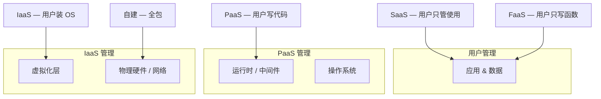

<!--
module:
  parent: computer-basics
  slug: computer-basics/cloud-services
  type: article
  category: 主模块子文章
  summary: IaaS / PaaS / SaaS / DaaS / FaaS 五大云服务模型——责任边界、计费粒度、锁定风险与选型决策。
-->

# 云服务模式

## 引言：云服务模式 — 自建 vs IaaS vs PaaS vs SaaS

云服务模式讨论**"控制权 + 运维责任 + 成本结构"在服务商和客户之间的边界划分**。难点不在"用哪个云"，而在**业务核心 vs 非核心的控制权 vs 灵活性 vs 成本的取舍**：IaaS 给你裸金属，PaaS 给你运行时，SaaS 给你成品。本篇围绕"自建 vs IaaS vs PaaS vs SaaS vs FaaS"的 5 大模式，对比运维责任分配 + 计费粒度 + 锁定风险。

---

> IaaS/PaaS/SaaS/DaaS — 云计算四大核心服务模型，通过互联网提供不同层次的资源，降低 IT 成本、提升灵活性。

## IaaS（基础设施即服务）- **定义**：提供基础的计算、存储、网络等硬件资源，用户按需租用虚拟化的物理资源（如虚拟机、存储、带宽）。
- **核心特点**：
    - **资源抽象化**：通过虚拟化技术将物理服务器、存储等转化为可动态分配的资源池。
    - **用户自主管理**：用户需自行安装操作系统、中间件、数据库及应用，负责数据备份、安全补丁等。
    - **典型场景**：需要灵活扩展计算资源的场景（如突发流量处理、测试环境搭建）。
- **代表厂商**：AWS EC2、阿里云ECS、Azure VM。
- **优势**：成本低（按使用量付费）、扩展性强、无需前期硬件投资。
- **挑战**：需用户具备较高的技术运维能力。

## PaaS（平台即服务）- **定义**：在IaaS基础上提供开发、测试、部署应用的完整平台，包括操作系统、数据库、开发工具等。
- **核心特点**：
    - **开发环境标准化**：预集成开发框架（如Spring、Django）、中间件（如消息队列、缓存）。
    - **自动化运维**：平台负责底层资源管理（如负载均衡、自动扩容），用户专注应用开发。
    - **典型场景**：快速开发Web应用、移动应用后端、微服务架构。
- **代表厂商**：AWS Elastic Beanstalk、Google App Engine、Azure App Service。
- **优势**：缩短开发周期、降低运维复杂度、支持团队协作。
- **挑战**：平台锁定风险（迁移成本高）、定制化能力受限。

## SaaS（软件即服务）- **定义**：通过互联网直接提供完整的软件应用，用户无需安装，按需订阅使用。
- **核心特点**：
    - **即开即用**：通过浏览器或客户端访问，无需关心底层技术实现。
    - **多租户架构**：同一软件实例服务多个用户，数据隔离但资源共享。
    - **典型场景**：企业办公（如CRM、ERP）、协作工具（如Slack、Zoom）、个人应用（如Gmail、Dropbox）。
- **代表厂商**：Salesforce、Office 365、Zoom、Slack。
- **优势**：零部署成本、自动更新、跨设备访问。
- **挑战**：数据隐私风险、功能定制化有限。

## DaaS（数据即服务）- **定义**：通过API或界面提供数据访问、处理、分析服务，用户无需自行存储或管理数据。
- **核心特点**：
    - **数据抽象化**：隐藏数据存储、清洗、转换等复杂过程，提供标准化接口。
    - **实时性**：支持实时数据流处理（如物联网传感器数据）。
    - **典型场景**：市场数据分析、金融风控、智能推荐系统。
- **代表厂商**：Snowflake、AWS Data Exchange、Google BigQuery。
- **优势**：降低数据获取成本、加速数据驱动决策、支持跨组织数据共享。
- **挑战**：数据质量依赖供应商、合规性风险（如GDPR）。

## FaaS（函数即服务 / Serverless）
- **定义**：以"函数"为粒度部署代码，由平台按需触发、自动扩缩，用户只为执行时长付费。
- **核心特点**：
    - **事件驱动**：HTTP 请求、消息队列、定时任务、文件上传均可触发。
    - **毫秒级计费**：AWS Lambda 按 1ms、阿里云函数计算按 100ms 计费。
    - **零运维**：无需管理 OS / 容器 / 实例数。
- **典型场景**：轻量 API 网关、数据 ETL 管道、Webhook 处理、IoT 事件消费。
- **代表厂商**：AWS Lambda、Google Cloud Functions、Azure Functions、阿里云函数计算。
- **优势**：成本极低（空闲不收费）、天然弹性、聚焦业务代码。
- **挑战**：冷启动延迟（数百 ms ~ 秒级）、执行时长上限（通常 15 分钟）、调试链路复杂。

## ❌ / ✅ 选型对比

| 场景 | ❌ 反例 | ✅ 正例 |
|------|--------|--------|
| 高度定制业务逻辑 | 用 SaaS 硬套 → 锁定 + 改不动 | IaaS + 自建 K8s，保留控制权 |
| 初创 MVP 快速验证 | 自建机房 + IaaS → 成本高、周期长 | PaaS（Heroku / App Engine）一键部署 |
| 偶发轻量任务（每日百次） | 长期开 IaaS 虚拟机 → 闲置浪费 | FaaS（Lambda）按需触发，成本近零 |
| 跨部门数据共享 | 自建数仓 + ETL → 重复造轮子 | DaaS（Snowflake）直接订阅数据源 |

## 对比总结
| **维度**   | **IaaS**       | **PaaS**     | **SaaS**    | **DaaS**    | **FaaS**    |
|----------|----------------|--------------|-------------|-------------|-------------|
| **资源层级** | 硬件（计算、存储、网络）   | 开发平台（OS、中间件） | 完整软件应用      | 数据访问与处理     | 单个函数 / 代码片段 |
| **用户责任** | 操作系统及以上        | 应用开发及以上      | 仅使用         | 数据应用与分析     | 仅业务代码        |
| **灵活性**  | 高（可自定义环境）      | 中（依赖平台功能）    | 低（标准化功能）    | 中（依赖数据源）    | 中（受运行时限约）   |
| **典型用户** | DevOps团队、系统管理员 | 开发人员、架构师     | 终端用户、业务部门   | 数据科学家、分析师   | 后端 / 数据工程师   |
| **成本模型** | 按资源使用量付费       | 按应用实例或功能模块付费 | 按用户数或功能订阅付费 | 按数据量或查询次数付费 | 按执行次数 + 时长付费 |

## 责任边界分层（Mermaid）

## 选择建议
- **需要完全控制基础设施** → **IaaS**（例：金融核心交易系统，需定制内核参数）
- **希望快速开发应用** → **PaaS**（例：初创团队用 Heroku 一周上线 MVP）
- **只需使用现成软件** → **SaaS**（例：全员用飞书 / Slack 协作）
- **聚焦数据价值挖掘** → **DaaS**（例：BI 团队订阅 Snowflake 数据集市）
- **偶发轻量任务** → **FaaS**（例：电商每天百次订单回调处理）

**组合案例**：某电商 = IaaS（ECS 跑核心订单服务）+ PaaS（K8s 托管微服务）+ SaaS（飞书 / 钉钉协作）+ FaaS（Lambda 处理 OSS 图片裁剪）。

---

## 相关章节

- [TCP/IP 四层模型](../../03-network/tcp-ip-model/README.md)
- [贪心算法 · 深度原理（局部最优 → 全局最优）](../../01-algorithms/greedy-algorithms/README.md)
- [文件系统与 I/O](../../02-os/filesystem/README.md)
- [Spring Cloud 微服务](../../../04.spring-backend/03-cloud/README.md) — 云原生应用开发与治理
- [Kubernetes 容器编排](../../../07.devops-and-tools/01-tools/kubernetes/README.md) — 云基础设施的事实标准
- [云设计模式](../../../06.distributed-systems/01-foundation/system-design-basics/cloud-design-patterns/README.md) — 分布式 + 云原生设计范式

← [返回 运维](../README.md)