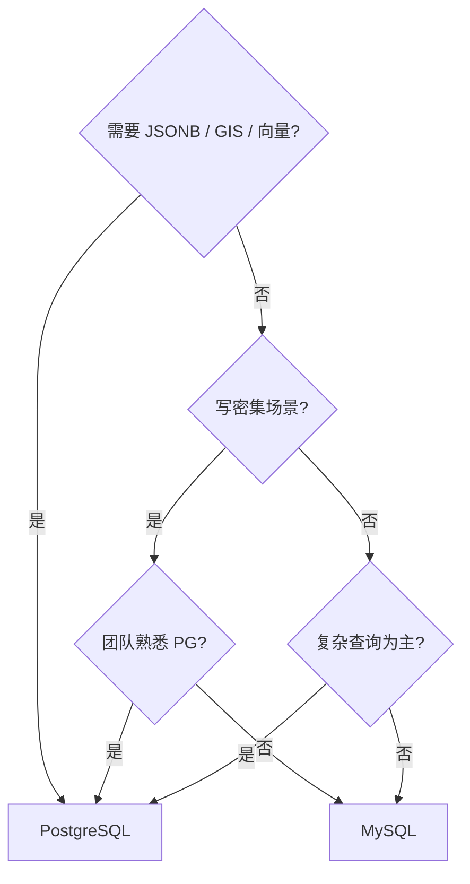

<!--
module:
  parent: database
  slug: database/postgresql
  type: article
  category: 主模块子文章
  summary: PostgreSQL 架构、MVCC、索引、扩展生态与高可用，兼顾与 MySQL 的选型决策
  depth: ⭐⭐⭐⭐
-->

# PostgreSQL

> 一句话定位：**最先进的开源关系型数据库——从 MVCC 到 JSON/JSONB、从 GiST 索引到 pgvector，一个数据库覆盖 ORDBMS + NoSQL + 向量搜索**

PostgreSQL（简称 PG）以"世界最先进的开源关系型数据库"自居，2026 年 DB-Engines 排名稳居前四。它不只是一个 RDBMS，更是一个 **ORDBMS**（对象关系型），支持数组、JSON、自定义类型、继承、表空间等高级特性。

---

## 📚 核心内容

| 主题 | 内容 | 关键点 |
|------|------|--------|
| 一、架构对比 | PostgreSQL vs MySQL 架构差异 | 进程模型 vs 线程模型 |
| 二、MVCC 实现 | heap tuple + 事务 ID vs undo log | PG 保留旧版本元组，MySQL 用回滚段 |
| 三、查询优化 | EXPLAIN ANALYZE / 统计信息 / pg_stat_statements | 执行计划 + 真实运行时数据 |
| 四、索引类型 | B-tree / Hash / GiST / GIN / BRIN | 5 大索引覆盖全场景 |
| 五、扩展生态 | PostGIS / pgvector / Citus / TimescaleDB | 插件化架构 |
| 六、JSON/JSONB | 半结构化数据的 NoSQL 能力 | JSONB 二进制存储 + GIN 索引 |
| 七、复制与高可用 | 流复制 / 逻辑复制 / Patroni | 异步 → 同步 → 自动故障转移 |
| 八、选型决策 | PG vs MySQL 场景对比 | 按业务特征选型 |

---

## 一、PostgreSQL vs MySQL 架构对比

| 维度 | PostgreSQL | MySQL (InnoDB) |
|------|-----------|----------------|
| **连接模型** | 多进程（每连接 fork 子进程） | 多线程（线程池） |
| **存储引擎** | 单引擎（heap + 索引） | 可插拔（InnoDB / MyISAM / Memory） |
| **MVCC** | heap tuple 多版本元组 | undo log 回滚段 |
| **默认隔离级别** | Read Committed | Repeatable Read |
| **WAL** | pg_xlog（Write-Ahead Log） | Redo Log（双文件循环） |
| **DDL** | 事务型 DDL（支持 ROLLBACK） | 非事务型（8.0 起仅原子 DDL） |
| **数据类型** | 丰富（数组、range、JSON、UUID、自定义） | 较少（标准 SQL 类型） |
| **扩展性** | 插件式（CREATE EXTENSION） | 组件式（存储引擎 / UDF） |
| **子查询** | 成熟优化 | 8.0 前较差，8.0 改善 |
| **全文搜索** | 内置 tsvector / tsquery | InnoDB FULLTEXT（功能较弱） |

### 进程 vs 线程模型

```text
PostgreSQL:                    MySQL:
┌──────────────┐              ┌──────────────┐
│  postmaster   │              │   mysqld     │
│  (监听进程)   │              │  (单进程)    │
└──────┬───────┘              └──────┬───────┘
       │ fork                        │ 线程池
  ┌────┴────┐                   ┌────┴────┐
  │backend 1│                   │ thread 1 │
  │backend 2│                   │ thread 2 │
  │backend N│                   │ thread N │
  └─────────┘                   └─────────┘
```

PG 的进程模型内存隔离更强（单连接 crash 不影响其他），但高并发时内存占用大，通常配合 **PgBouncer** 连接池使用。

---

## 二、MVCC 实现差异

### PostgreSQL：heap tuple 多版本

PG 在 heap page 中直接保存**多版本元组**，每个元组携带 `xmin`（创建事务 ID）和 `xmax`（删除事务 ID）。

```sql
-- PG 元组头部关键字段
-- xmin: 插入该元组的事务 ID
-- xmax: 删除/更新该元组的事务 ID（0 = 未删除）
-- cmin/cmax: 命令 ID（同一事务内多条语句）

-- VACUUM 的作用：清理已不可见的旧版本元组
-- autovacuum 默认开启，避免表膨胀
```

```text
┌────────────────────────────┐
│ Heap Page                  │
│ ┌──────────────────────┐   │
│ │ Tuple v1 (xmin=100)  │──→ 对 tx<100 不可见
│ │ Tuple v2 (xmin=200)  │──→ 对 tx>=200 可见（最新版本）
│ │ Tuple v3 (xmax=300)  │──→ 已删除标记
│ └──────────────────────┘   │
│                            │
│ Free Space Map (FSM)       │
│ Visibility Map (VM)        │
└────────────────────────────┘
```

### MySQL (InnoDB)：undo log

InnoDB 只在聚簇索引中保留**最新版本**，旧版本通过 **undo log**（回滚段）链式回溯。

| 对比点 | PostgreSQL | MySQL (InnoDB) |
|--------|-----------|----------------|
| 旧版本位置 | heap page 内 | undo log（回滚段表空间） |
| 清理方式 | VACUUM（手动/自动） | purge thread（后台自动） |
| 表膨胀 | 是（需要 VACUUM FULL 或 pg_repack） | 否（undo log 独立空间） |
| 读性能 | 旧版本多时下降 | 长事务链回溯时下降 |
| 写性能 | 每次 UPDATE 插入新元组 | 原地更新 + undo log |

> 💡 **面试高频**：PG 的 UPDATE 是 "delete + insert"（产生新元组），MySQL 的 UPDATE 是原地修改 + 写 undo log。这导致 PG 写密集场景更容易表膨胀。

---

## 三、查询优化

### EXPLAIN ANALYZE

```sql
-- 基础执行计划
EXPLAIN SELECT * FROM orders WHERE user_id = 42;

-- 带真实运行时数据（执行 + 统计）
EXPLAIN (ANALYZE, BUFFERS, FORMAT TEXT)
  SELECT u.name, COUNT(o.id)
  FROM users u
  JOIN orders o ON u.id = o.user_id
  WHERE o.created_at > '2025-01-01'
  GROUP BY u.name;

-- 输出关键字段
-- actual time=0.045..12.340 ms  ← 真实耗时
-- rows=1500                      ← 实际返回行数
-- Buffers: shared hit=234 read=56  ← buffer 命中 vs 磁盘读取
```

### 统计信息

```sql
-- 手动更新统计信息（大表变更后建议执行）
ANALYZE orders;

-- 查看列统计
SELECT attname, n_distinct, most_common_vals
FROM pg_stats
WHERE tablename = 'orders';

-- 调整采样精度（默认 100，高基数列可加大）
ALTER TABLE orders ALTER COLUMN user_id SET STATISTICS 1000;
```

### pg_stat_statements

```sql
-- 启用扩展
CREATE EXTENSION pg_stat_statements;

-- 查看 Top 10 慢查询
SELECT
  query,
  calls,
  round(total_exec_time::numeric, 2) AS total_ms,
  round(mean_exec_time::numeric, 2) AS avg_ms,
  rows
FROM pg_stat_statements
ORDER BY mean_exec_time DESC
LIMIT 10;

-- 重置统计
SELECT pg_stat_statements_reset();
```

---

## 四、索引类型

| 索引类型 | 适用场景 | 示例 |
|---------|---------|------|
| **B-tree**（默认） | 等值 + 范围查询 | `CREATE INDEX idx ON t(a);` |
| **Hash** | 纯等值查询 | `CREATE INDEX idx ON t USING hash(a);` |
| **GiST** | 几何 / 范围 / 全文搜索 / KNN | `CREATE INDEX idx ON t USING gist(geom);` |
| **GIN** | 数组 / JSONB / 全文搜索 | `CREATE INDEX idx ON t USING gin(tags);` |
| **BRIN** | 时序数据（物理有序大表） | `CREATE INDEX idx ON t USING brin(created_at);` |

### 部分索引与表达式索引

```sql
-- 部分索引：只索引活跃用户
CREATE INDEX idx_active_users ON users(email)
WHERE status = 'active';

-- 表达式索引：对函数结果建索引
CREATE INDEX idx_lower_email ON users(lower(email));

-- 覆盖索引（Index-Only Scan）
CREATE INDEX idx_orders_cover ON orders(user_id, status, total);
```

### 并发创建索引

```sql
-- 不阻塞写操作（生产必备）
CREATE INDEX CONCURRENTLY idx_orders_user ON orders(user_id);
```

---

## 五、扩展生态

| 扩展 | 功能 | 典型场景 |
|------|------|---------|
| **PostGIS** | 空间数据（GIS） | 地图、位置服务、地理围栏 |
| **pgvector** | 向量搜索 | AI/ML embedding 相似性检索 |
| **Citus** | 分布式分片 | 水平扩展、多租户 SaaS |
| **TimescaleDB** | 时序数据 | IoT、监控指标、金融行情 |
| **pg_trgm** | 三字母组模糊匹配 | 搜索引擎纠错、模糊查询 |
| **pg_cron** | 数据库内定时任务 | 替代外部 cron / 调度器 |

### pgvector 示例

```sql
-- 安装
CREATE EXTENSION vector;

-- 创建向量列（1536 维 = OpenAI embedding）
CREATE TABLE documents (
  id SERIAL PRIMARY KEY,
  content TEXT,
  embedding VECTOR(1536)
);

-- GIN/IVFFlat 索引加速近邻搜索
CREATE INDEX idx_embedding ON documents
USING ivfflat (embedding vector_cosine_ops) WITH (lists = 100);

-- 相似性搜索
SELECT content, 1 - (embedding <=> $1) AS similarity
FROM documents
ORDER BY embedding <=> $1
LIMIT 10;
```

---

## 六、JSON/JSONB 与 NoSQL 能力

### JSON vs JSONB

| 特性 | JSON | JSONB |
|------|------|-------|
| 存储格式 | 原始文本 | 解析后的二进制 |
| 重复 key | 保留 | 去重（最后一条） |
| 索引支持 | 无 | GIN / B-tree 表达式 |
| 查询性能 | 每次解析 | 直接读取 |
| **推荐** | 仅存不需要查的数据 | **默认选择** |

### JSONB 操作

```sql
-- 插入
INSERT INTO products (data) VALUES (
  '{"name": "iPhone 16", "price": 7999, "specs": {"ram": "8GB", "storage": "256GB"}}'
);

-- 查询操作符
SELECT data->>'name' AS name,              -- 文本提取
       data->'specs'->>'ram' AS ram,       -- 嵌套提取
       data @> '{"price": 7999}'::jsonb    -- 包含查询（可用 GIN 索引）
FROM products;

-- GIN 索引加速 JSONB 查询
CREATE INDEX idx_products_data ON products USING gin(data);

-- 更新 JSONB 字段
UPDATE products
SET data = jsonb_set(data, '{price}', '8999')
WHERE data->>'name' = 'iPhone 16';
```

> 💡 PG 的 JSONB + GIN 索引组合让它可以替代很多 MongoDB 场景，同时保留关系型数据库的事务和 JOIN 能力。

---

## 七、复制与高可用

### 流复制（Streaming Replication）

```text
Primary ──WAL stream──→ Standby 1 (hot standby)
                    └──→ Standby 2 (hot standby)

-- 异步流复制（默认）：低延迟，可能丢数据
-- 同步流复制：零丢数据，写延迟增加

-- postgresql.conf (Primary)
wal_level = replica
max_wal_senders = 10
synchronous_standby_names = 'ANY 1 (standby1, standby2)'
```

### 逻辑复制（Logical Replication）

```sql
-- 发布端
ALTER SYSTEM SET wal_level = logical;
CREATE PUBLICATION pub_orders FOR TABLE orders, order_items;

-- 订阅端
CREATE SUBSCRIPTION sub_orders
  CONNECTION 'host=primary dbname=shop'
  PUBLICATION pub_orders;

-- 用途：跨大版本升级、跨库同步、选择性复制部分表
```

### Patroni 自动高可用

```text
┌─────────────┐     ┌─────────────┐
│   etcd/      │     │   etcd/     │
│  Consul DCS  │     │  Consul DCS │
└──────┬──────┘     └──────┬──────┘
       │                    │
  ┌────┴────┐          ┌───┴─────┐
  │Patroni  │          │Patroni  │
  │Primary  │          │Replica  │
  │(读写)   │          │(只读)   │
  └─────────┘          └─────────┘

-- 故障转移：< 30 秒自动 failover
-- VIP / DNS 切换对应用透明
-- 生产标配：Patroni + etcd + PgBouncer
```

| 高可用方案 | 故障转移 | 复杂度 | 适用 |
|-----------|---------|--------|------|
| **Patroni + etcd** | 自动（<30s） | 中 | 生产标配 |
| **repmgr** | 半自动 | 低 | 中小规模 |
| **流复制 + 手动** | 手动 | 最低 | 开发/测试 |
| **云 RDS** | 全自动 | 零 | 云用户 |

---

## 八、与 MySQL 的选型决策表

| 决策维度 | 选 PostgreSQL | 选 MySQL |
|---------|-------------|---------|
| **数据类型** | 需要 JSONB / 数组 / 地理 / 向量 | 标准 SQL 类型足够 |
| **事务 DDL** | 需要 DDL 回滚（迁移脚本安全） | 不需要 |
| **全文搜索** | 需要内置高质量全文搜索 | 可接受 ES 外挂 |
| **复杂查询** | 多表 JOIN / CTE / 窗口函数密集 | 简单 CRUD 为主 |
| **写入性能** | 读多写少（UPDATE 产生新元组） | 写密集（原地更新更优） |
| **团队熟悉度** | 团队有 PG 经验 | 团队以 MySQL 为主 |
| **扩展需求** | 需要 GIS / 向量 / 时序 | 标准关系型即可 |
| **生态工具** | ORM 支持好，运维工具偏少 | 生态最成熟，DBA 好招 |
| **云托管** | AWS RDS PG / Azure / Supabase | AWS RDS / 阿里云 RDS |

### 简单决策树



---

## 九、VACUUM、autovacuum 与表/索引膨胀（含人大金仓特化）

> 🎯 **核心问题**：PG/KingbaseES 删除大量数据后查询变慢，autovacuum 不是万能的——本文讲清 dead tuples / 表膨胀 / 索引膨胀的根因 + 排查 + 调优 + 人大金仓特化。

### 9.1 dead tuples 与 MVCC：DELETE 不是物理删除

PG 的 MVCC 实现是 **delete + insert** 模式（与 MySQL InnoDB 的"原地更新 + undo log"截然不同）：

```sql
-- 元组头部关键字段
-- xmin: 插入该元组的事务 ID
-- xmax: 删除/更新该元组的事务 ID（0 = 未删除）
-- cmin/cmax: 命令 ID（同一事务内多条语句）

-- DELETE 后行为
-- ❌ 不是物理删除：是 UPDATE xmax=current_tx_id，标记为"对当前及后续事务不可见"
-- ❌ 旧元组仍占 heap page 空间，直到 VACUUM 回收
```

```text
┌────────────────────────────┐
│ Heap Page                  │
│ ┌──────────────────────┐   │
│ │ Tuple v1 (xmin=100)  │──→ 对 tx<100 不可见（已删除，待 VACUUM 回收）
│ │ Tuple v2 (xmin=200)  │──→ 对 tx>=200 可见（最新版本）
│ │ Tuple v3 (xmax=300)  │──→ 已删除标记（同上）
│ └──────────────────────┘   │
│                            │
│ Free Space Map (FSM)       │
│ Visibility Map (VM)        │
└────────────────────────────┘
```

### 9.2 autovacuum 机制与触发公式

**autovacuum** 是后台自动清理 worker，定期扫描 `pg_stat_user_tables` 找满足触发条件的表并执行 VACUUM（+ ANALYZE）。

**核心公式**：

```text
触发阈值 = autovacuum_vacuum_threshold + autovacuum_vacuum_scale_factor × n_live_tup
默认     = 50                       + 0.2                              × n_live_tup
```

**实战意义**：
- 100 万行表 → 触发 = 50 + 0.2 × 100 万 = 200,050 死元组（约 20% 表大小）
- 5000 万行表 → 触发 = 50 + 0.2 × 5000 万 = 1000 万 死元组（约 20% 表大小）

**⚠️ 关键问题**：大表（亿级）可能累积 1000 万+ 死元组才触发，期间查询已严重劣化。

**autovacuum 默认配置**：

| 参数 | 默认值 | 说明 |
|------|--------|------|
| `autovacuum` | on | 是否启用自动清理 |
| `autovacuum_naptime` | 60s | worker 唤醒间隔 |
| `autovacuum_max_workers` | 3 | 最大并发 worker 数 |
| `autovacuum_vacuum_threshold` | 50 | 触发 VACUUM 的最小死元组数 |
| `autovacuum_vacuum_scale_factor` | 0.2 | 触发表尺寸比例（与 threshold 相加） |
| `autovacuum_analyze_threshold` | 50 | 触发 ANALYZE 的最小变更元组数 |
| `autovacuum_analyze_scale_factor` | 0.2 | ANALYZE 触发表尺寸比例 |
| `maintenance_work_mem` | 64MB | 维护操作（VACUUM / CREATE INDEX）的内存 |

### 9.3 表膨胀（Table Bloat）：死元组堆积

**根因**：DELETE 大量数据后，死元组在 heap page 内堆积，**VACUUM 只标记空间可重用，不归还 OS**。

**量化排查**（`pgstattuple` 扩展）：

```sql
CREATE EXTENSION pgstattuple;

-- 单表膨胀度
SELECT * FROM pgstattuple('orders_log');
-- dead_tuple_percent: 35.5  ← 死元组占比
-- free_percent: 12.3       ← 可重用空间（VACUUM 后会增大）

-- 全库膨胀 TOP 表
SELECT schemaname || '.' || relname AS table_name,
       pg_size_pretty(pg_relation_size(schemaname || '.' || relname)) AS size,
       n_live_tup, n_dead_tup,
       round(n_dead_tup * 100.0 / NULLIF(n_live_tup + n_dead_tup, 0), 2) AS dead_pct
FROM pg_stat_user_tables
WHERE n_dead_tup > 10000
ORDER BY n_dead_tup DESC LIMIT 20;
```

### 9.4 索引膨胀（Index Bloat）：易被忽视

**根因**：B-tree 索引项（index tuples）也含 xmin/xmax，DELETE 后**索引项不会立即清除**，VACUUM 才回收。

**⚠️ 反直觉**：即使表本身膨胀度不高，索引可能严重膨胀（特别是高频更新的表 + 不走 HOT update 的列）。

**排查**：

```sql
-- 索引膨胀度（pgstattuple 也支持）
SELECT * FROM pgstatindex('idx_orders_log_created_at');

-- 全库索引膨胀 TOP
SELECT schemaname || '.' || indexrelname AS index_name,
       pg_size_pretty(pg_relation_size(indexrelid)) AS size
FROM pg_stat_user_indexes
ORDER BY pg_relation_size(indexrelid) DESC LIMIT 20;
```

### 9.5 人大金仓（KingbaseES）特化

人大金仓 V8R6 基于 **PostgreSQL 9.6 内核**改造，autovacuum 机制**完全兼容**，但有以下差异：

| 差异点 | 标准 PG | 人大金仓 KingbaseES |
|--------|---------|---------------------|
| 系统视图前缀 | `pg_stat_*` | `sys_stat_*`（兼容 `pg_stat_*`） |
| 默认 autovacuum | 开启 | 开启（V8R6+）|
| `sys_dump` | 普通备份 | **隐式 repeatable read**，可能阻止 vacuum 回收 |
| 兼容模式 | — | 支持 Oracle / MySQL / PG 三种兼容模式 |

**人大金仓特有排查 SQL**：

```sql
-- 系统视图（人大金仓特有，习惯用 sys_ 前缀）
SELECT relname, n_live_tup, n_dead_tup,
       last_vacuum, last_autovacuum, last_analyze, last_autoanalyze
FROM sys_stat_user_tables  -- 也可用 pg_stat_user_tables
WHERE n_dead_tup > 10000
ORDER BY n_dead_tup DESC LIMIT 30;
```

**⚠️ 重要避坑**：人大金仓的 `sys_dump` 工具默认使用 `repeatable read` 隔离级别，**长事务会阻塞 vacuum 回收**，监控长事务：

```sql
SELECT pid, state, now() - xact_start AS xact_age, left(query, 180) AS query_sample
FROM sys_stat_activity  -- 也可用 pg_stat_activity
WHERE xact_start IS NOT NULL
ORDER BY xact_start LIMIT 20;
```

### 9.6 实战案例：删除 1500 万行后查询从 100ms 飙到 3s

**场景**：
- 业务表 `orders_log`，5000 万行（保留近 6 个月数据）
- 凌晨定时任务 `DELETE FROM orders_log WHERE created_at < now() - interval '3 months'`（删 1500 万行）
- 上午业务高峰期：原本 100ms 的列表查询飙到 2-3s

**排查过程**：

```sql
-- 步骤 1：定位死元组最多的表
SELECT relname, n_live_tup, n_dead_tup, last_autovacuum
FROM pg_stat_user_tables ORDER BY n_dead_tup DESC LIMIT 5;
-- orders_log: n_live_tup=3500万, n_dead_tup=1500万（30%）← 超过 20% 才触发

-- 步骤 2：检查 autovacuum 是否在工作
SELECT * FROM pg_stat_progress_vacuum;  -- 空，说明 autovacuum 没在跑

-- 步骤 3：查长事务
SELECT pid, now() - xact_start AS xact_age, left(query, 180)
FROM pg_stat_activity WHERE xact_start IS NOT NULL ORDER BY xact_start LIMIT 5;
-- 发现一个 ETL 任务 8 小时未提交，xact_age=08:23:15 ← 阻塞 vacuum 回收

-- 步骤 4：量化膨胀
SELECT * FROM pgstattuple('orders_log');
-- dead_tuple_percent: 28.5  ← 严重膨胀
```

**根因（3 个共同作用）**：

1. **autovacuum 触发滞后**：5000 万 × 0.2 = 1000 万触发阈值，本次只删 1500 万，刚刚超阈值但 worker 60s 才唤醒一次
2. **长事务阻塞回收**：那个 8 小时 ETL 未提交，vacuum 无法回收 xid > ETL xmin 的元组
3. **统计信息陈旧**：删除 30% 数据后未 ANALYZE，优化器误判走错执行计划（Seq Scan 而不是 Index Scan）

**解决（4 步走）**：

```sql
-- 步骤 1：立即止血（不锁表）
VACUUM (ANALYZE, VERBOSE) orders_log;

-- 步骤 2：杀掉长事务（或让它提交）
SELECT pg_terminate_backend(<pid>);

-- 步骤 3：根治（表级 autovacuum 调优）
ALTER TABLE orders_log SET (
    autovacuum_vacuum_scale_factor = 0.05,    -- 从 0.2 降到 0.05（提前触发）
    autovacuum_analyze_scale_factor = 0.02,
    autovacuum_vacuum_cost_limit = 2000       -- 提升 I/O 预算
);

-- 步骤 4：彻底回收空间（如需，用 pg_repack 在线重建）
-- pg_repack -t public.orders_log  -- 不锁表，原理：触发器 + CTAS
```

**修复后效果**：

| 指标 | 修复前 | 修复后 |
|------|-------|-------|
| dead_tuple_percent | 28.5% | 0.3% |
| 列表查询耗时 | 2-3s | 80-150ms |
| autovacuum 频率 | ~12 小时/次 | ~30 分钟/次 |

### 9.7 4 种解决手段对比

| 手段 | 是否锁表 | 何时用 | 代价 |
|------|---------|--------|------|
| `VACUUM ANALYZE` | 否 | 立即止血，清理标记可重用 | 不归还 OS，磁盘占用不变 |
| `ALTER TABLE ... SET (...)` | 否 | 表级调优，让 autovacuum 更激进 | 调整后死元组才能被回收 |
| **`pg_repack`** | 否 | 在线重建表/索引，**真正归还空间** | 需双倍磁盘空间 + 触发器 |
| `VACUUM FULL` | **是（AccessExclusiveLock）** | 万不得已 | 锁表时间长，大表慎用 |

**推荐生产配置**（人大金仓 / PG）：

```ini
# kingbase.conf / postgresql.conf
autovacuum = on
autovacuum_naptime = 10s                      # 缩短检查周期（默认 60s）
autovacuum_vacuum_scale_factor = 0.05         # 大表更激进（默认 0.2）
autovacuum_analyze_scale_factor = 0.02
autovacuum_vacuum_cost_limit = 2000           # 提升 I/O 预算
autovacuum_max_workers = 5                    # 与 CPU 核数匹配
maintenance_work_mem = 512MB                  # VACUUM/REINDEX 内存
log_autovacuum_min_duration = 0               # 记录所有 autovacuum 行为
```

### 9.8 5 个反直觉点（避坑指南）

| # | ❌ 直觉 | ✅ 真相 |
|---|--------|--------|
| 1 | DELETE 后空间立即释放 | 标记 xmax，堆页空间不释放（VACUUM 才回收） |
| 2 | autovacuum 立即触发清理 | 默认要等死元组达到 20% 表大小才触发（大表滞后严重） |
| 3 | VACUUM ANALYZE 释放空间 | 只标记可重用，**磁盘占用不变**（真正释放需 VACUUM FULL / pg_repack） |
| 4 | VACUUM FULL 总是能用 | 锁表 `AccessExclusiveLock`，生产慎用 |
| 5 | 表膨胀就完了，索引没事 | 索引也膨胀（index bloat），index scan 需扫更多 dead pointers |

### 9.9 排查 SQL 一集（人大金仓视图适配）

```sql
-- 1. 定位死元组最多的表（人大金仓也支持 pg_ 前缀）
SELECT relname, n_live_tup, n_dead_tup,
       last_vacuum, last_autovacuum, last_analyze, last_autoanalyze,
       round(n_dead_tup * 100.0 / NULLIF(n_live_tup + n_dead_tup, 0), 2) AS dead_pct
FROM pg_stat_user_tables
WHERE n_dead_tup > 10000
ORDER BY n_dead_tup DESC LIMIT 30;

-- 2. 查长事务（阻塞 vacuum）
SELECT pid, state, now() - xact_start AS xact_age, left(query, 180) AS query_sample
FROM pg_stat_activity WHERE xact_start IS NOT NULL ORDER BY xact_start LIMIT 20;

-- 3. 量化膨胀（用 pgstattuple 扩展）
CREATE EXTENSION pgstattuple;
SELECT * FROM pgstattuple('your_table');
SELECT * FROM pgstatindex('idx_your_table_column');

-- 4. 实时监控 autovacuum 是否在工作
SELECT pid, datname, relid::regclass, phase,
       heap_blks_total, heap_blks_scanned, heap_blks_vacuumed,
       index_vacuum_count, max_dead_tuples, num_dead_tuples
FROM pg_stat_progress_vacuum;

-- 5. 查 autovacuum 历史日志
SELECT * FROM pg_stat_user_tables WHERE last_autovacuum IS NOT NULL
ORDER BY last_autovacuum DESC LIMIT 10;
```

### 9.10 推荐阅读

- **PG 官方文档**：[Routine Vacuuming](https://www.postgresql.org/docs/current/routine-vacuuming.html)
- **人大金仓官方**：[自动清理参数文档](https://help.kingbase.com.cn/v9/admin/reference/ref-database-parameter/initialization-parameters/runtime-config-autovacuum.html)
- **人大金仓官方**：[管理表/索引膨胀](https://help.kingbase.com.cn/v8/admin/general/administrator-guide/27-Managing-Bloat.html)
- **实战案例**：[PG/KingbaseES Vacuum 机制生产环境调优实战](https://www.kingbase.com.cn/explore/tech-blog/)

---

## 🔗 相关章节

- **事务与 MVCC**：[03-transaction](../03-transaction/README.md) — ACID / 隔离级别 / MVCC 理论基础
- **索引原理**：[04-index](../04-index/README.md) — B+ 树 / 聚簇索引 / 最左前缀
- **MySQL 深入**：[05-mysql](../05-mysql/README.md) — InnoDB 内部机制 / 主从复制
- **缓存**：[06-cache](../06-cache/README.md) — 数据库前的高速缓存层
- **PG-VACUUM 排查实战**：[12.interview/03.database pg-vacuum-troubleshooting](../../../12.interview/03.database/pg-vacuum-troubleshooting/README.md) — 大量删除数据后查询变慢的 5 步排查方法论 + 人大金仓特化（含 5 个反直觉点 + 90 秒话术）

---

## 📖 开源参考

| 项目 | 说明 | 链接 |
|------|------|------|
| PostgreSQL | 最先进的开源 RDBMS | [postgresql.org](https://www.postgresql.org) |
| PostGIS | 空间数据扩展 | [postgis.net](https://postgis.net) |
| pgvector | 向量搜索扩展 | [github.com/pgvector/pgvector](https://github.com/pgvector/pgvector) |
| Citus | 分布式 PG | [github.com/citusdata/citus](https://github.com/citusdata/citus) |
| TimescaleDB | 时序数据扩展 | [timescale.com](https://www.timescale.com) |
| Patroni | 自动高可用 | [github.com/zalando/patroni](https://github.com/zalando/patroni) |
| PgBouncer | 轻量连接池 | [pgbouncer.github.io](https://www.pgbouncer.org) |

---

← [返回: 数据库](../README.md)
