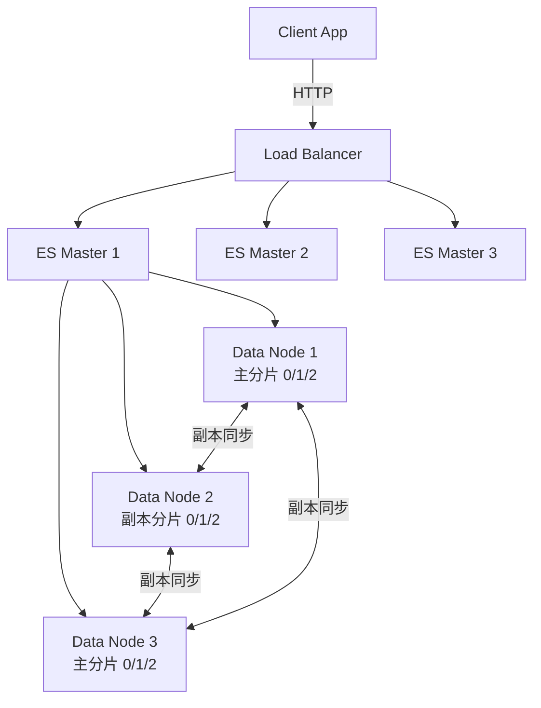

<!--
module:
  parent: database/nosql
  slug: database/nosql/elasticsearch
  type: article
  category: 主模块子文章
  summary: Elasticsearch 搜索引擎：倒排索引原理、BM25 评分、ELK 日志分析、向量检索
-->

# Elasticsearch 搜索引擎

> Elasticsearch（ES）是基于 Apache Lucene 构建的分布式搜索与分析引擎，核心数据结构为**倒排索引**，支持全文搜索、结构化搜索、聚合分析和向量检索。广泛应用于站内搜索、ELK 日志平台、RAG 向量数据库等场景。

---

## 📚 核心内容

| 主题 | 关键点 |
|------|--------|
| 正排 vs 倒排 | 两种索引结构对比 |
| 倒排索引结构 | 词项字典 + Posting List |
| 与 B+ 树对比 | 全文搜索 vs 精确查询的差异 |
| 集群架构 | Master / Data / Coordinating / Ingest Node |
| 分片与副本 | Shard + Replica 设计 |
| 分析器与分词 | Analyzer = Tokenizer + Token Filter |
| Query DSL | match / term / bool / range / knn |
| BM25 评分 | 相关度排序核心算法 |
| 向量检索 | ES 8.0+ dense_vector + kNN |

---

## 一、正排索引 vs 倒排索引

| 类型 | 结构 | 用途 | 类比 |
|------|------|------|------|
| **正排索引** | 文档 ID → 词条列表 | 通过 ID 找内容 | 数据库主键查行 |
| **倒排索引** | 词条 → 文档 ID 列表 | 通过词条找文档 | 书末关键词索引 |

### 倒排索引结构

```text
词项      |  文档 ID 列表（文档频率）
---------+-----------------------------
"redis"  |  [doc1, doc3, doc7, doc15]          (df=4)
"mysql"  |  [doc2, doc3]                       (df=2)
"index"  |  [doc1, doc4, doc5, doc7, doc8, doc15] (df=6)
"搜索"   |  [doc1, doc2, doc9, doc11]          (df=4)
```

每个词项对应一个**倒排列表（Posting List）**，按文档 ID 排序。存储时还附带：
- **词频（TF）**：该词在文档中出现的次数
- **位置（Position）**：用于短语查询（`"redis mysql"` 相邻匹配）
- **偏移量（Offset）**：用于高亮显示

> **压缩优化**：Posting List 使用 Frame Of Reference（FOR）和 Roaring Bitmap 压缩，百万级文档的倒排列表可压到几 KB。

---

## 二、B+ 树 vs 倒排索引

| 维度 | B+ 树（MySQL） | 倒排索引（ES） |
|------|---------------|----------------|
| 适用查询 | 等值、范围、前缀 | 全文、模糊、相关度排序 |
| 写入方式 | 随机 I/O（页分裂） | 顺序 I/O（段合并） |
| 空间占用 | 中等 | 较大（词项字典 + Posting List） |
| 排序依据 | 字段值 | 相关度评分（BM25） |
| 更新方式 | 原地修改页 | 写新段 + 后台 Merge（近实时） |
| 典型场景 | 业务数据精确查询 | 全文搜索、日志分析 |

> **近实时（Near Real-Time）**：ES 写入后需等待 `refresh`（默认 1 秒）才能被搜索到，这是段（Segment）机制带来的延迟。可通过 `?refresh=true` 强制刷新（生产慎用，影响吞吐）。

---

## 三、集群架构

ES 集群由多种角色的节点组成：

```text
                    ┌─────────────────┐
         请求 ─────→│ Coordinating    │（路由 + 结果聚合）
                    │     Node        │
                    └────────┬────────┘
                             │
              ┌──────────────┼──────────────┐
              ▼              ▼              ▼
      ┌──────────────┐ ┌──────────────┐ ┌──────────────┐
      │  Data Node   │ │  Data Node   │ │  Data Node   │
      │  Shard 0-P   │ │  Shard 0-R   │ │  Shard 1-P   │
      │  Shard 1-R   │ │  Shard 2-P   │ │  Shard 2-R   │
      └──────────────┘ └──────────────┘ └──────────────┘
              ▲              ▲              ▲
              └──────────────┴──────────────┘
                    Master Nodes（3 个专用）
                    管理集群元数据，不存数据
```

| 节点类型 | 职责 | 配置建议 |
|---------|------|---------|
| **Master Node** | 管理索引创建、分片分配、集群状态 | 3 个专用 Master，轻负载 |
| **Data Node** | 存储分片，处理 CRUD 和搜索 | CPU/内存/SSD 密集 |
| **Coordinating Node** | 接收请求，转发，聚合结果 | 所有节点默认是，可专用 |
| **Ingest Node** | 写入前预处理（Pipeline） | 复杂 ETL 场景专用 |

---

## 四、分片（Shard）与副本（Replica）

- **主分片（Primary Shard）**：数据水平切分，每个分片是一个 Lucene 索引
- **副本（Replica）**：主分片的完整拷贝，提供高可用和读扩展
- **分片数不可更改**（创建索引时固定），副本数可随时调整

```text
索引: products（3 主分片 + 1 副本）
Node A: [Shard 0-P] [Shard 2-R]
Node B: [Shard 1-P] [Shard 0-R]
Node C: [Shard 2-P] [Shard 1-R]
```

> **分片数量建议**：单个分片 10-50GB，总分片数 = 数据量 / 单分片大小。过多小分片（over-sharding）会严重影响查询性能（每次搜索需协调所有分片）。

---

## 五、分析器与分词（Analyzer）

分析器是全文搜索的核心，将文本转换为词项（Term）：

```text
输入文本: "Elasticsearch is running on port 9200"
        ↓ Character Filter（去除 HTML 等）
        ↓ Tokenizer（按空格/标点切分）
Token:  ["Elasticsearch", "is", "running", "on", "port", "9200"]
        ↓ Token Filter（小写、去停用词、同义词）
Term:   ["elasticsearch", "running", "port", "9200"]
```

| 内置分析器 | 行为 | 适用 |
|-----------|------|------|
| `standard` | 按 Unicode 文本切分，小写化 | 英文默认 |
| `simple` | 按非字母切分，小写化 | 简单英文 |
| `whitespace` | 仅按空格切分 | 调试用 |
| `keyword` | 不切分，整个字段作为一个词 | 精确匹配（如 ID、状态码） |

**中文分词**需安装 IK 插件（`elasticsearch-analysis-ik`）：
- `ik_smart`：最粗粒度切分（"北京大学" → ["北京大学"]）
- `ik_max_word`：最细粒度切分（"北京大学" → ["北京大学", "北京", "大学"]）

```json
// 索引映射示例
{
  "mappings": {
    "properties": {
      "title": {
        "type": "text",
        "analyzer": "ik_max_word",       // 写入时细粒度切分
        "search_analyzer": "ik_smart"    // 搜索时粗粒度切分
      },
      "status": { "type": "keyword" }   // keyword 不分词，精确匹配
    }
  }
}
```

---

## 六、Query DSL 常用查询

```json
// 全文搜索（分词后匹配）
{ "query": { "match": { "title": "redis 高可用" } } }

// 精确匹配（不分词）
{ "query": { "term": { "status": "published" } } }

// 布尔组合
{
  "query": {
    "bool": {
      "must":     [{ "match": { "title": "redis" } }],
      "must_not": [{ "term": { "status": "deleted" } }],
      "filter":   [{ "range": { "created_at": { "gte": "2024-01-01" } } }],
      "should":   [{ "match": { "tags": "cache" } }]
    }
  }
}

// 高亮
{
  "query": { "match": { "content": "倒排索引" } },
  "highlight": { "fields": { "content": {} } }
}
```

**BM25 评分**（ES 7.0+ 默认，取代 TF-IDF）：
- **词频（TF）**：词在文档中出现越多，分数越高（但有饱和上限，避免关键词堆砌）
- **逆文档频率（IDF）**：词在整个语料中越罕见，分数越高
- **字段长度归一化**：字段越短，匹配权重越高

---

## 七、向量检索（ES 8.0+）

ES 8.0 引入 `dense_vector` 字段和 **kNN（k 最近邻）** 查询，支持 RAG / 语义搜索场景：

```json
// 索引映射
{
  "mappings": {
    "properties": {
      "embedding": {
        "type": "dense_vector",
        "dims": 768,
        "index": true,
        "similarity": "cosine"
      }
    }
  }
}

// kNN 查询（找语义最相似的文档）
{
  "knn": {
    "field": "embedding",
    "query_vector": [0.1, 0.2, ...],
    "k": 10,
    "num_candidates": 100
  }
}
```

> **RAG 架构**：用户提问 → LLM 生成向量 → ES kNN 检索相关文档 → 拼接上下文 → LLM 生成回答。ES 同时承担向量数据库和关键词搜索双重角色（混合检索 Hybrid Search）。

---

## 八、ELK 日志分析平台

```text
应用日志 → Filebeat（采集）→ Logstash（处理/过滤）→ Elasticsearch（存储/搜索）
                                                          ↓
                                                    Kibana（可视化）
```

| 组件 | 职责 |
|------|------|
| **Filebeat** | 轻量日志采集，推送到 Logstash 或直写 ES |
| **Logstash** | ETL：解析、过滤、富化日志（Grok 正则解析） |
| **Elasticsearch** | 存储、搜索、聚合分析 |
| **Kibana** | 仪表盘、告警、APM 可视化 |

> **索引生命周期（ILM）**：热（Hot）→ 温（Warm）→ 冷（Cold）→ 删除（Delete），自动将旧日志迁移到低成本存储。

---

## 🔗 相关章节

- [NoSQL 总览](../README.md) — NoSQL 类型对比与选型指南
- [MongoDB](../mongodb/README.md) — MongoDB 内置文本搜索能力弱，生产搜索场景用 ES
- [系统设计 · 日志平台](../../../04.system-design/) — ELK / Loki 日志方案对比

---

← [返回 NoSQL 数据库](../README.md)

## IK 分词插件安装（中文环境必备）

```bash
# 1. 下载 IK 插件（需与 ES 版本一致）
./bin/elasticsearch-plugin install \
  https://github.com/medcl/elasticsearch-analysis-ik/releases/download/v8.11.0/elasticsearch-analysis-ik-8.11.0.zip

# 2. 重启 ES
systemctl restart elasticsearch

# 3. 测试 IK 分词
curl -X POST "localhost:9200/_analyze?pretty" -H 'Content-Type: application/json' -d '{
  "analyzer": "ik_max_word",
  "text": "中华人民共和国国歌"
}'

# 预期返回：中华、人民、共和国、国歌 等
```

**ik_max_word vs ik_smart**：
- `ik_max_word`：细粒度分词（召回高，索引大）
- `ik_smart`：粗粒度分词（精确率高，索引小）
- 生产建议：索引用 `ik_max_word`，查询用 `ik_smart`

## 集群架构图（ASCII → Mermaid 对比）

**原 ASCII 图**（80-95 行）已被替换为以下 Mermaid 形式，更易维护与版本控制：



**3 节点 = 1 副本 / 写入 1 主 2 副本 / 读任意**。
