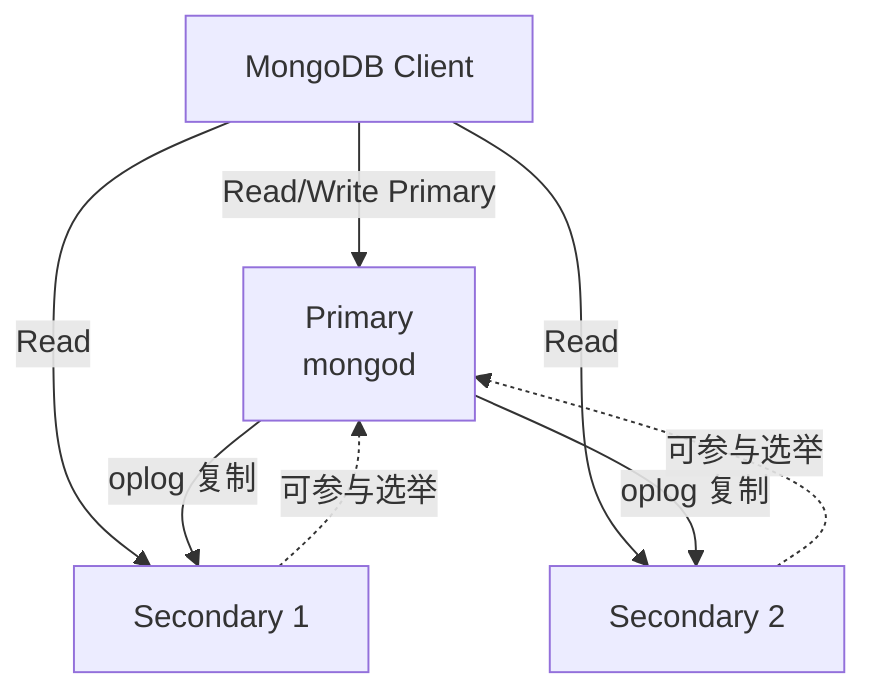

<!--
module:
  parent: database/nosql
  slug: database/nosql/mongodb
  type: article
  category: 主模块子文章
  summary: MongoDB 文档数据库：BSON 存储、副本集高可用、分片集群扩展、聚合管道、索引类型
-->

# MongoDB 文档数据库

> MongoDB 是最流行的文档型数据库，使用 BSON（Binary JSON）格式存储数据，天然支持嵌套结构，Schema 灵活，适合用户画像、内容管理、日志采集等场景。4.0+ 版本引入多文档 ACID 事务，进一步缩小了与关系型数据库的能力差距。

---

## 📚 核心内容

| 主题 | 关键点 |
|------|--------|
| 核心概念 | SQL → MongoDB 术语映射 |
| 基础 CRUD | insertOne / find / updateOne / deleteOne |
| 副本集 | 高可用 + 数据冗余，Primary + Secondary + Arbiter |
| 分片集群 | 水平扩展，Chunk 自动分裂与均衡 |
| Write/Read Concern | 可调一致性与持久性 |
| 索引类型 | 单字段、复合、多键、地理空间、TTL 等 |
| 聚合管道 | $match → $group → $sort 流水线式计算 |

---

## 一、核心概念（SQL → MongoDB）

| 概念 | SQL 类比 | MongoDB |
|------|---------|---------|
| 数据库 | Database | Database |
| 表 | Table | Collection |
| 行 | Row | Document |
| 列 | Column | Field |
| 主键 | Primary Key | `_id`（自动生成 ObjectId） |
| JOIN | JOIN | `$lookup`（聚合阶段） |
| 索引 | Index | Index（B-Tree 实现） |

> **ObjectId 结构**：12 字节 = 4 字节时间戳 + 5 字节随机值 + 3 字节计数器，天然有序且全局唯一，无需自增 ID。

---

## 二、基础 CRUD

```javascript
// 插入单文档
db.users.insertOne({
    name: "张三",
    age: 25,
    address: { city: "北京", zip: "100000" },
    tags: ["developer", "java"]
});

// 批量插入
db.users.insertMany([
    { name: "李四", age: 28, city: "上海" },
    { name: "王五", age: 22, city: "广州" }
]);

// 条件查询 + 排序 + 分页
db.users.find({ age: { $gt: 20 }, city: "北京" })
    .sort({ age: -1 })
    .skip(0).limit(10);

// 更新（$set 只改指定字段，不影响其他字段）
db.users.updateOne(
    { name: "张三" },
    { $set: { age: 26 }, $push: { tags: "senior" } }
);

// 删除
db.users.deleteMany({ age: { $lt: 18 } });
```

**MongoDB 4.0+ 支持多文档 ACID 事务**，但与 MySQL 的事务能力仍有差距（跨分片事务性能开销更大，建议优先用单文档原子操作）。

```javascript
// 多文档事务示例（需副本集或分片集群）
const session = db.getMongo().startSession();
session.startTransaction();
try {
    const coll = session.getDatabase("bank").accounts;
    coll.updateOne({ name: "A" }, { $inc: { balance: -100 } });
    coll.updateOne({ name: "B" }, { $inc: { balance: 100 } });
    session.commitTransaction();
} catch (e) {
    session.abortTransaction();
}
```

---

## 三、副本集（Replica Set）

MongoDB 副本集提供**高可用 + 数据冗余**，由 1 个 Primary 和多个 Secondary 组成。

```text
┌──────────┐
│  Primary │  ← 所有写操作
└────┬─────┘
     │ 异步复制 oplog
     ├──→ Secondary 1 (可读,默认)
     ├──→ Secondary 2 (可读,默认)
     └──→ Arbiter (仅投票,不存数据)
```

- **自动故障转移**：Primary 宕机时，Secondary 通过选举机制选出新 Primary（通常 10-30 秒）
- **读写分离**：Secondary 节点可读（需设置 `readPreference: secondaryPreferred`）
- **oplog**：操作日志（类 MySQL binlog），Secondary 通过拉取 oplog 增量同步
- **选举机制**：基于 Raft-like 协议，需奇数投票节点（Arbiter 用于凑奇数）

> **生产建议**：副本集最少 3 节点（1 Primary + 2 Secondary），或 2 节点 + 1 Arbiter；跨机房部署时 Secondary 放在不同 AZ。

---

## 四、分片集群（Sharded Cluster）

数据量超过单节点承载（通常 2TB+）或写入 QPS 超过单副本集上限时，使用分片。

```text
客户端 → mongos(路由) → Config Server(元数据,副本集)
                              ↓
              ┌───────────────┼───────────────┐
              ▼               ▼               ▼
          Shard 1         Shard 2         Shard 3
        (副本集)         (副本集)         (副本集)
```

- **分片键（Shard Key）**：决定数据分布，必须包含在唯一索引中，一旦选定不可更改（MongoDB 5.0+ 支持 refine，但不支持 reshard）
- **Chunk**：默认 64MB，自动分裂与均衡（Balancer 后台迁移）
- **Hash 分片 vs Range 分片**：

| 策略 | 分布均匀度 | 范围查询 | 适用场景 |
|------|-----------|---------|---------|
| Hash 分片 | 极均匀 | 需扫所有分片（scatter-gather） | 写多读少，ID 类分片键 |
| Range 分片 | 可能热点 | 单分片内高效 | 时间序列，范围查询多 |

> **分片键选择是性能关键**：避免单调递增字段（如时间戳）作为 Hash 键；复合分片键（如 `{userId: 1, createdAt: 1}`）兼顾均匀性和查询效率。

---

## 五、写关注（Write Concern）与读关注（Read Concern）

| 级别 | 写关注 | 读关注 |
|------|--------|--------|
| `{w: 0}` | 不确认（fire-and-forget） | - |
| `{w: 1}` | Primary 写入即返回 | - |
| `{w: "majority"}` | **多数节点确认**（推荐生产用） | - |
| `{level: "local"}` | - | 读本地节点（可能未持久化） |
| `{level: "majority"}` | - | 读已确认的多数节点数据 |
| `{level: "linearizable"}` | - | 读最新数据（强一致，有性能代价） |

> **最佳实践**：写用 `w: "majority"`，读用 `level: "majority"`，可保证"读已写"一致性（Read Your Writes）。

---

## 六、索引类型

| 索引 | 示例 | 用途 |
|------|------|------|
| **单字段** | `{name: 1}` | 单字段等值/范围查询 |
| **复合** | `{name: 1, age: -1}` | 多字段联合查询（顺序重要，遵循 ESR 原则） |
| **多键（Multikey）** | 自动对数组字段建立 | 数组内元素检索 |
| **地理空间** | `2dsphere`（球面）、`2d`（平面） | LBS 附近的人、距离计算 |
| **文本** | `{content: "text"}` | 全文搜索（生产建议用 ES） |
| **Hash** | `{name: "hashed"}` | 分片键专用 |
| **TTL** | `{createdAt: 1}, expireAfterSeconds: 3600` | 自动过期（验证码、Session） |
| **通配符（Wildcard）** | `{"$**": 1}` | Schema 不固定场景（MongoDB 4.2+） |

> **ESR 原则**（Equality → Sort → Range）：复合索引字段顺序应为 等值字段 → 排序字段 → 范围字段，否则索引无法充分利用。

---

## 七、聚合管道（Aggregation Pipeline）

聚合管道是 MongoDB 的数据处理核心，类似 SQL 的 GROUP BY + JOIN + 窗口函数。

```javascript
// 各年龄段用户数 + 平均消费（按年龄分组）
db.users.aggregate([
    { $match: { status: 'active' } },          // 阶段 1：过滤
    { $group: {                                 // 阶段 2：分组聚合
        _id: { $switch: {
            branches: [
                { case: { $lt: ['$age', 18] }, then: '未成年' },
                { case: { $lt: ['$age', 30] }, then: '青年' },
                { case: { $lt: ['$age', 60] }, then: '中年' }
            ],
            default: '老年'
        }},
        count: { $sum: 1 },
        avgSpending: { $avg: '$spending' },
        maxSpending: { $max: '$spending' }
    }},
    { $sort: { count: -1 } },                   // 阶段 3：排序
    { $limit: 10 }                              // 阶段 4：取 Top N
]);
```

**常用聚合阶段**：

| 阶段 | 功能 | SQL 等价 |
|------|------|---------|
| `$match` | 过滤 | WHERE |
| `$group` | 分组聚合 | GROUP BY |
| `$sort` | 排序 | ORDER BY |
| `$lookup` | 跨集合关联 | LEFT JOIN |
| `$unwind` | 展开数组 | UNNEST |
| `$project` | 字段投影 | SELECT 列 |
| `$addFields` | 新增计算字段 | SELECT 表达式 |

> **性能提示**：`$match` 和 `$sort` 尽量放在管道最前面，可利用索引；`$lookup` 是性能瓶颈，大数据量时考虑在应用层做关联。

---

## 🔗 相关章节

- [NoSQL 总览](../README.md) — NoSQL 类型对比与选型指南
- [Redis](../../07-redis/README.md) — 键值型 NoSQL，常与 MongoDB 配合做缓存层
- [Elasticsearch](../elasticsearch/README.md) — MongoDB 全文搜索能力弱，生产搜索场景用 ES

---

← [返回 NoSQL 数据库](../README.md)

## 副本集架构图（ASCII → Mermaid）



**节点类型**：
- **Primary**（1 个）：唯一接收写入，定期写 oplog
- **Secondary**（1+ 个）：异步复制 oplog，提供读扩展
- **Arbiter**（可选）：轻量投票节点，不存数据

## 分片键选择决策树（新增）

```text
Q1: 数据访问是否以范围查询为主（如时间范围、地理位置）？
  ├─ 是 → Q2: 范围字段是否单调递增/递减？
  │        ├─ 是 → 使用范围分片键（如 timestamp、_id）→ 高效范围扫描
  │        └─ 否 → 复合分片键（范围+哈希前缀）→ 平衡范围和分布
  └─ 否 → Q3: 写入是否均匀分布？
           ├─ 是 → 哈希分片键（{field: hashed}）→ 完全分布
           └─ 否 → 复合分片键（{highCardinality: 1, lowCardinality: hashed}）→ 解决热点
```

**反模式警告**：
- ❌ 单调递增字段（如 `_id` 单独哈希）→ 写热点集中在最新 chunk
- ❌ 低基数字段（如 status 0/1/2）→ 分片不均，部分分片过载
- ✅ 组合分片键（如 `{userId: hashed, timestamp: 1}`）→ 用户级聚合 + 时间排序
