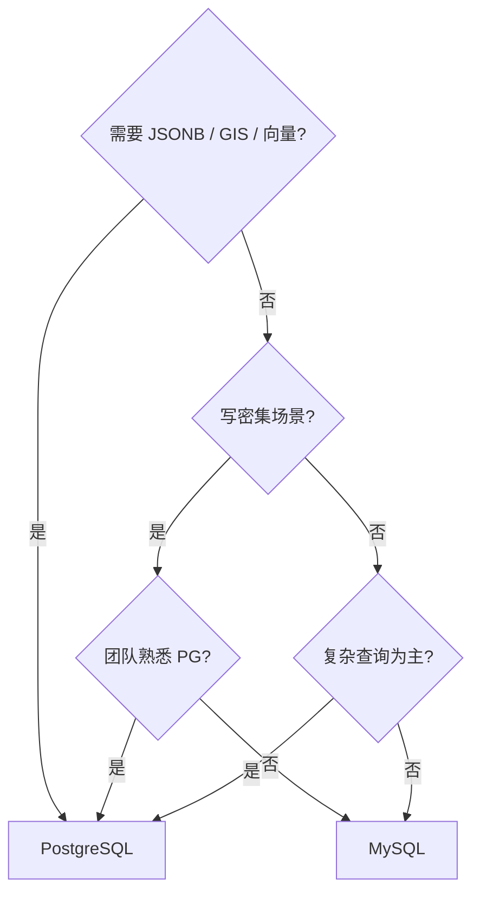

<!--
module:
  parent: database
  slug: database/postgresql
  type: article
  category: 主模块子文章
  summary: PostgreSQL 架构、MVCC、索引、扩展生态与高可用，兼顾与 MySQL 的选型决策
-->

# PostgreSQL

> 一句话定位：**最先进的开源关系型数据库——从 MVCC 到 JSON/JSONB、从 GiST 索引到 pgvector，一个数据库覆盖 ORDBMS + NoSQL + 向量搜索**

PostgreSQL（简称 PG）以"世界最先进的开源关系型数据库"自居，2026 年 DB-Engines 排名稳居前四。它不只是一个 RDBMS，更是一个 **ORDBMS**（对象关系型），支持数组、JSON、自定义类型、继承、表空间等高级特性。

---

## 📚 核心内容

| 主题 | 内容 | 关键点 |
|------|------|--------|
| 一、架构对比 | PostgreSQL vs MySQL 架构差异 | 进程模型 vs 线程模型 |
| 二、MVCC 实现 | heap tuple + 事务 ID vs undo log | PG 保留旧版本元组，MySQL 用回滚段 |
| 三、查询优化 | EXPLAIN ANALYZE / 统计信息 / pg_stat_statements | 执行计划 + 真实运行时数据 |
| 四、索引类型 | B-tree / Hash / GiST / GIN / BRIN | 5 大索引覆盖全场景 |
| 五、扩展生态 | PostGIS / pgvector / Citus / TimescaleDB | 插件化架构 |
| 六、JSON/JSONB | 半结构化数据的 NoSQL 能力 | JSONB 二进制存储 + GIN 索引 |
| 七、复制与高可用 | 流复制 / 逻辑复制 / Patroni | 异步 → 同步 → 自动故障转移 |
| 八、选型决策 | PG vs MySQL 场景对比 | 按业务特征选型 |

---

## 一、PostgreSQL vs MySQL 架构对比

| 维度 | PostgreSQL | MySQL (InnoDB) |
|------|-----------|----------------|
| **连接模型** | 多进程（每连接 fork 子进程） | 多线程（线程池） |
| **存储引擎** | 单引擎（heap + 索引） | 可插拔（InnoDB / MyISAM / Memory） |
| **MVCC** | heap tuple 多版本元组 | undo log 回滚段 |
| **默认隔离级别** | Read Committed | Repeatable Read |
| **WAL** | pg_xlog（Write-Ahead Log） | Redo Log（双文件循环） |
| **DDL** | 事务型 DDL（支持 ROLLBACK） | 非事务型（8.0 起仅原子 DDL） |
| **数据类型** | 丰富（数组、range、JSON、UUID、自定义） | 较少（标准 SQL 类型） |
| **扩展性** | 插件式（CREATE EXTENSION） | 组件式（存储引擎 / UDF） |
| **子查询** | 成熟优化 | 8.0 前较差，8.0 改善 |
| **全文搜索** | 内置 tsvector / tsquery | InnoDB FULLTEXT（功能较弱） |

### 进程 vs 线程模型

```text
PostgreSQL:                    MySQL:
┌──────────────┐              ┌──────────────┐
│  postmaster   │              │   mysqld     │
│  (监听进程)   │              │  (单进程)    │
└──────┬───────┘              └──────┬───────┘
       │ fork                        │ 线程池
  ┌────┴────┐                   ┌────┴────┐
  │backend 1│                   │ thread 1 │
  │backend 2│                   │ thread 2 │
  │backend N│                   │ thread N │
  └─────────┘                   └─────────┘
```

PG 的进程模型内存隔离更强（单连接 crash 不影响其他），但高并发时内存占用大，通常配合 **PgBouncer** 连接池使用。

---

## 二、MVCC 实现差异

### PostgreSQL：heap tuple 多版本

PG 在 heap page 中直接保存**多版本元组**，每个元组携带 `xmin`（创建事务 ID）和 `xmax`（删除事务 ID）。

```sql
-- PG 元组头部关键字段
-- xmin: 插入该元组的事务 ID
-- xmax: 删除/更新该元组的事务 ID（0 = 未删除）
-- cmin/cmax: 命令 ID（同一事务内多条语句）

-- VACUUM 的作用：清理已不可见的旧版本元组
-- autovacuum 默认开启，避免表膨胀
```

```text
┌────────────────────────────┐
│ Heap Page                  │
│ ┌──────────────────────┐   │
│ │ Tuple v1 (xmin=100)  │──→ 对 tx<100 不可见
│ │ Tuple v2 (xmin=200)  │──→ 对 tx>=200 可见（最新版本）
│ │ Tuple v3 (xmax=300)  │──→ 已删除标记
│ └──────────────────────┘   │
│                            │
│ Free Space Map (FSM)       │
│ Visibility Map (VM)        │
└────────────────────────────┘
```

### MySQL (InnoDB)：undo log

InnoDB 只在聚簇索引中保留**最新版本**，旧版本通过 **undo log**（回滚段）链式回溯。

| 对比点 | PostgreSQL | MySQL (InnoDB) |
|--------|-----------|----------------|
| 旧版本位置 | heap page 内 | undo log（回滚段表空间） |
| 清理方式 | VACUUM（手动/自动） | purge thread（后台自动） |
| 表膨胀 | 是（需要 VACUUM FULL 或 pg_repack） | 否（undo log 独立空间） |
| 读性能 | 旧版本多时下降 | 长事务链回溯时下降 |
| 写性能 | 每次 UPDATE 插入新元组 | 原地更新 + undo log |

> 💡 **面试高频**：PG 的 UPDATE 是 "delete + insert"（产生新元组），MySQL 的 UPDATE 是原地修改 + 写 undo log。这导致 PG 写密集场景更容易表膨胀。

---

## 三、查询优化

### EXPLAIN ANALYZE

```sql
-- 基础执行计划
EXPLAIN SELECT * FROM orders WHERE user_id = 42;

-- 带真实运行时数据（执行 + 统计）
EXPLAIN (ANALYZE, BUFFERS, FORMAT TEXT)
  SELECT u.name, COUNT(o.id)
  FROM users u
  JOIN orders o ON u.id = o.user_id
  WHERE o.created_at > '2025-01-01'
  GROUP BY u.name;

-- 输出关键字段
-- actual time=0.045..12.340 ms  ← 真实耗时
-- rows=1500                      ← 实际返回行数
-- Buffers: shared hit=234 read=56  ← buffer 命中 vs 磁盘读取
```

### 统计信息

```sql
-- 手动更新统计信息（大表变更后建议执行）
ANALYZE orders;

-- 查看列统计
SELECT attname, n_distinct, most_common_vals
FROM pg_stats
WHERE tablename = 'orders';

-- 调整采样精度（默认 100，高基数列可加大）
ALTER TABLE orders ALTER COLUMN user_id SET STATISTICS 1000;
```

### pg_stat_statements

```sql
-- 启用扩展
CREATE EXTENSION pg_stat_statements;

-- 查看 Top 10 慢查询
SELECT
  query,
  calls,
  round(total_exec_time::numeric, 2) AS total_ms,
  round(mean_exec_time::numeric, 2) AS avg_ms,
  rows
FROM pg_stat_statements
ORDER BY mean_exec_time DESC
LIMIT 10;

-- 重置统计
SELECT pg_stat_statements_reset();
```

---

## 四、索引类型

| 索引类型 | 适用场景 | 示例 |
|---------|---------|------|
| **B-tree**（默认） | 等值 + 范围查询 | `CREATE INDEX idx ON t(a);` |
| **Hash** | 纯等值查询 | `CREATE INDEX idx ON t USING hash(a);` |
| **GiST** | 几何 / 范围 / 全文搜索 / KNN | `CREATE INDEX idx ON t USING gist(geom);` |
| **GIN** | 数组 / JSONB / 全文搜索 | `CREATE INDEX idx ON t USING gin(tags);` |
| **BRIN** | 时序数据（物理有序大表） | `CREATE INDEX idx ON t USING brin(created_at);` |

### 部分索引与表达式索引

```sql
-- 部分索引：只索引活跃用户
CREATE INDEX idx_active_users ON users(email)
WHERE status = 'active';

-- 表达式索引：对函数结果建索引
CREATE INDEX idx_lower_email ON users(lower(email));

-- 覆盖索引（Index-Only Scan）
CREATE INDEX idx_orders_cover ON orders(user_id, status, total);
```

### 并发创建索引

```sql
-- 不阻塞写操作（生产必备）
CREATE INDEX CONCURRENTLY idx_orders_user ON orders(user_id);
```

---

## 五、扩展生态

| 扩展 | 功能 | 典型场景 |
|------|------|---------|
| **PostGIS** | 空间数据（GIS） | 地图、位置服务、地理围栏 |
| **pgvector** | 向量搜索 | AI/ML embedding 相似性检索 |
| **Citus** | 分布式分片 | 水平扩展、多租户 SaaS |
| **TimescaleDB** | 时序数据 | IoT、监控指标、金融行情 |
| **pg_trgm** | 三字母组模糊匹配 | 搜索引擎纠错、模糊查询 |
| **pg_cron** | 数据库内定时任务 | 替代外部 cron / 调度器 |

### pgvector 示例

```sql
-- 安装
CREATE EXTENSION vector;

-- 创建向量列（1536 维 = OpenAI embedding）
CREATE TABLE documents (
  id SERIAL PRIMARY KEY,
  content TEXT,
  embedding VECTOR(1536)
);

-- GIN/IVFFlat 索引加速近邻搜索
CREATE INDEX idx_embedding ON documents
USING ivfflat (embedding vector_cosine_ops) WITH (lists = 100);

-- 相似性搜索
SELECT content, 1 - (embedding <=> $1) AS similarity
FROM documents
ORDER BY embedding <=> $1
LIMIT 10;
```

---

## 六、JSON/JSONB 与 NoSQL 能力

### JSON vs JSONB

| 特性 | JSON | JSONB |
|------|------|-------|
| 存储格式 | 原始文本 | 解析后的二进制 |
| 重复 key | 保留 | 去重（最后一条） |
| 索引支持 | 无 | GIN / B-tree 表达式 |
| 查询性能 | 每次解析 | 直接读取 |
| **推荐** | 仅存不需要查的数据 | **默认选择** |

### JSONB 操作

```sql
-- 插入
INSERT INTO products (data) VALUES (
  '{"name": "iPhone 16", "price": 7999, "specs": {"ram": "8GB", "storage": "256GB"}}'
);

-- 查询操作符
SELECT data->>'name' AS name,              -- 文本提取
       data->'specs'->>'ram' AS ram,       -- 嵌套提取
       data @> '{"price": 7999}'::jsonb    -- 包含查询（可用 GIN 索引）
FROM products;

-- GIN 索引加速 JSONB 查询
CREATE INDEX idx_products_data ON products USING gin(data);

-- 更新 JSONB 字段
UPDATE products
SET data = jsonb_set(data, '{price}', '8999')
WHERE data->>'name' = 'iPhone 16';
```

> 💡 PG 的 JSONB + GIN 索引组合让它可以替代很多 MongoDB 场景，同时保留关系型数据库的事务和 JOIN 能力。

---

## 七、复制与高可用

### 流复制（Streaming Replication）

```text
Primary ──WAL stream──→ Standby 1 (hot standby)
                    └──→ Standby 2 (hot standby)

-- 异步流复制（默认）：低延迟，可能丢数据
-- 同步流复制：零丢数据，写延迟增加

-- postgresql.conf (Primary)
wal_level = replica
max_wal_senders = 10
synchronous_standby_names = 'ANY 1 (standby1, standby2)'
```

### 逻辑复制（Logical Replication）

```sql
-- 发布端
ALTER SYSTEM SET wal_level = logical;
CREATE PUBLICATION pub_orders FOR TABLE orders, order_items;

-- 订阅端
CREATE SUBSCRIPTION sub_orders
  CONNECTION 'host=primary dbname=shop'
  PUBLICATION pub_orders;

-- 用途：跨大版本升级、跨库同步、选择性复制部分表
```

### Patroni 自动高可用

```text
┌─────────────┐     ┌─────────────┐
│   etcd/      │     │   etcd/     │
│  Consul DCS  │     │  Consul DCS │
└──────┬──────┘     └──────┬──────┘
       │                    │
  ┌────┴────┐          ┌───┴─────┐
  │Patroni  │          │Patroni  │
  │Primary  │          │Replica  │
  │(读写)   │          │(只读)   │
  └─────────┘          └─────────┘

-- 故障转移：< 30 秒自动 failover
-- VIP / DNS 切换对应用透明
-- 生产标配：Patroni + etcd + PgBouncer
```

| 高可用方案 | 故障转移 | 复杂度 | 适用 |
|-----------|---------|--------|------|
| **Patroni + etcd** | 自动（<30s） | 中 | 生产标配 |
| **repmgr** | 半自动 | 低 | 中小规模 |
| **流复制 + 手动** | 手动 | 最低 | 开发/测试 |
| **云 RDS** | 全自动 | 零 | 云用户 |

---

## 八、与 MySQL 的选型决策表

| 决策维度 | 选 PostgreSQL | 选 MySQL |
|---------|-------------|---------|
| **数据类型** | 需要 JSONB / 数组 / 地理 / 向量 | 标准 SQL 类型足够 |
| **事务 DDL** | 需要 DDL 回滚（迁移脚本安全） | 不需要 |
| **全文搜索** | 需要内置高质量全文搜索 | 可接受 ES 外挂 |
| **复杂查询** | 多表 JOIN / CTE / 窗口函数密集 | 简单 CRUD 为主 |
| **写入性能** | 读多写少（UPDATE 产生新元组） | 写密集（原地更新更优） |
| **团队熟悉度** | 团队有 PG 经验 | 团队以 MySQL 为主 |
| **扩展需求** | 需要 GIS / 向量 / 时序 | 标准关系型即可 |
| **生态工具** | ORM 支持好，运维工具偏少 | 生态最成熟，DBA 好招 |
| **云托管** | AWS RDS PG / Azure / Supabase | AWS RDS / 阿里云 RDS |

### 简单决策树



---

## 🔗 相关章节

- **事务与 MVCC**：[03-transaction](../03-transaction/README.md) — ACID / 隔离级别 / MVCC 理论基础
- **索引原理**：[04-index](../04-index/README.md) — B+ 树 / 聚簇索引 / 最左前缀
- **MySQL 深入**：[05-mysql](../05-mysql/README.md) — InnoDB 内部机制 / 主从复制
- **缓存**：[06-cache](../06-cache/README.md) — 数据库前的高速缓存层

---

## 📖 开源参考

| 项目 | 说明 | 链接 |
|------|------|------|
| PostgreSQL | 最先进的开源 RDBMS | [postgresql.org](https://www.postgresql.org) |
| PostGIS | 空间数据扩展 | [postgis.net](https://postgis.net) |
| pgvector | 向量搜索扩展 | [github.com/pgvector/pgvector](https://github.com/pgvector/pgvector) |
| Citus | 分布式 PG | [github.com/citusdata/citus](https://github.com/citusdata/citus) |
| TimescaleDB | 时序数据扩展 | [timescale.com](https://www.timescale.com) |
| Patroni | 自动高可用 | [github.com/zalando/patroni](https://github.com/zalando/patroni) |
| PgBouncer | 轻量连接池 | [pgbouncer.github.io](https://www.pgbouncer.org) |

---

← [返回: 数据库](../README.md)
