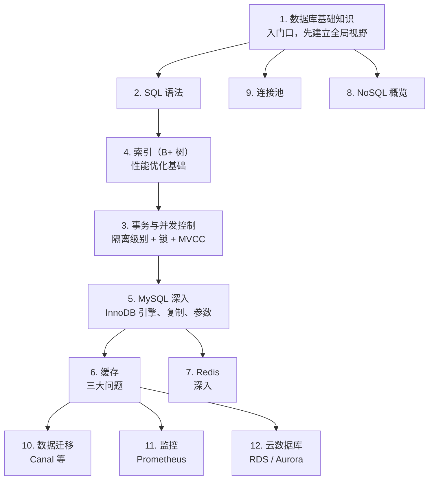

<!--
module:
  number: 03
  slug: database
  topic: 数据库
  audience: 工程师 / DBA
  category: 主模块
  summary: 数据库是按照数据结构来组织、存储和管理数据的仓库。本章节从关系型数据库基础出发,逐步深入到 SQL、事务、索引、MySQL 内部机制,再扩展到缓存、Redis、...
-->

# 数据库

> 数据库是按照数据结构来组织、存储和管理数据的仓库。本章节从关系型数据库基础出发,逐步深入到 SQL、事务、索引、MySQL 内部机制,再扩展到缓存、Redis、NoSQL 与连接池。

> 最后更新: 2026-06-09

---

## 🗺️ 知识体系

| 序号 | 主题 | 难度 | 说明 |
|------|------|------|------|
| 1 | [数据库基础知识](01-fundamentals/README.md) | ⭐ 入门 | 核心概念、ER 图、范式、设计步骤 |
| 2 | [SQL](02-sql/README.md) | ⭐ 入门 | SQL 语法、执行顺序、慢查询分析与优化 |
| 3 | [事务与并发控制](03-transaction/README.md) | ⭐⭐ 进阶 | ACID、隔离级别、锁机制、MVCC |
| 4 | [索引](04-index/README.md) | ⭐⭐ 进阶 | B+ 树、聚簇/非聚簇索引、覆盖索引、最左前缀、索引失效 |
| 5 | [MySQL](05-mysql/README.md) | ⭐⭐ 进阶 | 架构、存储引擎、InnoDB 内部机制、主从复制、日志系统 |
| 6 | [缓存](06-cache/README.md) | ⭐⭐ 进阶 | 缓存分类、穿透/击穿/雪崩、缓存与数据库一致性 |
| 7 | [Redis](07-redis/README.md) | ⭐⭐ 进阶 | 数据类型、持久化、集群高可用、内存管理 |
| 8 | [NoSQL 数据库](08-nosql/README.md) | ⭐⭐ 进阶 | NoSQL 分类、SQL vs NoSQL 对比、选型指南 |
| 9 | [数据库连接池](09-connection-pool/README.md) | ⭐ 入门 | HikariCP、Druid、参数配置、监控 |
| 10 | [数据迁移与同步](10-data-migration/README.md) | ⭐⭐ 进阶 | DataX 全量同步、Canal/Maxwell Binlog 订阅、Flink CDC |
| 11 | [数据库监控告警](11-monitoring/README.md) | ⭐⭐ 进阶 | Prometheus + Grafana + AlertManager、慢查询分析 |
| 12 | [云数据库](12-cloud-database/README.md) | ⭐⭐ 进阶 | AWS RDS/Aurora、阿里云 PolarDB、TiDB Cloud、自建 vs 云 |

---

## 🧭 学习路线

## 📊 速查表

| 概念 | 核心要点 | 典型场景 |
|------|---------|---------|
| **ACID** | 原子性、一致性、隔离性、持久性 | 事务保证 |
| **隔离级别** | RU < RC < RR < Serializable，越高越安全但越慢 | 并发控制选型 |
| **MVCC** | 多版本并发控制，Read View + Undo Log | RR 级别下读写不冲突 |
| **B+ 树索引** | 叶子节点形成有序链表，适合范围查询 | 关系数据库默认索引 |
| **聚簇索引** | 索引和数据存一起，InnoDB 主键索引 | 主键查询直接返回行 |
| **最左前缀** | 联合索引 (a,b,c) 支持 a / a,b / a,b,c | 索引设计原则 |
| **缓存穿透** | 查询不存在数据，击穿到数据库 | 空值缓存 / 布隆过滤器 |
| **缓存击穿** | 热点 key 过期，大量请求打到数据库 | 互斥锁 / 永不过期 |
| **缓存雪崩** | 大量 key 同时过期 | 过期时间加随机值 |
| **HikariCP** | 高性能连接池，默认 Spring Boot 2.x+ | 数据库连接管理 |

## 🎯 前置知识

- 任意一门后端语言基础(Java/Python/Go)
- 基本的计算机网络(TCP 三次握手)
- 数据结构基础(B+ 树、Hash 表)

## 🔗 相关章节

数据库章节的多个主题与 [04.system-design](../04.system-design/README.md) 深度联动:

- **缓存**: [04.system-design · 缓存设计模式](../04.system-design/04-high-performance/cache-patterns/README.md) 详解 Cache-Aside/Read-Through/Write-Through/Write-Behind
- **Redis**: [04.system-design · 分布式缓存](../04.system-design/02-distributed/distributed-cache/README.md) 讲解缓存架构
- **连接池**: [04.system-design · 连接池](../04.system-design/04-high-performance/connection-pool/README.md) 架构视角的调优
- **主从复制**: 与 [04.system-design · CAP 定理](../04.system-design/02-distributed/cap-and-base/cap/README.md) 共同理解分布式一致性

## 🎯 高频面试题（咬文嚼字）

针对面试中反复深挖的细节问题，见 [13.split-hairs/03.database](../13.split-hairs/03.database/)：

| 主题 | 难度 | 核心问题 |
|------|------|---------|
| [缓存穿透 / 击穿 / 雪崩](../13.split-hairs/03.database/redis/cache-penetration-breakdown-avalanche/) | ⭐⭐⭐⭐⭐ | 面试必考三件套 |
| [索引失效的 10 种场景](../13.split-hairs/03.database/mysql/index-failure/) | ⭐⭐⭐⭐⭐ | LIKE 左通配 / 函数 / 类型转换 / OR / 最左前缀 |
| [COUNT(*) vs COUNT(1) vs COUNT(字段)](../13.split-hairs/03.database/relational-database/mysql/count/) | ⭐⭐ | 性能差异 |
| [事务隔离级别](../13.split-hairs/03.database/relational-database/mysql/isolation/) | ⭐⭐⭐⭐ | RU / RC / RR / Serializable |

## 📖 开源参考

| 项目 | 说明 | 链接 |
|------|------|------|
| MySQL | 最流行的开源关系数据库 | [dev.mysql.com](https://dev.mysql.com) |
| Redis | 高性能内存键值数据库 | [redis.io](https://redis.io) |
| HikariCP | 高性能 JDBC 连接池 | [github.com/brettwooldridge/HikariCP](https://github.com/brettwooldridge/HikariCP) |
| Canal | 阿里开源 MySQL Binlog 订阅 | [github.com/alibaba/canal](https://github.com/alibaba/canal) |
| DataX | 离线数据同步工具 | [github.com/alibaba/DataX](https://github.com/alibaba/DataX) |
| CHMCache | 基于 ConcurrentHashMap 的 LRU 缓存 | [gitee.com/wb04307201/CHMCache](https://gitee.com/wb04307201/CHMCache) |

---

← [返回笔记目录](../README.md)
