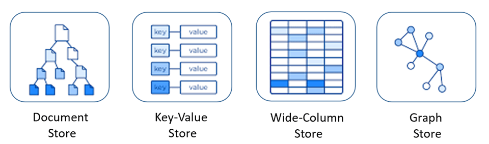

# NoSQL基础知识

NoSQL（Not Only SQL 的缩写）泛指非关系型的数据库，主要针对的是键值、文档以及图形类型数据存储。 并且，NoSQL 数据库天生支持分布式，数据冗余和数据分片等特性，旨在提供可扩展的高可用高性能数据存储解决方案。

## 优点
NoSQL 数据库非常适合许多现代应用程序，例如移动、Web 和游戏等应用程序，它们需要灵活、可扩展、高性能和功能强大的数据库以提供卓越的用户体验。
- **灵活性**：NoSQL 数据库通常提供灵活的架构，以实现更快速、更多的迭代开发。灵活的数据模型使 NoSQL 数据库成为半结构化和非结构化数据的理想之选。
- **可扩展性**：NoSQL 数据库通常被设计为通过使用分布式硬件集群来横向扩展，而不是通过添加昂贵和强大的服务器来纵向扩展。
- **高性能**：NoSQL 数据库针对特定的数据模型和访问模式进行了优化，这与尝试使用关系数据库完成类似功能相比可实现更高的性能。
- **强大的功能**：NoSQL 数据库提供功能强大的 API 和数据类型，专门针对其各自的数据模型而构建。

## 类型、特点和示例

1. **键值存储数据库**
    * **简介**：是最简单、最基础的NoSQL数据库类型。它将数据保存为键值对的形式，其中键和值都可以是任意的数据类型。
    * **特点**：以高性能为目标，适用于需要处理大量读写操作的场景。
    * **示例**：Redis、Memcached、Amazon DynamoDB和Riak等。

2. **文档数据库**
    * **简介**：是基于文档模型的NoSQL数据库类型，它将数据以类似于JSON的文档形式进行存储。
    * **特点**：具有更灵活的数据模型和更好的可扩展性，非常适合存储和处理半结构化数据。
    * **示例**：MongoDB、Couchbase和CouchDB等。

3. **列族数据库**
    * **简介**：是一种按列而不是按行存储数据的NoSQL数据库类型。它将数据以列族的形式进行组织和存储，每个列族可以包含不同的列，而每一列则包含多个值。
    * **特点**：适用于需要进行大量的列级操作和聚合查询的场景，特别适合于海量数据集的大规模并行处理，并且在大数据分析中表现出色。
    * **示例**：Apache Cassandra、HBase以及Google Bigtable等。

4. **图数据库**
    * **简介**：是基于图论理论的NoSQL数据库类型，它以图的形式存储和处理数据。
    * **特点**：适用于需要处理复杂关系和图算法的场景，能够轻松表达复杂的关系网状结构。
    * **示例**：Neo4j和Amazon Neptune等。

5. **搜索引擎**
    * **简介**：是一种特殊类型的NoSQL数据库，它主要用于全文搜索和信息检索。
    * **特点**：以倒排索引的方式来存储和索引数据，快速地检索和返回相关的搜索结果。
    * **示例**：Elasticsearch是目前最受欢迎的搜索引擎之一。

### 应用

1. **高并发读写场景**：如微博、Facebook等社交平台，需要处理大量的用户动态、点赞、评论等操作。NoSQL数据库可以轻松应对高并发的读写请求，快速存储和检索用户生成的内容。
2. **电商网站**：在购物高峰期间，电商网站会面临大量的用户浏览商品、添加购物车、下单等操作。NoSQL数据库可以支持高并发的读写，确保用户能够快速访问商品信息和完成交易。
3. **日志分析**：企业的服务器日志、应用程序日志等数据量通常非常庞大。NoSQL数据库可以存储和处理这些海量的日志数据，并且能够快速进行查询和分析。例如，使用Hive等基于Hadoop的NoSQL工具进行日志分析，可以快速找出系统中的问题和异常情况。
4. **物联网**：物联网设备会产生大量的传感器数据，这些数据需要实时存储和处理。NoSQL数据库可以轻松应对海量的物联网数据，并且能够支持实时的数据查询和分析。
5. **内容管理系统（CMS）**：通常需要存储各种类型的内容，如文章、图片、视频等。NoSQL数据库的灵活数据模型可以适应不同类型的内容存储需求，并且能够方便地进行扩展和修改。
6. **游戏**：会有各种类型的玩家数据、游戏状态数据等。NoSQL数据库的灵活数据模型可以适应游戏开发中的快速变化需求，并且能够方便地进行数据存储和查询。
7. **分布式系统**：在分布式系统中，数据需要在多个节点上进行存储和处理。NoSQL数据库通常具有良好的分布式架构，可以轻松实现数据的分布式存储和处理，提高系统的可用性和可扩展性。
8. **云计算环境**：资源可以根据需求进行动态扩展和收缩。NoSQL数据库可以轻松适应云计算环境的弹性需求，并且能够快速进行部署和扩展。

总之，NoSQL数据库具有多种类型，每种类型都有其独特的优势和适用场景。在选择NoSQL数据库时，需要根据具体的应用场景和需求来进行选择。