# NoSQL基础知识

> NoSQL（Not Only SQL 的缩写）泛指非关系型的数据库，主要针对的是键值、文档以及图形类型数据存储。  
> 并且，NoSQL 数据库天生支持分布式，数据冗余和数据分片等特性，旨在提供可扩展的高可用高性能数据存储解决方案。

## 优点
> NoSQL 数据库非常适合许多现代应用程序，例如移动、Web 和游戏等应用程序，它们需要灵活、可扩展、高性能和功能强大的数据库以提供卓越的用户体验。
> - **灵活性**：NoSQL 数据库通常提供灵活的架构，以实现更快速、更多的迭代开发。灵活的数据模型使 NoSQL 数据库成为半结构化和非结构化数据的理想之选。
> - **可扩展性**：NoSQL 数据库通常被设计为通过使用分布式硬件集群来横向扩展，而不是通过添加昂贵和强大的服务器来纵向扩展。
> - **高性能**：NoSQL 数据库针对特定的数据模型和访问模式进行了优化，这与尝试使用关系数据库完成类似功能相比可实现更高的性能。
> - **强大的功能**：NoSQL 数据库提供功能强大的 API 和数据类型，专门针对其各自的数据模型而构建。

## 类型

> - **键值**：键值数据库是一种较简单的数据库，其中每个项目都包含键和值。这是极为灵活的 NoSQL 数据库类型，因为应用可以完全控制 value 字段中存储的内容，没有任何限制。Redis 和 DynanoDB 是两款非常流行的键值数据库。
> - **文档**：文档数据库中的数据被存储在类似于 JSON（JavaScript 对象表示法）对象的文档中，非常清晰直观。每个文档包含成对的字段和值。这些值通常可以是各种类型，包括字符串、数字、布尔值、数组或对象等，并且它们的结构通常与开发者在代码中使用的对象保持一致。MongoDB 就是一款非常流行的文档数据库。
> - **图形**：图形数据库旨在轻松构建和运行与高度连接的数据集一起使用的应用程序。图形数据库的典型使用案例包括社交网络、推荐引擎、欺诈检测和知识图形。Neo4j 和 Giraph 是两款非常流行的图形数据库。
> - **宽列**：宽列存储数据库非常适合需要存储大量的数据。Cassandra 和 HBase 是两款非常流行的宽列存储数据库。

## 缓存与数据库一致性的问题

### 缓存的三种设计模式
#### Cache Aside Pattern（先更新数据在更新缓存）
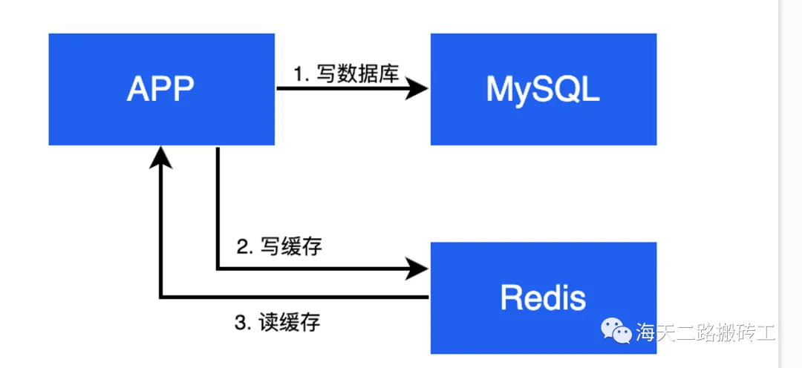
> - **加载（Load）**：应用程序从缓存读取数据，如果缓存不存在，则从数据库中把数据加载到缓存。
> - **更新（Update）**：当数据发生变化时，应用程序负责更新数据库，并清除或更新相应的缓存项。这保持了缓存中的数据与数据库的一致性。
##### 优点
> 简单、易于理解和实现。缓存中的数据是惰性加载的，减少了对缓存的依赖。
##### 缺点
> 应用程序需要管理缓存，导致了代码中可能存在一致性维护的复杂性。
#### Cache Through Pattern （基于DTS)
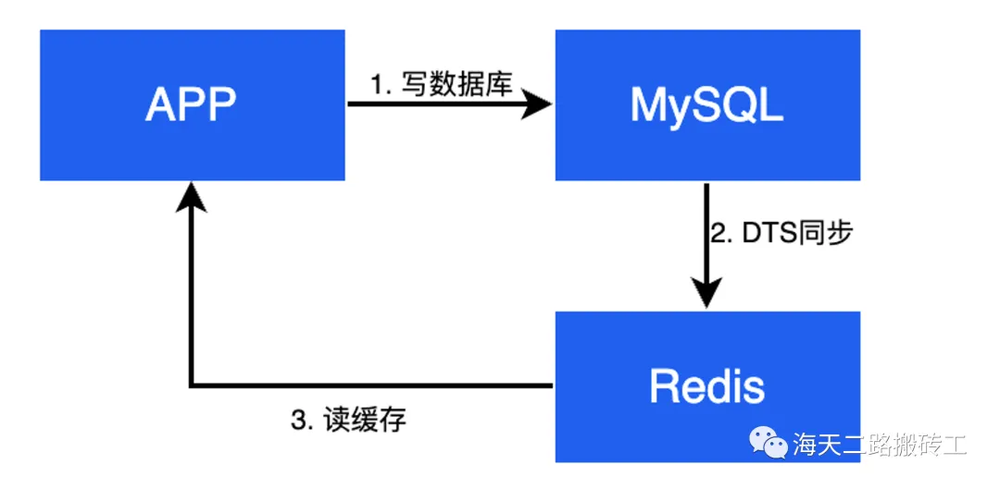
> - **加载（Load）**：应用程序通过缓存接口请求数据，而不直接从数据库读取。如果缓存中不存在所需数据，缓存会负责从数据库中加载数据，然后返回给应用程序。
> - **更新（Update）**：与 Cache Aside 不同，Cache Through 模式中更新数据时，缓存并不直接参与。应用程序负责将更新操作发送到数据库，然后数据库负责更新数据（并通过DTS等方式将数据同步到缓存中），保持数据一致性。
##### 优点
> 简化了应用程序对缓存的管理，数据库更直接地负责更新操作，减轻了应用程序的负担。
##### 缺点
> 数据更新时，可能引起缓存和数据库之间的不一致，需要额外的机制来维护一致性。
#### Cache Back Pattern （先更新缓存再更新数据库）

> - **加载（Load）**：应用程序通过缓存接口请求数据，缓存负责检查是否有缓存命中。如果缓存未命中，缓存会从数据库中加载数据并返回给应用程序。
> - **更新（Update）**：当数据需要更新时，应用程序负责将更新发送到缓存，缓存负责将更新异步地传递给数据库，以保持数据的一致性。
##### 优点
> 提供了更好的性能，因为应用程序可以更快地获取数据。同时，通过异步更新数据库，降低了对数据库的直接压力。
##### 缺点
> 引入了异步处理，可能会在一定程度上牺牲一致性。系统中需要处理缓存和数据库之间的同步问题。

### 缓存与数据库数据不一致的四种场景
#### 先更新数据库再更新缓存Cache Aside Pattern
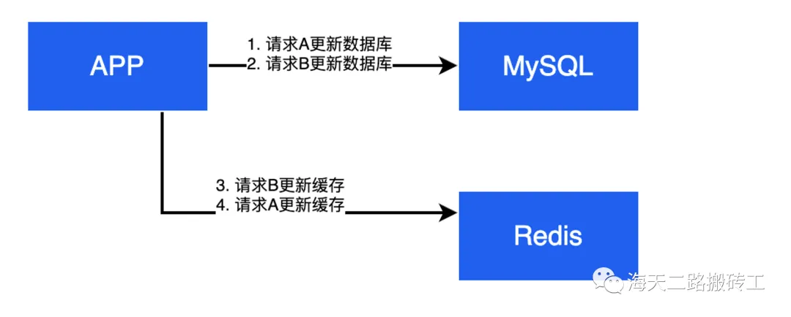
> 高并发时，会出现不一致行为。假设请求 A 先操作数据库，请求 B 后操作数据库，但是可能存在请求 B 先写缓存，请求 A 后写缓存的情况，从而导致数据库与缓存之间的数据不一致。
#### 先更新数据库再删除缓存Cache Aside Pattern
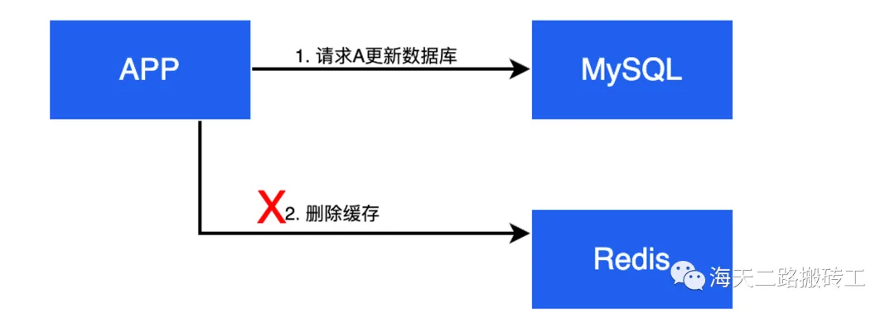
> 出现缓存不一致的概率较低，一般是删除缓存失败才会导致最终的不一致。
#### 先更新缓存再更新数据库Cache Back Pattern
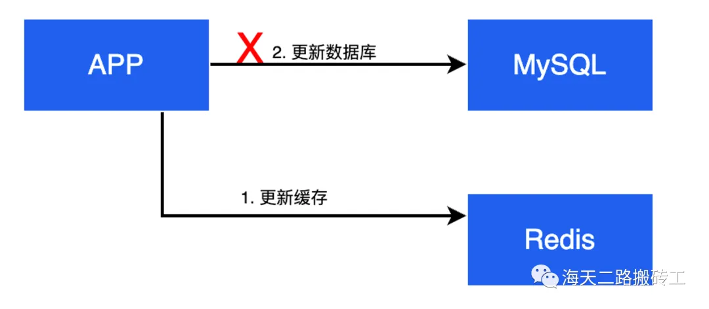
> 业务无法保证两个写操作都成功，如果数据库更新失败，则数据会最终不一致。
#### 先删除缓存在更新数据库Cache Back Pattern
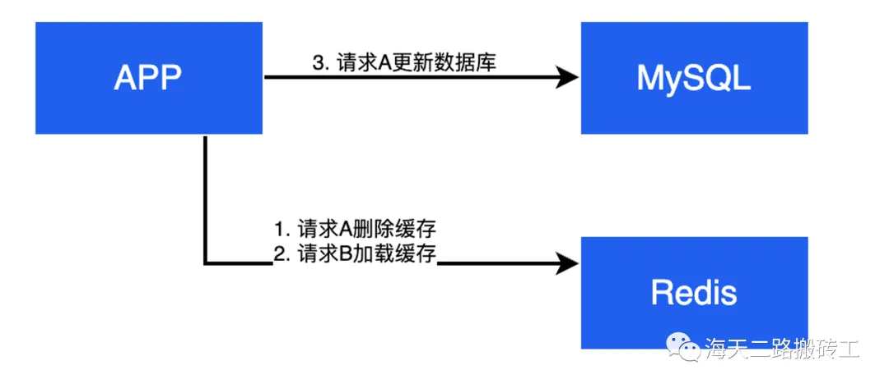
> 高并发时，会出现不一致情况。如果一个请求在删除缓存和更新数据库之间来了一个新的读请求，又把旧的数据加载到缓存，则会发生数据不一致。

### 解决缓存与数据库的一致性问题
#### 延时双删策略
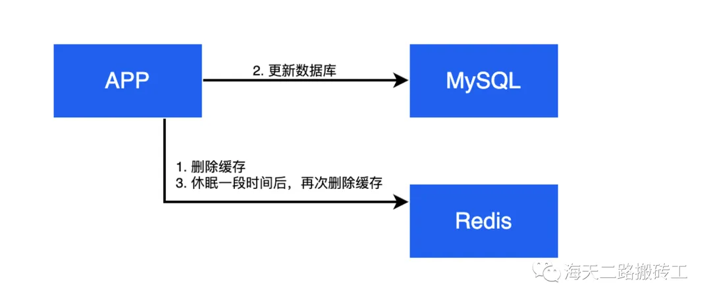
> 一方面，如果在删除缓存和更新数据库的空挡，有其他的读请求加载了旧数据到缓存，第二次删除也可以修正数据。  
> 另一方面，如果并发没有特别高，那么业务侧旧能较快地在缓存中获取到新数据。
#### 重试补偿
> 1. 更新数据库
> 2. 更新缓存（失败）
> 3. 再次更新缓存。
##### 缺点
> - 重试操作大概率会再次失败
> - 重试的次数如何选择
> - 如果在更新数据库和更新缓存之间程序Crash， 则不会有补偿机会
#### 基于MQ的异步更新缓存策略
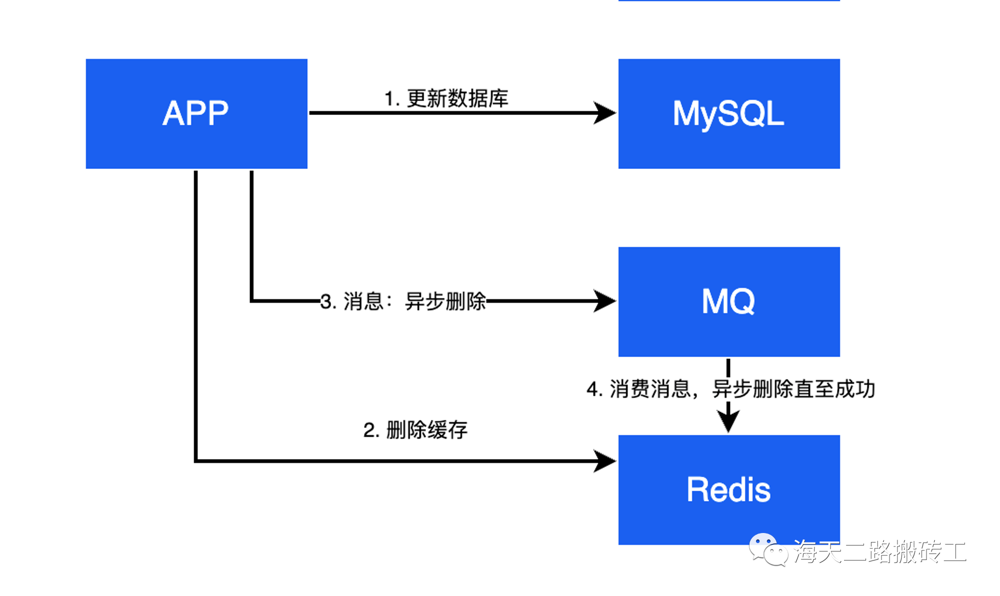
> 对于原子性问题引起的一致性问题，在补偿的基础上，可以将重试补偿的动作转为异步，从而修正重试补偿方案的不足。
> 方案基于消息队列的下列特性：
> - **保证可靠性**：写到队列中的消息，成功消费之前不会丢失
> - **保证消息成功投递**：消息成功消费后才会被删除，满足重试需要
#### 基于binlog的异步更新缓存策略
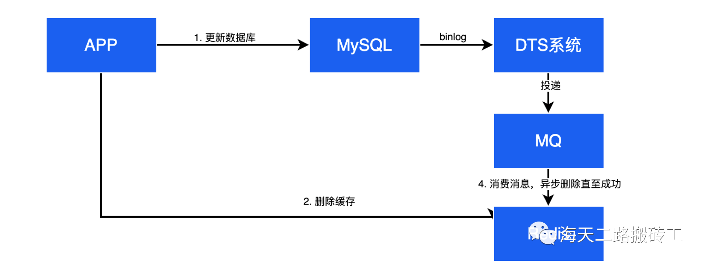
> 基于MQ的异步更新缓存策略因为使用了消息队列组件，也引入新的问题
> - **写队列失败**：写消息队列也可能出现失败。（写缓存和写消息队列同时失败概率其实很小）
> 
> MySQL等数据库通常自身保证了数据的一致性，并提供了binlog。binlog不会出现丢失问题，可以利用binlog来解决消息丢失（未成功写入）的问题。

### 其他缺点
> - **强一致性问题**：   
> 上文提到的缓存与数据库一致性问题的几种解决方案都不是完美的，可以看出，只能保证数据的最终一致性，是无法保证强一致性的。  
> 能否保证强一致性呢，通过Paxos、Raft 等一致性协议是可以做到到，但可能并非业务侧想要的。基于CAP理论，一个业务系统只能在一致性（Consistency）、可用性（Availability）和分区容忍性（Partition Tolerance）最多满足两个。  
> 使用缓存和数据库，相当于已经实现了P，因此系统只能是一个CP系统：保证强一致性，但是牺牲可用性AP系统：保证可用性，牺牲一致性（只做最终一致）如果实现CP， 系统的可用性（性能）会受到比较大的影响。  
> 对于大多数系统而言，引入缓冲只是为了提升读取的性能，如果最终结果反而牺牲可用性（牺牲性能）那就本末倒置了。因此通常业务系统不会选择CP，不去强求强一致性。

## 缓存稳定性的3种经典问题

### 缓存穿透

> 用户请求的数据在缓存中不存在即没有命中，同时在数据库中也不存在，导致用户每次请求该数据都要去数据库中查询一遍，一旦流量暴增，容易直接带崩数据库  
> 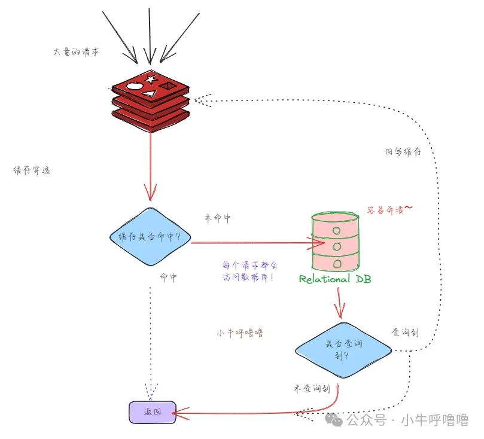
#### 解决办法
##### 缓存空数据  
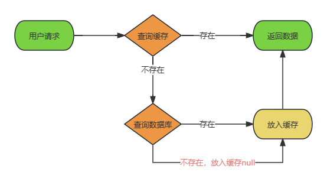
###### 优点
> - 实现简单。
###### 缺点
> - 耗费内存并且会有失效的情况。
> - 数据不一致。
##### 布隆过滤器
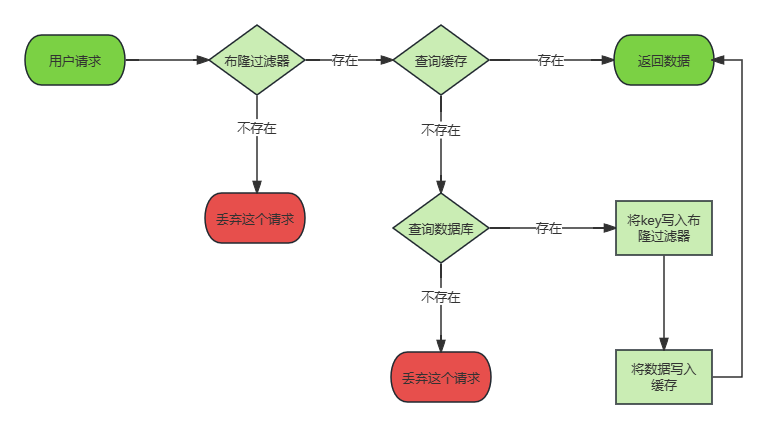
###### 优点
> - 占用内存小。
###### 缺点
> - 存在一定的误判情况。
> - 不可逆性。
> - 数据不一致。

### 缓存击穿

> 缓存中热点数据的key过期失效，由于是热点数据在过期的一瞬间会有大量的请求过来(高并发)，这些请求最终都会直接访问数据库，这样数据库很容易被打垮，缓存仿佛被"击穿"了  
> 
#### 解决办法
##### 互斥锁
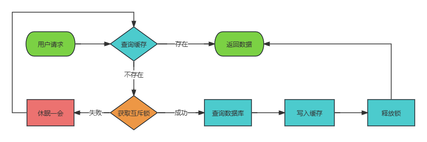
###### 优点
> - 强一致
> - 实现相对简单
###### 缺点
> - 吞吐量低
##### 逻辑过期
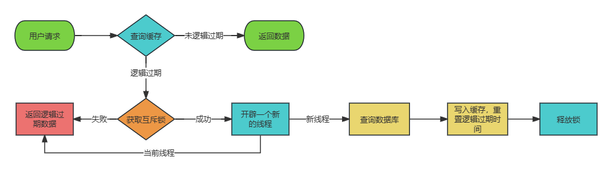
###### 优点
> - 吞吐量高
###### 缺点
> - 牺牲数据一致性
> - 实现复杂
> - 耗费更多的内存

### 缓存雪崩

> 缓存服务异常、新上线的系统或者大量缓存数据在同一时间过期，导致大量请求直接到达后端数据库，进而可能造成数据库崩溃和整个系统的崩溃。
#### 解决办法
##### 缓存服务异常
> - redis集群
> - 使用熔断机制
##### 新上线的系统
> - 缓存预热
##### 大量缓存数据在同一时间过期
> - 过期时间随机
> - 多级缓存
> - 互斥锁
