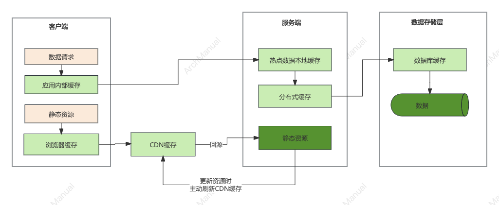

# 缓存

缓存（Cache）是一种高效的数据存储技术，旨在提高数据访问速度。

## 缓存的分类
在系统开发中，缓存可以根据不同的维度进行分类。以下是常见的缓存分类：

### 根据存储介质分类
- **内存缓存（In-Memory Cache）**：
  - **示例**：Redis、Memcached
  - **特点**：速度快，但容量有限，适用于需要快速访问的数据。

- **磁盘缓存（Disk Cache）**：
  - **示例**：本地文件系统缓存
  - **特点**：速度较慢，但容量较大，适用于大数据量的缓存需求。

### 根据缓存层级分类
- **一级缓存（L1 Cache）**：
  - **位置：通常在CPU内部，靠近处理器核心。
  - **特点：速度最快，容量最小，用于存储最频繁访问的数据和指令。

- **二级缓存（L2 Cache）**：
  - **位置**：在CPU内部或外部，介于L1缓存和内存之间。
  - **特点**：速度和容量介于L1缓存和内存之间。

- **三级缓存（L3 Cache）**：
  - **位置**：通常在多个CPU核心之间共享。
  - **特点**：速度较慢但容量较大，适用于减少不同核心之间的数据访问延迟。

### 根据缓存作用范围分类
- **本地缓存（Local Cache）**：
  - **特点**：缓存数据存储在本地机器上，适用于单机系统。
- **分布式缓存（Distributed Cache）**：
  - **示例**：Redis Cluster、Amazon DynamoDB
  - **特点**：缓存数据分布在多个机器上，适用于分布式系统，提高系统的可扩展性和容错能力。

### 根据数据更新策略分类
- **写通过缓存（Write-Through Cache）**：
  - **特点**：数据在写入缓存的同时也写入后端存储，确保数据一致性。
- **写回缓存（Write-Back Cache）**：
  - **特点**：数据首先写入缓存，只有在缓存中的数据被替换或过期时才写入后端存储，能提高写入性能，但可能导致数据一致性问题。

### 根据缓存淘汰策略分类
- **LRU（Least Recently Used）**：
  - **特点**：移除最久未使用的数据。
- **LFU（Least Frequently Used）**：
  - **特点**：移除访问频率最低的数据。
- **FIFO（First In, First Out）**：
  - **特点**：按数据进入缓存的顺序进行移除，先进入的先移除。

### 根据应用场景分类
- **浏览器缓存（Browser Cache）：
  - **特点：存储网页资源（如HTML、CSS、JavaScript等），减少页面加载时间。
- **数据库缓存（Database Cache）：
  - **示例：MySQL Query Cache、Oracle Result Cache
  - **特点：缓存数据库查询结果，提高查询性能。
- **应用缓存（Application Cache）：
  - **示例：Spring Cache、Ehcache
  - **特点：应用程序内部实现的缓存机制，减少对后端服务的调用。

### 其他分类
- **会话缓存（Session Cache）**：
  - **特点**：用于存储用户会话数据，如登录状态、购物车等。
- **对象缓存（Object Cache）**：
  - **特点**：缓存复杂的对象或数据结构，提高对象的创建和访问速度。

## 常见缓存类型

### 静态缓存
**定义**：静态缓存通常用于缓存静态内容，例如HTML页面、CSS文件、JavaScript文件、图像等。它可以显著减少服务器负载和响应时间。

**应用场景**：
- **网页缓存**：浏览器缓存网页资源，减少对服务器的请求，提高页面加载速度。
- **内容分发网络（CDN）**：CDN缓存网站的静态资源，将内容分发到全球各地的边缘节点，提高用户访问速度。

**实现方式**：
- **HTTP缓存头**：使用Cache-Control、ETag、Last-Modified等HTTP头控制缓存行为。
- **反向代理**：例如Nginx、Varnish等反向代理服务器，用于缓存静态资源并响应请求。

### 分布式缓存
**定义**：分布式缓存是将缓存数据分布在多个服务器节点上，以提高系统的可扩展性和容错能力。它适用于分布式系统或高并发场景。

**应用场景**：
- **大规模Web应用**：如社交网络、电子商务网站，需要处理大量用户请求。
- **分布式系统**：在微服务架构中，各个服务之间共享和缓存数据。

**实现方式**：
- **Redis**：高性能的分布式内存数据库，支持数据持久化和高可用集群。
- **Memcached**：轻量级的分布式内存缓存系统，适用于缓存简单数据结构。

### 热点本地缓存
**定义**：热点本地缓存是指将频繁访问的数据缓存到本地内存中，以提高访问速度和减少对远程服务的依赖。通常用于单机系统或单个服务实例内。

**应用场景**：
- **应用程序内部缓存**：如Java应用中的Ehcache、Guava Cache，用于缓存计算结果或数据库查询结果。
- **临时数据缓存**：如用户会话数据、短期有效的数据等。

**实现方式**：
- **Ehcache**：Java中常用的开源缓存框架，支持多种缓存策略和持久化。
- **Guava Cache**：Google的Guava库提供的轻量级缓存实现，适用于简单缓存需求。