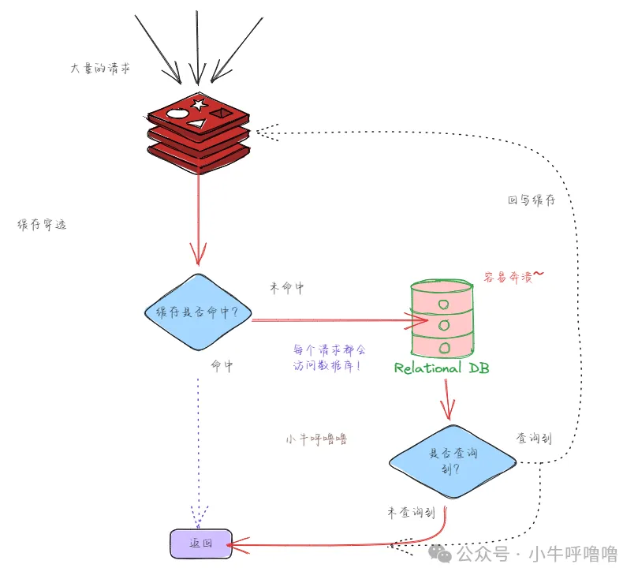
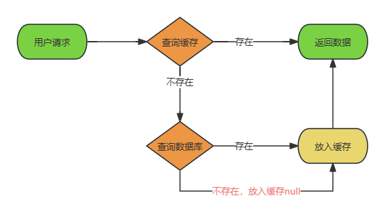
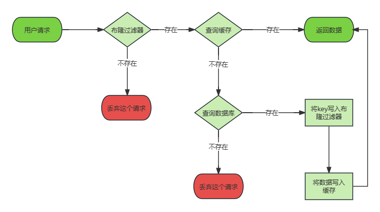
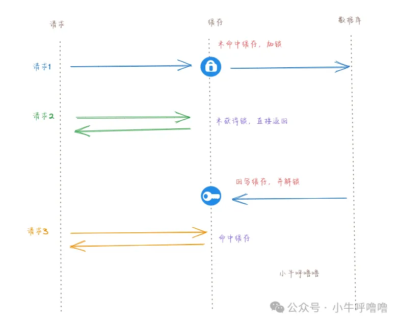
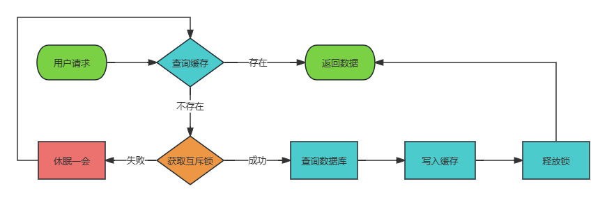
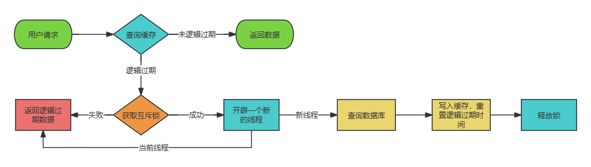

# 缓存稳定性的3种经典问题

## 缓存穿透

用户请求的数据在缓存中不存在即没有命中，同时在数据库中也不存在，导致用户每次请求该数据都要去数据库中查询一遍，一旦流量暴增，容易直接带崩数据库

### 解决办法

#### 缓存空数据

- **优点**：实现简单。
- **缺点**：耗费内存并且会有失效的情况；数据会不一致。

#### 布隆过滤器

- **优点**：占用内存小。
- **缺点**：存在一定的误判情况；不可逆性；数据不一致。

## 缓存击穿

缓存中热点数据的key过期失效，由于是热点数据在过期的一瞬间会有大量的请求过来(高并发)，这些请求最终都会直接访问数据库，这样数据库很容易被打垮，缓存仿佛被"击穿"了

### 解决办法

#### 互斥锁

- **优点**：强一致；实现相对简单
- **缺点**：吞吐量低

#### 逻辑过期

- **优点**：吞吐量高
- **缺点**：牺牲数据一致性；实现复杂；耗费更多的内存

## 缓存雪崩
缓存服务异常、新上线的系统或者大量缓存数据在同一时间过期，导致大量请求直接到达后端数据库，进而可能造成数据库崩溃和整个系统的崩溃。

### 解决办法
#### 缓存服务异常
- redis集群
- 使用熔断机制
#### 新上线的系统
- 缓存预热
#### 大量缓存数据在同一时间过期
- 过期时间随机
- 多级缓存
- 互斥锁

