# 事务处理

## 事务处理的四个特性ACID

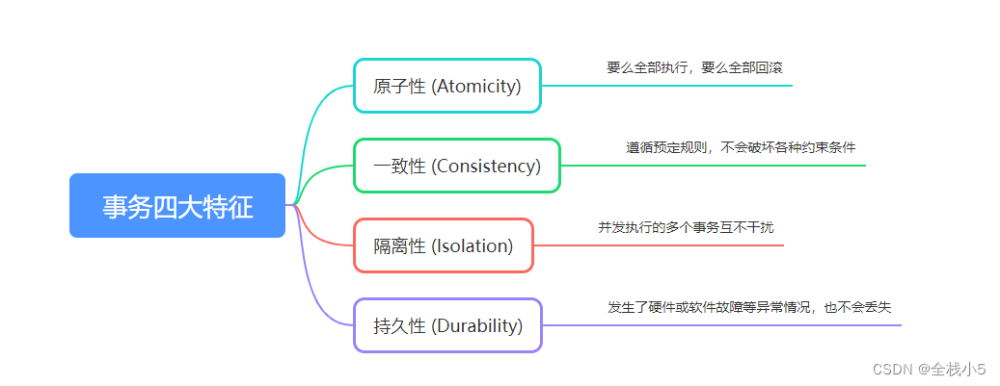

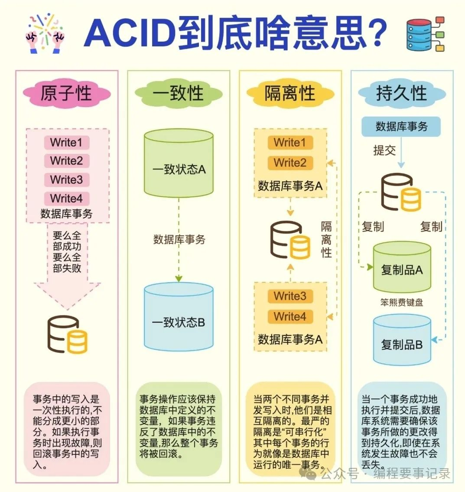

### Atomicity原子性

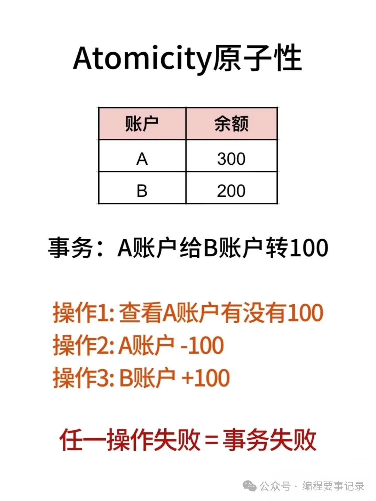

### Consistency一致性

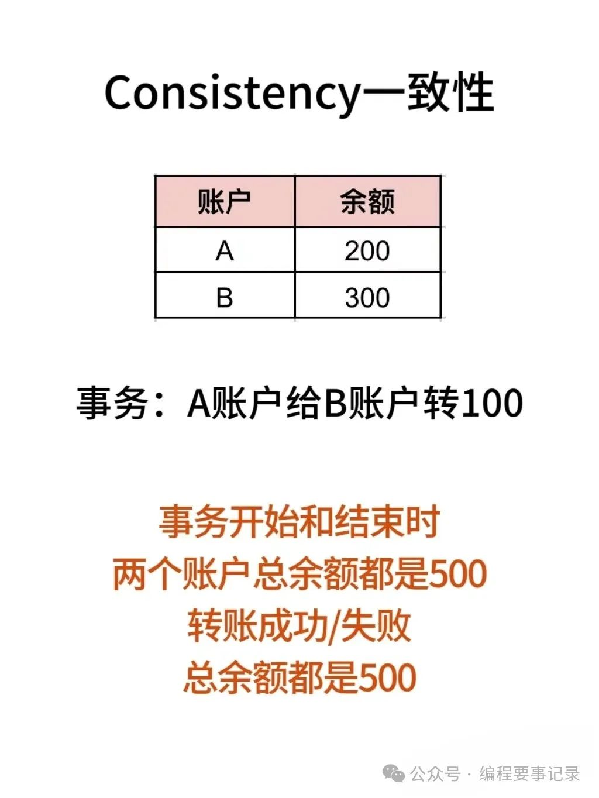

### lsolation隔离性

#### 脏读（Dirty read）

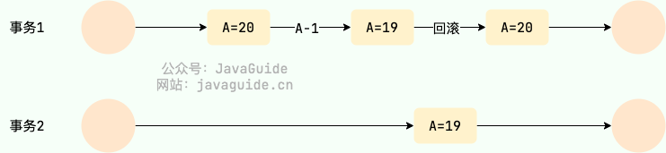

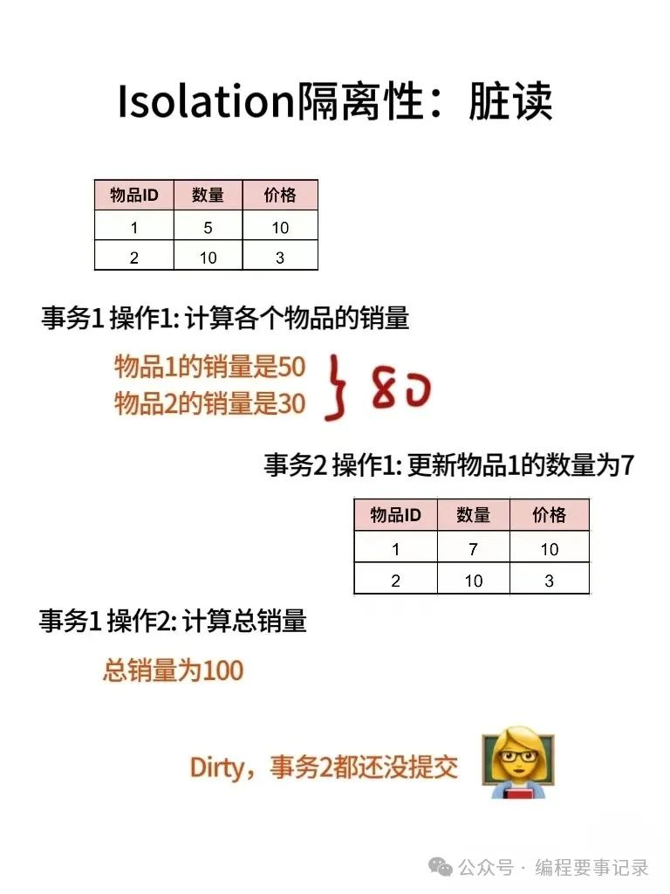

#### 丢失修改（Lost to modify）

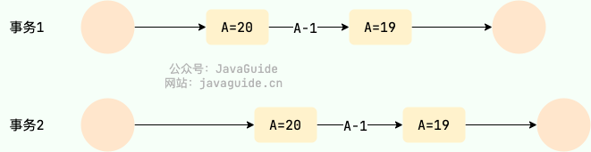

#### 不可重复读（Unrepeatable read）

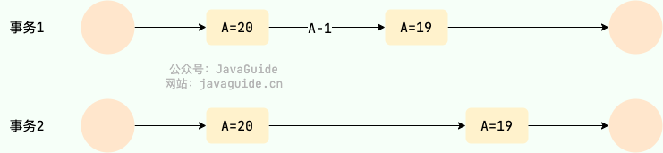

#### 幻读（Phantom read）

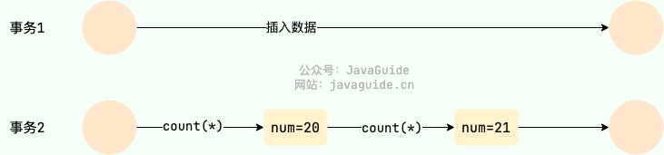

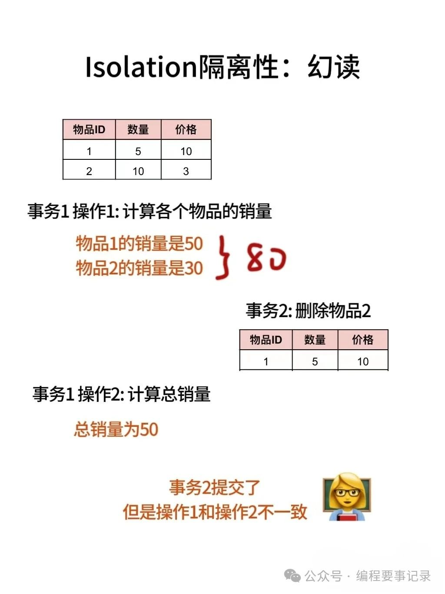

#### 事务隔离级别

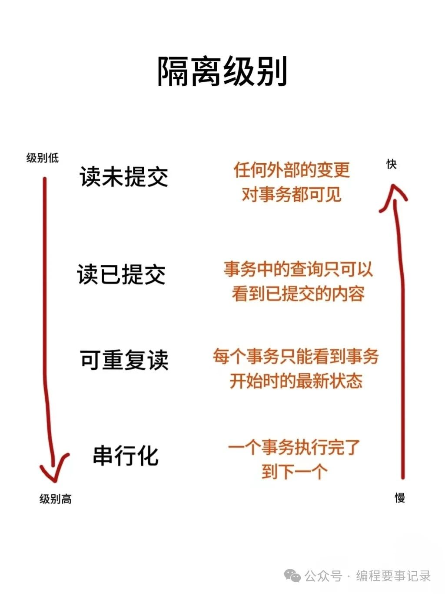

> - **READ-UNCOMMITTED(读取未提交)**：最低的隔离级别，允许读取尚未提交的数据变更，可能会导致脏读、幻读或不可重复读。
> - **READ-COMMITTED(读取已提交)**：允许读取并发事务已经提交的数据，可以阻止脏读，但是幻读或不可重复读仍有可能发生。
> - **REPEATABLE-READ(可重复读)**：对同一字段的多次读取结果都是一致的，除非数据是被本身事务自己所修改，可以阻止脏读和不可重复读，但幻读仍有可能发生。
> - **SERIALIZABLE(可串行化)**：最高的隔离级别，完全服从`ACID`的隔离级别。所有的事务依次逐个执行，这样事务之间就完全不可能产生干扰，也就是说，该级别可以防止脏读、不可重复读以及幻读。

| 事务隔离级别                  | 脏读 | 不可重复读 | 幻读 |
|-------------------------|----|-------|----|
| READ-UNCOMMITTED(读取未提交) | √  | √     | √  |
| READ-COMMITTED(读取已提交)   | ×  | √     | √  |
| REPEATABLE-READ(可重复读)   | ×  | ×     | √  |
| SERIALIZABLE(可串行化)      | ×  | ×     | ×  |

### Durability持久性

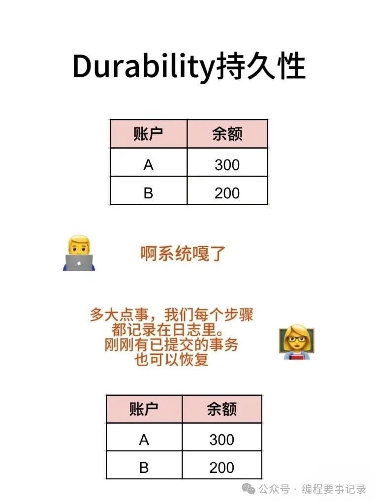

## 并发事务的控制方式

### 锁

> 锁是悲观控制的模式  
> 锁 控制方式下会通过锁来显式控制共享资源而不是通过调度手段，`MySQL`中主要是通过`读写锁`来实现并发控制。

### 表级锁与行级锁

#### 锁定范围

> - **表级锁**：锁定的是整个表，即当一个事务对表进行加锁操作时，会阻塞其他事务对该表的所有操作，直到锁被释放。
> - **行级锁**：仅锁定表中的特定行，其他事务仍然可以对表中的其他行进行操作，除非这些行也被锁定。

#### 粒度

> - **表级锁**：粒度较大，因为它锁定了整个表，这意味着任何对表的访问都会受到锁的影响。
> - **行级锁**：粒度较细，只锁定需要修改或查询的行，对表的其他部分没有影响，从而提高了并发性。

#### 并发性

> - **表级锁**：由于锁定整个表，其他事务无法同时访问该表，因此并发性较低。
> - **行级锁**：允许不同事务同时访问表中的不同行，从而提高了并发性。这使得在高并发环境下，数据库系统能够更有效地处理多个事务。

#### 锁定开销

> - **表级锁**：由于只需要一个锁定的数据结构来管理整个表的锁定状态，因此其锁定开销相对较小。
> - **行级锁**：由于每个被锁定的行都需要一个锁定的数据结构来管理其锁定状态，因此其锁定开销相对较大。在高并发环境下，这可能会导致系统资源的显著增加。

#### 锁定冲突

> - **表级锁**：由于锁定整个表，因此容易发生锁定冲突。当多个事务需要同时访问同一个表时，它们可能会因为锁而相互等待，导致性能下降。
> - **行级锁**：由于只锁定特定的行，因此锁定冲突的概率较低。但是，在高并发环境下，如果多个事务需要同时修改或查询同一行数据，仍然可能发生锁定冲突。

#### 支持情况

> 不同的数据库管理系统对表级锁和行级锁的支持程度不同。例如，MyISAM引擎只支持表级锁，而InnoDB引擎则支持行级锁和表级锁。

#### 共享锁（S 锁）与排他锁（X 锁）

> 共享锁（S锁）与排他锁（X锁）并不直接等同于表级锁或行级锁，而是锁的一种类型，它们可以应用于不同的锁定级别上。

> - **共享锁（S 锁）**：又称读锁，事务在读取记录的时候获取共享锁，允许多个事务同时获取（锁兼容）。
> - **排他锁（X 锁）**：又称写锁/独占锁，事务在修改记录的时候获取排他锁，不允许多个事务同时获取。如果一个记录已经被加了排他锁，那其他事务不能再对这条记录加任何类型的锁（锁不兼容）。

##### 锁的兼容性

<table>
<thead>
<tr><th colspan="3">共享锁（S 锁） 排他锁（X 锁）</th></tr>
<tr><th></th><th>S 锁</th><th>X 锁</th></tr>
</thead>
<tbody>
<tr><td>S 锁</td><td>兼容</td><td>不兼容</td></tr>
<tr><td>X 锁</td><td>不兼容</td><td>不兼容</td></tr>
</tbody>
</table>

> 读写锁可以做到读读并行，但是无法做到写读、写写并行

#### 锁粒度
> - **表级锁(table-level locking)**：MySQL 中锁定粒度最大的一种锁（全局锁除外），是针对非索引字段加的锁，对当前操作的整张表加锁，实现简单，资源消耗也比较少，加锁快，不会出现死锁。不过，触发锁冲突的概率最高，高并发下效率极低。表级锁和存储引擎无关，MyISAM 和 InnoDB 引擎都支持表级锁。
> - **行级锁(row-level locking)**：MySQL 中锁定粒度最小的一种锁，是 针对索引字段加的锁 ，只针对当前操作的行记录进行加锁。 行级锁能大大减少数据库操作的冲突。其加锁粒度最小，并发度高，但加锁的开销也最大，加锁慢，会出现死锁。行级锁和存储引擎有关，是在存储引擎层面实现的。

#### 意向锁
> 判断表中的记录没有行锁呢，需要用到“意向锁”来快速判断是否可以对某个表使用表锁。
> - **意向共享锁(Intention Shared Lock，IS 锁)**：事务有意向对表中的某些记录加共享锁（S 锁），加共享锁前必须先取得该表的 IS 锁。
> - **意向排他锁(Intention Exclusive Lock，IX 锁)**：事务有意向对表中的某些记录加排他锁（X 锁），加排他锁之前必须先取得该表的 IX 锁。

##### 锁的兼容性

<table>
<thead>
<tr><th colspan="3">意向共享锁（Intention Shared Lock，IS 锁） 意向排他锁（Intention Exclusive Lock，IX 锁）</th></tr>
<tr><th></th><th>IS 锁</th><th>IX 锁</th></tr>
</thead>
<tbody>
<tr><td>IS 锁</td><td>兼容</td><td>兼容</td></tr>
<tr><td>IX 锁</td><td>兼容</td><td>兼容</td></tr>
</tbody>
</table>

> - **IS锁与IS锁**：多个事务可以同时持有对同一张表的IS锁，表明它们都有意图在表中的某些行上设置共享锁，但这并不会造成冲突。
> - **IX锁与IX锁**：多个事务可以同时持有对同一张表的IX锁，表明它们都有意图在表中的某些行上设置排他锁，这也不会导致冲突。
> - **IS锁与IX锁**：IS锁和IX锁之间也是兼容的，因为它们分别代表了不同的加锁意图（共享或排他），但并不直接冲突。

##### 意向锁与行级锁的兼容性

> 意向锁本身并不与行级锁直接冲突，因为它们是表级锁，用于表明事务在表中的某些行上即将或已经设置的锁类型。  
> 然而，意向锁的存在为数据库系统提供了一种快速检测行级锁冲突的方法。  
> 例如，如果一个事务请求对表中的某行数据加排他锁（X锁），但发现该表上已经存在IX锁，那么它就知道有其他事务可能正在或已经对该行数据加了排他锁，因此必须等待或采取其他措施。

#### 意向锁与共享锁/排它锁的兼容性

<table>
<thead>
<tr><th colspan="3">意向锁 共享锁/排它锁</th></tr>
<tr><th></th><th>IS 锁</th><th>IX 锁</th></tr>
</thead>
<tbody>
<tr><td>S 锁</td><td>兼容</td><td>不兼容</td></tr>
<tr><td>X 锁</td><td>不兼容</td><td>不兼容</td></tr>
</tbody>
</table>

> - **IS 锁与表级共享锁（S 锁）**：当一个事务持有对某张表的IS锁时，其他事务可以在该表上设置S锁（表级共享锁），因为IS锁并不阻止其他事务读取表中的数据。
> - **IS 锁与表级排他锁（X 锁）**：如果一个事务已经持有对某张表的IS锁，并试图在该表上设置X锁（表级排他锁），或者另一个事务试图在该表上设置X锁而该表上已有IS锁，那么这些操作将被阻塞，因为X锁要求独占对表的访问权。
> - **IX 锁与表级共享锁（S 锁）**：IX锁表示事务有意图在表中的某些行上设置排他锁，因此它会与S锁冲突，因为S锁允许其他事务读取表中的数据但不允许写入。
> - **IX 锁与表级排他锁（X 锁）**：IX锁与X锁之间的不兼容性是显而易见的，因为两者都要求独占对表的访问权或至少对表中某些行的独占访问权。

### MVCC

