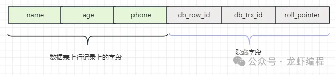
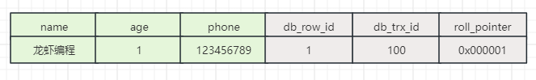
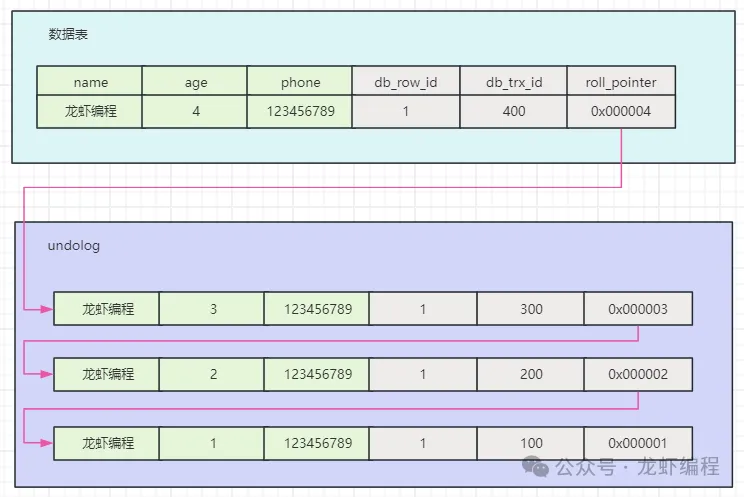
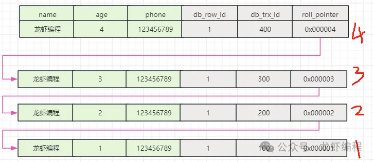
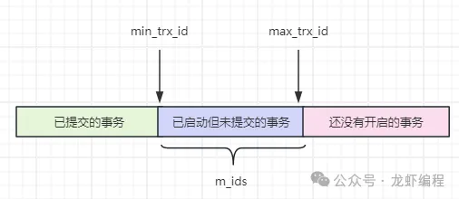
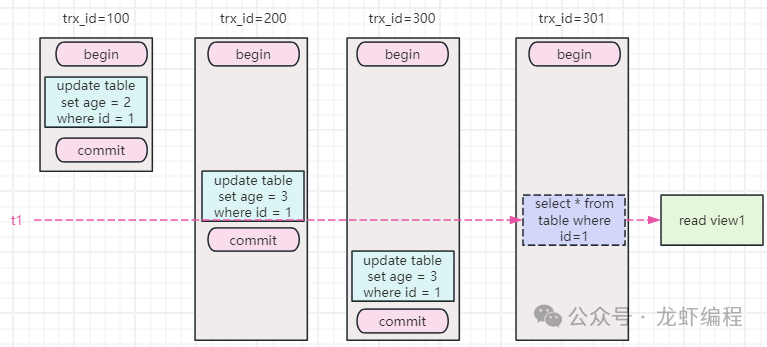
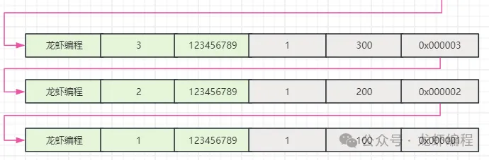
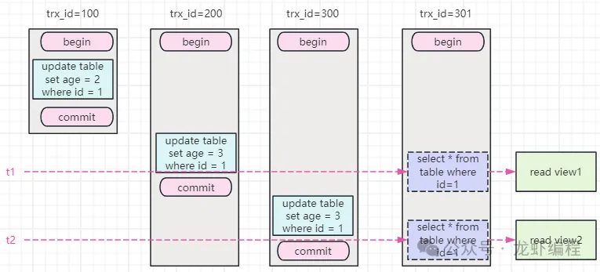
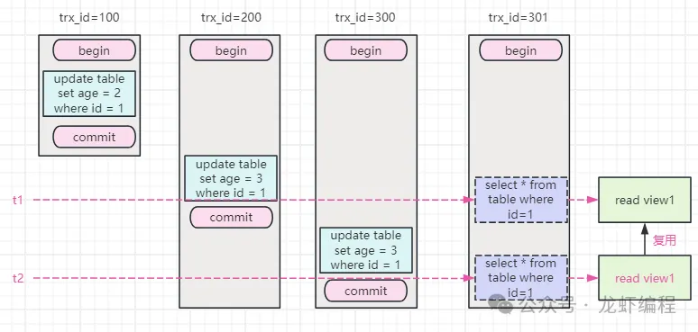

# MVCC

多版本并发控制（MVCC，Multiversion concurrency control）是乐观控制的模式

`MVCC`是多版本并发控制方法，即对一份数据会存储多个版本，通过事务的可见性来保证事务能看到自己应该看到的版本。通常会有一个全局的版本分配器来为每一行数据设置版本号，版本号是唯一的。

## 实现原理

以MySQL为例，MVCC的实现主要依赖于记录中的三个隐藏字段、undolog事物版本链、read view等共同实现的。

### 行记录中的三个隐藏字段

在数据中除了保存了我们自己定义的一些字段以外，每个记录中都存在三个隐藏字段，各个隐藏的字段的含义如下所示：

| 字段         | 含义                                  |
|------------|-------------------------------------|
| db_row_id  | 隐藏主键，如果我们没有给这个表创建主键，那么会以这个字段来创建聚簇索引 |
| db_trx_id  | 对这条记录做了最新一次修改的事务的id                 |
| roll_point | 回滚指针，指向这条记录的上一个版本                   |

如下展示的是一条完整的数据行记录和三个隐藏字段的赋值后的整个行记录数据：

### undolog事务版本链

每一次update行记录的时候，都会在变更之前先存储一份快照到undo log中，此时这三个隐式字段也会跟着记录一起保存在undo log中，如下如所示：

这样每一个更新的快照中都有一个db_trx_id字段记录了本次变更的事务id，并且有一个roll_pointer指向了上一个快照的地址。

### read view

age字段从开始的1 ----> 2 ----> 3 ---->4变化中，形成了一个undolog事物版本链。那么在做数据多版本的查询的时候，我们应该查询这些版本中的哪些数据呢？这个时候read view机制（select在查询的时候会生成一个read view）可以帮助我们来确定读取哪个版本的数据。read view中有如下几个重要的属性，如下图所示：

| 属性             | 含义                 |
|----------------|--------------------|
| m_ids          | 当前数据库中”活跃“的事务的id列表 |
| min_trx_id     | m_ids最小的事务id       |
| max_trx_id     | max(m_ids) +1      |
| creator_trx_id | 创建read view事务的事务id |

在读已提交隔离级别（RC）下的MVCC工作流程如下如图所示：

在时间t1的时候read view1的信息：活跃的事务的trx_id是200、300、301，活跃事务中最小的事务id是200，最大的事务id是302（也就是301+1），创建读视图的事务的trx_id是301。现在可以找到最小的已经提交事务的trx_id是100，那么从undolog版本链中找到100事务对应的数据，如下所示：

此时返回的数据是trx_id=100对应的数据，也就是roll_pointer=0x00001这条数据。如果我们再次查询id=1这条数据的时候，如下所示：

在t2时刻read view2中的信息：活跃的事务的trx_id是300、301，活跃事务中最小的事务id是300，最大的事务id是302（也就是301+1），创建读视图的事务的trx_id是301。此时最小的已经提交的事务id是200，那么和t1时刻一样从undolog版本链中找到200事务对应的数据，也就是roll_pointer=0x00002的数据。

所以在读已提交隔离级别下每次查询都会创建一个读视图，因此多次读取同一条数据的时候可能存在前后的结果不一致性的。所以RC隔离级别没有解决幻读的问题。

在可重复读的隔离级别（RR）下，对于快照读的查询（如select * from table where id = 1），其查询的的过程如下所示：

在RR隔离级别下，每次查询的时候都是复用第一次查询时候创建的read view。但是RR不能完全解决幻读问题，因为如果是当前读（如SELECT * FROM student FOR UPDATE）是需要重新生成视图的（类似现在的RR隔离级别变成了RC隔离级别）。

## 总结
1. MVCC是一种并发控制的方法，一般在数据库管理系统中实现对数据库的并发访问。
2. MVCC的实现是依赖于三个隐藏字段、undolog事物版本链、read view共同实现的。
3. Mysql的RC隔离级别下，每次查询都会生成一个新的视图；RR隔离级别下针对快照的情况是复用之前的视图，当前读的情况下是新建新的视图。

