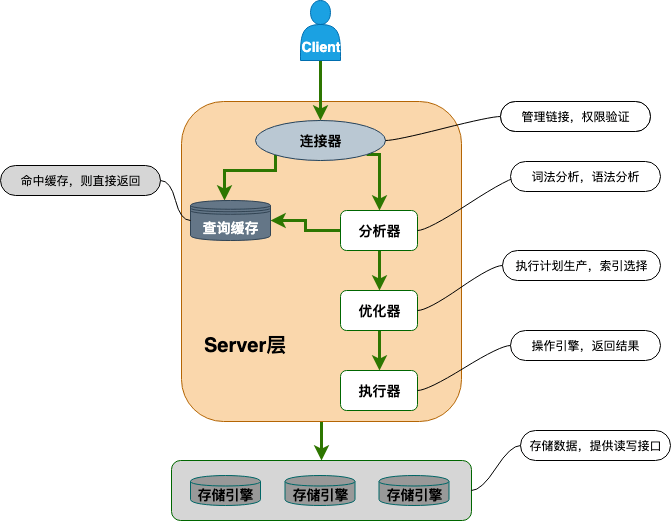

# MySQL

MySQL 是一种关系型数据库，主要用于持久化存储我们的系统中的一些数据比如用户信息

## MySQL 字段

### MySQL 字段类型
#### 数值类型
##### 整型
- TINYINT
- SMALLINT
- MEDIUMINT
- INT
- BIGINT
##### 浮点型
- FLOAT
- DOUBLE
##### 定点型
- DECIMAL

#### 字符串类型
##### 常用
- CHAR
- VARCHAR
##### TEXT类 文本大对象（字符流）
- TINYTEXT：255个字元(2^8-1)
- TEXT：65535个字元(2^16-1)
- MEDIUMTEXT：16777215 个字元(2^24-1
- LONGTEXT：4294967295个字元 (2^32-1)
##### BLOB类 二进制大对象（字节流）
- TINYBLOB：255个字元(2^8-1)
- BLOB：65535个字元(2^16-1)
- MEDIUMBLOB：16777215 个字元(2^24-1)
- LONGBLOB：4294967295个字元 (2^32-1)

#### 日期时间类型
- YEAR
- TIME
- DATE
- DATETIME
- TIMESTAMP

### 整数类型的 UNSIGNED 属性的作用
MySQL 中的整数类型可以使用可选的 UNSIGNED 属性来表示不允许负值的无符号整数。使用 UNSIGNED 属性可以将正整数的上限提高一倍，因为它不需要存储负数值。

### CHAR 和 VARCHAR 的区别
CHAR 是定长字符串，VARCHAR 是变长字符串

### DECIMAL 和 FLOAT/DOUBLE 的区别
DECIMAL 是定点数，FLOAT/DOUBLE 是浮点数。DECIMAL 可以存储精确的小数值，FLOAT/DOUBLE 只能存储近似的小数值

### 为什么不推荐使用 TEXT 和 BLOB？
- 不能有默认值。
- 在使用临时表时无法使用内存临时表，只能在磁盘上创建临时表（《高性能 MySQL》书中有提到）。
- 检索效率较低。
- 不能直接创建索引，需要指定前缀长度。
- 可能会消耗大量的网络和 IO 带宽。
- 可能导致表上的 DML 操作变慢。
- ……

### NULL 和 '' 的区别是什么？
NULL 代表一个不确定的值,就算是两个 NULL,它俩也不一定相等。例如，SELECT NULL=NULL的结果为 false，但是在我们使用DISTINCT,GROUP BY,ORDER BY时,NULL又被认为是相等的。

''的长度是 0，是不占用空间的，而NULL 是需要占用空间的。NULL 会影响聚合函数的结果。例如，SUM、AVG、MIN、MAX 等聚合函数会忽略 NULL 值。 COUNT 的处理方式取决于参数的类型。如果参数是 *(COUNT(*))，则会统计所有的记录数，包括 NULL 值；如果参数是某个字段名(COUNT(列名))，则会忽略 NULL 值，只统计非空值的个数。

查询 NULL 值时，必须使用 IS NULL 或 IS NOT NULLl 来判断，而不能使用 =、!=、 <、> 之类的比较运算符。而''是可以使用这些比较运算符的。

## 架构/引擎
### MySQL 基础架构

- **连接器**：身份认证和权限相关(登录 MySQL 的时候)。
- **查询缓存**：执行查询语句的时候，会先查询缓存（MySQL 8.0 版本后移除，因为这个功能不太实用）。
- **分析器**：没有命中缓存的话，SQL 语句就会经过分析器，分析器说白了就是要先看你的 SQL 语句要干嘛，再检查你的 SQL 语句语法是否正确。
- **优化器**：按照 MySQL 认为最优的方案去执行。
- **执行器**：执行语句，然后从存储引擎返回数据。 执行语句之前会先判断是否有权限，如果没有权限的话，就会报错。
- **插件式存储引擎**：主要负责数据的存储和读取，采用的是插件式架构，支持 InnoDB、MyISAM、Memory 等多种存储引擎。

### MySQL 存储引擎
- **InnoDB**：MySQL默认的存储引擎，支持事务、行级锁机制和外键约束。适合处理大量数据和高并发的应用场景，但对于频繁的全表扫描和大量的写操作，性能可能不如MyISAM。 

  **InnoDB 有几类行锁**:
  - **记录锁(Record Lock)**：也被称为记录锁，属于单个行记录上的锁。
  - **间隙锁(Gap Lock)**：锁定一个范围，不包括记录本身。
  - **临键锁(Next-Key Lock)**：Record Lock+Gap Lock，锁定一个范围，包含记录本身，主要目的是为了解决幻读问题（MySQL 事务部分提到过）。记录锁只能锁住已经存在的记录，为了避免插入新记录，需要依赖间隙锁。

- **MyISAM**:MySQL最早提供的存储引擎，不支持事务、行级锁机制和外键约束。但对于只读或者大量的查询操作，性能比InnoDB更好。
- **Memory**:这种类型的数据表只存在于内存中，使用散列索引，数据的存取速度非常快。由于存在于内存中，因此这种类型常应用于临时表中。
- **Merge**:将多个相同的MyISAM表合并为一个虚表，常应用于日志和数据仓库。
- **Archive**:适用于对于只偶尔需要查询的历史数据进行存储，将数据进行压缩存储，占用空间小，但不支持索引和更新操作。
- **CSV**:将数据以CSV格式存储，适合用于导入和导出数据。
- **BLACKHOLE**:这种存储引擎不实际存储数据，所有写入的数据都会被丢弃，但可以记录数据的写入日志。

#### 常见 MySQL 存储引擎对比

| Feature                               | MyISAM      | Memory          | InnoDB      | Archive     | NDB         |
|---------------------------------------|-------------|-----------------|-------------|-------------|-------------|
| B-tree indexes                        | Yes         | Yes             | Yes         | No          | No          |
| Backup/point-in-time recovery(note 1) | Yes         | Yes             | Yes         | Yes         | Yes         |
| Cluster database support              | No          | No              | No          | No          | No          |
| Compressed data                       | Yes (note2) | No              | Yes         | Yes         | No          |
| Data caches                           | No          | N/A             | Yes         | No          | Yes         |
| Encrypted data                        | Yes (note3) | Yes (note3)     | Yes (note4) | Yes (note3) | Yes (note3) |
| Foreign key support                   | No          | No              | Yes         | No          | Yes (note5) |
| Full-text search indexes              | Yes         | No              | Yes (note6) | No          | No          |
| Geospatial data type support          | Yes         | No              | Yes         | Yes         | Yes         |
| Geospatial indexing support           | Yes         | No              | Yes (note7) | No          | No          |
| Hash indexes                          | No          | Yes             | No (note8)  | No          | Yes         |
| Index caches                          | Yes         | N/A             | Yes         | No          | Yes         |
| Lockinggranularity                    | Table       | Table           | Row         | Row         | Row         |
| MVCC                                  | No          | No              | Yes         | No          | No          |
| Replication support(note1)            | Yes         | Limited (note9) | Yes         | Yes         | Yes         |
| Storage limits                        | 256TB       | RAM             | 64TB        | None        | 384EB       |
| T-tree indexes                        | No          | No              | No          | No          | Yes         |
| Transactions                          | No          | No              | No          | No          | Yes         |
| Update statistics for data dictionary | Yes         | Yes             | Yes         | Yes         | Yes         |

## [事务控制](..%2Fbase%2Ftransaction-processing%2FREADME.md)