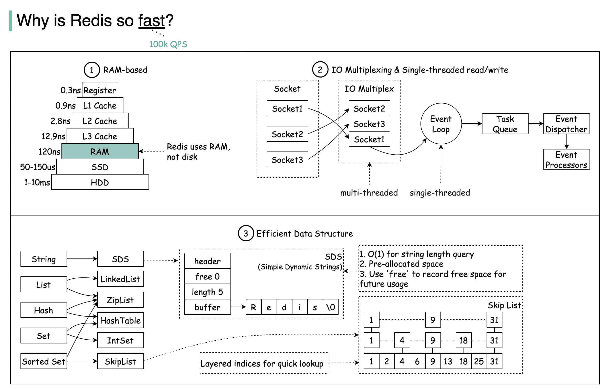

# Redis

Redis （REmote DIctionary Server）是一个基于 C 语言开发的开源 NoSQL 数据库（BSD 许可）。

## Redis 为什么快？
- Redis 基于内存，内存的访问速度比磁盘快很多；
- Redis 基于 Reactor 模式设计开发了一套高效的事件处理模型，主要是单线程事件循环和 IO 多路复用（Redis 线程模式后面会详细介绍到）；
- Redis 内置了多种优化过后的数据类型/结构实现，性能非常高。
- Redis 通信协议实现简单且解析高效。

## 缓存选型

### 内存缓存
- **HashMap**：HashMap是Java中最常用的内存缓存实现之一。它使用哈希表数据结构来存储键值对，具有快速的查找和插入操作。
- **ConcurrentHashMap**：ConcurrentHashMap是线程安全的HashMap实现，适用于多线程环境下的缓存需求。它使用分段锁来实现并发访问，提供了更高的并发性能。
- **Caffeine**：Caffeine是一个基于Java的高性能缓存库，提供了内存缓存的功能。它使用了类似于ConcurrentHashMap的分段锁机制，并提供了更多的缓存策略和配置选项。
- **Guava Cache**：Guava Cache是Google Guava库中提供的一个内存缓存实现。它提供了简单易用的API，并支持缓存的过期时间、最大大小等配置选项。
- **Ehcache**：Ehcache是一个流行的Java缓存框架，支持内存缓存和磁盘缓存。它提供了丰富的配置选项和缓存策略，适用于各种缓存需求。

### 分布式缓存
- **Redis**：Redis是一种开源的内存数据存储系统，也可以用作分布式缓存。它支持多种数据结构（如字符串、哈希、列表、集合、有序集合等），并提供了丰富的缓存功能和命令。
- **Memcached**：Memcached是一种高性能的分布式内存对象缓存系统。它以键值对的形式存储数据，并提供了简单的API来进行数据的读取和写入。Memcached可以水平扩展，适用于大规模的分布式缓存需求。
- **Hazelcast**：Hazelcast是一个开源的分布式缓存和计算平台。它提供了分布式数据结构（如Map、Queue、Set等），支持高可用性和水平扩展，并提供了分布式缓存的功能。
- **Apache Ignite**：Apache Ignite是一个内存中的分布式数据库和计算平台。它提供了分布式缓存、分布式查询、分布式计算等功能，并支持持久化存储和高可用性。
- **Caffeine**：虽然Caffeine在前面提到的是内存缓存，但它也可以用作分布式缓存。Caffeine提供了一些分布式缓存的扩展，如Caffeine-JCache和Caffeine-Rest。
- **Dragonfly**：一种针对现代应用程序负荷需求而构建的内存数据库，完全兼容 Redis 和 Memcached 的 API，迁移时无需修改任何代码，号称全世界最快的内存数据库。
- **KeyDB**：Redis 的一个高性能分支，专注于多线程、内存效率和高吞吐量。

### Ehcache、Caffeine、Memcached和Redis优缺点以及适用场景
1. Ehcache
  - **优点**：
    - 支持本地缓存和分布式缓存。
    - 提供了丰富的配置选项和缓存策略，如过期时间、最大大小、持久化等。
    - 可以与Spring框架无缝集成。
  - **缺点**：
    - 在高并发环境下，性能可能不如Caffeine、Memcached和Redis。
    - 分布式缓存功能相对较新，可能不如Redis和Memcached成熟稳定。
  - **适用场景**：  
    - 需要本地缓存和分布式缓存的场景。  
    - 对缓存的配置和策略有较高要求的场景。

2. Caffeine
- **优点**：
  - 提供了高性能的本地缓存实现。
    - 支持多种缓存策略，如最大大小、过期时间、自动加载等。
    - 可以根据应用程序的需求进行灵活的配置。
- **缺点**：
  - 不支持分布式缓存，只能用作本地缓存。
    - 不支持持久化存储。
- **适用场景**：
  - 需要高性能的本地缓存的场景。
    - 对缓存的灵活配置和策略有较高要求的场景。
    - 
3. Memcached
- **优点**：
  - 提供了高性能的分布式缓存实现。
  - 支持多种数据结构和缓存策略。
  - 可以水平扩展，适用于大规模的分布式缓存需求。
- **缺点**：
  - 不支持持久化存储。
  - 功能相对较简单，不如Redis丰富。
- **适用场景**：
  - 需要高性能的分布式缓存的场景。
  - 对缓存的扩展性和可伸缩性有较高要求的场景。

4. Redis
- **优点**：
  - 提供了高性能的分布式缓存和数据存储。
  - 支持多种数据结构和缓存策略。
  - 支持持久化存储和数据复制。
  - 提供了丰富的功能，如发布/订阅、事务等。
- **缺点**：
  - 相对于本地缓存实现，性能可能稍低。
- **适用场景**：
  - 需要高性能的分布式缓存和数据存储的场景。
  - 对缓存的持久化和数据复制有较高要求的场景。
  - 需要使用缓存以外的功能，如发布/订阅、事务等的场景。

### Memcached 和 Redis 比较
#### 共同点
- 都是基于内存的数据库，一般都用来当做缓存使用。
- 都有过期策略。
- 两者的性能都非常高。
#### 区别
- **数据类型**：Redis 支持更丰富的数据类型（支持更复杂的应用场景）。Redis 不仅仅支持简单的 k/v 类型的数据，同时还提供 list，set，zset，hash 等数据结构的存储。Memcached 只支持最简单的 k/v 数据类型。
- **数据持久化**：Redis 支持数据的持久化，可以将内存中的数据保持在磁盘中，重启的时候可以再次加载进行使用，而 Memcached 把数据全部存在内存之中。也就是说，Redis 有灾难恢复机制而 Memcached 没有。
- **集群模式支持**：Memcached 没有原生的集群模式，需要依靠客户端来实现往集群中分片写入数据；但是 Redis 自 3.0 版本起是原生支持集群模式的。
- **线程模型**：Memcached 是多线程，非阻塞 IO 复用的网络模型；Redis 使用单线程的多路 IO 复用模型。 （Redis 6.0 针对网络数据的读写引入了多线程）
- **特性支持**：Redis 支持发布订阅模型、Lua 脚本、事务等功能，而 Memcached 不支持。并且，Redis 支持更多的编程语言。
- **过期数据删除**：Memcached 过期数据的删除策略只用了惰性删除，而 Redis 同时使用了惰性删除与定期删除
#### 为选择 Redis
- 访问速度更快
- 高并发
- 功能全面
- 生态全面
- 支持持久化（很重要的一点）

## Redis Module
Redis 从 4.0 版本开始，支持通过 Module 来扩展其功能以满足特殊的需求。
- **RediSearch**：用于实现搜索引擎的模块。
- **RedisJSON**：用于处理 JSON 数据的模块。
- **RedisGraph**：用于实现图形数据库的模块。
- **RedisTimeSeries**：用于处理时间序列数据的模块。
- **RedisBloom**：用于实现布隆过滤器的模块。
- **RedisAI**：用于执行深度学习/机器学习模型并管理其数据的模块。
- **RedisCell**：用于实现分布式限流的模块。
- ……

## Redis 数据类型和应用场景

- **5 种基础数据类型**：String（字符串）、List（列表）、Set（集合）、Hash（散列）、Zset（有序集合）。
- **3 种特殊数据类型**：HyperLogLog（基数统计）、Bitmap （位图）、Geospatial (地理位置)。

### 1. 字符串（String）
Redis 的字符串（String）数据类型是最基本和最常用的数据类型之一。它可以存储各种类型的数据，如文本、数字、二进制数据等。以下是字符串类型的一些常见应用场景及其示例代码。

#### 应用场景
- 缓存
  - 场景： 缓存频繁访问的数据，如网页内容、查询结果等。
  - 示例： 缓存用户个人信息。
- 计数器  
  - 场景： 计数操作，如网站访问量、视频播放次数等。
  - 示例： 记录文章阅读次数。
- 简单的键值对存储  
  - 场景： 存储一些简单的配置信息或状态标识。
  - 示例： 存储网站的配置信息。
- 分布式锁  
  - 场景： 控制对共享资源的访问，避免并发问题。
  - 示例： 使用字符串实现分布式锁。

### 2. 哈希（Hash）
Redis 的哈希（Hash）数据类型是一个键值对集合，适合存储对象及其属性。以下是哈希类型的一些常见应用场景及其示例代码。

#### 应用场景
- 存储用户信息
  - 场景： 存储用户的基本信息，如用户名、密码、邮箱等。
  - 示例： 用户注册信息存储。
- 存储对象属性
  - 场景： 存储商品的属性信息，如名称、价格、库存等。
  - 示例： 商品详情存储。
- 会话数据
  - 场景： 存储用户会话数据，如登录状态、会话时间等。
  - 示例： 用户登录会话管理。
- 配置管理
  - 场景： 存储应用的配置信息，方便集中管理和读取。
  - 示例： 网站配置项存储。

### 3. 列表（List）
Redis 列表（List）是一个按插入顺序排序的字符串列表，支持从列表的两端推入和弹出元素，并且支持阻塞操作。以下是 Redis 列表的一些常见应用场景及其示例代码。

#### 应用场景
- 消息队列
  - 场景： 使用列表实现简单的消息队列系统，存储任务或消息。
  - 示例： 任务队列。
- 最新消息列表
  - 场景： 存储和获取最新的消息或日志，如社交媒体的时间线、聊天记录。
  - 示例： 获取最新的聊天记录。
- 待办事项
  - 场景： 存储用户的待办事项清单。
  - 示例： 任务管理系统中的任务列表。
- 排行榜
  - 场景： 存储和管理排名信息。
  - 示例： 游戏排行榜。

### 4. 集合（Set）
Redis 集合（Set）是一种无序的字符串集合，集合中的元素是唯一的，不允许重复。集合类型支持多种集合操作，如交集、并集、差集等。以下是 Redis 集合的一些常见应用场景及其示例代码。

#### 应用场景
- 标签系统
  - 场景： 存储和管理标签，如用户标签、商品标签等。
  - 示例： 用户兴趣标签。
- 去重
  - 场景： 存储和管理唯一性数据，防止重复。
  - 示例： 记录唯一访问 IP。
- 好友推荐
  - 场景： 计算共同好友或共同关注的用户。
  - 示例： 推荐共同好友。
- 权限管理
  - 场景： 存储和管理用户权限。
  - 示例： 用户角色权限。

### 5. 有序集合（Sorted Set）
Redis 有序集合（Sorted Set）是一种带有分数的集合，集合中的每个成员都有一个分数，Redis 会按照分数的大小进行排序。以下是 Redis 有序集合的一些常见应用场景及其示例代码。

#### 应用场景
- 排行榜
  - 场景： 存储和管理排行榜数据，如游戏得分排行榜。
  - 示例： 游戏玩家得分排行榜。
- 延时队列
  - 场景： 实现基于时间的任务调度。
  - 示例： 定时任务执行。
- 推荐系统
  - 场景： 根据权重推荐内容，如推荐文章或商品。
  - 示例： 根据点击率推荐文章。
- 优先级队列
  - 场景： 存储和管理不同优先级的任务。
  - 示例： 任务调度系统中的任务队列。

### 6. 位图（Bitmaps）
位图（Bitmap）在 Redis 中是一种高效的按位存储数据的方式，主要用于处理需要进行按位操作的场景。以下是位图的一些常见应用场景及其示例代码。

#### 应用场景
- 用户签到
  - 场景： 记录用户每天的签到情况。
  - 示例： 记录用户每月的签到信息。
- 在线状态统计
  - 场景： 记录用户是否在线的状态。
  - 示例： 记录用户每天的在线状态。
- 活动记录
  - 场景： 记录用户在某个时间段内的活动情况。
  - 示例： 记录用户每小时的活动状态。
- A/B 测试分组
  - 场景： 将用户分为不同的实验组进行 A/B 测试。
  - 示例： 将用户随机分配到两个不同的实验组。

### 7. HyperLogLog
HyperLogLog 是 Redis 中的一种用于基数（唯一值）统计的数据结构，能够在极小的内存占用下提供高精度的基数估计。它特别适用于需要快速计算大量数据集唯一元素数量的场景。

#### 应用场景
- 网站独立访客统计（UV）
  - 场景： 统计网站的独立访客数量。
  - 示例： 每天、每月的独立访客数。
- 实时去重统计
  - 场景： 统计实时数据流中的唯一元素数量。
  - 示例： 实时分析中统计唯一用户数或事件数。
- 社交网络的好友数
  - 场景： 统计用户在社交网络中有多少唯一好友。
  - 示例： 统计用户的唯一好友数量。
- 在线广告的展示
  - 场景： 统计广告的独立展示数量。
  - 示例： 统计某广告在一段时间内的独立展示用户数。

### 8. 地理空间（Geospatial）
Redis 的地理空间（Geospatial）数据类型允许存储地理位置信息，并且可以执行各种地理空间操作，如半径查询和位置距离计算。以下是地理空间的一些常见应用场景及其示例代码。

#### 应用场景
- 附近地点搜索
  - 场景： 查找某个位置附近的地点，如餐馆、加油站、酒店等。
  - 示例： 查找用户当前位置附近的餐馆。
- 地理围栏
  - 场景： 检查某个位置是否在指定区域内。
  - 示例： 判断车辆是否在指定的城市区域内。
- 位置存储与检索
  - 场景： 存储和检索实体的位置数据，如用户位置、设备位置等。
  - 示例： 存储和检索快递员的位置。
- 距离计算
  - 场景： 计算两个位置之间的距离。
  - 示例： 计算用户与商店之间的距离。

### 9. 流（Streams）
Redis 的流（Streams）数据类型是一种高效的日志和消息存储数据结构，适用于实时数据处理。以下是流的一些常见应用场景及其示例代码。

#### 应用场景
- 实时日志收集
  - 场景： 收集和处理实时日志数据。
  - 示例： 应用程序或系统的日志收集。
- 消息队列
  - 场景： 实现消息队列，用于任务分发和处理。
  - 示例： 任务处理系统中的任务队列。
- 事件溯源
  - 场景： 记录系统或应用程序中的事件，支持事件重放和追踪。
  - 示例： 用户行为事件溯源。
- 实时分析
  - 场景： 收集和分析实时数据流。
  - 示例： 实时数据分析和监控系统。

## Redis 3种持久化机制

### 快照（snapshotting，RDB）
#### 快照原理
1. **触发条件**： 快照可以通过配置文件中的 save 命令进行定时触发，也可以通过手动执行 BGSAVE 或 SAVE 命令来触发。BGSAVE 会在后台异步生成快照，而 SAVE 会在前台同步生成快照。
2. **创建子进程**： 当触发快照时，Redis 会通过 fork 创建一个子进程。这个子进程是原 Redis 进程的副本，拥有相同的内存数据。
3. **写入快照文件**： 子进程创建后，父进程（主 Redis 进程）继续处理客户端请求，而子进程将当前的内存数据写入到一个临时文件中。这个临时文件的格式是 RDB 文件格式，包含了 Redis 数据集的序列化数据。
4. **数据持久化**： 子进程完成数据写入后，会将临时文件重命名为实际的 RDB 文件。重命名操作是原子性的，确保不会出现部分写入的情况。
5. **清理子进程**： 完成快照操作后，子进程会退出。父进程会通过等待子进程的结束信号来确认快照操作的完成。如果在快照过程中出现错误，Redis 会进行相应的错误处理。

#### 快照过程中的细节
- **内存使用**：在 fork 创建子进程的过程中，Redis 采用写时复制（Copy-On-Write）机制。父进程和子进程共享相同的内存页，只有当父进程需要修改某个内存页时，才会复制该页。这种机制可以最大限度地减少内存开销。
- **性能影响**：在 fork 子进程的过程中，Redis 的性能可能会受到一定影响，尤其是在内存占用较大的情况下。创建子进程和写入 RDB 文件的过程都会消耗系统资源。

#### 快照的优缺点
- **优点**：
  - **恢复速度快**：RDB 文件包含完整的数据集，加载速度较快，适合大规模数据的恢复。
  - **占用空间小**：相比 AOF 文件，RDB 文件通常更小，适合用于备份。
- **缺点**：  
  - **数据丢失风险**：由于快照是周期性的，如果 Redis 崩溃，可能会丢失最近一次快照后的所有数据。
  - **性能开销**：快照过程中的 fork 操作和数据写入可能会影响 Redis 的性能，尤其是在高并发场景下。

### 只追加文件（append-only file, AOF）
Redis 的追加文件（Append-Only File，AOF）持久化机制通过记录每一个写操作来实现数据持久化。

#### AOF 原理
1. **记录命令**： 每当 Redis 执行一条写命令（如 SET、DEL 等）时，这条命令会被追加到 AOF 文件中。命令以 Redis 协议格式保存，可以被 Redis 解析和执行。 
2. **同步策略**： AOF 文件的写入可以通过不同的同步策略进行控制：
   - **appendfsync always**：每次有新命令追加到 AOF 文件时，都会立即调用 fsync 将数据同步到磁盘。这种方式提供了最强的数据安全性，但性能较差。
   - **appendfsync everysec**：每秒调用一次 fsync 将数据同步到磁盘。折衷了性能和数据安全性，大多数情况下使用这种方式。
   - **appendfsync no**：不主动调用 fsync，而是依赖操作系统决定何时将数据同步到磁盘。这种方式性能最好，但数据安全性最差。 
3. **重写机制**： 随着时间的推移，AOF 文件会越来越大。为了避免文件过大影响性能，Redis 提供了 AOF 重写机制（Rewrite）。重写过程中，Redis 会创建一个新的 AOF 文件，该文件包含数据集的当前状态，而不是每一条写命令。重写过程如下：
   - Redis 创建一个子进程来执行 AOF 重写。
   - 子进程会读取当前内存中的数据，并生成一个新的 AOF 文件。
   - 在重写过程中，父进程继续处理客户端请求，并将新的写操作同时记录到旧的 AOF 文件和一个缓冲区中。
   - 子进程完成新的 AOF 文件写入后，会将缓冲区中的新命令追加到新文件中，确保数据的一致性。 
   - 最后，Redis 将新的 AOF 文件替换旧的 AOF 文件。
4. **数据恢复**：当 Redis 启动时，会读取 AOF 文件，并按照文件中的命令顺序重放这些命令，以恢复数据集的状态。

#### 优缺点
- **优点**：
  - **高数据安全性**：通过适当的同步策略，AOF 可以保证在极少数据丢失的情况下进行持久化。
  - **灵活性**：可以通过不同的同步策略平衡性能和数据安全性。
- **缺点**：
  - **文件较大**：AOF 文件通常比 RDB 文件大，重放命令时间较长。
  - **性能开销**：频繁的磁盘写操作会对性能产生影响，尤其是在同步策略为 always 时。

### 混合持久化
混合持久化（Hybrid Persistence）是 Redis 6.0 引入的一种持久化机制，它结合了 RDB 和 AOF 的优点。

通过这种机制，Redis 可以利用 RDB 的快速加载速度和 AOF 的高数据安全性，实现高效且可靠的持久化。

#### 混合持久化的工作原理
混合持久化机制通过以下方式工作：
1. **创建快照**：在执行 AOF 重写时，Redis 首先会创建一个 RDB 快照文件。这一步类似于传统的 RDB 持久化。
2. **记录增量数据**：在生成 RDB 快照的同时，Redis 会将新的写操作记录到一个增量 AOF 文件中。这确保了在快照生成后发生的所有写操作都被记录下来。
3. **合并文件**：最后，Redis 将 RDB 快照和增量 AOF 文件合并为一个混合持久化文件。这种文件格式首先包含一个 RDB 快照部分，紧接着是一个 AOF 部分。 
4. **恢复数据**：在恢复数据时，Redis 会先加载 RDB 部分，然后应用 AOF 部分的增量数据，从而恢复到最新的状态。

#### 混合持久化的优点
- **快速恢复**：由于混合持久化文件的前半部分是 RDB 格式，加载速度快，适合大数据集的快速恢复。
- **高数据安全性**：增量 AOF 部分记录了 RDB 快照后发生的所有写操作，确保数据的完整性和安全性。
- **存储效率**：相比纯 AOF 文件，混合持久化文件的大小更小，因为 RDB 部分的序列化效率更高。
