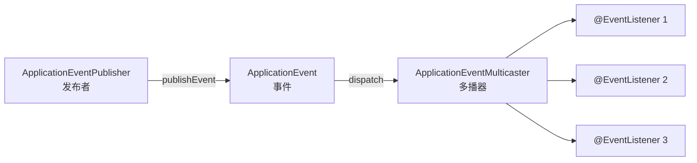

<!--
module:
  parent: 04.spring-backend
  slug: 04.spring-backend\01-core\event
  type: article
  category: 主模块子文章
  summary: Spring Event 事件机制
-->

# Spring Event 事件机制

> ⬅️ [返回 01 核心容器](README.md)

Spring Event 是基于**观察者模式**实现的应用内事件发布/订阅机制，让不同 Bean 之间**解耦通信**——发布者不关心谁订阅、订阅者不关心谁发布。

---

## 🎯 一句话定位

**Spring Event = 应用内的"消息队列"**——通过 `ApplicationEventPublisher` 发布事件，通过 `@EventListener` 订阅事件。**同进程内**的松耦合通信（跨进程用 MQ）。

---

## 一、为什么需要 Event 机制

### 场景：用户注册

```java
// ❌ 紧耦合：注册服务直接调用其他服务
@Service
public class UserService {
    @Autowired private EmailService emailService;
    @Autowired private SmsService smsService;
    @Autowired private PointsService pointsService;

    public void register(User user) {
        userRepository.save(user);
        emailService.sendWelcome(user);  // 紧耦合
        smsService.sendCode(user);        // 紧耦合
        pointsService.addPoints(user);    // 紧耦合
    }
}
```

**问题**：
- UserService 需要知道所有"注册后要做的事"
- 新增"注册后埋点"功能需要改 UserService
- 任何一个子服务出问题，整个注册流程可能失败

### 使用 Event 后（**推荐**）

```java
// ✅ 解耦：发布事件即可
@Service
public class UserService {
    @Autowired private ApplicationEventPublisher publisher;

    public void register(User user) {
        userRepository.save(user);
        publisher.publishEvent(new UserRegisteredEvent(user));  // 发出事件
    }
}

// 订阅者 1：发邮件
@EventListener
public void onUserRegistered(UserRegisteredEvent event) {
    emailService.sendWelcome(event.getUser());
}

// 订阅者 2：发短信
@EventListener
public void onUserRegistered(UserRegisteredEvent event) {
    smsService.sendCode(event.getUser());
}

// 订阅者 3：加积分
@EventListener
public void onUserRegistered(UserRegisteredEvent event) {
    pointsService.addPoints(event.getUser());
}
```

**优点**：
- UserService **不关心**谁订阅、有多少订阅者
- 新增订阅者**不改** UserService
- 订阅者之间**互不影响**

---

## 二、3 大核心组件



| 组件 | 角色 |
|------|------|
| `ApplicationEventPublisher` | **发布者**——负责把事件发出去 |
| `ApplicationEvent` | **事件**——携带数据 |
| `ApplicationEventMulticaster` | **多播器**——把事件分发给所有匹配的监听器 |
| `@EventListener` | **监听器**——处理事件 |

---

## 三、5 步快速上手

### 第 1 步：定义事件

> Spring 4.2+ **事件可以是任意 POJO**，不需要继承 `ApplicationEvent`（但继承可以拿到 source）。

```java
// ✅ 方式 1：继承 ApplicationEvent（传统方式）
public class UserRegisteredEvent extends ApplicationEvent {
    private final User user;

    public UserRegisteredEvent(Object source, User user) {
        super(source);
        this.user = user;
    }

    public User getUser() { return user; }
}

// ✅ 方式 2：任意 POJO（推荐，Spring 4.2+）
public class UserRegisteredEvent {
    private final User user;

    public UserRegisteredEvent(User user) {
        this.user = user;
    }

    public User getUser() { return user; }
}
```

### 第 2 步：发布事件

```java
@Service
public class UserService {

    @Autowired
    private ApplicationEventPublisher publisher;

    public void register(User user) {
        userRepository.save(user);
        publisher.publishEvent(new UserRegisteredEvent(user));
    }
}
```

### 第 3 步：监听事件（@EventListener）

```java
@Component
public class UserEventListener {

    @EventListener
    public void onUserRegistered(UserRegisteredEvent event) {
        // 处理事件
        log.info("User registered: {}", event.getUser().getName());
    }
}
```

### 第 4 步：异步监听（@Async）

> 默认监听器是**同步执行**的，**会阻塞发布者**。需要异步时加 `@Async`。

```java
@Component
public class UserEventListener {

    @Async  // 异步执行
    @EventListener
    public void onUserRegistered(UserRegisteredEvent event) {
        // 异步处理（如发邮件、发短信）
    }
}
```

> ⚠️ **@Async 需要在启动类加 @EnableAsync**。

### 第 5 步：顺序控制（@Order）

```java
@Component
public class UserEventListener {

    @Order(1)  // 数字越小，优先级越高
    @EventListener
    public void sendEmail(UserRegisteredEvent event) {
        // 先发邮件
    }

    @Order(2)
    @EventListener
    public void addPoints(UserRegisteredEvent event) {
        // 后加积分
    }
}
```

---

## 四、4 大高级特性

### 1. 条件监听（condition）

> 用 SpEL 表达式决定是否触发监听器。

```java
@EventListener(condition = "#event.user.age >= 18")
public void processAdult(UserRegisteredEvent event) {
    // 只处理成年用户
}
```

### 2. 监听父类事件

```java
// 监听 ApplicationEvent（所有事件的父类）
@EventListener
public void logAllEvents(ApplicationEvent event) {
    log.info("Event published: {}", event);
}
```

### 3. 事务绑定事件（@TransactionalEventListener）

> **事务提交后才触发**事件，避免事务回滚后还发邮件。

```java
@Component
public class UserEventListener {

    @TransactionalEventListener(phase = TransactionPhase.AFTER_COMMIT)
    public void onUserRegistered(UserRegisteredEvent event) {
        // 事务提交后才会触发
        // 事务回滚则不触发
        emailService.sendWelcome(event.getUser());
    }
}
```

**4 个阶段**：

| 阶段 | 触发时机 |
|------|---------|
| `BEFORE_COMMIT` | 事务提交**前** |
| `AFTER_COMMIT`（**默认**） | 事务提交**后** |
| `AFTER_ROLLBACK` | 事务**回滚后** |
| `AFTER_COMPLETION` | 事务**完成后**（无论提交/回滚） |

### 4. 自定义事件多播器

```java
@Configuration
public class EventConfig {

    @Bean
    public ApplicationEventMulticaster multicaster() {
        SimpleApplicationEventMulticaster multicaster = new SimpleApplicationEventMulticaster();
        multicaster.setTaskExecutor(new ThreadPoolTaskExecutor());  // 异步多播
        return multicaster;
    }
}
```

---

## 五、同步 vs 异步监听

| 维度 | 同步（默认） | 异步（@Async） |
|------|:-----------:|:--------------:|
| **执行线程** | 发布者所在线程 | 线程池 |
| **是否阻塞发布者** | ✅ 是 | ❌ 否 |
| **事务感知** | 与发布者同事务 | **无事务**（独立线程） |
| **异常处理** | 异常会传播给发布者 | 异常被吞，需手动处理 |
| **适用场景** | 必须立即处理（缓存更新） | 不阻塞主流程（发邮件、埋点） |

```java
// ❌ 错误：异步事件 + @TransactionalEventListener
@Async
@TransactionalEventListener
public void onEvent(MyEvent event) {
    // 因为 @Async 启动新线程，可能在事务提交前就开始执行
}
```

> 📌 **@Async 和 @TransactionalEventListener 不能同时用**。

---

## 六、Spring Event vs MQ 消息队列

| 维度 | Spring Event | MQ（Kafka/RabbitMQ） |
|------|------------|---------------------|
| **作用范围** | **同进程内** | **跨进程/跨服务** |
| **性能** | 极高（方法调用） | 高（网络 IO） |
| **可靠性** | 默认**不保证**（同步时若监听器抛异常会传播；异步时异常被吞） | 高（持久化、ACK） |
| **解耦性** | 单体应用内解耦 | 系统级解耦（微服务） |
| **事务支持** | ✅（@TransactionalEventListener） | 弱（需要补偿/幂等） |
| **使用场景** | **同进程**模块解耦 | **跨服务**事件驱动 |

> 📌 **同进程用 Spring Event，跨进程用 MQ**。

---

## 七、典型应用场景

| 场景 | 用途 |
|------|------|
| 用户注册后 | 发邮件、发短信、加积分、埋点 |
| 订单创建后 | 减库存、发通知、记录日志 |
| 支付成功后 | 更新订单状态、发通知、加积分 |
| 缓存更新 | 业务完成后清除相关缓存 |
| 异步任务 | 耗时操作（文件处理、报表生成） |

---

## 八、完整实战：用户注册

```java
// 1. 事件
public class UserRegisteredEvent {
    private final User user;
    public UserRegisteredEvent(User user) { this.user = user; }
    public User getUser() { return user; }
}

// 2. 发布
@Service
public class UserService {
    @Autowired private ApplicationEventPublisher publisher;

    @Transactional
    public void register(User user) {
        userRepository.save(user);
        publisher.publishEvent(new UserRegisteredEvent(user));
    }
}

// 3. 监听
@Component
public class UserEventListener {

    // 同步：发邮件
    @EventListener
    @Order(1)
    public void sendEmail(UserRegisteredEvent event) {
        emailService.sendWelcome(event.getUser());
    }

    // 异步：发短信
    @Async
    @EventListener
    @Order(2)
    public void sendSms(UserRegisteredEvent event) {
        smsService.sendCode(event.getUser());
    }

    // 事务提交后：加积分
    @TransactionalEventListener(phase = TransactionPhase.AFTER_COMMIT)
    @Order(3)
    public void addPoints(UserRegisteredEvent event) {
        pointsService.addPoints(event.getUser());
    }
}
```

---

## 九、源码链路：publishEvent 到底做了什么

> 面试常考：从 `publisher.publishEvent(event)` 到监听器方法执行，中间经过了什么？

### 9.1 调用链路全景

```
publisher.publishEvent(event)
  └─ AbstractApplicationContext.publishEvent()
       ├─ 1. 包装：如果不是 ApplicationEvent → 包装为 PayloadApplicationEvent
       ├─ 2. 获取多播器：getApplicationEventMulticaster()
       └─ 3. 广播：multicaster.multicastEvent(event, eventType)
            ├─ 遍历所有 ApplicationListener
            │    ├─ supportsEvent() → 类型匹配（ResolvableType 泛型解析）
            │    └─ invokeListener()
            │         ├─ 同步：直接 listener.onApplicationEvent(event)
            │         └─ 异步：taskExecutor.submit(() -> listener.onApplicationEvent(event))
            └─ 如果是 SmartApplicationListener：额外检查 shouldInvokeOnLatePublications()
```

### 9.2 核心类职责

| 类 | 职责 |
|---|------|
| `AbstractApplicationContext` | 持有 `ApplicationEventMulticaster` 实例，是发布入口 |
| `SimpleApplicationEventMulticaster` | 默认多播器，遍历监听器 + 分发（同步/异步） |
| `ApplicationListenerMethodAdapter` | `@EventListener` 方法的适配器，把注解方法包装成 `ApplicationListener` |
| `EventListenerMethodProcessor` | `BeanPostProcessor`，启动时扫描所有 `@EventListener` 方法并注册适配器 |
| `ResolvableType` | Spring 的泛型类型解析器，用于匹配 `ApplicationEvent<UserRegisteredEvent>` 的泛型参数 |

### 9.3 类型匹配原理

```java
// 监听器声明
@EventListener
public void onUserRegistered(UserRegisteredEvent event) { ... }

// 匹配过程（简化）：
// 1. EventListenerMethodProcessor 扫描方法参数类型 → UserRegisteredEvent
// 2. 包装为 ApplicationListenerMethodAdapter，其 getSupportedEventType() = UserRegisteredEvent
// 3. publishEvent(new UserRegisteredEvent(...)) 时：
//    multicaster 调用 adapter.supportsEvent(eventType)
//    → eventType.resolve() == UserRegisteredEvent.class → 匹配成功
```

> 💡 **为什么 POJO 事件也能被监听？**
> Spring 4.2+ 的 `PayloadApplicationEvent` 会把 POJO 包装一层，多播器在匹配时会解包（unwrap）比较 payload 类型，所以 `@EventListener` 可以直接声明 POJO 参数。

---

## 十、@TransactionalEventListener 源码：事务同步器

> 面试常考：`@TransactionalEventListener` 是怎么做到"事务提交后才触发"的？

### 10.1 核心机制：TransactionSynchronizationManager

```
@TransactionalEventListener(phase = AFTER_COMMIT) 的注册过程：

1. EventListenerMethodProcessor 扫描到 @TransactionalEventListener 方法
2. 包装为 TransactionalApplicationListenerMethodAdapter
3. 当事件发布时，该适配器 **不直接执行监听方法**，而是：
   └─ TransactionSynchronizationManager.registerSynchronization(
        new TransactionSynchronization() {
            @Override
            public void afterCommit() {
                // 这里才真正调用监听方法
                listener.onApplicationEvent(event);
            }
        }
      )
4. 事务管理器（TransactionInterceptor）在事务生命周期中回调这些同步器：
   ├─ beforeCommit(boolean readOnly)  → BEFORE_COMMIT
   ├─ afterCommit()                   → AFTER_COMMIT（默认）
   ├─ afterCompletion(int status)     → AFTER_COMPLETION / AFTER_ROLLBACK
   └─ suspend() / resume() / beforeCommit()
```

### 10.2 关键类关系

```
TransactionInterceptor（@Transactional 的 AOP 切面）
  └─ 调用 TransactionAspectSupport.invokeWithinTransaction()
       └─ 事务开始时：TransactionSynchronizationManager.initSynchronization()
       └─ 事务提交前：遍历 synchronization.afterCommit()
       └─ 事务完成后：遍历 synchronization.afterCompletion(status)
       └─ 事务结束时：TransactionSynchronizationManager.clearSynchronization()
```

### 10.3 fallbackExecution 行为

```java
@TransactionalEventListener(phase = AFTER_COMMIT, fallbackExecution = true)  // 默认
// 如果当前没有活跃事务 → 同步立即执行（降级为普通 @EventListener）

@TransactionalEventListener(phase = AFTER_COMMIT, fallbackExecution = false)
// 如果当前没有活跃事务 → 事件被丢弃（不执行）
```

> 💡 **为什么事务中发布的事件，同步监听器会"看到脏数据"？**
> 因为同步 `@EventListener` 在发布者的**同一事务**中执行，此时事务未提交，监听器读到的是事务内未提交数据。如果监听器发邮件后事务回滚 → 邮件已发但数据没入库。**必须用 `@TransactionalEventListener(AFTER_COMMIT)` 避免此问题。**

---

## 十一、6 大生产陷阱

### 陷阱 1：同步监听器看到未提交数据

```java
@Transactional
public void register(User user) {
    userRepository.save(user);                       // INSERT 但事务未提交
    publisher.publishEvent(new UserRegisteredEvent(user));  // 触发同步监听器
    // 此时监听器查 DB 能读到 user，但如果后续代码抛异常 → 事务回滚
    // 而监听器可能已经发了欢迎邮件 → 数据不一致
}
```

**修复**：需要事务感知的逻辑一律用 `@TransactionalEventListener(phase = AFTER_COMMIT)`。

### 陷阱 2：@Async + @TransactionalEventListener 失效

```java
@Async
@TransactionalEventListener(phase = AFTER_COMMIT)
public void onRegistered(UserRegisteredEvent event) { ... }
// ❌ @Async 在新线程执行，新线程没有原事务的同步回调注册
//    → 监听器可能在事务提交前就执行，或根本不执行
```

**修复**：二选一。需要异步 + 事务感知 → 先 `@TransactionalEventListener`，内部调异步服务。

```java
@TransactionalEventListener(phase = AFTER_COMMIT)
public void onRegistered(UserRegisteredEvent event) {
    asyncEmailService.sendWelcome(event.getUser());  // 手动异步
}
```

### 陷阱 3：异步监听器异常被吞

```java
@Async
@EventListener
public void sendEmail(UserRegisteredEvent event) {
    emailClient.send(...);  // 网络超时抛异常
    // ❌ 异步线程的异常不会传播给发布者，默认只打 ERROR 日志
    //    发布者完全不知道邮件发送失败
}
```

**修复**：自定义 `AsyncUncaughtExceptionHandler` + 持久化失败记录 + Spring Retry。

```java
@Configuration
public class AsyncConfig implements AsyncConfigurer {
    @Override
    public AsyncUncaughtExceptionHandler getAsyncUncaughtExceptionHandler() {
        return (ex, method, params) -> {
            log.error("异步事件处理失败: {}.{}", method.getDeclaringClass().getSimpleName(), method.getName(), ex);
            failureRecordRepository.save(new AsyncFailureRecord(method.getName(), ex.getMessage()));
        };
    }
}
```

### 陷阱 4：异步线程池打满 → 事件丢失

```java
@Bean
public ThreadPoolTaskExecutor eventExecutor() {
    ThreadPoolTaskExecutor executor = new ThreadPoolTaskExecutor();
    executor.setCorePoolSize(4);
    executor.setMaxPoolSize(8);
    executor.setQueueCapacity(100);  // ⚠️ 队列满后默认 AbortPolicy → RejectedExecutionException
    executor.setThreadNamePrefix("event-");
    return executor;
}
// ❌ 高并发时队列满 → 事件发布被拒绝 → 事件丢失
```

**修复**：
- 设置 `setRejectedExecutionHandler(new ThreadPoolExecutor.CallerRunsPolicy())`（降级为同步执行）
- 或扩大队列 + 监控队列长度告警
- 或关键事件改用 MQ（保证不丢）

### 陷阱 5：@Async 下 @Order 顺序失效

```java
@Async @Order(1) @EventListener
public void step1(UserRegisteredEvent e) { log.info("step 1"); }

@Async @Order(2) @EventListener
public void step2(UserRegisteredEvent e) { log.info("step 2"); }
// ❌ @Async 让监听器在线程池并发执行，@Order 只决定提交顺序，不决定执行顺序
//    step2 可能比 step1 先完成
```

**修复**：需要严格顺序 → 去掉 `@Async`；或用单个监听器内串行调用多个服务。

### 陷阱 6：监听器内发布事件 → 事件风暴 / 死循环

```java
@EventListener
public void onUserRegistered(UserRegisteredEvent e) {
    publisher.publishEvent(new WelcomeBonusEvent(e.getUser()));  // 又发事件
}

@EventListener
public void onWelcomeBonus(WelcomeBonusEvent e) {
    publisher.publishEvent(new UserRegisteredEvent(e.getUser()));  // ❌ 死循环
}
```

**修复**：
- 避免在监听器中发布"会触发回环"的事件
- 用状态标记（`ThreadLocal` 或事件对象内的 `processed` 标志）防重入
- 设计时画出事件依赖图，检查是否有环

---

## 🤔 思考

1. **Spring Event 是同步还是异步？** 默认**同步**（在发布者线程执行），加 @Async 才异步。
2. **监听器抛异常会怎样？** 同步时异常会传播给发布者；异步时异常被吞。
3. **Spring Event 怎么保证不丢消息？** 同步不丢，**异步可能丢**（需要持久化用 MQ）。
4. **ApplicationEventPublisher 和 ApplicationContext 关系？** ApplicationContext 本身实现了 ApplicationEventPublisher 接口，注入 ApplicationContext 也能发布事件。

---

## 相关章节

- ⬅️ [返回 01 核心容器](README.md)
- [IoC 总览](ioc/README.md) — Bean 管理是事件机制的基础
- [AOP 总览](aop/README.md) — @EventListener 本质是 AOP 切面
- [08 注解/异常注解](../08-annotations/exception.md) — 事件可携带异常信息
