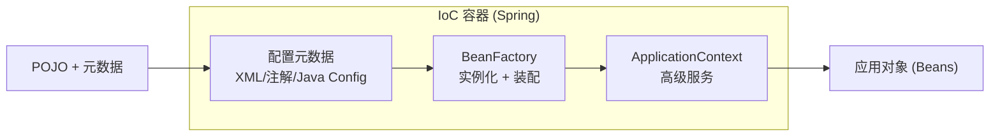
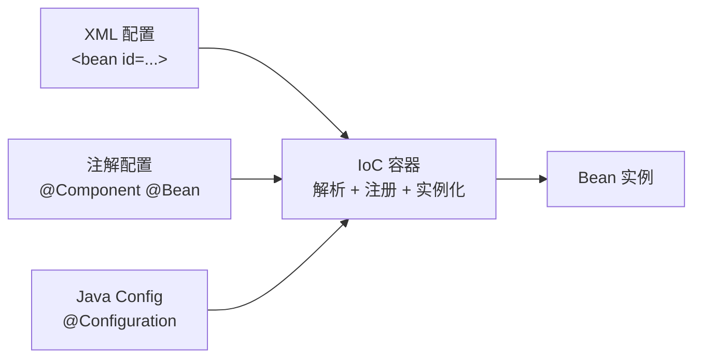
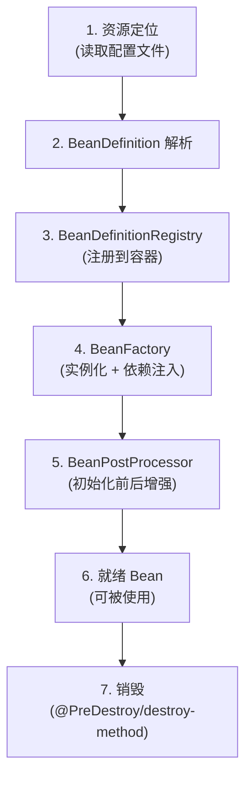

<!--
module:
  parent: spring
  slug: spring/ioc
  type: article
  category: 主模块子文章
  summary: IoC（Inversion of Control）控制反转
  depth: ⭐⭐⭐
-->

# IoC（Inversion of Control）控制反转

> ⬅️ [返回 01 核心容器](../README.md)

---
---

## 🎯 一句话定位

**IoC = 把对象创建权从代码"反转"给容器**——你声明 Bean（@Component/@Bean），Spring 负责实例化、组装、注入、管理生命周期。

---

## 📚 章节导航

| 章节 | 核心问题 | 阅读时长 |
|:-----|:---------|:--------:|
| [Bean 生命周期](bean-lifecycle.md) | Bean 从创建到销毁经历了哪些步骤？ | 15 min |
| [作用域与线程安全](scopes-and-thread-safety.md) | singleton Bean 安全吗？prototype 何时用？ | 10 min |
| [依赖注入](dependency-injection.md) | 4 种注入方式怎么选？构造器还是 setter？ | 8 min |
| [循环依赖](circular-dependency.md) | Spring 怎么解决 A↔B 闭环？三级缓存？@Lazy？ | 10 min |
| [FactoryBean](FactoryBean.md) | FactoryBean 与普通 Bean 的区别？SqlSessionFactoryBean？ | 8 min |

---

## 一、什么是控制反转

- **控制**：指的是对象创建（实例化、管理）的权力
- **反转**：控制权交给外部环境（Spring 框架、IoC 容器）



> 利用 Java 的反射功能实例化 Bean 并建立 Bean 之间的依赖关系，还提供了**实例化缓存、生命周期管理、实例代理、事件发布和资源装载**等高级服务。

---

## 二、Spring Bean

> **Bean** 代指的就是那些被 IoC 容器所管理的对象。

### 1. IoC 容器如何使用配置元数据来管理对象



### 2. Spring Bean 的装配流程



---

## 三、将一个类声明为 Bean

### 4 个"语义化"注解 + 1 个通用

| 注解 | 语义 | 适用层 |
|------|------|--------|
| `@Component` | 通用组件 | 不好归类时 |
| `@Service` | 业务层 | Service |
| `@Repository` | 数据访问层（**自动转换持久化异常**） | DAO |
| `@Controller` | 控制层 | Controller |

> 详见 [08 注解/Bean 注解](../../08-annotations/bean-and-ioc.md#一声明-bean-4-种语义化注解-1-个通用)

### @Component vs @Bean

| 维度 | @Component | @Bean |
|------|-----------|-------|
| **作用对象** | 类 | 方法 |
| **注册方式** | 类路径扫描（@ComponentScan） | 显式调用（方法返回值） |
| **自定义能力** | 弱 | 强（可写任意 Java 代码构造对象） |
| **典型场景** | 自己写的类 | 第三方库的类 |

- **@Component** 注解作用于类，而 @Bean 注解作用于方法。
- **@Component** 通常是通过类路径扫描来自动侦测以及自动装配到 Spring 容器中（我们可以使用 `@ComponentScan` 注解定义要扫描的路径从中找出标识了需要装配的类自动装配到 Spring 的 bean 容器中）。
- **@Bean** 注解通常是我们在标有该注解的方法中定义产生这个 bean，@Bean 告诉了 Spring "这是某个类的实例，当我需要用它的时候还给我"。
- **@Bean 注解比 @Component 注解的自定义性更强**，而且很多地方我们只能通过 @Bean 注解来注册 bean。比如当我们引用第三方库中的类需要装配到 Spring 容器时，则只能通过 @Bean 来实现。

---

## 四、注入 Bean

### 3 种注入注解

| 注解 | 来源 | 默认注入方式 | 适用场景 |
|------|------|------------|---------|
| `@Autowired` | Spring | byType | 大多数场景 |
| `@Resource` | JDK | byName | 明确知道 Bean 名称时 |
| `@Inject` | JDK（JSR-330） | byType | 需要 JSR-330 兼容时 |

> 详见 [08 注解/Bean 注解](../../08-annotations/bean-and-ioc.md#二注入-bean-3-种注解)

### @Autowired 和 @Resource 的区别

- **@Autowired 是 Spring 提供的注解，@Resource 是 JDK 提供的注解。**
- **@Autowired 默认的注入方式为 byType**（根据类型进行匹配），**@Resource 默认注入方式为 byName**（根据名称进行匹配）。
- 当一个接口存在多个实现类的情况下，@Autowired 和 @Resource 都需要通过名称才能正确匹配到对应的 Bean。@Autowired 可以通过 @Qualifier 注解来显式指定名称，@Resource 可以通过 name 属性来显式指定名称。
- @Autowired 支持在**构造函数、方法、字段和参数**上使用。@Resource 主要用于**字段和方法**上的注入，不支持在构造函数或参数上使用。

---

## 五、Bean 作用域

详见 [作用域与线程安全](scopes-and-thread-safety.md)

---

## 六、Bean 生命周期

详见 [Bean 生命周期](bean-lifecycle.md)

---

## 七、整体知识图谱

```mermaid
graph TB
    IoC[IoC 容器] --> Meta[配置元数据<br/>XML/注解/Java Config]
    Meta --> Scan[扫描 + 解析]
    Scan --> Bean[创建 Bean]
    Bean --> Inst[1. 实例化]
    Inst --> Fill[2. 属性填充]
    Fill --> Init[3. 初始化]
    Init --> Use[4. 使用]
    Use --> Dest[5. 销毁]

    Init -.扩展点.-> Aware[Aware 接口]
    Init -.扩展点.-> BP[BeanPostProcessor]
    Init -.扩展点.-> IB[InitializingBean]

    IoC --> Scope[作用域管理]
    Scope --> Sing[singleton]
    Scope --> Proto[prototype]
    Scope --> Web[request/session/...]

    IoC --> DI[依赖注入]
    DI --> AutoW[@Autowired]
    DI --> Res[@Resource]
    DI --> Inject[@Inject]
```

---

## 八、源码级深度：Bean 创建核心链路

### 1. AbstractApplicationContext.refresh()——容器启动的 12 步

```java
// org.springframework.context.support.AbstractApplicationContext#refresh
// Spring 容器启动的"总入口"，12 步中任何一步失败都会销毁已创建资源
public void refresh() throws BeansException, IllegalStateException {
    synchronized (this.startupShutdownMonitor) {
        // 1. 准备刷新：设置启动时间、活跃标志
        prepareRefresh();

        // 2. 获取 BeanFactory + 加载 BeanDefinition（XML/注解解析）
        ConfigurableListableBeanFactory beanFactory = obtainFreshBeanFactory();

        // 3. 准备 BeanFactory：设置 ClassLoader、注册内置 Bean（environment、systemProperties）
        prepareBeanFactory(beanFactory);

        try {
            // 4. 子类扩展点（如 Web 容器注册 scope）
            postProcessBeanFactory(beanFactory);

            // 5. 执行 BeanFactoryPostProcessor（PropertySourcesPlaceholderConfigurer 在此生效）
            invokeBeanFactoryPostProcessors(beanFactory);

            // 6. 注册 BeanPostProcessor（AOP、@Autowired 在此注册）
            registerBeanPostProcessors(beanFactory);

            // 7-9. 初始化消息源、事件广播器、注册 ApplicationListener
            initMessageSource();
            initApplicationEventMulticaster();
            onRefresh();
            registerListeners();

            // 10. ⭐ 实例化所有非懒加载 singleton Bean（核心！）
            finishBeanFactoryInitialization(beanFactory);

            // 11-12. 发布 ContextRefreshedEvent、注册 Live/Ready 回调
            finishRefresh();
        } catch (BeansException ex) {
            destroyBeans();  // 失败则销毁所有已创建 Bean
            cancelRefresh(ex);
            throw ex;
        }
    }
}
```

> **WHY**：第 10 步 `finishBeanFactoryInitialization` 是 Bean 实例化的真正触发点，内部调用 `DefaultListableBeanFactory.preInstantiateSingletons()` 遍历所有 BeanDefinition。

### 2. DefaultListableBeanFactory.getBean()——获取 Bean 的入口

```java
// org.springframework.beans.factory.support.DefaultListableBeanFactory
// 所有 getBean() 最终汇聚于此，内部调用 doGetBean()
@Override
public <T> T getBean(String name, Class<T> requiredType) throws BeansException {
    return doGetBean(name, requiredType, null, false);
}

// doGetBean 核心逻辑（简化）
protected <T> T doGetBean(String name, ...) throws BeansException {
    // 1. 检查 singleton 缓存（一级缓存）
    Object sharedInstance = getSingleton(beanName);
    if (sharedInstance != null) {
        return (T) getObjectForBeanInstance(sharedInstance, name, beanName, null);
    }

    // 2. 检查 parent BeanFactory（支持容器层级）
    BeanFactory parentBeanFactory = getParentBeanFactory();
    if (parentBeanFactory != null && !containsBeanDefinition(beanName)) {
        return parentBeanFactory.getBean(name, requiredType);
    }

    // 3. 处理 @DependsOn——先创建依赖的 Bean
    String[] dependsOn = mbd.getDependsOn();
    if (dependsOn != null) {
        for (String dep : dependsOn) {
            getBean(dep);  // 递归创建依赖
        }
    }

    // 4. 根据 scope 创建 Bean（singleton/prototype/其他）
    if (mbd.isSingleton()) {
        sharedInstance = getSingleton(beanName, () -> createBean(beanName, mbd, args));
    }
    // ...
}
```

> **WHY**：`getSingleton()` 内部就是三级缓存解决循环依赖的地方——先从 `singletonObjects`（一级）查，再到 `earlySingletonObjects`（二级），最后到 `singletonFactories`（三级，ObjectFactory）。

---

## 九、版本演进

| 版本 | 关键变更 | 影响 |
|:-----|:---------|:-----|
| **Spring 4.x** | 全面注解驱动，`@ComponentScan` + `@Bean` 替代 XML | XML 配置开始边缘化 |
| **Spring 5.0** | 函数式 Bean 注册（`GenericApplicationContext.register()`）| 轻量级容器场景 |
| **Spring 5.3** | `@Bean` 方法支持 `@Lazy` + `@Scope(proxyMode)` 组合 | 延迟初始化更灵活 |
| **Spring Boot 2.x** | 条件注解体系成熟（`@ConditionalOnBean`/`@ConditionalOnProperty`）| 自动配置条件化 |
| **Spring Boot 3.x / Spring 6.0** | `@Autowired` 构造器注入成为默认推荐；`javax.*` → `jakarta.*` 命名空间迁移 | 破坏性变更，需全局替换 |
| **Spring Boot 3.2+** | Virtual Threads 支持（`spring.threads.virtual.enabled`）| IoC 容器内 Bean 可跑虚拟线程 |

---

## 十、❌/✅ 反例对比

### 10.1 字段注入 vs 构造器注入

```java
// ❌ 反例：字段注入（@Autowired 直接打在字段上）
@Service
public class OrderService {
    @Autowired
    private UserRepository userRepository;  // 不可变？不可测试！

    public Order createOrder(Long userId) {
        User user = userRepository.findById(userId);
        // ...
    }
}
// 问题：1) 无法声明 final 字段  2) 单元测试必须依赖 Spring 容器或反射
//       3) 循环依赖在运行时才暴露（而非启动时）
```

```java
// ✅ 正例：构造器注入（Spring 4.3+ 推荐，Boot 3.x 默认）
@Service
public class OrderService {
    private final UserRepository userRepository;  // final → 不可变

    // Spring 4.3+：只有一个构造器时可省略 @Autowired
    public OrderService(UserRepository userRepository) {
        this.userRepository = userRepository;
    }

    public Order createOrder(Long userId) {
        User user = userRepository.findById(userId);
        // ...
    }
}
// 优势：1) final 保证不可变  2) 单元测试直接 new OrderService(mockRepo)
//       3) 循环依赖在启动时直接报错（fail-fast），而非运行时 NPE
```

### 10.2 @Component 滥用 vs @Bean 精确控制

```java
// ❌ 反例：对第三方类用 @Component（不可行！）
// 第三方库的类不在你的包扫描路径下，@Component 无法生效
@Component  // 编译不报错，但扫描不到
public class RedissonClient extends org.redisson.Redisson { ... }
```

```java
// ✅ 正例：第三方类用 @Bean 显式注册
@Configuration
public class RedisConfig {
    @Bean
    public RedissonClient redissonClient() {
        Config config = new Config();
        config.useSingleServer().setAddress("redis://localhost:6379");
        return (RedissonClient) Redisson.create(config);
    }
}
// WHY：@Bean 作用于方法，可写任意 Java 代码构造对象，适合第三方库集成
```

### 10.3 循环依赖：@Lazy 解耦 vs 设计重构

```java
// ❌ 反例：用 @Lazy 掩盖循环依赖（A ↔ B）
@Service
public class A {
    @Autowired @Lazy private B b;  // 运行时代理，延迟初始化
}
@Service
public class B {
    @Autowired private A a;
}
// 问题：编译通过、启动通过，但运行时调用 b.xxx() 可能触发代理初始化失败
//       本质是设计缺陷——A 和 B 职责耦合，应该重构
```

```java
// ✅ 正例：提取公共逻辑，消除循环
@Service
public class A {
    private final SharedService sharedService;  // A 依赖 SharedService
    public A(SharedService sharedService) { this.sharedService = sharedService; }
}
@Service
public class B {
    private final SharedService sharedService;  // B 也依赖 SharedService
    public B(SharedService sharedService) { this.sharedService = sharedService; }
}
@Service
public class SharedService { /* 抽取公共逻辑 */ }
// WHY：循环依赖是设计坏味道，@Lazy 只是止痛药，重构才是根治
```

---

## 🤔 思考

1. **IoC 和 DI 是什么关系？** IoC 是一种设计思想（控制反转），DI 是 IoC 的具体实现（依赖注入）。
2. **为什么 Spring 默认 Bean 是 singleton？** 绝大多数 Bean 是无状态的（Service、DAO），singleton 性能更高、节省内存。
3. **IoC 容器和 Spring 上下文什么关系？** BeanFactory 是最底层容器，ApplicationContext 在 BeanFactory 之上提供更多企业级功能（i18n、事件发布、AOP 等）。一般说 "Spring 容器" 指 ApplicationContext。
4. **IoC 有什么缺点？** 对象创建过程变得"看不见"了，调试时定位问题较难；学习曲线较陡。

---

## 相关章节

- ⬅️ [返回 01 核心容器](../README.md)
- [Bean 生命周期](bean-lifecycle.md)
- [作用域与线程安全](scopes-and-thread-safety.md)
- [依赖注入](dependency-injection.md)
- [循环依赖](circular-dependency.md)
- [FactoryBean](FactoryBean.md)
- [08 注解/Bean 注解](../../08-annotations/bean-and-ioc.md)


- [configuration-lite-vs-full](../configuration-lite-vs-full.md)
- [core-externalized-configuration](../core-externalized-configuration.md)
- [event](../event.md)
- [module](../module.md)
← [返回: Spring 全家桶 · ioc](../README.md)
