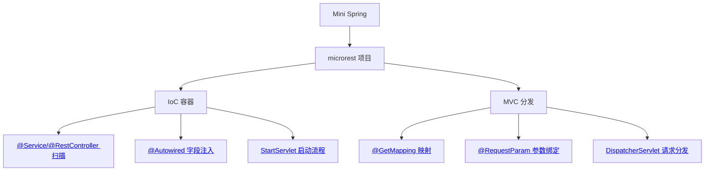

<!--
module:
  parent: spring
  slug: spring/minispring
  type: index
  category: 主模块子文章
  summary: 手写 Mini Spring
  depth: ⭐⭐⭐
-->

# 手写 Mini Spring

> 通过 200 行 Servlet 模拟 Spring IoC + MVC，理解框架底层运作机制

---
---

## 导航

| 序号 | 主题 | 核心内容 |
|------|------|---------|
| 1 | [microrest/](microrest/README.md) | MicroRest 轻量实现：Bean 扫描、字段注入、GET 请求分发 |

---

## 知识脉络



---

## 学习价值

本项目是一个**教学型 mini 框架**，用 Servlet 模拟 Spring 核心机制：

- **IoC 容器**：通过类扫描 → 实例化 → 依赖注入，理解 Spring 如何管理 Bean → 重点看 `StartServlet.java` 的 `scanClasses()` 扫描逻辑
- **MVC 分发**：通过 URL 映射 → 参数解析 → 反射调用，理解 Spring MVC 请求流转 → 重点看 `DispatcherServlet.java` 的 `service()` 分发入口
- **注解驱动**：自定义注解替代 XML 配置，理解 Spring 的注解处理链 → 重点看 `annotation/` 包下 6 个注解定义与 `StartServlet` 的反射处理

## 范围与限制

| 已实现 | 未实现 |
|--------|--------|
| Bean 扫描与注册 → `StartServlet.scanClasses()` | AOP / 动态代理 |
| 字段级 `@Autowired` → `StartServlet.injection()` | `@Qualifier` / `@Primary` |
| GET 请求分发 → `DispatcherServlet.service()` | POST / PUT / DELETE |
| 基础 `@RequestParam` → `DispatcherServlet` 参数解析 | 复杂参数绑定 |
| YAML 配置加载 → `DefaultConfig` | `@Configuration` / `@Bean` |
| 日志与 Servlet 容器 | Bean 生命周期 / 作用域 |

## 核心流程

```text
配置加载 → 包扫描 → Bean 实例化 → 依赖注入 → 处理器映射 → 启动监听
```

---

## 相关章节

- 上游：[`01 核心容器`](../README.md) — IoC 容器 + AOP 框架 + 工具集
- 关联：[`IoC 容器`](../ioc/README.md) — 理解 Spring 原生 Bean 管理
- 关联：[`AOP 总览`](../aop/README.md) — Mini Spring 未覆盖 AOP，需另行学习
- 关联：[`02 Web 层`](../../02-web/README.md) — Spring MVC 完整实现
- 同级：[`tools-reference`](../tools-reference.md) — Spring 自带 24 个工具类
- 同级：[`module`](../module.md) — Spring 模块总览

---

> 建议路径：先读 [IoC 容器](../ioc/README.md) 理解概念 → 再看 MicroRest 代码 → 对照 Spring 源码验证理解

← [返回: Spring 全家桶 · minispring](../README.md)
