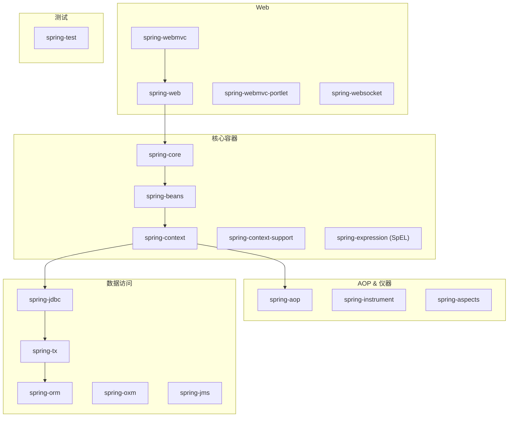
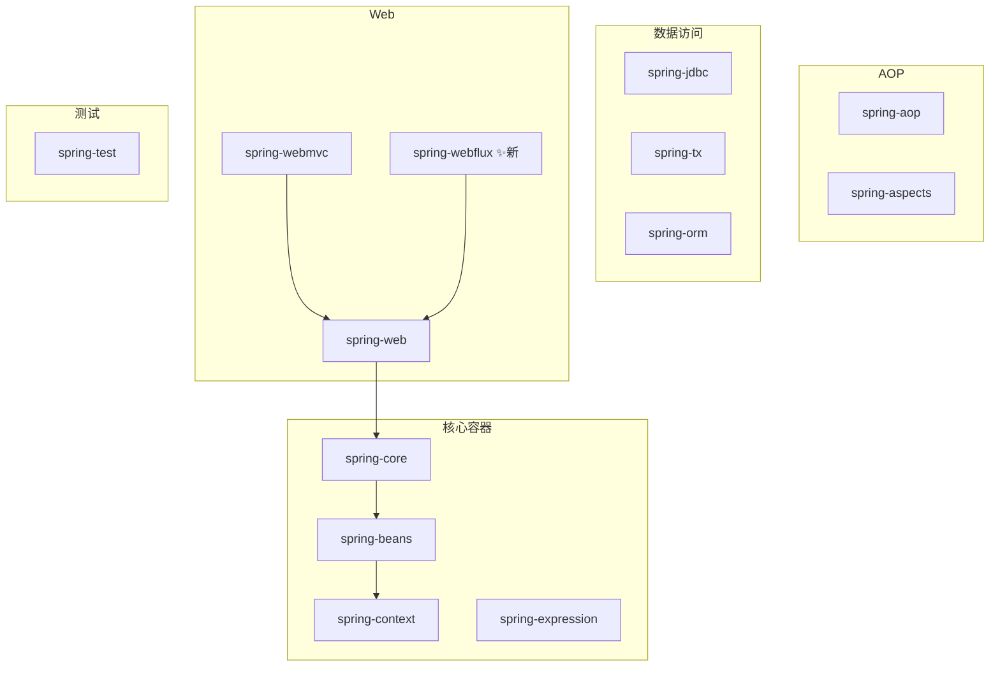
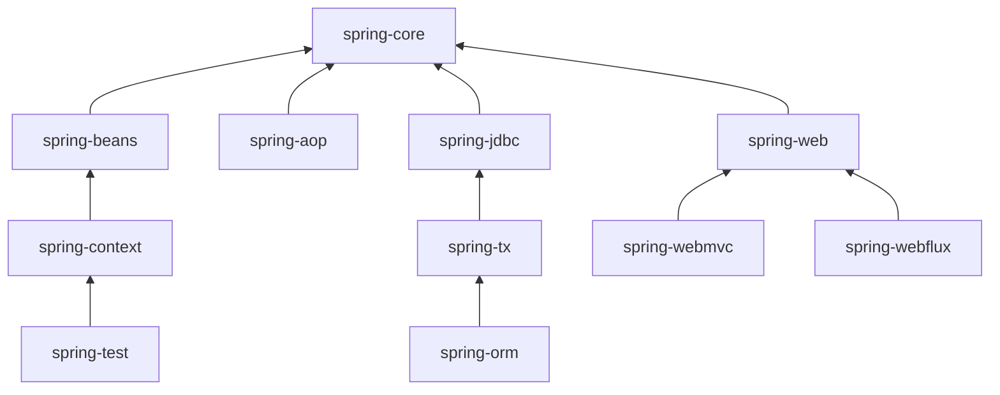

<!--
module:
  parent: 04.spring-backend
  slug: 04.spring-backend\01-core\module
  type: article
  category: 主模块子文章
  summary: Spring Framework 模块结构
-->

# Spring Framework 模块结构

> ⬅️ [返回 01 核心容器](README.md)

Spring Framework 自发布以来经过多个大版本迭代，目前主流使用 5.x 和 6.x。本章梳理 Spring 4.x 与 5.x 的模块划分、各模块职责及模块之间的依赖关系。

---

## Spring 4.x 模块结构
### 1.1 Spring 4.x 模块总览

**模块速查**（点击跳转详细章节）：
- 核心容器：[spring-core](#31-spring-core) · [spring-beans](#32-spring-beans) · [spring-context](#33-spring-context) · [spring-expression](#34-spring-expression)
- AOP & 仪器：[spring-aspects](#41-spring-aspects) · [spring-aop](#42-spring-aop) · [spring-instrument](#43-spring-instrument) · [spring-instrument-tomcat](#44-spring-instrument-tomcat)
- 数据访问：[spring-jdbc](#51-spring-jdbc) · [spring-tx](#52-spring-tx) · [spring-orm](#53-spring-orm) · [spring-oxm](#54-spring-oxm) · [spring-jms](#55-spring-jms)
- Web：[spring-web](#61-spring-web) · [spring-webmvc](#62-spring-webmvc) · [spring-websocket](#64-spring-websocket)
- 测试：[Spring Test](#spring-test)

### 1.2 Spring 5.x 模块结构

> Spring 5.x 版本中 Web 模块的 Portlet 组件已经被废弃掉，同时增加了用于异步响应式处理的 WebFlux 组件。
>
> **Portlet 废弃原因**：Portlet 是 JSR-168/286 规范的实现，主要用于门户（Portal）系统，但随着现代 SPA + 微服务架构的兴起，Portlet 生态已大幅萎缩。Spring 5.0 起不再提供 `spring-webmvc-portlet` 模块。
>
> **替代方案**：需要门户功能的场景建议使用 **Spring WebFlux + API Gateway**（如 Spring Cloud Gateway）或前端微服务组合（Micro-Frontends）模式。
>
> **Portlet 废弃原因**：Portlet 是 JSR-168/286 规范的实现，主要用于门户（Portal）系统，但随着现代 SPA + 微服务架构的兴起，Portlet 生态已大幅萎缩。Spring 5.0 起不再提供 `spring-webmvc-portlet` 模块。
>
> **替代方案**：需要门户功能的场景建议使用 **Spring WebFlux + API Gateway**（如 Spring Cloud Gateway）或前端微服务组合（Micro-Frontends）模式。

---

## Spring 各个模块的依赖关系

---

## 核心容器层（Core Container）
Spring 框架的核心模块，也可以说是基础模块，主要提供 IoC 依赖注入功能的支持，Spring 其他所有的功能基本都需要依赖于该模块。

### 3.1 Spring-Core

核心功能工具类，具体包括控制反转和依赖控制。

### 3.2 Spring-Beans

提供对 bean 的创建、配置和管理等功能的支持。

### 3.3 Spring-Context

- 继承自 Spring-Beans 模块，并添加国际化、事件传播、资源加载和透明地创建上下文等功能。
- 提供一些 J2EE 功能，比如 EJB、JMX 和远程调用等。
- Spring-Context-Support 提供了将第三方库集成到 Spring-Context 的支持。

### 3.4 spring-expression

表达式语言 SpEL 支持。

---

## AOP
### 4.1 spring-aspects

该模块为与 AspectJ 的集成提供支持。

### 4.2 spring-aop

提供了面向切面的编程实现。

### 4.3 spring-instrument

用于 Java 代理（Agent）和类文件的加载时（Load-Time）转换。

### 4.4 spring-instrument-tomcat

为 Tomcat 提供了一个织入代理，能够为 Tomcat 传递类文件，就像这些文件是被类加载器加载的一样。

> **典型使用场景**：在不修改 Tomcat 类加载器的前提下，将 AspectJ LTW（Load-Time Weaving）织入代理注入到 Tomcat 中。仅在需要在 Tomcat 容器内启用 `spring-instrument` 类转换时才引入，绝大多数 Spring Boot 项目不需要此模块。

---

## 数据访问层（Data Access/Integration）
### 5.1 spring-jdbc

提供了对数据库访问的抽象 JDBC。不同的数据库都有自己独立的 API 用于操作数据库，而 Java 程序只需要和 JDBC API 交互，这样就屏蔽了数据库的影响。

### 5.2 spring-tx

提供对事务的支持。

### 5.3 spring-orm

提供对 Hibernate、JPA、iBatis 等 ORM 框架的支持。

### 5.4 spring-oxm

提供一个抽象层支撑 OXM(Object-to-XML-Mapping)，例如：JAXB、Castor、XMLBeans、JiBX 和 XStream 等。

### 5.5 spring-jms

消息服务。自 Spring Framework 4.1 以后，它还提供了对 spring-messaging 模块的继承。

---

## Web 应用层（Spring Web）
### 6.1 spring-web

对 Web 功能的实现提供一些最基础的支持。

### 6.2 spring-webmvc

提供对 Spring MVC 的实现。

### 6.3 spring-webmvc-portlet

基于 Portlet 环境的 MVC 实现，5.x 已经废弃。

### 6.4 spring-websocket

提供了对 WebSocket 的支持，WebSocket 可以让客户端和服务端进行双向通信。

### 6.5 spring-webflux

提供对 WebFlux 的支持。WebFlux 是 Spring Framework 5.0 中引入的新的响应式框架。与 Spring MVC 不同，它不需要 Servlet API，是完全异步。

---

## Messaging
`spring-messaging` 是从 Spring 4.0 开始新加入的一个模块，主要职责是为 Spring 框架集成一些基础的报文传送应用。

---

## Spring Test
Spring 团队提倡测试驱动开发（TDD）。

Spring 的测试模块对 JUnit（单元测试框架）、TestNG（类似 JUnit）、Mockito（主要用来 Mock 对象）、PowerMock（解决 Mockito 的问题比如无法模拟 final, static， private 方法）等等常用的测试框架支持的都比较好。

---

## 相关章节

- ⬅️ [返回 01 核心容器](README.md)
- ➡️ [IoC 容器](ioc/README.md) — Spring 核心模块的最佳实践
- ➡️ [AOP 详解](aop/README.md) — spring-aop / spring-aspects 模块详解
- ➡️ [工具类参考](tools-reference.md) — spring-context-support 集成指南
- ➡️ [事件机制](event.md) — spring-context 事件发布与监听
- ➡️ [事务管理](../04-data/transaction/README.md) — spring-tx 模块详解
