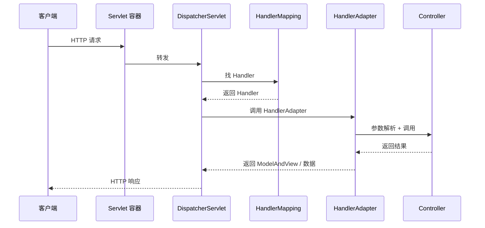

<!--
module:
  parent: spring
  slug: spring/mvc
  type: article
  category: 主模块子文章
  summary: Spring MVC 流程与 Filter/AOP 顺序。
-->

# Spring MVC

> ⬅️ [返回 02 Web 层](../README.md)

---
---

## 🎯 一句话定位

**Spring MVC = DispatcherServlet 前端控制器 + 9 大组件协作 + 注解驱动**——Java Web 层的事实标准，RESTful API 与视图渲染一站式搞定。

---

## 📚 章节导航

| 章节 | 核心问题 | 阅读时长 |
|:-----|:---------|:--------:|
| [DispatcherServlet 与 9 大组件](dispatch-flow.md) | 请求从进入到响应经过哪些步骤？9 大组件怎么协作？ | 15 min |
| [组件对比与场景](components-order.md) | Filter / Interceptor / AOP 怎么选？执行顺序？ | 10 min |
| [视图解析器](view-resolver.md) | ViewResolver 体系；前后端分离还需要吗？ | 15 min |
| [异常处理](exception-resolver.md) | HandlerExceptionResolver 链、@ExceptionHandler、ErrorResponse | 20 min |
| [文件上传](file-upload.md) | MultipartFile、单/多文件、大小类型限制 | 15 min |
| [CORS 与静态资源](cors-and-static.md) | @CrossOrigin、WebJars、addResourceHandlers | 15 min |
| [异步 MVC](async-mvc.md) | Callable/DeferredResult/SseEmitter、spring.mvc.async | 20 min |
| [国际化（i18n）](i18n.md) | LocaleResolver、MessageSource、messages.properties | 15 min |

---

## 一、什么是 Spring MVC

> **Spring MVC** 是 **Spring Framework** 中用于构建 **Web 应用程序** 和 **RESTful Web 服务** 的核心模块。它基于经典的 **MVC（Model-View-Controller）架构模式** 设计，将应用程序的不同关注点（业务逻辑、数据展示、用户交互）分离，使代码更清晰、可维护、可测试。

---

## 二、核心思想：MVC 架构

| 角色 | 职责 | 不依赖什么 |
|------|------|----------|
| **Model (模型)** | 代表应用程序的数据和业务逻辑（Java 对象、数据库操作） | 不依赖 Web 层 |
| **View (视图)** | 负责数据的呈现（JSP、Thymeleaf、FreeMarker 模板，或 JSON/XML 响应） | 从 Model 获取数据 |
| **Controller (控制器)** | 接收 HTTP 请求，调用 Model 处理业务逻辑，选择 View 渲染结果 | 核心枢纽 |

---

## 三、为什么需要 Spring MVC

- **解决传统 Servlet/JSP 开发痛点**：避免在 Servlet 中混杂业务逻辑、数据访问和视图渲染代码，导致代码臃肿、难以维护和测试。
- **提供强大的基础设施**：封装了底层 Servlet API 的复杂性（如请求/响应处理、会话管理），开发者只需关注业务逻辑。
- **高度可配置和可扩展**：通过配置（XML 或 Java Config）和丰富的接口/抽象类，可以灵活定制几乎任何环节（如参数解析、数据绑定、验证、视图解析、异常处理）。
- **无缝集成 Spring 生态**：与 Spring 的核心特性（IoC 容器、AOP、事务管理、数据访问、安全性等）深度集成。
- **强大的 REST 支持**：是构建现代 RESTful Web 服务的首选框架之一（配合 `@RestController`）。

---

## 四、关键特点与优势

- **注解驱动开发**（@Controller, @RequestMapping 等）：极大简化配置，使代码更简洁、意图更清晰。**这是现代 Spring MVC 开发的主流方式**。
- **松耦合**：各组件（Controller, Service, Repository）通过接口和 Spring IoC 容器管理依赖，易于单元测试和模块替换。
- **强大的数据绑定与验证**：自动将请求参数映射到 Java 对象，并支持 JSR-303 Bean Validation 规范。
- **灵活的视图技术**：无缝支持 JSP, Thymeleaf, FreeMarker, Velocity, JSON, XML 等各种视图技术，易于切换。
- **一流的 REST 支持**：通过 @RestController, @PathVariable, @RequestBody, @ResponseBody, HttpMessageConverter 等，轻松构建符合 REST 原则的 Web 服务。
- **国际化 (i18n) 与主题 (Themes) 支持**：内置对多语言和主题切换的支持。
- **文件上传/下载**：提供简单易用的 API 处理文件上传和下载。
- **与 Spring Boot 深度集成**：Spring Boot 极大简化了 Spring MVC 应用的配置和部署。通过 `spring-boot-starter-web` 依赖，自动配置 DispatcherServlet、常用视图解析器、JSON 转换器等，**开箱即用**。

---

## 五、Spring MVC vs. Spring Boot

| 维度 | Spring MVC | Spring Boot |
|------|-----------|-------------|
| **定位** | Spring Framework 中**专门处理 Web 层**的模块/技术 | 快速开发框架/平台 |
| **范围** | 只能处理 Web 层 | 包含并自动配置了 Spring MVC（及其他 Spring 模块和第三方库） |
| **配置** | 需要手动配置大量 XML/Java Config | 自动配置，**开箱即用** |
| **生产级特性** | 无 | 监控、健康检查、外部化配置等 |
| **关系** | Spring Boot 的子集 | Spring MVC 的超集 |

> 你可以只用 Spring MVC（需要手动配置），但**强烈推荐**在 Spring Boot 的基础上使用 Spring MVC。Spring Boot 是构建 Spring MVC 应用的**最佳实践和事实标准**。

---

## 六、核心组件与工作流程

Spring MVC 的核心是一个 **前端控制器 (Front Controller)** 模式实现：

### 1. DispatcherServlet（核心引擎）

- 本质上是**一个 Servlet**（通常映射到 `/`）
- 作为**所有请求的单一入口点**
- 负责协调整个请求处理流程

### 2. 请求处理流程



| 步骤 | 行为 | 组件 |
|:----:|:-----|:----|
| 1 | 用户发起 HTTP 请求 | — |
| 2 | 请求被 Servlet 容器接收，转发给 DispatcherServlet | Tomcat |
| 3 | **HandlerMapping** 找到能处理此请求的 Controller 方法 | HandlerMapping |
| 4 | **HandlerAdapter** 真正执行 Controller 方法 | HandlerAdapter |
| 5 | **参数解析**（路径变量、查询参数、表单、JSON、Header 等） | HandlerMethodArgumentResolver |
| 6 | **数据验证**（如 JSR-303 @Valid） | Validator |
| 7 | 执行 Controller 方法，返回 ModelAndView 或数据 | Controller |
| 8 | **视图解析**（逻辑视图名 → 物理视图）或 **JSON 序列化** | ViewResolver / HttpMessageConverter |
| 9 | 异常统一处理 | HandlerExceptionResolver |
| 10 | 返回响应给客户端 | DispatcherServlet |

> 详细 9 大组件解析见 [DispatcherServlet 与 9 大组件](dispatch-flow.md)

---

## 七、组件协作全景

```mermaid
graph TB
    MVC[Spring MVC] --> DS[DispatcherServlet]
    MVC --> Annotation[注解驱动<br/>@Controller @RequestMapping]
    MVC --> Binding[数据绑定 + 验证<br/>@ModelAttribute @Valid]
    MVC --> View[视图技术<br/>JSP/Thymeleaf/FreeMarker]
    MVC --> REST[REST 支持<br/>@RestController @ResponseBody]
    MVC --> i18n[国际化 + 主题]
    MVC --> File[文件上传/下载]
    MVC --> Boot[Spring Boot 集成]

    style MVC fill:#e3f2fd,stroke:#1976d2,stroke-width:3px
    style DS fill:#fff3e0,stroke:#f57c00
```

---

## 八、总结

**Spring MVC 是一个强大、灵活、基于 MVC 模式的 Java Web 框架，是 Spring Framework 的核心 Web 模块。** 它通过 DispatcherServlet 作为前端控制器，利用注解驱动的方式，将请求分发给 Controller 处理业务逻辑，协调 Model 和 View，最终生成响应。

它解决了传统 Web 开发的痛点，提供了企业级应用所需的基础设施，并与 Spring 生态无缝集成。**在现代 Java 开发中，它通常与 Spring Boot 结合使用，以实现极高的开发效率和生产力。**

理解 Spring MVC 的核心概念（尤其是请求处理流程和 9 大关键组件）对于成为合格的 Java Web 开发者至关重要。

---

## 速记卡：split-hairs 视角

> 本节为 split-hairs 迁出内容（2026-08-10），保留面试深挖价值，避免与上方概念铺陈重复。

### 30 秒面试话术（9 步流程版）

> "Spring MVC 流程分 9 步：
>
> 1. 请求到 **DispatcherServlet**
> 2. 调用 **HandlerMapping** 找 Controller（返回 HandlerExecutionChain + 拦截器）
> 3. 调用 **HandlerAdapter** 执行 Controller 方法
> 4. Controller 返回 **ModelAndView**
> 5. **ViewResolver** 解析视图名 → 实际 View
> 6. View 渲染，返回响应
>
> **@RestController 简化**：返回对象 → **HttpMessageConverter** 序列化为 JSON，直接响应，**不经过 ViewResolver**。
>
> **三大核心组件**：
> - DispatcherServlet：前端控制器
> - HandlerMapping：URL → Controller
> - HandlerAdapter：调用 Controller
>
> **拦截器**在 HandlerExecutionChain 中执行：preHandle → Controller → postHandle → afterCompletion。"

### 3 大反直觉陷阱

| 陷阱 | 直觉以为 | 实际真相 |
|------|---------|---------|
| **"9 步流程每次都跑完整"** | 9 步是固定路径 | `@ResponseBody` / `@RestController` **跳过 ViewResolver**，直接走 HttpMessageConverter 序列化 |
| **"拦截器 = 过滤器"** | 两者功能等价 | 拦截器在 **HandlerExecutionChain 中**（Spring MVC 范围）；过滤器是 **Servlet 规范**，作用范围更广 |
| **"HandlerMapping = 路由表"** | 一次性查表 | 实际是**链式查找**——多个 HandlerMapping 都有机会匹配，按顺序返回首个 |

### 关键组件速查（面试高频追问）

**HandlerMapping 实现**：

| 实现 | 匹配方式 | 示例 |
|------|---------|------|
| **RequestMappingHandlerMapping** | `@RequestMapping` 注解（默认） | `@GetMapping("/users")` |
| SimpleUrlHandlerMapping | URL 显式配置 | `<property name="urlMap">` |
| BeanNameUrlMapping | Bean 名称为 URL | `<bean name="/users">` |

**HandlerAdapter 实现**：

| 实现 | 适用场景 |
|------|---------|
| **RequestMappingHandlerAdapter** | `@RequestMapping` 注解（最常用） |
| HttpRequestHandlerAdapter | 实现 `HttpRequestHandler` 接口 |
| SimpleControllerHandlerAdapter | 实现 `Controller` 接口（老式） |

### 拦截器 vs 过滤器（一表打尽）

| 维度 | 过滤器（Filter） | 拦截器（Interceptor） |
|------|----------------|---------------------|
| **规范** | Servlet 规范 | Spring 规范 |
| **配置** | `web.xml` / `@WebFilter` | Spring MVC 配置 |
| **作用范围** | 所有请求（含静态资源） | 仅 DispatcherServlet 分发的请求 |
| **依赖** | 不依赖 Spring 容器 | 依赖 Spring 容器 |
| **执行时机** | DispatcherServlet **之前** | HandlerMapping **之后** |

### 异常处理顺序（@ExceptionHandler 链）

```text
1. Controller 内 @ExceptionHandler       ← 最先匹配
2. @ControllerAdvice 全局处理            ← 二级兜底
3. SimpleMappingExceptionResolver        ← 视图异常处理
4. 默认处理（返回 500）                  ← 最后兜底
```

### 面试反问模板

```text
Q1：@RestController 和 @Controller 选哪个？
    → 前端分离/纯 API 用 @RestController；要返回 JSP/Thymeleaf 用 @Controller
Q2：拦截器和过滤器哪个先执行？
    → 过滤器（Filter）在 DispatcherServlet 之前；拦截器（Interceptor）在 HandlerMapping 之后
Q3：如何做接口超时控制？
    → 拦截器 preHandle 里检查；或用 Async 拦截器（AsyncHandlerInterceptor）
```

---

## 九、源码级深度：DispatcherServlet.doDispatch

### 1. doDispatch()——请求分发的核心入口

```java
// org.springframework.web.servlet.DispatcherServlet#doDispatch
// 所有 HTTP 请求最终汇聚于此方法，是 Spring MVC 的"心脏"
protected void doDispatch(HttpServletRequest request, 
                          HttpServletResponse response) throws Exception {
    
    HttpServletRequest processedRequest = request;
    HandlerExecutionChain mappedHandler = null;
    ModelAndView mv = null;
    Exception dispatchException = null;

    try {
        // 1. 检查 multipart（文件上传）
        processedRequest = checkMultipart(request);

        // 2. ⭐ HandlerMapping：根据 URL 找到 Handler + Interceptor 链
        mappedHandler = getHandler(processedRequest);
        if (mappedHandler == null) {
            noHandlerFound(processedRequest, response);  // 404
            return;
        }

        // 3. ⭐ HandlerAdapter：根据 Handler 类型找到适配器
        HandlerAdapter ha = getHandlerAdapter(mappedHandler.getHandler());

        // 4. 执行 Interceptor.preHandle()
        if (!mappedHandler.applyPreHandle(processedRequest, response)) {
            return;  // preHandle 返回 false → 中断请求
        }

        // 5. ⭐ 实际调用 Controller 方法（参数解析 + 数据绑定 + 验证）
        mv = ha.handle(processedRequest, response, mappedHandler.getHandler());

        // 6. 执行 Interceptor.postHandle()
        mappedHandler.applyPostHandle(processedRequest, response, mv);

    } catch (Exception ex) {
        dispatchException = ex;
    }

    // 7. 处理结果：视图渲染 或 JSON 序列化
    processDispatchResult(processedRequest, response, mappedHandler, mv, dispatchException);
}
```

> **WHY**：`getHandler()` 内部遍历所有 `HandlerMapping`（链式查找），`RequestMappingHandlerMapping` 是最常用的实现——它解析 `@RequestMapping` 注解建立 URL → Method 映射。`getHandlerAdapter()` 则根据 Handler 类型选择适配器，`RequestMappingHandlerAdapter` 负责执行 `@RequestMapping` 标注的方法。

### 2. RequestMappingHandlerAdapter——方法执行与参数解析

```java
// org.springframework.web.servlet.mvc.method.annotation.RequestMappingHandlerAdapter
// handleInternal() 是实际调用 Controller 方法的地方

@Override
protected ModelAndView handleInternal(HttpServletRequest request,
        HttpServletResponse response, HandlerMethod handlerMethod) throws Exception {

    // 1. 参数解析：HandlerMethodArgumentResolver 链
    //    @RequestParam → RequestParamMethodArgumentResolver
    //    @PathVariable → PathVariableMethodArgumentResolver
    //    @RequestBody  → RequestResponseBodyMethodProcessor（HttpMessageConverter 反序列化）
    //    @Valid        → 触发 Validator 链

    // 2. 方法调用：反射调用 Controller 方法
    Object returnValue = handlerMethod.invokeAndHandle(webRequest, mavContainer);

    // 3. 返回值处理：HandlerMethodReturnValueHandler 链
    //    @ResponseBody → RequestResponseBodyMethodProcessor（HttpMessageConverter 序列化）
    //    ModelAndView  → 走 ViewResolver 渲染
    //    ResponseEntity → 直接写 HTTP 状态码 + Body

    return getModelAndView(mavContainer, handlerMethod, webRequest);
}
```

> **WHY**：`@RestController` 之所以"跳过 ViewResolver"，是因为返回值处理器 `RequestResponseBodyMethodProcessor` 直接通过 `HttpMessageConverter`（如 `MappingJackson2HttpMessageConverter`）将对象序列化为 JSON 写入 response body，不产生 `ModelAndView`。

---

## 十、版本演进

| 版本 | 关键变更 | 影响 |
|:-----|:---------|:-----|
| **Spring MVC 4.x** | `@RestController` 引入（4.0），`@RequestMapping` 全功能 | REST 开发标准化 |
| **Spring MVC 5.0** | `RouterFunction` 函数式路由（替代注解路由）| 可选的编程式路由风格 |
| **Spring MVC 5.3** | `@HttpExchange` 声明式 HTTP 客户端（类似 Feign 但原生）| 替代 RestTemplate/WebClient 部分场景 |
| **Spring Boot 2.x** | 自动配置 `DispatcherServlet` + 内嵌 Tomcat/Netty | 零配置启动 Web 应用 |
| **Spring Boot 3.x / Spring 6.0** | `javax.servlet.*` → `jakarta.servlet.*`；ProblemDetail（RFC 7807）标准错误体 | 破坏性迁移 + 错误响应标准化 |
| **Spring Boot 3.2+** | Virtual Threads 默认启用（`spring.threads.virtual.enabled`）；RestClient 替代 RestTemplate | 高并发场景吞吐量提升；HTTP 客户端 API 现代化 |

---

## 十一、❌/✅ 反例对比

### 11.1 @Controller vs @RestController 误用

```java
// ❌ 反例：REST API 用 @Controller + @ResponseBody 每个方法都标注
@Controller
public class UserController {
    @GetMapping("/api/users")
    @ResponseBody  // 每个方法都要写，容易遗漏
    public List<User> getUsers() { ... }

    @PostMapping("/api/users")
    @ResponseBody  // 忘了加 → 返回 404（找视图模板）
    public User createUser(@RequestBody User user) { ... }
}
```

```java
// ✅ 正例：纯 API 用 @RestController（= @Controller + @ResponseBody）
@RestController
@RequestMapping("/api/users")
public class UserController {
    @GetMapping
    public List<User> getUsers() { ... }  // 自动序列化为 JSON

    @PostMapping
    public User createUser(@RequestBody User user) { ... }
}
// WHY：@RestController 在类级别启用 @ResponseBody，所有方法默认返回 JSON
//      只有需要返回视图（JSP/Thymeleaf）时才用 @Controller
```

### 11.2 异常处理：try-catch 散落 vs 全局统一

```java
// ❌ 反例：每个 Controller 方法内部 try-catch
@RestController
public class OrderController {
    @PostMapping("/orders")
    public ResponseEntity<?> createOrder(@RequestBody OrderDTO dto) {
        try {
            Order order = orderService.create(dto);
            return ResponseEntity.ok(order);
        } catch (ValidationException e) {
            return ResponseEntity.badRequest().body(e.getMessage());  // 重复代码
        } catch (Exception e) {
            return ResponseEntity.status(500).body("服务器错误");      // 每个方法都写
        }
    }
}
```

```java
// ✅ 正例：@RestControllerAdvice 全局异常处理
@RestControllerAdvice
public class GlobalExceptionHandler {

    @ExceptionHandler(ValidationException.class)
    public ResponseEntity<ErrorResponse> handleValidation(ValidationException ex) {
        return ResponseEntity.badRequest()
            .body(new ErrorResponse("VALIDATION_ERROR", ex.getMessage()));
    }

    @ExceptionHandler(ResourceNotFoundException.class)
    public ResponseEntity<ErrorResponse> handleNotFound(ResourceNotFoundException ex) {
        return ResponseEntity.status(HttpStatus.NOT_FOUND)
            .body(new ErrorResponse("NOT_FOUND", ex.getMessage()));
    }

    @ExceptionHandler(Exception.class)
    public ResponseEntity<ErrorResponse> handleGeneral(Exception ex) {
        return ResponseEntity.status(HttpStatus.INTERNAL_SERVER_ERROR)
            .body(new ErrorResponse("INTERNAL_ERROR", "服务器内部错误"));
    }
}
// WHY：集中处理、统一格式、Controller 只关注业务逻辑
//      Spring Boot 3.x 还支持 ProblemDetail（RFC 7807）标准格式
```

### 11.3 拦截器 vs 过滤器选择

```java
// ❌ 反例：用 Filter 做 Spring Bean 级别的操作（如权限检查需要注入 Service）
@WebFilter("/api/*")
public class AuthFilter implements Filter {
    @Autowired
    private AuthService authService;  // ⚠️ Filter 不是 Spring Bean（除非手动注册）
    // @Autowired 注入为 null → NPE

    public void doFilter(ServletRequest req, ServletResponse res, FilterChain chain) {
        authService.checkPermission(...);  // NPE!
    }
}
```

```java
// ✅ 正例：需要 Spring Bean 注入 → 用 HandlerInterceptor
@Component
public class AuthInterceptor implements HandlerInterceptor {
    private final AuthService authService;  // 构造器注入，正常 Spring Bean

    public AuthInterceptor(AuthService authService) {
        this.authService = authService;
    }

    @Override
    public boolean preHandle(HttpServletRequest request,
                             HttpServletResponse response,
                             Object handler) {
        return authService.checkPermission(request);
    }
}
// 注册到 Spring MVC
@Configuration
public class WebConfig implements WebMvcConfigurer {
    @Override
    public void addInterceptors(InterceptorRegistry registry) {
        registry.addInterceptor(authInterceptor)
                .addPathPatterns("/api/**")
                .excludePathPatterns("/api/public/**");
    }
}
// WHY：Filter 是 Servlet 规范（容器级），Interceptor 是 Spring 规范（Bean 级）
//      需要注入 Spring Bean → Interceptor；需要处理所有请求（含静态资源）→ Filter
```

---

## 🤔 思考

1. **Spring MVC 是同步的还是异步的？** 同步为主，但支持异步（SSE、WebAsyncTask、DeferredResult、Reactive）。
2. **Spring MVC 和 Spring WebFlux 怎么选？** 99% 场景用 Spring MVC（同步阻塞、简单直接）；高并发/响应式场景用 WebFlux。
3. **为什么用 DispatcherServlet 作为统一入口？** 集中处理通用逻辑（异常、i18n、主题），业务 Controller 只关注业务。
4. **Spring MVC 支持 WebSocket 吗？** 通过 spring-websocket 模块支持。

---

## 相关章节

- ⬅️ [返回 02 Web 层](../README.md)
- [DispatcherServlet 与 9 大组件](dispatch-flow.md)
- [组件对比与场景](components-order.md)
- [08 注解/Web 注解](../../08-annotations/web.md) — @RequestMapping、@RestController 详解
- [04 Spring Boot/自定义 Starter](../../02-boot/custom-starter.md) — spring-boot-starter-web 详解


- [router-functions](../webflux/router-functions.md)
← [返回: Spring 全家桶 · mvc](../README.md)
