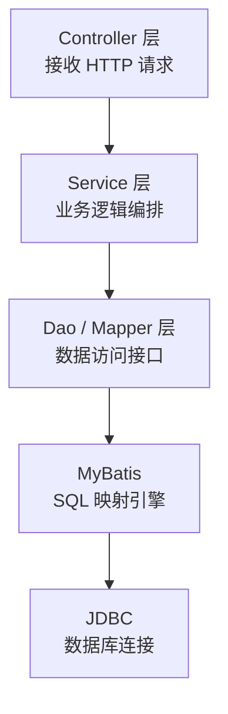

<!--
module:
  parent: 04.spring-backend/04-data/mybatis/01-architecture
  slug: 04.spring-backend/04-data/mybatis/01-architecture/01-framework-essence
  type: topic
  category: MyBatis 内部原理
  summary: MyBatis 01-architecture 章节深度 —— Framework Essence
  depth: ⭐⭐⭐
-->

# 01 框架本质与三层架构

> 来源:整合自原 08.mybatis/README.md § 一

> 🎯 **一句话定位**：MyBatis = 半自动 ORM + 动态代理 Mapper + XML/注解 SQL 映射，让开发者直接掌控 SQL 而非被框架包办。

## 框架本质
MyBatis 是基于 **ORM（对象关系映射）** 思想的**半自动**持久层框架，其核心价值在于：

- **SQL 定制化**：允许开发者直接编写原生 SQL，支持存储过程、动态 SQL 生成
- **JDBC 封装**：自动管理 Connection/Statement/ResultSet 生命周期，消除样板代码
- **映射引擎**：通过 XML/注解实现 Java 对象与数据库表的双向映射

### 与 Hibernate / JPA 对比

| 维度 | MyBatis | Hibernate / JPA |
|------|---------|-----------------|
| 自动化程度 | 半自动（SQL 手写） | 全自动（HQL/JPQL 生成） |
| SQL 控制力 | 极强（原生 SQL） | 较弱（依赖框架生成） |
| 复杂查询 | 灵活 | 受限，需 NativeQuery |
| 缓存 | 一级 + 二级缓存 | 一级 + 二级缓存 |
| 适用场景 | 复杂 SQL、存量库改造 | CRUD 为主的新项目 |
| 学习曲线 | 低（SQL 基础即可） | 高（HQL/缓存策略） |

<details><summary>❌/✅ SQL 写法对比：同一查询的两种实现</summary>

```java
// ❌ Hibernate/HQL —— 框架生成 SQL，复杂查询表达力受限
@Query("SELECT o FROM Order o JOIN o.user u WHERE u.status = :status AND o.amount > :min")
List<Order> findByUserStatusAndMinAmount(@Param("status") String status, @Param("min") BigDecimal min);

// ✅ MyBatis XML —— 直接写原生 SQL，动态条件组合清晰可控
<select id="findOrders" resultType="Order">
    SELECT o.* FROM t_order o
    JOIN t_user u ON o.user_id = u.id
    WHERE u.status = #{status}
      AND o.amount > #{minAmount}
    <if test="startDate != null">
      AND o.create_time >= #{startDate}
    </if>
</select>
```

</details>

## 三层架构


- **Controller**：接收 HTTP 请求，参数校验，调用 Service 层，返回响应
- **Service**：实现业务逻辑，事务管理（`@Transactional`），协调多个 Dao 操作
- **Dao / Mapper**：定义数据访问接口，由 MyBatis 通过动态代理生成实现类

<details><summary>🔧 mybatis-config.xml 核心 settings 速查</summary>

| setting | 默认值 | 作用 | 调优建议 |
|---------|--------|------|---------|
| `cacheEnabled` | true | 开启二级缓存 | 多实例部署时关闭，改用 Redis |
| `lazyLoadingEnabled` | false | 延迟加载关联对象 | N+1 场景开启，配合 `aggressiveLazyLoading=false` |
| `mapUnderscoreToCamelCase` | false | 下划线 → 驼峰自动映射 | 推荐开启，减少 resultMap 配置 |
| `defaultExecutorType` | SIMPLE | 执行器类型 | 批量导入改 `BATCH` |
| `defaultStatementTimeout` | null(秒) | SQL 超时 | 生产建议 30s 兜底 |

```xml
<settings>
    <setting name="mapUnderscoreToCamelCase" value="true"/>
    <setting name="lazyLoadingEnabled" value="true"/>
    <setting name="defaultStatementTimeout" value="30"/>
</settings>
```

</details>

## 核心设计模式
| 模式 | 在 MyBatis 中的应用 |
|------|-------------------|
| **工厂模式** | `SqlSessionFactory` 创建 `SqlSession` |
| **建造者模式** | `SqlSessionFactoryBuilder` 构建工厂 |
| **代理模式** | `MapperProxy` 为 Mapper 接口生成动态代理 |
| **模板方法** | `Executor` 定义执行骨架，具体操作由子类实现 |
| **装饰器模式** | `Cache` 接口的多层装饰（L1 → L2 → 序列化） |

<details><summary>🔍 代理模式源码速览：MapperProxy.invoke()</summary>

```java
// org.apache.ibatis.binding.MapperProxy
@Override
public Object invoke(Object proxy, Method method, Object[] args) throws Throwable {
    // Object 方法直接执行（toString / hashCode / equals）
    if (Object.class.equals(method.getDeclaringClass())) {
        return method.invoke(this, args);
    }
    // 其余方法走 MapperMethod —— 从 XML/注解解析 SQL + 参数映射 + 执行
    return cachedInvoker(method).invoke(sqlSession, args);
}
```

> 关键点：`MapperProxyFactory` 在 `SqlSession.getMapper()` 时生成 JDK 动态代理，运行时把接口方法翻译为 SQL 调用。

</details>

---

## 相关章节

- 深入：[`02 初始化流程`](02-initialization-flow.md) — SqlSessionFactory 创建全过程
- 扩展：[`03 数据库厂商扩展`](../02-extension/03-database-vendor.md) — 多数据库适配
- 对比：[`04.spring-backend/04-data`](../../../README.md) — Spring 数据层全景

- [08-class-diagram](08-class-diagram.md)

---

← [返回: MyBatis 架构与原理](README.md)