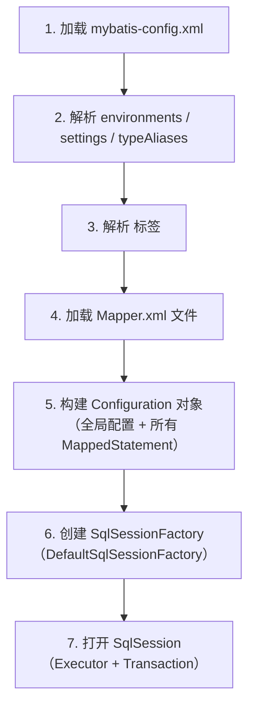

<!--
module:
  parent: 04.spring-backend
  slug: 04.spring-backend/04-data/mybatis/01-architecture/02-initialization-flow
  type: topic
  category: MyBatis 内部原理
  summary: MyBatis 初始化 7 步流程——从 XML 解析到 SqlSession 创建的全链路剖析
  depth: ⭐⭐⭐
-->

# 02 初始化流程

> 🎯 **一句话定位**：MyBatis 启动 7 步——从加载 XML 到打开 SqlSession，构建 Configuration 全局单例。

> 来源:整合自原 08.mybatis/README.md § 二.2.1

## 初始化流程图


## 各步骤详解
### 2.1 配置解析
- 通过 DOM4J / SAX 解析 XML 文件，构建全局配置对象 `Configuration`
- 解析内容：`<environments>`（数据源）、`<settings>`（全局开关）、`<typeAliases>`（别名）
- `<plugins>` 注册的插件按顺序加入拦截器链

**mybatis-config.xml 核心 settings 参数：**

| 参数 | 默认值 | 说明 |
|------|--------|------|
| `mapUnderscoreToCamelCase` | false | 开启后 `user_name` 自动映射到 `userName`，强烈建议开启 |
| `defaultExecutorType` | SIMPLE | 执行器类型：SIMPLE / REUSE / BATCH |
| `defaultStatementTimeout` | null | SQL 超时秒数，建议设置防止慢查询拖垮系统 |
| `cacheEnabled` | true | 全局二级缓存开关 |
| `lazyLoadingEnabled` | false | 延迟加载开关，N+1 查询时建议关闭 |
| `logImpl` | null | 日志实现：SLF4J / LOG4J2 / STDOUT_LOGGING |

### 2.2 映射注册
- 将每个 SQL 语句封装为 `MappedStatement` 对象，存储在 `Configuration` 中
- `MappedStatement` 包含：SQL 文本、参数类型、返回类型、缓存配置、结果映射
- 每个 `<select|insert|update|delete>` 标签 → 一个 `MappedStatement`
- Key = `namespace + "." + id`（如 `com.example.UserMapper.selectById`）

**MappedStatement 核心字段：**

| 字段 | 类型 | 说明 |
|------|------|------|
| `id` | String | namespace + id，全局唯一标识 |
| `sqlCommandType` | Enum | SELECT / INSERT / UPDATE / DELETE |
| `parameterMap` | ParameterMap | 入参映射（含 TypeHandler 列表） |
| `resultMaps` | List\<ResultMap\> | 结果集映射（含嵌套关联） |
| `sqlSource` | SqlSource | 解析后的 SQL（含动态标签） |
| `cache` | Cache | 二级缓存引用（若启用） |
| `flushCacheRequired` | boolean | 执行后是否清空缓存 |

**❌ 常见错误配置 vs ✅ 正确配置：**

```xml
<!-- ❌ 错误：namespace 与 Mapper 接口不匹配 -->
<mapper namespace="com.example.UserDao">
  <select id="selectById">...</select>
</mapper>
```

```xml
<!-- ✅ 正确：namespace 必须与 Mapper 接口全限定名一致 -->
<mapper namespace="com.example.UserMapper">
  <select id="selectById">...</select>
</mapper>
```

### 2.3 工厂创建
- 使用**建造者模式**生成 `SqlSessionFactory` 实例
- `SqlSessionFactoryBuilder.build(configuration)` → `DefaultSqlSessionFactory`
- 工厂是线程安全的，**全局单例**；`SqlSession` 是线程不安全的，**每次请求创建**

## 与 Spring 整合后的变化
| 原生 MyBatis | Spring 整合后 |
|-------------|--------------|
| `SqlSessionFactoryBuilder` | `SqlSessionFactoryBean`（FactoryBean） |
| 手动解析 XML | Spring 自动注入 `DataSource` |
| 手动创建 `SqlSession` | `SqlSessionTemplate` 自动管理 |
| 手动注册 Mapper | `@MapperScan` 自动扫描 |

---

## 相关章节

- 前置：[`01 框架本质`](01-framework-essence.md)
- 深入：[`03 执行流程`](03-execution-flow.md) — SQL 执行全链路

- [08-class-diagram](08-class-diagram.md)
- [03-database-vendor](../02-extension/03-database-vendor.md)

---

← [返回: MyBatis 架构与原理](README.md)
