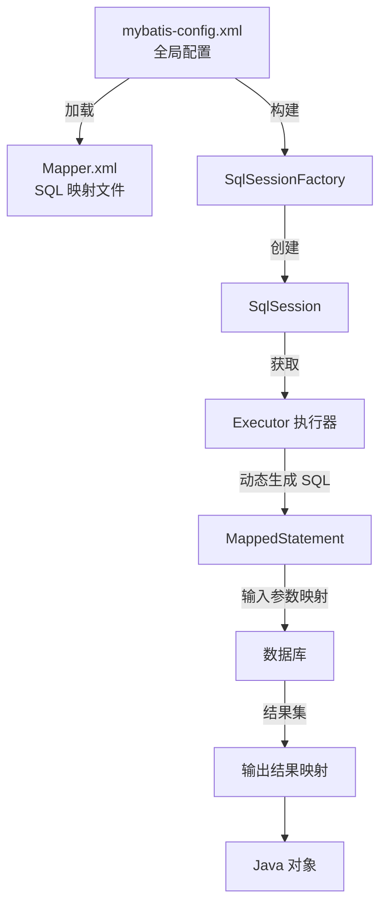

<!--
module:
  parent: spring/mybatis/01-architecture
  slug: spring/mybatis/01-architecture/03-execution-flow
  type: article
  category: MyBatis 内部原理
  summary: 以查询为例串起 MyBatis 从配置加载到结果映射的八步执行链路
-->

# 03 执行流程

> 来源:整合自原 08.mybatis/README.md § 二.2.2
>
> 🎯 一句话定位：以查询为例串起 MyBatis 从配置加载到结果映射的八步执行链路。

## 执行流程（以查询为例）



### 八步链路逐步拆解

1. **读取全局配置**：`mybatis-config.xml` 是 MyBatis 的全局配置文件，配置运行环境（数据源、事务管理器、默认 Executor 类型等）。对应源码入口 `XMLConfigBuilder.parse()`，解析结果统一挂在 `Configuration` 对象上。

   ```java
   // SqlSessionFactoryBuilder.build() 内部
   XMLConfigBuilder parser = new XMLConfigBuilder(inputStream, environment, properties);
   return build(parser.parse());   // parse() 解析 mybatis-config.xml → Configuration
   ```

2. **加载映射文件**：每个 `Mapper.xml` 对应一张表的 SQL 映射，由 `XMLMapperBuilder` 解析，`<select>`/`<insert>` 等节点被封装为 `MappedStatement` 注册进 `Configuration.mappedStatements`（key = 命名空间 + id）。

3. **构造会话工厂**：`DefaultSqlSessionFactory` 只是 `Configuration` 的薄包装，**每个应用只建一个**（重量级对象，内部含全部元数据）。

   ```java
   SqlSessionFactory factory = new SqlSessionFactoryBuilder().build(inputStream);
   ```

4. **创建会话对象**：`SqlSession` 是面向应用层的 API（`selectList` / `insert` / `commit`），**非线程安全，用完必须关闭**。`openSession()` 时同步创建 `Executor`。

   ```java
   try (SqlSession session = factory.openSession()) {
       User user = session.selectOne("com.example.UserMapper.selectById", 1L);
   }
   ```

5. **Executor 执行器**：`SimpleExecutor` / `ReuseExecutor` / `BatchExecutor` 三选一（还可叠加 `CachingExecutor` 装饰器做二级缓存）。核心入口是 `query()`，先查缓存再委托 `doQuery()`。

   ```java
   // SimpleExecutor.doQuery()（MyBatis 3.5 源码，有删减）
   Configuration configuration = ms.getConfiguration();
   StatementHandler handler = configuration.newStatementHandler(
       wrapper, ms, parameter, rowBounds, resultHandler, boundSql);
   Statement stmt = prepareStatement(handler, ms.getStatementLog());
   return handler.query(stmt, resultHandler);
   ```

6. **MappedStatement 与 StatementHandler**：`MappedStatement` 封装一条 SQL 的全部映射信息（id、SqlSource、参数映射、结果映射）。`RoutingStatementHandler` 按 `statementType` 路由到三种实现：

   | statementType | 实现类 | 底层 JDBC | 适用场景 |
   |---------------|--------|-----------|---------|
   | `STATEMENT`（默认外） | `SimpleStatementHandler` | `Statement` | 无参拼接，有注入风险 |
   | `PREPARED`（默认） | `PreparedStatementHandler` | `PreparedStatement` | 预编译 + 参数占位，防注入 |
   | `CALLABLE` | `CallableStatementHandler` | `CallableStatement` | 存储过程（含 OUT 参数） |

7. **输入参数映射**：`PreparedStatementHandler.parameterize()` 委托 `ParameterHandler.setParameters()`，本质等价于 JDBC 的 `ps.setXxx()`——按 `ParameterMapping` 列表逐个取值并交给 `TypeHandler`：

   ```java
   // DefaultParameterHandler.setParameters() 核心循环（有删减）
   for (ParameterMapping pm : boundSql.getParameterMappings()) {
       Object value = /* 依次从 additionalParameter / 基本类型 / MetaObject 反射取 */;
       TypeHandler th = pm.getTypeHandler();
       th.setParameter(ps, i + 1, value, pm.getJdbcType());
   }
   ```

8. **输出结果映射**：`ResultSetHandler.handleResultSets()` 逐行读取 `ResultSet`，按 `ResultMap` 的 `id` / `result` / `association` / `collection` 配置映射为 Map、List、基本类型或 POJO——等价于手写 JDBC 解析结果集的自动化版本。

### ❌ N+1 反例与 ✅ 关联查询正例

第 8 步的结果映射支持"嵌套查询"（`association select=`），这正是 N+1 的高发点：

```xml
<!-- ❌ 反例：嵌套 select —— 查 100 个订单触发 100 次额外用户查询 -->
<resultMap id="orderMap" type="Order">
  <id property="id" column="id"/>
  <association property="user" column="user_id"
               select="com.example.UserMapper.selectById"/>  <!-- 每行触发一次 -->
</resultMap>
```

```xml
<!-- ✅ 正例：JOIN 一次取出，嵌套 result 映射，无额外查询 -->
<resultMap id="orderMap" type="Order">
  <id property="id" column="id"/>
  <association property="user" javaType="User">
    <id property="id" column="user_id"/>
    <result property="name" column="user_name"/>
  </association>
</resultMap>
<select id="selectWithUser" resultMap="orderMap">
  SELECT o.id, o.user_id, u.name AS user_name
  FROM t_order o JOIN t_user u ON o.user_id = u.id
</select>
```

> 例外：嵌套 `select` 配 `lazyLoadingEnabled=true` + `fetchSize` 分批拉取，在"大概率不访问关联对象"的场景反而更优——选型看访问比例，不是一刀切。

### Executor 选型与调优参数

| Executor | 行为 | 适用场景 | 调优参数 |
|----------|------|---------|---------|
| `SIMPLE` | 每次执行新建 Statement | 常规查询（默认） | `defaultStatementTimeout` 防慢查询拖死连接 |
| `REUSE` | 复用预编译的 Statement | 同一会话内重复执行同 SQL | 复用限单会话内，跨会话无效 |
| `BATCH` | 攒批后 `executeBatch()` | 大批量写（迁移/刷数） | `flushStatements()` 控制刷新点；单次建议 ≤1000 条 |
| `CACHING`（装饰器） | 二级缓存读写 | 读多写少 + 可容忍脏读 | `cacheEnabled` 全局开关；写操作即失效 |

### 版本演进

- **3.4.0（2016）**：新增 `Cursor<T>` 返回类型——流式逐条消费大结果集，避免一次性把百万行载入内存（`@Options(fetchSize = Integer.MIN_VALUE)` 配合 MySQL 流式读取）。
- **3.5.0（2019）**：最低要求 Java 8；`ResultSetHandler` 处理逻辑重构简化，结果映射性能与可维护性提升。
- **3.5.6+**：`ResultHandler` 中止语义完善——返回 `false` 即停止读取后续行，分页截断更可控。

---

## 系列导航

- 上一篇：[`02 初始化流程`](02-initialization-flow.md) — SqlSessionFactory 创建全过程
- 下一篇：[`04 核心组件`](04-core-components.md) — Executor / StatementHandler / ParameterHandler / ResultHandler
- 类图参考：[`08 类图`](08-class-diagram.md) — MyBatis 核心组件关系图

← [返回: 01-architecture](README.md)
