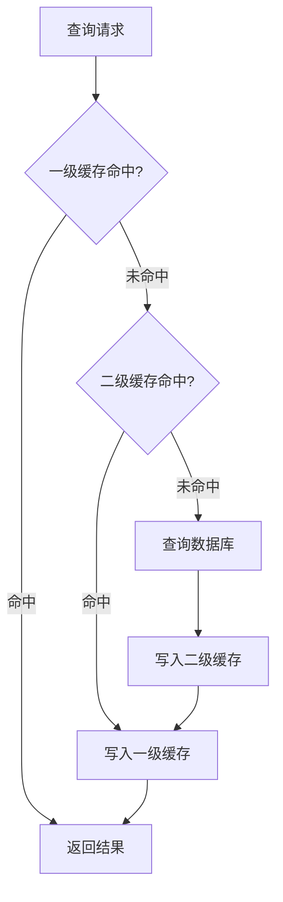

<!--
module:
  parent: spring/mybatis/01-architecture
  slug: spring/mybatis/01-architecture/07-cache-mechanism
  type: topic
  category: MyBatis 内部原理
  summary: 一级 SqlSession 缓存 / 二级 Mapper 缓存机制与缓存穿透解决方案
  depth: ⭐⭐⭐
-->

# 07 缓存机制

> **一句话定位**：MyBatis 两级缓存体系（SqlSession 一级 + Mapper 二级）的生效条件、失效时机与穿透/击穿/雪崩应对。

> 来源:整合自原 08.mybatis/README.md § 四.4.3 + § 六.6.2

## 一级/二级缓存
> 来源:原 § 四.4.3

### 4.3 缓存机制

- **一级缓存**：默认开启，基于 `SqlSession` 生命周期
- **二级缓存**：需手动配置，基于 `Mapper` 命名空间
- **缓存失效**：执行增删改操作后自动清空

## 缓存穿透解决方案
> 来源:原 § 六.6.2

### 6.2 缓存穿透问题
**解决方案**：
1. **布隆过滤器**：预过滤不存在的 ID 请求
2. **空值缓存**：将查询结果为 null 的记录缓存为特定标记
```xml
<cache eviction="LRU" flushInterval="60000" size="1024" readOnly="true">
    <!-- 自定义缓存实现 -->
</cache>
```

| 参数 | 含义 | 调优建议 |
|------|------|---------|
| eviction | 淘汰策略（LRU / FIFO） | 默认 LRU，热点数据场景更优 |
| flushInterval | 自动刷新间隔（毫秒） | 0 表示不自动刷新，需手动 `clearCache()` |
| size | 最大缓存对象数 | 超过后按 eviction 淘汰，建议按业务 QPS 设置 |
| readOnly | true=只读共享引用（快但不安全）；false=序列化副本（安全但慢） | 单线程查询可设 true，多线程必须 false |
---

## 系列导航

- 上一篇：[`06 结果映射`](06-result-mapping.md) — resultMap / collection / association
- 下一篇：[`08 类图`](08-class-diagram.md) — 架构全景类图

**相关章节**：
- [`04-core-components`](04-core-components.md) — Executor 与缓存的调用关系
- [`08-class-diagram`](08-class-diagram.md) — CachingExecutor 在类图中的位置

← [返回: 01-architecture](README.md)
