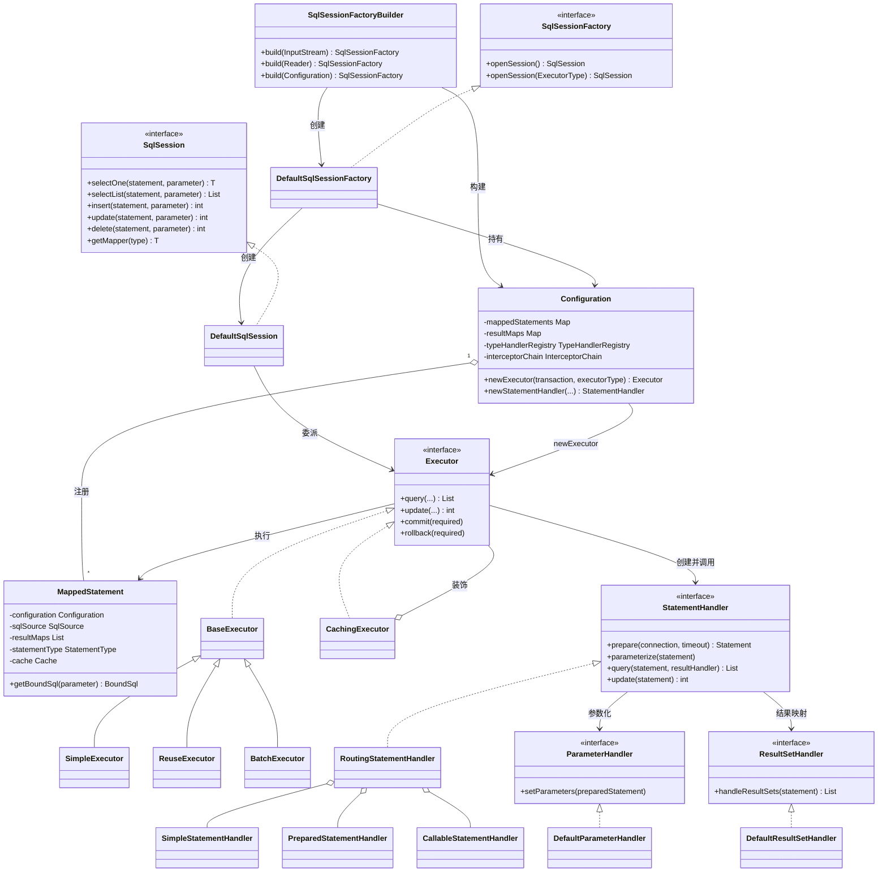
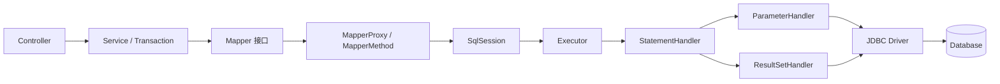
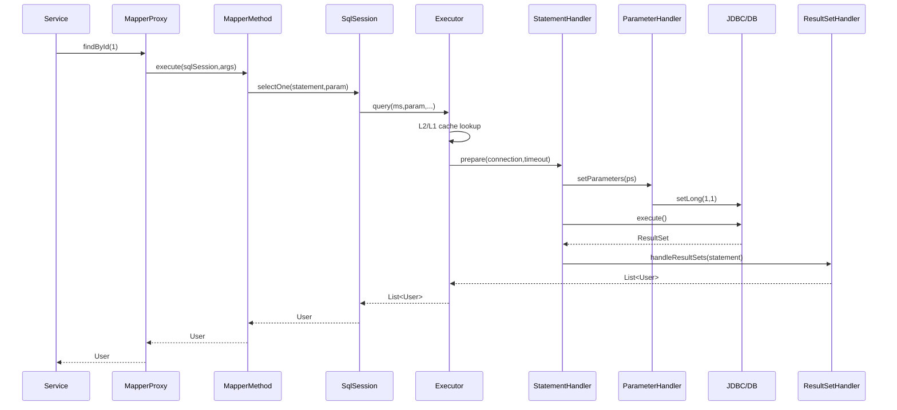

<!--
module:
  parent: spring/mybatis/01-architecture
  slug: spring/mybatis/01-architecture/08-class-diagram
  type: topic
  category: MyBatis 内部原理
  summary: 从九大核心类、四大处理器到一次 SQL 执行全链路，建立 MyBatis 源码阅读地图
-->

# MyBatis 核心类图与职责链路

> 一句话定位：用九大核心类串起 MyBatis 从配置解析、Mapper 代理到 JDBC 执行与结果映射的完整职责链。

## 📌 类图全景



这张图应按“**构建期**”和“**运行期**”两条线阅读：

- 构建期：`SqlSessionFactoryBuilder → Configuration → MappedStatement`。
- 运行期：`SqlSession → Executor → StatementHandler → JDBC`。
- 入参支线：`StatementHandler → ParameterHandler → TypeHandler`。
- 出参支线：`StatementHandler → ResultSetHandler → TypeHandler`。
- 横切支线：`Configuration` 在创建四大对象时调用 `InterceptorChain.pluginAll()`。
- 缓存支线：`CachingExecutor` 装饰基础 `Executor`，二级缓存位于执行器外层。

## 📖 MyBatis 架构定位

MyBatis 位于应用的 DAO/Mapper 与 JDBC 之间。它不是数据库连接池，也不是事务协调器；它以“SQL 由开发者掌控、框架负责执行与映射”为边界，消除 JDBC 样板代码。



| 维度 | MyBatis | Spring Data JPA | Hibernate |
|---|---|---|---|
| 定位 | SQL Mapper、半自动映射 | Repository 抽象规范与生态整合 | JPA 实现与完整 ORM 引擎 |
| SQL 来源 | XML、注解、Provider，开发者主导 | 方法名、JPQL、Specification、原生 SQL | HQL/JPQL、Criteria、自动生成 |
| 对象模型 | 不要求实体生命周期 | 围绕 Entity、Repository | 持久化上下文与实体状态机 |
| 脏检查 | 无 | 通常由 JPA Provider 提供 | 有，flush 时同步变更 |
| 关联加载 | `resultMap`、嵌套查询/结果 | 注解映射与 Fetch 策略 | Lazy/Eager、抓取计划 |
| 适合场景 | 复杂 SQL、报表、存量数据库 | 领域 CRUD、快速开发 | 富领域模型、跨库 ORM |
| 主要风险 | SQL 分散、N+1、映射错误 | 隐式查询、派生方法失控 | N+1、会话边界、生成 SQL 不透明 |

选型不是“谁更高级”：需要精确控制 SQL、充分利用数据库能力时优先 MyBatis；需要实体状态管理与对象关系导航时考虑 JPA/Hibernate。Spring Boot 只负责自动装配，最终仍落到 MyBatis 或 JDBC 的执行模型。

相关基础可先读[框架本质与三层架构](01-framework-essence.md)、[初始化流程](02-initialization-flow.md)、[核心组件](04-core-components.md)与[动态 SQL](05-dynamic-sql.md)。跨技术边界参见[Spring 数据访问总览](../../README.md)、[JPA 事务](../../transaction/jpa-transaction.md)和[JDBC 基础](../../../../01.java-and-jvm/jdbc/README.md)。

## 🔧 9 大核心类职责详解

### 6.1 Configuration（配置中心）

**定位**：MyBatis 运行时的总注册表与对象工厂，不只是 XML 配置的 DTO。

- `XMLConfigBuilder.parse()` 最终返回唯一的 `Configuration`。
- `mappedStatements` 以 `namespace.id` 为键保存映射语句。
- `resultMaps` 保存显式和内联结果映射。
- `parameterMaps` 保留参数映射元数据，现代项目更多依赖内联参数。
- `sqlFragments` 保存 `<sql>` 片段，供 `<include>` 展开。
- `loadedResources` 防止同一 Mapper 资源重复加载。
- `mapperRegistry` 管理 Mapper 接口与 `MapperProxyFactory`。
- `typeAliasRegistry` 将短别名解析为 Java 类型。
- `typeHandlerRegistry` 按 JavaType/JdbcType 查找转换器。
- `languageRegistry` 管理 XML、Raw 等脚本语言驱动。
- `interceptorChain` 保存插件，注册顺序会影响代理嵌套顺序。
- `environment` 聚合 `DataSource` 与 `TransactionFactory`。
- `objectFactory` 决定结果对象如何实例化。
- `objectWrapperFactory` 扩展对象属性读写。
- `reflectorFactory` 缓存反射元数据，降低映射开销。
- `newExecutor()` 选择 SIMPLE、REUSE 或 BATCH。
- 开启二级缓存时，`newExecutor()` 再套一层 `CachingExecutor`。
- `newStatementHandler()` 创建路由处理器后应用插件链。
- `newParameterHandler()` 创建参数处理器后应用插件链。
- `newResultSetHandler()` 创建结果处理器后应用插件链。
- 因而插件只能拦截 MyBatis 明确暴露的四类扩展点。
- `Configuration` 构建完成后应视为只读共享对象。
- 运行期动态修改映射会引入可见性与并发一致性问题。
- Spring 场景通常由 `SqlSessionFactoryBean` 完成构建。
- 排障时先查它是否注册了目标 `MappedStatement` 和 `TypeHandler`。
- 设计原因：集中元数据可避免每次 SQL 重新解析 XML。

```java
// Configuration 是创建执行链的入口；插件代理在“创建对象”时织入。
public Executor newExecutor(Transaction tx, ExecutorType type) {
    Executor executor = switch (type) {
        case BATCH -> new BatchExecutor(this, tx);
        case REUSE -> new ReuseExecutor(this, tx);
        default -> new SimpleExecutor(this, tx);
    };
    if (cacheEnabled) {
        executor = new CachingExecutor(executor); // 二级缓存装饰基础执行器
    }
    return (Executor) interceptorChain.pluginAll(executor);
}
```

### 6.2 SqlSessionFactoryBuilder（构建器）

**定位**：把配置输入转换成 `SqlSessionFactory` 的一次性建造者。

- 支持 `Reader`、`InputStream`、`Configuration` 等重载。
- 可接收 environment 名称以选择目标环境。
- 可接收 properties 覆盖 XML 中的占位符。
- 输入流重载内部创建 `XMLConfigBuilder`。
- `XMLConfigBuilder.parse()` 完成配置与 Mapper 解析。
- 随后调用 `build(Configuration)`。
- 默认产物是 `DefaultSqlSessionFactory`。
- Builder 本身不保存业务运行状态。
- 构建成功后即可释放 Builder。
- 它不负责创建每次请求的 `SqlSession`。
- 它也不负责管理数据库连接。
- `ErrorContext` 在 finally 中重置，避免错误上下文污染后续操作。
- 输入流在 finally 中关闭，调用方不应依赖其继续可读。
- 配置解析失败会包装成 `PersistenceException`。
- XML 中 Mapper 顺序可能影响未完全限定引用的解析时机。
- `build(Configuration)` 是编程式配置的最终入口。
- 单元测试可直接构造 Configuration，绕开 XML。
- 生产环境通常只在应用启动阶段调用一次。
- 不应把 Builder 注册为高频调用的 Service。
- 不应为每次 SQL 重新 build 工厂。
- 反复 build 会重复解析 Mapper 并创建元数据图。
- 多数据源场景可为每个数据源建立独立工厂。
- 每个工厂拥有独立 Configuration、缓存和插件链。
- Spring 中相应角色由 `SqlSessionFactoryBean` 扩展。
- 设计原因：构建和运行分离，使重型解析只发生一次。

### 6.3 SqlSessionFactory（工厂）

**定位**：线程安全的会话工厂，根据环境、事务和执行器类型创建 `SqlSession`。

- 核心接口方法族是 `openSession()`。
- 默认实现为 `DefaultSqlSessionFactory`。
- 默认执行器类型来自 `Configuration.defaultExecutorType`。
- 可显式选择 `ExecutorType.SIMPLE/REUSE/BATCH`。
- 可指定自动提交标志。
- 可传入既有 `Connection`。
- 可指定事务隔离级别。
- 打开会话时先取得 `Environment`。
- 再由 `TransactionFactory` 创建 `Transaction`。
- 然后调用 `Configuration.newExecutor()`。
- 最后创建 `DefaultSqlSession`。
- 工厂本身通常保持全局单例。
- 工厂不持有某一次调用的 Connection。
- 因此多线程共享工厂是安全的。
- 它持有的 Configuration 也应在启动后稳定。
- `openSessionFromDataSource` 由数据源获取连接。
- `openSessionFromConnection` 复用调用方连接。
- 事务工厂决定连接提交、回滚和关闭语义。
- `autoCommit=true` 会改变更新后的提交行为。
- 但 BatchExecutor 仍需 flush 才真正发送批次。
- Spring 集成中通常不直接调用 `openSession()`。
- `SqlSessionTemplate` 通过事务同步器取得会话。
- 手动会话与 Spring 托管会话混用可能破坏事务边界。
- 排障时应核对工厂关联的数据源和 environment。
- 设计原因：统一封装会话创建策略，隔离调用者与执行器构造细节。

### 6.4 SqlSession（门面 / 会话）

**定位**：面向应用的数据库会话门面，把 statement id 和参数委派给 Executor。

- 接口提供 `selectOne`、`selectList`、`selectMap`、`selectCursor`。
- 写操作提供 `insert`、`update`、`delete`。
- 事务操作提供 `commit`、`rollback`、`close`。
- `flushStatements()` 显式刷新批处理语句。
- `clearCache()` 清除当前会话一级缓存。
- `getMapper()` 获取 Mapper 动态代理。
- 默认实现是 `DefaultSqlSession`。
- 它持有 Configuration 与 Executor。
- `selectOne()` 本质是 `selectList()` 后校验结果数量。
- 超过一条结果会抛 `TooManyResultsException`。
- statement id 用于从 Configuration 查 MappedStatement。
- 调用最终委派给 `executor.query()` 或 `executor.update()`。
- `SqlSession` 不是线程安全对象。
- 一级缓存也绑定到 SqlSession/Executor 生命周期。
- 应采用 try-with-resources 及时关闭。
- 原生 MyBatis 中写操作后需明确 commit。
- 异常路径应 rollback，随后 close。
- Mapper 代理并没有绕过 SqlSession。
- 它只是把 Java 方法翻译成 statement id 与命令类型。
- Spring 的 `SqlSessionTemplate` 是线程安全代理。
- Template 将真实会话绑定到当前 Spring 事务。
- 不要把 `DefaultSqlSession` 放入单例字段共享。
- 游标查询要求会话在消费期间保持打开。
- 设计原因：门面隐藏 Executor、缓存、Statement 等内部细节。

```java
// ✅ 会话边界清楚；异常时资源仍能关闭。
try (SqlSession session = factory.openSession(false)) {
    UserMapper mapper = session.getMapper(UserMapper.class);
    mapper.updateName(1L, "Amin");
    session.commit();
}
// ❌ 把 openSession() 的结果保存为单例，会并发共享 Connection 与一级缓存。
```

### 6.5 Executor（执行器）

**定位**：SQL 执行调度核心，负责一级缓存、事务协作和 StatementHandler 调用。

- 接口定义 query、update、flushStatements。
- 还定义 commit、rollback、close 与事务访问。
- `BaseExecutor` 实现公共执行骨架。
- `localCache` 是一级缓存，默认作用域 SESSION。
- `localOutputParameterCache` 支持存储过程输出参数。
- `queryStack` 防止嵌套查询中错误清理缓存。
- `deferredLoads` 支持延迟装载结果属性。
- `createCacheKey()` 组合 statement、分页、SQL 和参数。
- `update()` 执行前会清空一级缓存。
- `query()` 先看本地缓存，再调用 `queryFromDatabase()`。
- `doQuery()` 和 `doUpdate()` 留给子类实现。
- `SimpleExecutor` 每次创建新 Statement，用完关闭。
- `ReuseExecutor` 按 SQL 复用 Statement，关闭会话时统一释放。
- `BatchExecutor` 聚合同 SQL/同 MappedStatement 的写操作。
- `BatchExecutor` 查询前会 flush 已积累批次，保证读到最新结果。
- `CachingExecutor` 是委托装饰器而非 BaseExecutor 子类。
- 它管理 Mapper namespace 级二级缓存。
- 二级缓存写入通过 `TransactionalCacheManager` 延迟到 commit。
- rollback 不会把未提交结果写入二级缓存。
- `ExecutorType` 应按会话选择，而非按单条 SQL 临时切换。
- SIMPLE 适合普通在线请求。
- REUSE 适合同会话重复 SQL，但收益依驱动与连接池而定。
- BATCH 适合大量 DML，必须关注 flush 与失败定位。
- 插件可拦截 Executor，但不能替代正确事务设计。
- 设计原因：模板方法统一缓存与事务，子类只处理 Statement 策略。

| 实现 | Statement 生命周期 | 典型场景 | 关键风险 |
|---|---|---|---|
| SimpleExecutor | 每次新建并关闭 | 普通 CRUD | 高频重复 SQL 有创建开销 |
| ReuseExecutor | 会话内按 SQL 复用 | 同连接重复语句 | 长会话占用 Statement |
| BatchExecutor | 成批 addBatch/executeBatch | 批量写入 | 必须 flush，错误下标难定位 |
| CachingExecutor | 装饰其他 Executor | 二级缓存 | 跨事务陈旧数据与失效策略 |

### 6.6 StatementHandler（语句处理器）

**定位**：把 MappedStatement 与 BoundSql 落地为 JDBC Statement，并协调参数与结果处理。

- 接口定义 `prepare(Connection, timeout)`。
- `parameterize(Statement)` 负责设置参数。
- `batch(Statement)` 负责加入 JDBC 批次。
- `update(Statement)` 执行写操作。
- `query(Statement, ResultHandler)` 执行查询。
- `queryCursor()` 返回游标。
- `getBoundSql()` 暴露最终 SQL 与参数映射。
- `getParameterHandler()` 暴露参数处理器。
- 外层默认是 `RoutingStatementHandler`。
- Routing 根据 `StatementType` 选择真正 delegate。
- `STATEMENT` 对应 `SimpleStatementHandler`。
- `PREPARED` 对应 `PreparedStatementHandler`，也是默认值。
- `CALLABLE` 对应 `CallableStatementHandler`。
- 三个实现都继承 `BaseStatementHandler`。
- Base 构造时创建 ParameterHandler 与 ResultSetHandler。
- `prepare()` 负责实例化 Statement。
- 随后统一设置 queryTimeout。
- 还会按需设置 fetchSize。
- PreparedStatementHandler 使用带占位符的 SQL 预编译。
- SimpleStatementHandler 直接执行完整 SQL，参数化能力有限。
- CallableStatementHandler 处理 IN/OUT 参数与存储过程。
- Executor 决定 Statement 是否复用或批量。
- StatementHandler 决定 Statement 如何准备和执行。
- 分页插件常拦截 `prepare` 修改 BoundSql。
- 设计原因：隔离 JDBC Statement 三种模型，避免 Executor 出现类型分支爆炸。

### 6.7 ParameterHandler（参数处理器）

**定位**：根据 ParameterMapping 与 TypeHandler，把 Java 入参安全写入 PreparedStatement。

- 接口只有 `getParameterObject()` 与 `setParameters()`。
- 默认实现为 `DefaultParameterHandler`。
- 它持有 MappedStatement、parameterObject 与 BoundSql。
- BoundSql 保存最终 SQL、参数映射和附加参数。
- `setParameters()` 按 `ParameterMapping` 顺序遍历。
- OUT 参数不会作为普通输入参数设置。
- 动态 SQL 的 foreach 变量通常来自 additionalParameters。
- 简单类型可直接把整个参数对象作为值。
- 复杂对象通过 MetaObject 按 property 取值。
- 参数值为 null 时需要确定 JdbcType。
- 未显式声明时使用 `jdbcTypeForNull`。
- 每个 ParameterMapping 已绑定一个 TypeHandler。
- TypeHandler 调用 `PreparedStatement.setXxx()`。
- `#{}` 会生成 `?` 并走 ParameterHandler。
- `${}` 是文本替换，不经过参数绑定，存在注入风险。
- 自定义类型应注册明确 JavaType/JdbcType 组合。
- 枚举可选 EnumTypeHandler 或 EnumOrdinalTypeHandler。
- 时间类型依赖 JDBC 4.2 与驱动实现。
- JSON 字段可通过自定义 TypeHandler 序列化。
- 插件可拦截 `setParameters`，但修改值要保持映射顺序。
- 日志中的参数顺序应与 `?` 顺序一致。
- 参数名依赖 `@Param`、编译器 `-parameters` 与 ParamNameResolver。
- 多参数 Mapper 方法通常被封装成 ParamMap。
- 设计原因：SQL 生成与参数绑定分离，复用统一类型转换体系。
- 排障时同时检查 BoundSql、ParameterMapping 和 TypeHandlerRegistry。

```java
// ✅ 使用 #{}：生成 WHERE id = ?，由 TypeHandler 安全绑定。
@Select("select * from user where id = #{id}")
User findById(long id);

// ❌ 使用 ${orderBy}：直接拼接，必须先做字段白名单，不能接受任意输入。
@Select("select * from user order by ${orderBy}")
List<User> unsafeOrder(String orderBy);
```

### 6.8 ResultSetHandler（结果集处理器）

**定位**：把 JDBC ResultSet 按 ResultMap、构造器和 TypeHandler 组装成 Java 对象图。

- 接口核心方法是 `handleResultSets(Statement)`。
- 默认实现为 `DefaultResultSetHandler`。
- 它还处理游标与存储过程输出参数。
- 首先从 Statement 取得首个 ResultSet。
- 然后按 MappedStatement.resultMaps 逐个处理。
- `ResultSetWrapper` 缓存列名、JDBC 类型和 TypeHandler。
- 简单类型可直接通过单列 TypeHandler 返回。
- JavaBean 通常由 ObjectFactory 创建。
- 属性写入经 MetaObject 完成。
- 显式 ResultMap 优先决定 column-property 映射。
- 自动映射补充未显式声明的列。
- `mapUnderscoreToCamelCase` 影响自动映射名称匹配。
- constructor 映射支持不可变对象。
- discriminator 根据列值选择子 ResultMap。
- association 组装一对一对象。
- collection 组装一对多集合。
- 嵌套结果依靠联合行去重与对象缓存。
- 嵌套查询会触发额外 Executor.query，可能产生 N+1。
- lazyLoadingEnabled 决定是否创建延迟加载代理。
- resultOrdered 可在有序结果下优化嵌套映射内存。
- `returnInstanceForEmptyRow` 影响全 NULL 行是否返回对象。
- `callSettersOnNulls` 影响 null 值 setter 调用。
- TypeHandler 在读取单列时执行 `getNullableResult()`。
- ResultMap 决定“读哪一列给哪个属性”。
- TypeHandler 决定“该列如何转换为 Java 值”。
- 设计原因：把对象图组装从 JDBC 执行中剥离，支持复杂映射策略。

### 6.9 MappedStatement（映射语句）

**定位**：一条 Mapper 语句的不可变运行时元数据，连接配置解析与 SQL 执行。

- 每个 select/insert/update/delete 通常对应一个实例。
- 唯一 id 是 `namespace + "." + statementId`。
- `sqlCommandType` 标识 SELECT、INSERT、UPDATE、DELETE。
- `statementType` 决定 StatementHandler 分支。
- `sqlSource` 负责根据参数生成 BoundSql。
- 静态 SQL 常使用 StaticSqlSource。
- 动态标签通常构建 DynamicSqlSource。
- `${}` 或动态节点会让 SQL 在运行期求值。
- `parameterMap` 描述参数元数据。
- `resultMaps` 描述一个或多个结果映射。
- `resultSetType` 控制游标滚动特性。
- `fetchSize` 给驱动提供抓取提示。
- `timeout` 覆盖全局语句超时。
- `flushCacheRequired` 控制执行前是否清缓存。
- `useCache` 控制查询是否参与二级缓存。
- `cache` 指向 namespace 对应 Cache。
- `keyGenerator` 支持 JDBC generated keys 或 selectKey。
- `databaseId` 支持数据库厂商差异语句。
- `lang` 指定 LanguageDriver。
- `resultOrdered` 优化有序嵌套结果处理。
- `dirtySelect` 标记具有副作用的查询语句。
- Builder 在启动期验证并组装这些字段。
- 运行期通过 `getBoundSql(parameter)` 得到最终 SQL。
- 不要把 MappedStatement 误解为已编译的 PreparedStatement。
- 设计原因：把 XML/注解统一成稳定模型，让运行期不关心配置来源。

```xml
<select id="findByStatus"
        parameterType="string"
        resultMap="userMap"
        fetchSize="200"
        timeout="3"
        useCache="true">
  SELECT id, name, status FROM user WHERE status = #{status}
</select>
```

调优建议：`fetchSize` 是驱动提示而非跨数据库保证；`timeout` 单位为秒；大结果集还需结合驱动流式读取配置，不能仅靠增大 fetchSize。

## 🔗 一次 SQL 执行全链路

下面以 `userMapper.findById(1L)` 为例，追踪查询从代理入口到对象返回的关键调用：

1. `sqlSession.getMapper(UserMapper.class)` 进入 `Configuration.getMapper()`。
2. `MapperRegistry` 找到注册的 `MapperProxyFactory`。
3. 工厂创建实现 UserMapper 接口的 JDK 动态代理。
4. 调用 `findById` 时进入 `MapperProxy.invoke()`。
5. Object 默认方法与 Mapper 方法采用不同分支。
6. Mapper 方法被缓存为 `MapperMethodInvoker`，避免重复解析。
7. 普通方法最终调用 `MapperMethod.execute(sqlSession, args)`。
8. `SqlCommand` 依据 `UserMapper.findById` 查找 MappedStatement。
9. `MethodSignature` 把实参转换成单值或 ParamMap。
10. SELECT 分支依据返回类型选择 selectOne/selectList/selectMap/selectCursor。
11. 此例进入 `DefaultSqlSession.selectOne()`。
12. selectOne 委派 selectList 并在返回后检查 0/1/多条。
13. `DefaultSqlSession.selectList()` 从 Configuration 取得 MappedStatement。
14. 调用 `Executor.query(ms, parameter, rowBounds, resultHandler)`。
15. `CachingExecutor` 若存在，先检查二级缓存与事务缓存。
16. 未命中时委派 `BaseExecutor.query()`。
17. BaseExecutor 调用 `ms.getBoundSql(parameter)` 生成 BoundSql。
18. `createCacheKey()` 合成一级缓存键。
19. 一级缓存命中则直接返回列表。
20. 未命中则进入 `queryFromDatabase()` 并先放执行占位符。
21. 具体 Executor 的 `doQuery()` 获取 Connection。
22. Configuration 创建 `RoutingStatementHandler` 并套插件链。
23. Routing 根据 PREPARED 选择 `PreparedStatementHandler`。
24. BaseStatementHandler 构造 ParameterHandler 与 ResultSetHandler。
25. `StatementHandler.prepare(connection, timeout)` 创建 PreparedStatement。
26. prepare 同时应用事务超时、queryTimeout 与 fetchSize。
27. `StatementHandler.parameterize(statement)` 委派 ParameterHandler。
28. `DefaultParameterHandler.setParameters()` 依次取参数值。
29. 每个 TypeHandler 调用 PreparedStatement.setXxx。
30. `PreparedStatementHandler.query()` 调用 `ps.execute()`。
31. JDBC Driver 将 SQL 与绑定值发送至数据库。
32. 数据库执行并返回 ResultSet。
33. `DefaultResultSetHandler.handleResultSets(statement)` 开始映射。
34. 它按 ResultMap 创建对象并读取各列。
35. TypeHandler 调用 ResultSet.getXxx 完成类型转换。
36. association/collection 按映射规则组装对象图。
37. 映射列表返回 StatementHandler，再返回 Executor。
38. BaseExecutor 删除占位符并写入一级缓存。
39. CachingExecutor 在事务缓存中暂存二级缓存结果。
40. MapperMethod 按方法声明适配集合、数组或单对象。
41. `selectOne()` 多于一条时抛 TooManyResultsException。
42. 最终代理把 User 对象返回给业务代码。



写操作的主链相同，但 `Executor.update()` 会先清一级缓存；BatchExecutor 的 update 返回特殊计数，真实影响行数要到 `flushStatements()` 后从 `BatchResult` 获取。

## 🚨 常见踩坑

### 1. 一级缓存“莫名失效”

- 一级缓存键不仅有 statement id，还包含 RowBounds、最终 SQL 与参数值。
- 两次看似相同的调用，如果动态 SQL 不同，就不是同一个 CacheKey。
- 任意 insert/update/delete 会清空当前 SqlSession 的一级缓存。
- `localCacheScope=STATEMENT` 会在每条顶层语句结束后清理。
- Spring 中未处于同一事务的两次 Mapper 调用可能使用不同 SqlSession。
- 正确排查：确认会话身份、CacheKey 构成、是否发生写操作。

### 2. N+1 查询问题

- `<association select="...">` 或 `<collection select="...">` 会为每个父对象追加查询。
- 延迟加载只是推迟 N+1，不会自动消除 N+1。
- ✅ 列表页优先使用 JOIN + nested resultMap，或分两次批量查询后组装。
- ❌ 不要只因开启 lazy loading 就认为数据库压力消失。
- 应用 SQL 日志与链路追踪统计一次请求的 SQL 数量，而非只看单条耗时。

### 3. ExecutorType.BATCH 误用

- BatchExecutor 的 `doUpdate()` 主要执行 `addBatch()`，不是立即落库。
- 即使会话配置 `autoCommit=true`，也需要触发 `flushStatements()` 才发送积累批次。
- 查询、commit 与 close 会触发 flush，但依赖隐式触发会让错误定位困难。
- ✅ 分段调用 flushStatements，并记录每批 BatchResult。
- ❌ 循环内误用普通 Spring Mapper，可能每次都不在预期 Batch 会话中。
- 大批量还需按数据库参数上限、事务日志与内存容量分块。

### 4. ResultMap 与 TypeHandler 职责顺序混淆

- ResultMap 先决定 property 对应哪个 column 以及使用哪个 handler。
- TypeHandler 再负责该列值与 Java 类型之间的转换。
- 自定义 handler 未生效时，先检查 ResultMap 是否显式绑定了其他 handler。
- 再检查 javaType、jdbcType 注册组合是否匹配。
- 自动映射同名失败不应靠 TypeHandler 修复，应修正列别名或 ResultMap。

### 5. `${}` 导致 SQL 注入

- `${}` 在生成 BoundSql 前做字符串替换，不经过 ParameterHandler。
- 表名、排序字段无法使用 `#{}` 时，必须使用服务端固定白名单映射。
- ❌ 直接把 HTTP 的 `sort` 参数传给 `${sort}`。
- ✅ 把 `name_asc` 映射为固定片段 `name ASC`，拒绝未知值。
- 值参数始终优先使用 `#{}`。

### 6. SqlSession 跨线程共享

- DefaultSqlSession 持有 Executor、Connection 与一级缓存。
- 并发共享会造成事务串扰、缓存脏读与资源关闭竞态。
- 原生使用时每个工作单元创建并关闭会话。
- Spring 使用线程安全的 SqlSessionTemplate/Mapper 代理。
- 异步任务不会自动继承调用线程的 Spring 事务。

### 7. 插件签名写对却不生效

- 只能拦截 Executor、StatementHandler、ParameterHandler、ResultSetHandler 的公开接口方法。
- `@Signature` 的 type、method、args 必须与接口精确一致。
- 插件注册顺序会影响代理嵌套与 before/after 顺序。
- 直接 new 出来的非 Configuration 对象不会经过 `pluginAll()`。
- 修改 BoundSql 时要同步 parameterMappings 与 additionalParameters。

### 8. 二级缓存读到陈旧数据

- 二级缓存按 Mapper namespace 管理，不按表自动建立依赖图。
- 多个 namespace 更新同一张表时，另一个 namespace 的缓存不会自然失效。
- `useCache=false` 只控制读取/写入该查询缓存，不能替代失效设计。
- 多实例应用的本地二级缓存彼此独立。
- 强一致业务优先禁用二级缓存或接入具备明确失效机制的共享缓存。

### 9. 自动映射静默丢字段

- 列名与属性名不匹配时，默认行为可能只是不赋值。
- 开启驼峰映射前确认数据库命名规范一致。
- 复杂查询使用列别名和显式 ResultMap，避免重名列覆盖。
- 将 `autoMappingUnknownColumnBehavior` 设为 WARNING 或 FAILING 可尽早暴露错误。
- 构造器映射还要核对参数名元数据与 `<arg name="...">`。

### 10. 分页、超时与 fetchSize 误判

- RowBounds 默认可能是内存逻辑分页，不等于数据库 LIMIT。
- 分页插件重写 SQL 时必须正确处理 count、方言和 BoundSql 参数。
- `timeout` 最终调用 JDBC Statement.setQueryTimeout，驱动是否精确执行取决于实现。
- `fetchSize` 是提示值，不保证把结果集限制为该大小。
- 大结果查询应结合 SQL 分页、驱动流式选项、连接参数与消费方式验证。

## 🛠️ 实战源码片段

以下片段按 MyBatis 3.5.x 主线源码进行等价摘录与删减，保留控制流而省略重载和异常消息。源码版本升级时应以对应 tag 为准。

### 1. MyBatis 启动源码：XMLConfigBuilder.parse()

```java
// org.apache.ibatis.builder.xml.XMLConfigBuilder（按 3.5.x 主线删减）
public Configuration parse() {
    if (parsed) {
        throw new BuilderException("Each XMLConfigBuilder can only be used once.");
    }
    parsed = true; // 为什么：Builder 带有解析过程状态，重复解析会重复注册映射与插件。
    parseConfiguration(parser.evalNode("/configuration"));
    return configuration;
}

private void parseConfiguration(XNode root) {
    try {
        propertiesElement(root.evalNode("properties"));
        Properties settings = settingsAsProperties(root.evalNode("settings"));
        loadCustomVfsImpl(settings);
        loadCustomLogImpl(settings);
        typeAliasesElement(root.evalNode("typeAliases"));
        pluginsElement(root.evalNode("plugins"));
        objectFactoryElement(root.evalNode("objectFactory"));
        objectWrapperFactoryElement(root.evalNode("objectWrapperFactory"));
        reflectorFactoryElement(root.evalNode("reflectorFactory"));
        settingsElement(settings);
        environmentsElement(root.evalNode("environments"));
        databaseIdProviderElement(root.evalNode("databaseIdProvider"));
        typeHandlersElement(root.evalNode("typeHandlers"));
        mappersElement(root.evalNode("mappers"));
    } catch (Exception e) {
        throw new BuilderException("Error parsing SQL Mapper Configuration", e);
    }
}
```

为什么严格按顺序解析：

- properties 必须先展开，后续节点才能读取最终占位符。
- settings 先校验，再影响别名、日志、映射等行为。
- plugins 在 Configuration 中登记，真正代理发生在对象创建时。
- environments 在 Mapper 之前建立数据库环境。
- typeHandlers 在 Mapper 之前注册，使 ResultMap/ParameterMapping 能解析 handler。
- mappers 最后解析，因为它依赖前面几乎全部注册表。

### 2. Executor.query() 源码：缓存与数据库查询分界

```java
// org.apache.ibatis.executor.BaseExecutor（按 3.5.x 主线删减）
@Override
public <E> List<E> query(MappedStatement ms, Object parameter,
                         RowBounds rowBounds, ResultHandler resultHandler,
                         CacheKey key, BoundSql boundSql) throws SQLException {
    ErrorContext.instance().resource(ms.getResource()).activity("executing a query")
        .object(ms.getId());
    if (closed) {
        throw new ExecutorException("Executor was closed.");
    }
    if (queryStack == 0 && ms.isFlushCacheRequired()) {
        clearLocalCache(); // 为什么：需要刷新的查询不能复用会话内旧结果。
    }
    List<E> list;
    try {
        queryStack++;
        // 自定义 ResultHandler 时不读一级缓存，避免返回模型与缓存列表语义冲突。
        list = resultHandler == null
            ? (List<E>) localCache.getObject(key)
            : null;
        if (list != null) {
            handleLocallyCachedOutputParameters(ms, key, parameter, boundSql);
        } else {
            list = queryFromDatabase(ms, parameter, rowBounds,
                                     resultHandler, key, boundSql);
        }
    } finally {
        queryStack--;
    }
    if (queryStack == 0) {
        for (DeferredLoad deferredLoad : deferredLoads) {
            deferredLoad.load();
        }
        deferredLoads.clear();
        if (configuration.getLocalCacheScope() == LocalCacheScope.STATEMENT) {
            clearLocalCache(); // STATEMENT 级缓存只为解决同一语句嵌套引用。
        }
    }
    return list;
}

private <E> List<E> queryFromDatabase(...) throws SQLException {
    List<E> list;
    localCache.putObject(key, EXECUTION_PLACEHOLDER);
    try {
        list = doQuery(ms, parameter, rowBounds, resultHandler, boundSql);
    } finally {
        localCache.removeObject(key);
    }
    localCache.putObject(key, list);
    return list;
}
```

`EXECUTION_PLACEHOLDER` 的原因是标记当前 key 正在查询，配合嵌套查询避免错误的循环装载。一级缓存位于 BaseExecutor，因此 SIMPLE、REUSE、BATCH 共享相同缓存骨架。

### 3. Plugin 拦截器链：动态代理如何织入

```java
// org.apache.ibatis.plugin.InterceptorChain
public Object pluginAll(Object target) {
    for (Interceptor interceptor : interceptors) {
        target = interceptor.plugin(target);
    }
    return target;
}

// org.apache.ibatis.plugin.Interceptor 的默认方法
public default Object plugin(Object target) {
    return Plugin.wrap(target, this);
}

// 一个可执行的慢 SQL 观测插件
@Intercepts({
    @Signature(
        type = StatementHandler.class,
        method = "query",
        args = {Statement.class, ResultHandler.class}
    )
})
public final class SlowQueryInterceptor implements Interceptor {
    private long thresholdMs = 200L;

    @Override
    public Object intercept(Invocation invocation) throws Throwable {
        long start = System.nanoTime();
        try {
            return invocation.proceed(); // 必须继续代理链，否则 SQL 根本不会执行。
        } finally {
            long elapsedMs = (System.nanoTime() - start) / 1_000_000;
            if (elapsedMs >= thresholdMs) {
                StatementHandler handler = (StatementHandler) invocation.getTarget();
                BoundSql boundSql = handler.getBoundSql();
                // 生产环境应使用参数化日志并脱敏，避免输出口令、身份证等敏感值。
                log.warn("slow mybatis query: {} ms, sql={}",
                         elapsedMs, boundSql.getSql());
            }
        }
    }

    @Override
    public void setProperties(Properties properties) {
        thresholdMs = Long.parseLong(
            properties.getProperty("thresholdMs", "200"));
    }
}
```

```xml
<plugins>
  <plugin interceptor="com.example.mybatis.SlowQueryInterceptor">
    <property name="thresholdMs" value="300"/>
  </plugin>
</plugins>
```

插件链要点：

- 后注册的拦截器通常位于更外层，调用顺序需用测试确认。
- `invocation.proceed()` 才会进入下一层代理或目标对象。
- 计时插件只观测，不应在日志中拼接未脱敏参数。
- SQL 改写插件优先拦截 prepare，并复制 `additionalParameters`。
- 插件不是 Spring AOP；代理对象由 Configuration 创建并限定为四大接口。

### 4. 参数与结果 TypeHandler 的对称扩展

```java
@MappedTypes(Email.class)
@MappedJdbcTypes(JdbcType.VARCHAR)
public final class EmailTypeHandler extends BaseTypeHandler<Email> {
    @Override
    public void setNonNullParameter(PreparedStatement ps, int i,
                                    Email value, JdbcType jdbcType) throws SQLException {
        ps.setString(i, value.value()); // 入参路径：ParameterHandler → TypeHandler
    }

    @Override
    public Email getNullableResult(ResultSet rs, String column) throws SQLException {
        String value = rs.getString(column); // 出参路径：ResultSetHandler → TypeHandler
        return value == null ? null : new Email(value);
    }

    @Override
    public Email getNullableResult(ResultSet rs, int index) throws SQLException {
        String value = rs.getString(index);
        return value == null ? null : new Email(value);
    }

    @Override
    public Email getNullableResult(CallableStatement cs, int index) throws SQLException {
        String value = cs.getString(index);
        return value == null ? null : new Email(value);
    }
}
```

TypeHandler 的三种读取重载都应实现，因为列名映射、列序号映射与存储过程会走不同入口。值对象构造失败时应抛出带上下文的异常，而不是静默返回 null。

## 版本与配置速查

本文以 MyBatis 3.5.x 架构为基线。不同补丁版本可能增加字段或重载，但 Builder、Configuration、SqlSession、Executor 和四大处理器的主职责链长期稳定。

| 配置 | 常用值 | 默认/语义 | 建议 |
|---|---|---|---|
| `defaultExecutorType` | SIMPLE/REUSE/BATCH | 通常 SIMPLE | 在线请求保持 SIMPLE；批量任务显式 BATCH |
| `localCacheScope` | SESSION/STATEMENT | SESSION | 有会话内陈旧读顾虑时评估 STATEMENT |
| `cacheEnabled` | true/false | 控制二级缓存总开关 | 跨 namespace 写多时谨慎开启 |
| `mapUnderscoreToCamelCase` | true/false | 下划线自动转驼峰 | 团队统一命名后再开启 |
| `jdbcTypeForNull` | OTHER/NULL/VARCHAR | null 绑定类型 | 按目标数据库驱动验证 |
| `defaultStatementTimeout` | 秒数 | 全局查询超时 | 根据接口 SLO 设置，不要无限等待 |
| `defaultFetchSize` | 正整数 | 驱动抓取提示 | 用真实驱动压测，不盲目放大 |
| `autoMappingUnknownColumnBehavior` | NONE/WARNING/FAILING | 未知列处理 | 测试环境用 FAILING 尽早发现错配 |
| `lazyLoadingEnabled` | true/false | 是否启用延迟加载 | 列表接口慎用，监控 N+1 |
| `safeRowBoundsEnabled` | true/false | 嵌套语句 RowBounds 安全限制 | 复杂嵌套映射建议开启校验 |

不存在适用于所有系统的“一级缓存命中率 70%—85%”结论：命中率取决于同一 SqlSession 内是否重复执行相同 CacheKey。正确做法是基于应用事务边界和 SQL 指纹实测，而不是引用脱离场景的比例。

## 📚 参考来源

- [MyBatis 3 官方文档](https://mybatis.org/mybatis-3/zh_CN/index.html) — 配置、Mapper XML、动态 SQL 与 Java API。
- [MyBatis 3 GitHub 源码](https://github.com/mybatis/mybatis-3) — `builder`、`session`、`executor`、`scripting`、`type` 包。
- [MyBatis Configuration 文档](https://mybatis.org/mybatis-3/zh_CN/configuration.html) — settings、plugins、typeHandlers、environments。
- [MyBatis Mapper XML 文档](https://mybatis.org/mybatis-3/zh_CN/sqlmap-xml.html) — MappedStatement、ResultMap 与缓存属性。
- [MyBatis Java API 文档](https://mybatis.org/mybatis-3/zh_CN/java-api.html) — SqlSessionFactory、SqlSession、ExecutorType。
- [Spring Boot JDBC / 数据访问总览](../../README.md) — Spring 数据访问边界与子主题入口。
- [Hibernate/JPA 事务边界](../../transaction/jpa-transaction.md) — 与持久化上下文模型对照。
- [JDBC 基础](../../../../01.java-and-jvm/jdbc/README.md) — PreparedStatement、ResultSet 与事务底座。
- [01 框架本质](01-framework-essence.md) — MyBatis 与 ORM 的边界。
- [02 初始化流程](02-initialization-flow.md) — SqlSessionFactory 构建过程。
- [04 核心组件](04-core-components.md) — Executor 类型与 API。
- [05 动态 SQL](05-dynamic-sql.md) — BoundSql 生成的上游规则。

---

← [返回: 01-architecture](../README.md) | [返回: 04.spring-backend ](../../README.md)

