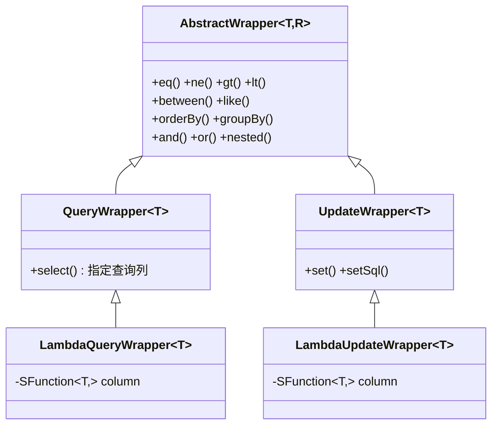

<!--
module:
  parent: 04.spring-backend
  slug: 04.spring-backend\04-data\mybatis\04-mybatis-plus\03-wrapper-system
  type: article
  category: MyBatis-Plus 实战
  summary: MyBatis-Plus Wrapper 体系——两大维度(用途 + 使用方式)全景 + 决策树。
-->

# 03 Wrapper 体系(两大维度)

> MyBatis-Plus 的 Wrapper 体系围绕 `AbstractWrapper` 父类展开,**按"用途"分 4 类(查询 / 更新),按"使用方式"分 2 类(普通 / Lambda)**。理解这两个维度后,选哪个 Wrapper 就有了明确决策路径。

## 🎯 一句话定位

**Wrapper 体系 = 4 个具体类(QueryWrapper / UpdateWrapper / LambdaQueryWrapper / LambdaUpdateWrapper)共享 `AbstractWrapper` 父类的 50+ 链式方法**,选哪个看 2 个维度:① 是查询还是更新?② 是否需要类型安全?

---

## 一、Wrapper 类继承关系



> **关键点**:Lambda 版本不是 QueryWrapper 的子类,**而是独立继承链**;两者方法签名完全相同,只是参数从 `String column` 换成 `SFunction<T, ?> column`。

---

## 二、维度 1:按用途划分

### 2.1 查询构造器(SELECT)

| 类 | 用途 | 是否支持 `set()` |
|------|------|----------------|
| `QueryWrapper<T>` | SELECT 查询条件 | 否 |
| `LambdaQueryWrapper<T>` | SELECT 查询条件(类型安全) | 否 |

```java
// QueryWrapper 示例:查 name='Tom' 且 age > 20 的用户
QueryWrapper<User> wrapper = new QueryWrapper<>();
wrapper.eq("name", "Tom").gt("age", 20);
List<User> users = userMapper.selectList(wrapper);
// SQL: SELECT * FROM user WHERE name = 'Tom' AND age > 20
```

### 2.2 更新构造器(UPDATE)

| 类 | 用途 | 是否支持 `set()` |
|------|------|----------------|
| `UpdateWrapper<T>` | UPDATE 语句 + SET 字段 | **是** |
| `LambdaUpdateWrapper<T>` | UPDATE 语句(类型安全) | **是** |

```java
// UpdateWrapper 示例:把 age=20 的用户 status 改成 1
UpdateWrapper<User> wrapper = new UpdateWrapper<>();
wrapper.set("status", 1).eq("age", 20);
userMapper.update(null, wrapper);
// SQL: UPDATE user SET status=1 WHERE age = 20
```

> **注意**:`UpdateWrapper` 比 `QueryWrapper` 多 `set()` / `setSql()` 方法,这是**唯一区别**。

---

## 三、维度 2:按使用方式划分

### 3.1 普通构造器(字符串字段名)

```java
QueryWrapper<User> wrapper = new QueryWrapper<>();
wrapper.eq("name", "Tom")        // 字段名是字符串
      .eq("is_delete", 0);       // 重构时无感知,改名要全文搜
```

**缺点**:
- 字段名硬编码,**编译期无法发现拼写错误**
- 字段重命名后,**IDE 不会自动追踪**
- 多表查询时**字段冲突**易踩坑(`name` 在 user 和 order 表都有)

### 3.2 Lambda 构造器(方法引用)

```java
LambdaQueryWrapper<User> wrapper = new LambdaQueryWrapper<>();
wrapper.eq(User::getName, "Tom")    // 方法引用,编译期类型检查
      .eq(User::getIsDelete, 0);   // 重命名 User.name 时,IDE 自动追踪
```

**优势**:
- **类型安全**:`User::getName` 拼错 → 编译失败
- **重构友好**:字段改名 → IDE 自动更新所有引用
- **零 SQL 注入**:框架解析字段名,不会拼接用户输入

**代价**:底层依赖 `SerializedLambda` 反射,**性能略低于字符串版**(可忽略,差异在微秒级)。

---

## 四、4 大构造器选型决策树

```text
是否要更新数据?
├── 是 → 是否需要类型安全?
│        ├── 是 → LambdaUpdateWrapper<T>
│        └── 否 → UpdateWrapper<T>
└── 否 → 是否需要类型安全?
         ├── 是 → LambdaQueryWrapper<T>
         └── 否 → QueryWrapper<T>
```

**实战推荐**:
- **新项目**:**永远用 Lambda 版**(`LambdaQueryWrapper` / `LambdaUpdateWrapper`)
- **老项目**:`QueryWrapper` 与 `LambdaQueryWrapper` 共存,新代码用 Lambda
- **动态表名 / 跨表查询**:用 `QueryWrapper` 字符串更灵活

---

## 五、完整代码对比(查询场景)

```java
// 场景:查 status=1 且 18<=age<=60 的用户,按 create_time 倒序,前 10 条

// ❌ 写法 1:QueryWrapper(字段名硬编码)
QueryWrapper<User> qw = new QueryWrapper<>();
qw.eq("status", 1)
  .between("age", 18, 60)
  .orderByDesc("create_time")
  .last("LIMIT 10");
List<User> users1 = userMapper.selectList(qw);

// ✅ 写法 2:LambdaQueryWrapper(推荐,类型安全)
LambdaQueryWrapper<User> lqw = new LambdaQueryWrapper<>();
lqw.eq(User::getStatus, 1)
   .between(User::getAge, 18, 60)
   .orderByDesc(User::getCreateTime)
   .last("LIMIT 10");
List<User> users2 = userMapper.selectList(lqw);
```

## 六、完整代码对比(更新场景)

```java
// 场景:把 status=0 且 age<18 的用户状态改为 1,update_time 同步

// ❌ 写法 1:UpdateWrapper + entity(字段名硬编码)
UpdateWrapper<User> uw = new UpdateWrapper<>();
uw.set("status", 1)
  .set("update_time", LocalDateTime.now())
  .eq("status", 0)
  .lt("age", 18);
userMapper.update(null, uw);

// ✅ 写法 2:LambdaUpdateWrapper + entity(推荐)
User user = new User();
user.setStatus(1);
user.setUpdateTime(LocalDateTime.now());  // 自动填充兜底
LambdaUpdateWrapper<User> luw = new LambdaUpdateWrapper<>();
luw.set(User::getStatus, 1)
   .set(User::getUpdateTime, LocalDateTime.now())
   .eq(User::getStatus, 0)
   .lt(User::getAge, 18);
userMapper.update(user, luw);

// ✅ 写法 3:LambdaUpdateWrapper 链式调用(最简洁)
LambdaUpdateWrapper<User> luw2 = new LambdaUpdateWrapper<User>()
    .set(User::getStatus, 1)
    .set(User::getUpdateTime, LocalDateTime.now())
    .eq(User::getStatus, 0)
    .lt(User::getAge, 18);
userMapper.update(null, luw2);
```

---

## 七、4 大反例对比

### ❌/✅ 1:QueryWrapper 与 LambdaQueryWrapper 混用

```java
// ❌ 半途切换 Wrapper 类型,代码割裂
QueryWrapper<User> qw = new QueryWrapper<>();
qw.eq("name", "Tom");
// ... 50 行后
qw.lambda().eq(User::getAge, 18);  // 临时切到 Lambda,语义混乱
```

```java
// ✅ 一开始就确定用哪个 Wrapper,全程统一
LambdaQueryWrapper<User> wrapper = new LambdaQueryWrapper<>();
wrapper.eq(User::getName, "Tom").eq(User::getAge, 18);
```

### ❌/✅ 2:UpdateWrapper 没 set(),SQL 没 SET 子句

```java
// ❌ 只想查 update 数据,结果用了 UpdateWrapper 但忘记 set()
// 执行后:UPDATE user SET ... WHERE id=1 → 影响 0 行,无 SET 子句报错
UpdateWrapper<User> uw = new UpdateWrapper<>();
uw.eq(User::getId, 1L);  // 缺 set()
userMapper.update(null, uw);
```

```java
// ✅ 明确需求:查询用 QueryWrapper,更新用 UpdateWrapper
QueryWrapper<User> qw = new QueryWrapper<>();
qw.eq("id", 1L);
User user = userMapper.selectOne(qw);  // 正确场景:查询
```

### ❌/✅ 3:Lambda 构造器引用了不存在的 getter

```java
// ❌ User 类没有 getUserName,编译期报错
@Data
public class User {
    private String name;  // 只有 getName,没有 getUserName
}
wrapper.eq(User::getUserName, "Tom");  // 编译失败:找不到符号
```

```java
// ✅ 实体类字段名必须与 getter 一致(Lombok @Data 自动生成)
@Data
public class User {
    private String name;  // 生成 getName()
}
wrapper.eq(User::getName, "Tom");  // 编译通过
```

### ❌/✅ 4:Lambda 引用了计算属性(非数据库字段)

```java
// ❌ getFullName 是计算属性,没有对应数据库列 → 运行时拼接 SQL 失败
@Data
public class User {
    private String firstName;
    private String lastName;
    public String getFullName() {  // 计算属性,非持久化字段
        return firstName + " " + lastName;
    }
}
wrapper.eq(User::getFullName, "Tom");  // 拼 SQL: WHERE full_name = 'Tom' → 列不存在
```

```java
// ✅ 用 @TableField(exist = false) 标注非持久化字段
@Data
public class User {
    private String firstName;
    private String lastName;

    @TableField(exist = false)  // 告诉 MP 这个字段不对应数据库列
    public String getFullName() { /* ... */ }
}
// MP 遇到 exist=false 的字段会跳过,不会拼到 SQL 里
```

---

## 八、3 大常见陷阱

### 陷阱 1:链式调用顺序影响 SQL 拼接顺序

```java
// SQL 拼接顺序:WHERE a=1 AND b=2 AND c=3
wrapper.eq("a", 1).eq("b", 2).eq("c", 3);

// 不同顺序会产生不同 SQL(虽然本例结果相同,但 OR 场景下顺序关键)
wrapper.eq("a", 1).or().eq("b", 2).or().eq("c", 3);
// SQL: WHERE a=1 OR b=2 OR c=3
```

### 陷阱 2:`and(w -> ...)` 与 `or(w -> ...)` 的括号语义

```java
// and(w -> ...) 包裹的是括号内的完整 OR 条件
wrapper.eq("status", 1)
       .and(w -> w.eq("name", "Tom").or().eq("email", "tom@x.com"));
// SQL: WHERE status=1 AND (name='Tom' OR email='tom@x.com')
```

```java
// 对比:直接用 or()
wrapper.eq("status", 1).or().eq("name", "Tom").or().eq("email", "tom@x.com");
// SQL: WHERE status=1 OR name='Tom' OR email='tom@x.com'  ← 没括号!
```

### 陷阱 3:`select()` 只能调一次,后调覆盖前调

```java
// ❌ 第一个 select 被覆盖
wrapper.select("id").select("name");  // 只剩 select("name")
List<User> users = userMapper.selectList(wrapper);
// SQL: SELECT name FROM user → id 字段没了!
```

```java
// ✅ 一次性传所有字段
wrapper.select("id", "name", "age");
```

---

## 九、5 大反模式

1. **反模式 1:用 `QueryWrapper` 写多表 JOIN** — `QueryWrapper` 不支持 JOIN 拼接;多表查询**必须**写 XML 或用 `@Select` 注解,不要硬塞。
2. **反模式 2:`UpdateWrapper` 缺 `set()`** — UPDATE 语句必须有 SET 子句;**要么 set 字段,要么传 entity**,否则 SQL 不完整会报错。
3. **反模式 3:Lambda 引用计算属性(@TableField(exist=false))** — 框架不知道这个字段不存在,会拼到 SQL 里;**必须**显式标注 `exist=false` 或用普通字段。
4. **反模式 4:`or()` 滥用导致条件语义混乱** — `or()` 没有括号包裹,容易出现 `a=1 OR b=2 OR c=3` 而非预期的 `(a=1 OR b=2) AND c=3`;**复杂 OR 必须用 `and(w -> w.or())` 显式包裹**。
5. **反模式 5:`last("LIMIT " + pageSize)` 拼接用户输入** — `last()` 直接拼接 SQL,有 SQL 注入风险;**只用于固定的 `LIMIT 1` 场景**,动态 LIMIT 应通过 `Page<T>` 或参数化。

---

## 十、30 秒话术

> **面试高频问法**:`QueryWrapper` 和 `LambdaQueryWrapper` 的区别?什么时候用哪个?
>
> **回答模板**:MyBatis-Plus 的 Wrapper 体系围绕 `AbstractWrapper` 展开,**按用途**分 2 类(`QueryWrapper` 查询、`UpdateWrapper` 更新),**按使用方式**分 2 类(普通字符串、Lambda 方法引用)。组合出 4 个具体类。**新项目永远推荐 Lambda 版**,因为 `User::getName` 在编译期类型安全、IDE 重构友好;**老项目或跨表动态查询**场景,字符串 `QueryWrapper` 更灵活。**Lambda 版底层通过 `SerializedLambda` 反射解析字段名**,性能差异可忽略。

---

## 相关章节

- 上一步:[02-crud-basics](./02-crud-basics.md) — CRUD 基础
- 同主题:[04-lambda-wrapper](./04-lambda-wrapper.md) — Lambda 实战
- 底层:[05-lambda-sfunction-deep-dive](./05-lambda-sfunction-deep-dive.md) — SFunction 序列化原理

← [返回: MyBatis-Plus 总览](./README.md)
