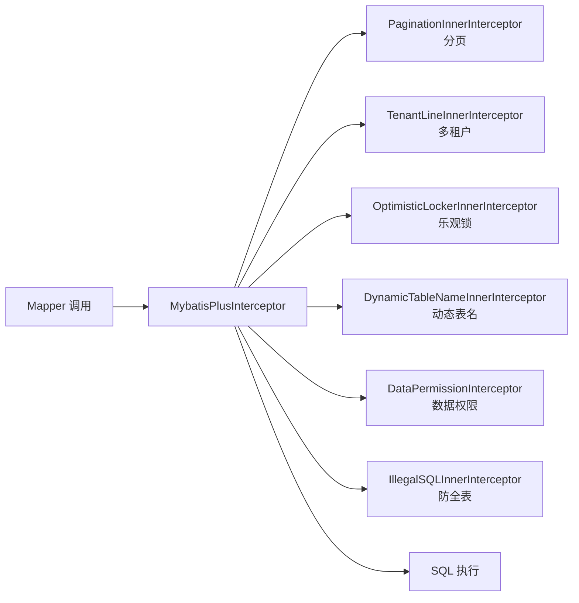

<!--
module:
  parent: 04.spring-backend
  slug: 04.spring-backend\04-data\mybatis\04-mybatis-plus\08-advanced-interceptors
  type: article
  category: 主模块子文章
  summary: 08 高级特性(动态表名 / 性能分析 / SQL 注入器)
-->

# 08 高级特性（动态表名 / 多租户 / 性能分析 / SQL 注入器）

> 来源:整合自原 `08.mybatis/mybatis-plus/README.md` L243-315（§四 高级特性）

`MybatisPlusInterceptor` 是 MP 的拦截器容器，按注册顺序形成责任链：`Executor → StatementHandler → ParameterHandler → ResultSetHandler` 四个层面分别可插入自定义插件。MP 内置了 9+ 种 `InnerInterceptor`（分页、多租户、动态表名、乐观锁、性能分析、数据权限、SQL 防止全表更新与删除等），覆盖企业级 90% 的横切关注点。本章给出 4 类核心插件的可运行代码与组合配置。

## 一、整体架构



**注册顺序至关重要**：分页必须在前（先确定查哪些数据），多租户/数据权限次之（再过滤），动态表名通常最后（确保过滤条件应用在替换后的表名上）。

## 二、动态表名（DynamicTableNameInnerInterceptor）

### 2.1 适用场景

- 按月份分表（订单、日志）：`order_202601`、`order_202602`
- 按租户分表：不同租户物理隔离
- 历史数据归档：旧数据迁移到冷表

### 2.2 完整实现

```java
@Component
public class OrderTableNameHandler implements TableNameHandler {

    private static final DateTimeFormatter FMT = DateTimeFormatter.ofPattern("yyyyMM");

    @Override
    public String dynamicTableName(String sql, String tableName) {
        if ("order".equals(tableName)) {
            // 业务当前月份（生产中应从 ThreadLocal/上下文取）
            String month = LocalDate.now().format(FMT);
            return "order_" + month;   // → order_202601
        }
        return tableName;
    }
}
```

### 2.3 注册到拦截器链

```java
@Configuration
public class MybatisPlusConfig {

    @Bean
    public MybatisPlusInterceptor mybatisPlusInterceptor(OrderTableNameHandler orderTableNameHandler) {
        MybatisPlusInterceptor interceptor = new MybatisPlusInterceptor();

        // 1. 分页（必须第一个）
        interceptor.addInnerInterceptor(new PaginationInnerInterceptor(DbType.MYSQL));

        // 2. 动态表名（必须最后，作用在 SQL 最终执行前）
        DynamicTableNameInnerInterceptor dynamicTable = new DynamicTableNameInnerInterceptor();
        dynamicTable.setTableNameHandler(orderTableNameHandler);
        interceptor.addInnerInterceptor(dynamicTable);

        return interceptor;
    }
}
```

### 2.4 ThreadLocal 上下文传递

```java
public class TableNameContext {
    private static final ThreadLocal<String> TABLE = new ThreadLocal<>();

    public static void set(String table) { TABLE.set(table); }
    public static String get() { return TABLE.get(); }
    public static void clear() { TABLE.remove(); }
}

// Handler 中使用
@Override
public String dynamicTableName(String sql, String tableName) {
    String override = TableNameContext.get();
    if (override != null) {
        TableNameContext.clear();
        return override;
    }
    return tableName;
}

// Service 中指定
TableNameContext.set("order_202512");  // 查询历史月份
List<Order> list = orderMapper.selectList(null);
```

---

## 三、多租户插件（TenantLineInnerInterceptor）

### 3.1 适用场景

SaaS 应用共用一个数据库实例，通过 `tenant_id` 字段隔离数据。MP 自动给每条 SQL 追加 `WHERE tenant_id = ?`，避免业务代码漏写导致数据越权。

### 3.2 实体类

```java
@Data
@TableName("user")
public class User {
    @TableId(type = IdType.AUTO)
    private Long id;
    private String name;

    @TableField(value = "tenant_id", fill = FieldFill.INSERT)
    private Long tenantId;
}
```

### 3.3 完整 Handler 实现

```java
@Component
public class MyTenantLineHandler implements TenantLineHandler {

    @Override
    public Expression getTenantId() {
        Long tenantId = TenantContext.getCurrentTenantId();
        if (tenantId == null) {
            throw new IllegalStateException("未设置当前租户");
        }
        return new LongValue(tenantId);
    }

    @Override
    public String getTenantIdColumn() {
        return "tenant_id";
    }

    @Override
    public boolean ignoreTable(String tableName) {
        // 系统表 / 字典表不需要租户隔离
        return Arrays.asList("sys_dict", "sys_config", "region").contains(tableName);
    }

    @Override
    public boolean ignoreInsert(List<Column> columns, String tenantIdColumn) {
        // insert 时自动写入 tenant_id，无需业务手动 set
        return columns.stream().anyMatch(c -> c.getColumn().equals(tenantIdColumn));
    }
}
```

### 3.4 拦截器注册

```java
@Bean
public MybatisPlusInterceptor mybatisPlusInterceptor(MyTenantLineHandler tenantHandler) {
    MybatisPlusInterceptor interceptor = new MybatisPlusInterceptor();

    // 分页
    interceptor.addInnerInterceptor(new PaginationInnerInterceptor(DbType.MYSQL));

    // 多租户（必须在分页之后，避免分页 SQL 与租户条件冲突）
    TenantLineInnerInterceptor tenantInterceptor = new TenantLineInnerInterceptor(new TenantLineInnerInterceptor.TenantLineInnerInterceptorBuilder()
        .setTenantLineHandler(tenantHandler));
    interceptor.addInnerInterceptor(tenantInterceptor);

    return interceptor;
}
```

### 3.5 临时绕过多租户

```java
// 场景：后台管理需要查询所有租户数据
try {
    // 关闭租户过滤（3.5.3+）
    TenantLineInnerInterceptor.IGNORE_TENANT = true;
    List<User> all = userMapper.selectList(null);
} finally {
    TenantLineInnerInterceptor.IGNORE_TENANT = false;
}
```

---

## 四、乐观锁插件（OptimisticLockerInnerInterceptor）

```java
@Data
@TableName("user")
public class User {
    @TableId
    private Long id;
    private String name;

    @Version   // 必填字段，标识乐观锁版本
    private Integer version;
}

@Bean
public MybatisPlusInterceptor mybatisPlusInterceptor() {
    MybatisPlusInterceptor interceptor = new MybatisPlusInterceptor();
    interceptor.addInnerInterceptor(new OptimisticLockerInnerInterceptor());
    return interceptor;
}

// 业务：更新前先查 version，更新时 MP 自动追加 WHERE version = #{oldVersion}
User user = userMapper.selectById(1L);   // version = 3
user.setName("new name");
userMapper.updateById(user);
// 实际 SQL：UPDATE user SET name=?, version=4 WHERE id=1 AND version=3
// 并发场景下若他人先更新 → version 已是 4 → 影响行数 0 → 抛出 OptimisticLockingFailureException
```

---

## 五、性能分析插件（PerformanceInterceptor）

> 3.5.3+ 已弃用，新版本推荐使用 `p6spy` 或 Druid Filter 替代。本节保留示例以兼容存量项目。

```java
@Bean
public MybatisPlusInterceptor mybatisPlusInterceptor() {
    MybatisPlusInterceptor interceptor = new MybatisPlusInterceptor();
    interceptor.addInnerInterceptor(new PerformanceInterceptor(
        new FormatStyle[]{FormatStyle.MSG},
        1000,    // 慢 SQL 阈值（毫秒）
        10,      // 最多打印 10 条
        true,    // 打印 SQL 参数
        true     // 打印 SQL 解析过程
    ));
    return interceptor;
}
```

**3.5.3+ 推荐方案：p6spy**

```xml
<!-- pom.xml -->
<dependency>
    <groupId>p6spy</groupId>
    <artifactId>p6spy</artifactId>
    <version>3.9.1</version>
</dependency>
```

```yaml
# application.yml
spring:
  datasource:
    url: jdbc:p6spy:mysql://localhost:3306/test
    driver-class-name: com.p6spy.engine.spy.P6SpyDriver
```

```properties
# spy.properties
appender=com.p6spy.engine.spy.appender.StdoutLogger
logMessageFormat=com.p6spy.engine.spy.appender.MultiLineFormat
filter=true
excludecategories=info,debug,result,resultset,batch,statement
```

输出：

```text
Consume Time：12 ms
2026-01-15 10:30:00
Execute SQL：
SELECT id, name, age FROM user WHERE deleted = 0
```

---

## 六、防全表更新与删除（IllegalSQLInnerInterceptor）

生产事故高发：开发误写 `UPDATE user SET status = 0`（无 WHERE）→ 全表更新；或 `DELETE FROM user` → 全表删除。

```java
@Bean
public MybatisPlusInterceptor mybatisPlusInterceptor() {
    MybatisPlusInterceptor interceptor = new MybatisPlusInterceptor();
    // 拦截无 WHERE 的 UPDATE/DELETE
    interceptor.addInnerInterceptor(new IllegalSQLInnerInterceptor());
    return interceptor;
}
```

抛错：`com.baomidou.mybatisplus.core.exceptions.MybatisPlusException: Prohibitively SQL: ...`

---

## 七、数据权限插件（DataPermissionInterceptor）

按当前用户角色过滤可见数据（如：部门经理只看本部门；普通员工只看自己）。

```java
@Component
public class MyDataPermissionHandler implements DataPermissionHandler {

    @Override
    public Expression getSqlSegment(Expression where, String mappedStatementId, boolean isSelect) {
        // 根据 mappedStatementId（Mapper 方法全限定名）决定权限范围
        if (mappedStatementId.contains("UserMapper")) {
            UserRole role = SecurityUtils.getCurrentUserRole();
            return switch (role) {
                case ADMIN    -> null;  // 管理员不过滤
                case MANAGER  -> new EqualsTo(where, "dept_id",
                                               new LongValue(SecurityUtils.getDeptId()));
                case EMPLOYEE -> new EqualsTo(where, "creator_id",
                                               new LongValue(SecurityUtils.getUserId()));
            };
        }
        return null;
    }
}

@Bean
public MybatisPlusInterceptor mybatisPlusInterceptor(MyDataPermissionHandler handler) {
    MybatisPlusInterceptor interceptor = new MybatisPlusInterceptor();
    interceptor.addInnerInterceptor(new PaginationInnerInterceptor(DbType.MYSQL));
    interceptor.addInnerInterceptor(new DataPermissionInterceptor(handler));
    return interceptor;
}
```

---

## 八、自定义 SQL 注入器（SqlInjector）

`BaseMapper` 默认提供 17 个方法。当需要扩展自定义方法（如 `findAll`、`selectBatchByCustomCondition`），通过继承 `DefaultSqlInjector` 添加。

### 8.1 自定义 Method 类

```java
public class FindAll extends AbstractMethod {
    @Override
    public MappedStatement injectMappedStatement(Class<?> mapperClass, Class<?> modelClass,
                                                  TableInfo tableInfo) {
        String sql = "SELECT %s FROM %s" ;
        String formattedSql = String.format(sql,
                sqlSelectColumns(tableInfo), tableInfo.getTableName());

        SqlSource sqlSource = languageDriver.createSqlSource(configuration, formattedSql, modelClass);
        return addSelectMappedStatement(mapperClass, "findAll", sqlSource, modelClass);
    }
}
```

### 8.2 继承 DefaultSqlInjector

```java
public class MySqlInjector extends DefaultSqlInjector {
    @Override
    public List<AbstractMethod> getMethodList(Class<?> mapperClass) {
        List<AbstractMethod> methods = super.getMethodList(mapperClass);
        methods.add(new FindAll());
        return methods;
    }
}
```

### 8.3 注册 & 使用

```java
@Bean
public MySqlInjector mySqlInjector() {
    return new MySqlInjector();
}

// Mapper 中直接调用
public interface UserMapper extends BaseMapper<User> {
    // findAll() 自动生成，无需手写
}
```

```java
List<User> all = userMapper.findAll();
```

---

## 九、完整组合配置

```java
@Configuration
public class MybatisPlusConfig {

    @Bean
    public MybatisPlusInterceptor mybatisPlusInterceptor(
            MyTenantLineHandler tenantHandler,
            MyDataPermissionHandler dataPermissionHandler) {

        MybatisPlusInterceptor interceptor = new MybatisPlusInterceptor();

        // ① 分页（最优先）
        PaginationInnerInterceptor pagination = new PaginationInnerInterceptor(DbType.MYSQL);
        pagination.setMaxLimit(500L);
        pagination.setOptimizeJoinOfCountSql(true);
        interceptor.addInnerInterceptor(pagination);

        // ② 数据权限（在分页后，过滤 WHERE）
        interceptor.addInnerInterceptor(new DataPermissionInterceptor(dataPermissionHandler));

        // ③ 多租户（在数据权限后，进一步过滤）
        interceptor.addInnerInterceptor(
            new TenantLineInnerInterceptor(new TenantLineInnerInterceptor.TenantLineInnerInterceptorBuilder()
                .setTenantLineHandler(tenantHandler)));

        // ④ 乐观锁
        interceptor.addInnerInterceptor(new OptimisticLockerInnerInterceptor());

        // ⑤ 动态表名（最后，确保表名替换后其他拦截器条件仍生效）
        interceptor.addInnerInterceptor(new DynamicTableNameInnerInterceptor(new OrderTableNameHandler()));

        // ⑥ 防全表
        interceptor.addInnerInterceptor(new IllegalSQLInnerInterceptor());

        return interceptor;
    }

    @Bean
    public MetaObjectHandler metaObjectHandler() {
        return new MyMetaObjectHandler();
    }

    @Bean
    public MySqlInjector mySqlInjector() {
        return new MySqlInjector();
    }
}
```

---

## 十、常见陷阱

| 陷阱 | 后果 | 解决 |
|------|------|------|
| 拦截器注册顺序错乱 | 分页 / 多租户 / 乐观锁失效 | 分页 → 数据权限 → 多租户 → 乐观锁 → 动态表名 → 防全表 |
| 多租户 Handler 抛 NPE | 所有 SQL 失败 | `TenantContext.getCurrentTenantId()` 必须有兜底 |
| 动态表名 Handler 改了表名但 SQL 中仍有原表名引用 | 表找不到 | Handler 内做原表名匹配，避免误改 |
| `OptimisticLockerInnerInterceptor` 未生效 | 并发更新丢失 | 实体类必须有 `@Version` 字段，且 update 必须传 entity |
| `IllegalSQLInnerInterceptor` 太严 | 单元测试初始化数据被拒 | 临时关闭：`IllegalSQLInnerInterceptor.IGNORE_CHECK = true` |
| 多数据源下只配一个 `MybatisPlusInterceptor` | 第二个数据源拦截器不生效 | 每个 `SqlSessionFactory` 单独配置 |

---

## 反向链

- [`06-pagination`](06-pagination.md) — 分页插件底层依赖 `PaginationInnerInterceptor`
- [`07-auto-fill-and-logic-delete`](07-auto-fill-and-logic-delete.md) — `MetaObjectHandler` 协同自动填充

← [返回: MyBatis-Plus 全家桶](./README.md)