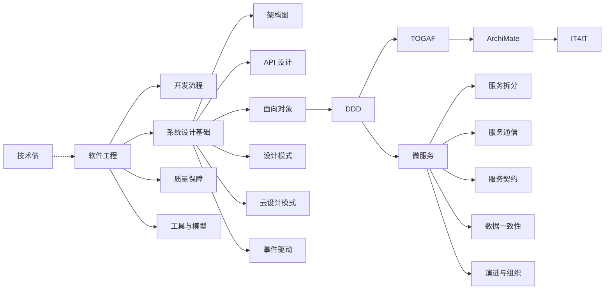

<!--
module:
  parent: system-design
  slug: system-design/01-foundation
  type: article
  category: 主模块子文章
  summary: 基础篇 本应该很简单，软件工程的核心理论基础与系统设计方法论，是理解后续分布式、高可用、高性能等高级主题的基石
-->

# 基础篇

## 引言：反直觉代码
基础篇 的关键不是语法——是**看起来对**的代码背后那些'踩坑点'。

本篇用 3 个反直觉片段切入，把面试/生产中常被问起、但一深入就漏馅的点摆出来。

---

> 软件工程的核心理论基础与系统设计方法论，是理解后续分布式、高可用、高性能等高级主题的基石。
> 最后更新: 2026-06-10

## 学习路径

1. [软件工程](software-engineering/README.md) — 学科定位、开发流程、工具与质量保障
2. [开发流程与方法](software-engineering/development-process/README.md) — 瀑布/敏捷/原型/螺旋/增量模型
3. [工具与模型](software-engineering/tools-and-models/README.md) — UML/DevOps/版本控制
4. [质量保障体系](software-engineering/quality-assurance/README.md) — 测试/CI-CD/代码审查/监控
5. [系统设计基础](system-design-basics/README.md) — 核心步骤、设计原则、常见模式
6. [架构图绘制](system-design-basics/architecture-diagram/) — 4+1 视图模型、C4 模型
7. [API 设计](system-design-basics/api/README.md) — RESTful/GraphQL/RPC 风格
8. [架构认知的演进](system-design-basics/architecture-evolution/README.md) — OOD → DDD → TOGAF 的认知升级之路
9. [面向对象设计](system-design-basics/ood/README.md) — SOLID/GRASP 原则、类与职责分配
10. [领域驱动设计 DDD](system-design-basics/ddd/README.md) — 以业务领域为核心的建模方法
11. [企业架构 TOGAF 10](system-design-basics/togaf/README.md) — 业务能力地图、ADM 9 阶段、模块化架构治理
12. [架构描述语言 ArchiMate 3.2](system-design-basics/archimate/README.md) — 30+ 视点的企业架构建模语言，与 TOGAF 同源
13. [IT 价值流参考架构 IT4IT 3.0](system-design-basics/it4it/README.md) — 4 价值流 + 9 功能组件，IT 运营层的"业务模型"
14. [设计模式](system-design-basics/design-patterns/README.md) — GoF 23 种经典设计模式
15. [微服务架构](system-design-basics/microservices/README.md) — 拆分/通信/契约/数据一致性/演进 5 大设计主题
16. [云设计模式](system-design-basics/cloud-design-patterns/README.md) — 云原生架构模式
17. [事件驱动 vs 异步](system-design-basics/eda-vs-async/README.md) — 两种解耦模式的选择
18. [技术债](technical-debt/README.md) — 技术债的识别、管理与偿还

## 📊 知识地图

下面这张图展示了基础篇 18 个模块之间的依赖关系，帮助你按图索骥地组织学习顺序：

阅读建议：先建立 **A 软件工程 → C 系统设计基础** 的全局视野，再深入 **F OOD → G DDD → I 微服务** 这条"认知升级"主轴；其他模块按需查阅。

## 📚 延伸阅读

基础篇是所有高级主题的**前置知识**。完成本篇后，建议按以下顺序继续深入：

- [分布式篇](../02-distributed/README.md) — 在多节点环境下解决一致性、调度与通信问题
- [高可用篇](../03-high-availability/README.md) — 通过冗余、限流、灾备保证系统持续可用
- [高性能篇](../04-high-performance/README.md) — 通过缓存、数据库优化、消息队列提升吞吐与响应速度

---

## 📊 本节统计

| 子目录 | leaf 主题数 | 备注 |
|:-------|:-----------:|:-----|
| `01-foundation/`（本文） | 18 | 软件工程 · OOD · DDD · TOGAF · ArchiMate · IT4IT |
| ├─ `software-engineering/` | 4 | 开发流程 · 质量保障 · 工具模型 |
| ├─ `system-design-basics/` | 11 | OOD · DDD · TOGAF · ArchiMate · IT4IT · 模式 · 微服务 |
| └─ `technical-debt/` | 1 | 技术债识别与偿还 |
| **README 覆盖** | 32 个 depth-2 leaf + 1 顶层 = **33** | 100% frontmatter |
| **聚合主题数** | 18（见上方学习路径列表） | 全部聚合在本章及子 README |

> 数字基线：本节以 README 数量 + 学习路径主题数双口径统计；最后更新 2026-07-02。

---

← [返回 04.system-design 主模块](../README.md)
