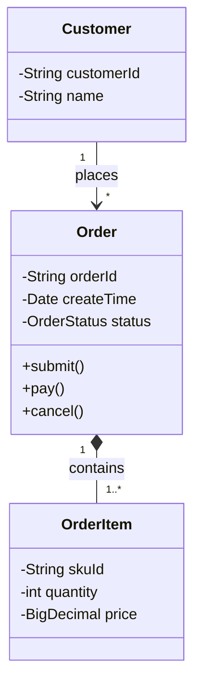
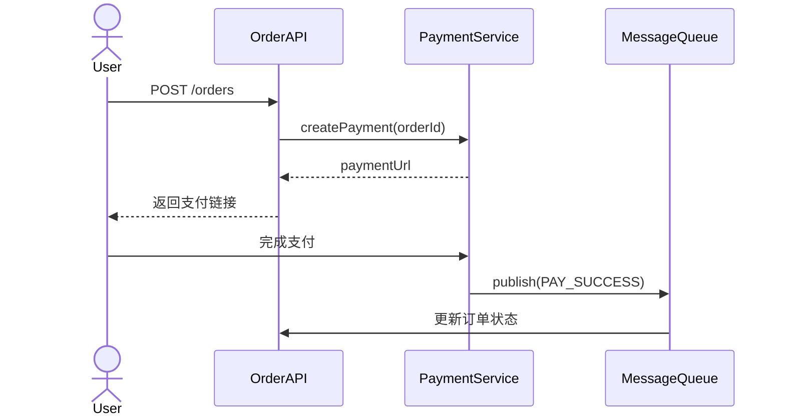

<!--
module:
  parent: system-design
  slug: system-design/tools-and-models
  type: article
  category: 主模块子文章
  summary: 软件工程的"瑞士军刀"——UML 建模、CI/CD 工具链、版本控制的核心概念与实战选型。
-->

# 工具与模型

> 软件工程的"瑞士军刀"——UML 建模、CI/CD 工具链、版本控制的核心概念与实战选型。

---

软件工程采用一系列标准化工具与模型来规范开发行为。本文聚焦三大支柱——**建模语言**、**自动化工具链**、**版本控制**——并给出可直接复用的代码示例与选型建议。

## 一、UML 建模

UML（统一建模语言）是软件系统可视化建模的标准语言，提供丰富的图形符号，帮助开发人员在编码前把系统结构、行为与交互"画"出来，从而在早期发现设计缺陷。

### 1.1 常用图型速览

| 图型 | 用途 | 典型场景 |
|------|------|----------|
| 用例图 | 描述系统功能需求与参与者关系 | 需求评审 |
| 类图 | 展示类的静态结构与关联/聚合/组合关系 | 面向对象设计 |
| 时序图 | 强调对象间消息传递的时间顺序 | 接口交互分析 |
| 状态图 | 描述对象在生命周期内的状态迁移 | 订单/工单流转 |
| 活动图 | 建模业务流程或算法步骤 | 审批流程设计 |

### 1.2 类图示例（Mermaid）

以一个电商订单系统为例：



### 1.3 时序图示例（Mermaid）

用户下单 → 支付 → 通知的完整流程：



> **实战建议**：类图用于评审数据结构，时序图用于对齐接口契约——把这两张图写进技术方案文档，能减少 50% 以上的沟通返工。

## 二、DevOps 自动化工具

DevOps 将开发（Development）与运维（Operations）紧密结合，核心目标是通过**持续集成（CI）** 和**持续部署（CD）** 提高交付速度与质量。

### 2.1 主流工具对比

| 工具 | 类型 | 核心优势 | 适用规模 |
|------|------|----------|----------|
| Jenkins | 开源自建 | 插件生态丰富、高度可定制 | 中大型企业 |
| GitLab CI/CD | 一体化平台 | 与代码仓库深度集成 | 中小团队 |
| GitHub Actions | 云原生 CI | YAML 配置简洁、Marketplace 生态 | 开源 / 中小团队 |
| ArgoCD | GitOps CD | 声明式 K8s 部署 | 云原生项目 |

### 2.2 Jenkinsfile 示例

```groovy
pipeline {
    agent any
    stages {
        stage('Build') {
            steps {
                sh 'mvn clean package -DskipTests'
            }
        }
        stage('Test') {
            steps {
                sh 'mvn test'
            }
            post {
                always {
                    junit 'target/surefire-reports/*.xml'
                }
            }
        }
        stage('Deploy') {
            when { branch 'main' }
            steps {
                sh 'docker build -t myapp:${BUILD_NUMBER} .'
                sh 'docker push registry.example.com/myapp:${BUILD_NUMBER}'
            }
        }
    }
}
```

### 2.3 GitHub Actions 示例

```yaml
name: CI/CD Pipeline
on:
  push:
    branches: [main]
  pull_request:
    branches: [main]

jobs:
  build-and-test:
    runs-on: ubuntu-latest
    steps:
      - uses: actions/checkout@v4
      - uses: actions/setup-java@v4
        with:
          java-version: '17'
          distribution: 'temurin'
      - run: mvn clean verify
      - uses: actions/upload-artifact@v4
        with:
          name: jar
          path: target/*.jar

  deploy:
    needs: build-and-test
    if: github.ref == 'refs/heads/main'
    runs-on: ubuntu-latest
    steps:
      - run: echo "Deploying to production..."
```

> **选型建议**：中小团队优先选 GitHub Actions / GitLab CI（零运维）；大型企业有定制需求时选 Jenkins；K8s 原生项目推荐 ArgoCD 做 GitOps。

## 三、版本控制系统

版本控制系统管理代码变更历史，是团队协作的基石。当前主流方案为 **Git**（分布式），传统项目偶见 **SVN**（集中式）。

### 3.1 Git 分支工作流对比

| 工作流 | 核心思路 | 适合团队 | 典型发布节奏 |
|--------|----------|----------|-------------|
| **Git Flow** | `main` + `develop` + `feature/*` + `release/*` + `hotfix/*` | 多版本并行维护 | 按月/季度发布 |
| **GitHub Flow** | 只有 `main`，所有开发通过 PR 合入 | 小团队、持续部署 | 每日多次发布 |
| **Trunk-Based** | 所有人直接在主干提交，用 feature flag 控制上线 | 高工程成熟度团队 | 持续交付 |

### 3.2 常用 Git 命令速查

```bash
# 功能分支开发
git checkout -b feature/user-login
git commit -m "feat: add login endpoint"
git push origin feature/user-login

# 变基到最新主干（避免合并提交噪音）
git fetch origin
git rebase origin/main

# 交互式暂存（精确选择提交内容）
git add -p
```

> **实战建议**：10 人以下团队用 GitHub Flow 就够了；需要同时维护 v1/v2 等多个大版本时再引入 Git Flow。

## 四、选型速查表

| 场景 | UML 工具 | CI/CD 平台 | VCS 工作流 |
|------|----------|-----------|------------|
| **3-5 人小团队** | Mermaid（文档即图表） | GitHub Actions | GitHub Flow |
| **中型企业（50-200 人）** | PlantUML / draw.io | GitLab CI/CD | Git Flow |
| **大型企业（200+ 人）** | Enterprise Architect | Jenkins + ArgoCD | Git Flow + Trunk-Based 混合 |
| **开源项目** | Mermaid | GitHub Actions | GitHub Flow（fork + PR） |

## 五、常见陷阱

### 5.1 UML 过度设计

**问题**：为每个类画完整类图、为每个接口画时序图，导致文档比代码还厚，无人维护。

**对策**：只为核心领域模型和关键交互路径画图；图的目的不是"完整"而是"对齐认知"。

### 5.2 CI 流水线臃肿

**问题**：把所有检查（单元测试、集成测试、静态扫描、镜像构建、安全扫描）串行放在一条流水线，一次构建 30+ 分钟，开发者排队等结果。

**对策**：
- 快速反馈层（lint + 单元测试）< 5 分钟，每次 PR 必跑
- 慢速层（集成测试 + 安全扫描）异步跑或 nightly 跑
- 利用缓存（Maven / npm cache）减少重复下载

### 5.3 分支策略与发布节奏不匹配

**问题**：团队每天多次部署却使用 Git Flow（5 种分支），导致合并冲突频繁、发布流程繁琐。

**对策**：高频发布团队用 GitHub Flow 或 Trunk-Based + Feature Flag，减少长期分支；低频发布、多版本维护团队才适合 Git Flow。

### 5.4 忽视 commit message 规范

**问题**：commit 信息写 "fix bug" 或 "update"，回溯历史时完全无法定位变更原因。

**对策**：采用 Conventional Commits（`feat:`, `fix:`, `refactor:` 等前缀），配合 `commitlint` 做自动校验。

## 相关章节

- [开发流程与方法](../development-process/README.md) — 瀑布 / 敏捷 / 螺旋模型详解
- [质量保障体系](../quality-assurance/README.md) — 测试策略、代码审查与 CI/CD 质量门禁
- [架构视图与 C4 模型](../../system-design-basics/architecture-diagram/c4-model/README.md) — 用 C4 模型做分层架构可视化
- [设计模式](../../system-design-basics/design-patterns/README.md) — GoF 23 种设计模式详解
- [可观测性](../../../08-observability/README.md) — Prometheus + Grafana + Loki 全链路监控

---

← [返回: 软件工程基础](../README.md)
