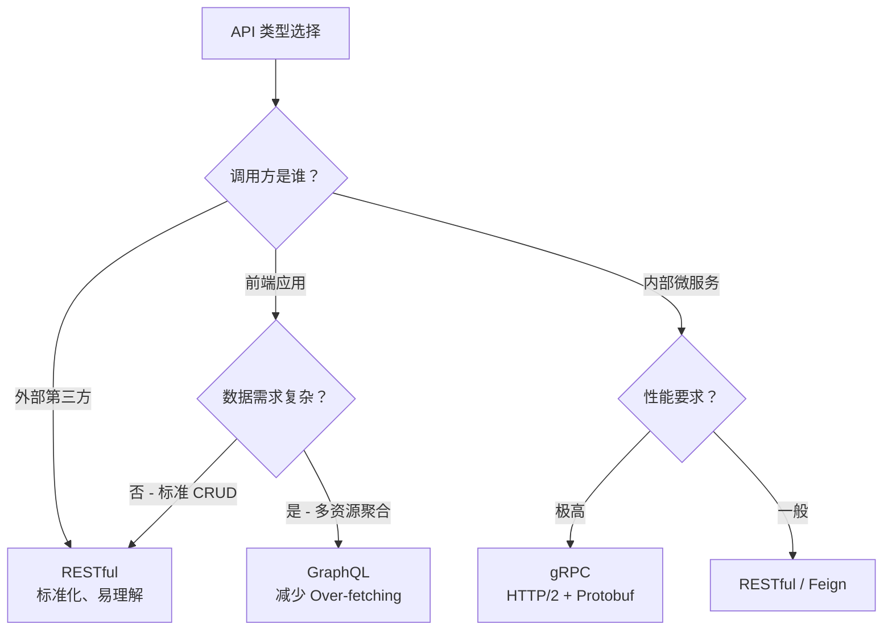

# API 设计

> API 是系统对外交互的接口，良好的 API 设计直接影响系统的可用性、可维护性和开发者体验。

## 1. 设计方式对比

| 特性 | RESTful | GraphQL | RPC |
|------|---------|---------|-----|
| 协议 | HTTP/1.1 | HTTP/1.1 | 多种(HTTP/2, TCP) |
| 数据格式 | JSON/XML | JSON | Protobuf/Thrift |
| 资源模型 | 资源导向（名词） | 查询导向 | 方法导向（动词） |
| 性能 | 中等（多次请求） | 灵活（按需获取） | 高（二进制序列化） |
| 缓存 | HTTP 缓存友好 | 需 POST，缓存复杂 | 自定义缓存 |
| 学习曲线 | 低 | 中 | 高 |
| 适用场景 | 公开 API / CRUD | 前端数据聚合 | 内部微服务调用 |
| 代表技术 | Spring MVC | Apollo Server | gRPC / Dubbo |

## 2. 选型决策

## 3. API 设计最佳实践

| 实践 | 说明 |
|------|------|
| **版本控制** | URL 路径版本（`/api/v1/users`）或 Header 版本（`Accept: application/vnd.api+json;version=1`） |
| **分页** | 游标分页（`?cursor=xxx&limit=20`）优于偏移分页（`?page=2`），大数据集性能更好 |
| **错误格式** | 统一错误响应 `{ "code": "USER_NOT_FOUND", "message": "...", "details": [...] }` |
| **幂等性** | PUT/DELETE 天然幂等；POST 用 `Idempotency-Key` Header 保证幂等 |
| **限流** | 返回 `429 Too Many Requests` + `Retry-After` Header |
| **HATEOAS** | 响应中嵌入关联资源链接，实现 API 自描述 |
| **文档** | OpenAPI 3.0（Swagger）自动生成文档 + 交互式测试 |

## 4. 认证方案对比

| 方案 | 适用场景 | 安全性 | 复杂度 |
|------|---------|--------|--------|
| **API Key** | 服务端对服务端 | 中（需 HTTPS） | 低 |
| **JWT** | 无状态认证 | 高（RS256） | 中 |
| **OAuth 2.0** | 第三方授权 | 高 | 高 |
| **mTLS** | 零信任内部服务 | 极高 | 高 |

## 子章节

- [RESTful API](rest/README.md) — 资源建模、HTTP 方法、状态码、版本控制
- [GraphQL](graphql/README.md) — Schema、Query/Mutation、Resolver
- [RPC API](rpc/README.md) — gRPC、Protobuf、服务存根

---

## 相关章节

- 上游：[`系统设计基础`](../README.md) — 设计原则与建模
- 关联：[`04.system-design/05-security`](../../../05-security/README.md) — API 安全、JWT、OAuth2
- 关联：[`06.spring/02-web`](../../../../06.spring/02-web/README.md) — Spring MVC / WebFlux 实现
