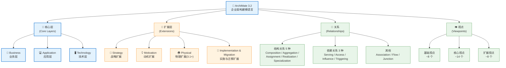

<!--
module:
  parent: system-design
  slug: system-design/archimate
  type: article
  category: 主模块子文章
  summary: **ArchiMate** 是 The Open Group 维护的**企业架构可视化建模语言**，与 TOGAF、IT4IT 并列"数字开放标准组合"三大件。
-->

# 架构描述语言（ArchiMate 3.2）

> **ArchiMate** 是 The Open Group 维护的**企业架构可视化建模语言**，与 TOGAF、IT4IT 并列"数字开放标准组合"三大件。  
> 最新版本是 **ArchiMate 3.2**（2022 年发布），3.1 起新增 **Physical（物理层）**扩展，3.2 进一步强化与 TOGAF 10 的概念对齐。  
---
## 引言：架构困境

架构描述语言（ArchiMate 3.2） 的关键不是'选型'——是**选完之后怎么在 5 个 trade-off 里活下来**。

本篇用'决策困境'切入，比较几种主流路径并讲清取舍。

---

## 🎯 一句话定位

**ArchiMate 是一套"分层 + 关系"的可视化建模语言**——它不教你怎么治理（那是 TOGAF 的事），也不管 IT 价值流怎么跑（那是 IT4IT 的事），**它只负责把企业架构用统一图符画出来，让业务、应用、技术三类干系人在同一张图上对齐**。如果说 TOGAF 是"做架构的方法论"，那 ArchiMate 就是"表达架构的语法"。

---

## 🆕 ArchiMate 3.2 速览（vs 3.0 / 3.1）

| 维度 | ArchiMate 3.0 | ArchiMate 3.1 | **ArchiMate 3.2** |
|------|---------------|---------------|-------------------|
| **发布** | 2016 | 2019 | 2022 |
| **核心层** | 3 层（Business / Application / Technology） | 同 3.0 | 同 3.1 |
| **扩展层** | Strategy / Motivation / Implementation & Migration | **新增 Physical 物理层**（设施、地理、设备） | 同 3.1 |
| **核心关系** | 6 大类 | 6 大类 | **细化为 8 大类**（拆分 Composition/Aggregation、明确 Influence 与 Triggering） |
| **视点(Viewpoints)** | 约 24 个 | 约 28 个 | **30+ 个**，并提供选型指南 |
| **认证** | ArchiMate 3.0 Certified | ArchiMate 3.1 Certified | **ArchiMate 3 Certified**（与 TOGAF 10 认证互通） |
| **与 TOGAF 对齐** | 独立语言 | 松散对齐 | **强对齐**——TOGAF 10 ADM 的每个产物都有对应视点 |
| **工具支持** | Archi (开源)、BiZZdesign、MEGA 等 | 同上 | **TOGAF 10 + ArchiMate 3.2** 双标准建模成为主流 |

### ArchiMate 3.2 全景结构



---

## 📚 章节导航

| 章节 | 文件 | 核心问题 | 建议时长 |
|:----:|:-----|:---------|:--------:|
| **第一章** | [建模语言：层、方面、关系](language.md) | ArchiMate 的"词汇"和"语法"是什么？ | 45 min |
| **第二章** | [视点：给不同人看不同的图](viewpoints.md) | 30+ 视点怎么选？怎么用视点讲故事？ | 40 min |
| **第三章** | [落地：ArchiMate × TOGAF × C4 × DDD](in-practice.md) | 在真实项目里怎么把这套语言用起来？ | 35 min |

### 推荐阅读顺序

```text
README（你在这里）  →  第一章（语言基础）
        ↓
        第二章（视点选型）→ 第三章（落地组合）
```

- **时间紧张**（30 分钟）：先读本章"核心概念速查" + 第一章前 3 节
- **架构师视角**：三章通读 + 第三章的"ArchiMate × TOGAF"
- **业务分析师**：重点看第一章 1.2（战略/动机扩展）+ 第二章基础视点
- **开发/技术**：重点看第一章 1.1（应用/技术层）+ 第三章的"C4 衔接"

---

## ⚡ 核心概念速查

| 概念 | 一句话定义 | 章节 |
|------|----------|:----:|
| **ArchiMate** | The Open Group 维护的企业架构建模语言 | 全部 |
| **核心层 (Core)** | 业务/应用/技术 三层——所有架构图的"骨架" | [第一章](language.md) |
| **扩展层 (Extension)** | 战略/动机/物理/实施与迁移——补充"为什么"和"怎么建" | [第一章](language.md) |
| **主动结构 (Active Structure)** | "做事的东西"：业务角色、应用组件、设备节点 | [第一章](language.md) |
| **行为 (Behavior)** | "做的事"：业务流程、应用服务、技术服务 | [第一章](language.md) |
| **被动结构 (Passive Structure)** | "被作用的对象"：业务对象、数据对象、制品 | [第一章](language.md) |
| **结构关系** | Composition / Aggregation / Assignment / Realization / Specialization | [第一章](language.md) |
| **依赖关系** | Serving / Access / Influence / Triggering | [第一章](language.md) |
| **视点 (Viewpoint)** | 给特定受众看的"定制切片图"——同一模型，视角不同 | [第二章](viewpoints.md) |
| **利益相关者 (Stakeholder)** | 受架构影响或影响架构的角色——视点选型的依据 | [第二章](viewpoints.md) |
| **Archi (工具)** | 开源 ArchiMate 建模工具，可导出 HTML 文档 | [第三章](in-practice.md) |

---

## 🧭 ArchiMate 在系统设计中的位置

```text
战略层：TOGAF（企业架构） → 决定"做什么系统、由谁做、怎么治理"
        ↓
表达层：ArchiMate（建模语言） → 决定"怎么把架构画出来给不同人看"  ★ 本章
        ↓
中观层：DDD（领域驱动设计） → 决定"系统边界在哪、业务是什么"
        ↓
战术层：OOD（面向对象设计） → 决定"类如何组织、方法如何分配"
        ↓
编码层：设计模式 + 编码规范  → 决定"常见问题如何优雅解决"
```

> **ArchiMate 与 TOGAF 是"语法与语法书"的关系**：TOGAF 告诉你"先做什么后做什么"（ADM 9 阶段），ArchiMate 告诉你"画出来时用什么形状、用什么线连接"。在 TOGAF 10 中，每个 ADM 阶段都有对应的 ArchiMate 视点作为产物模板。

### 三件套对照（TOGAF / ArchiMate / IT4IT）

| 维度 | TOGAF 10 | **ArchiMate 3.2** | IT4IT |
|------|----------|-------------------|-------|
| **本质** | 治理方法论（流程） | 建模语言（语法） | 价值流参考架构（IT 运营） |
| **回答的问题** | 怎么做企业架构？ | 怎么把架构画出来？ | IT 部门怎么交付服务？ |
| **核心输出** | ADM 9 阶段、治理流程 | 架构图、视点、模型 | 价值流、功能组件、数据对象 |
| **目标读者** | CIO / 架构委员会 | 全员（但不同视点） | IT 部门 / ITSM 团队 |
| **使用方式** | 流程化裁剪运行 | 建模工具中画图 | 工具链选型参考 |
| **关系** | 告诉你"做什么" | 告诉你"怎么画" | 告诉你"IT 怎么跑" |

---

## 📂 相关章节

- [第一章：建模语言：层、方面、关系](language.md) — ArchiMate 的"词汇"和"语法"
- [第二章：视点：给不同人看不同的图](viewpoints.md) — 30+ 视点的选型与组合
- [第三章：落地：ArchiMate × TOGAF × C4 × DDD](in-practice.md) — 真实项目里的工程实践
- [企业架构 TOGAF 10](../togaf/README.md) — 与 ArchiMate 同源同族的方法论框架
- [架构图绘制](../architecture-diagram/README.md) — 4+1 视图模型、C4 模型
- [架构认知的演进](../architecture-evolution/README.md) — OOD → DDD → TOGAF 的认知升级之路
- [领域驱动设计 DDD](../ddd/README.md) — 限界上下文与 ArchiMate 应用组件的映射
- [微服务架构](../microservices/README.md) — 微服务边界与 ArchiMate 应用组件的对应
- [IT 价值流参考架构 IT4IT 3.0](../it4it/README.md) — 用 ArchiMate 视点表达 IT 4 价值流与功能组件

---

## 📖 外部参考

- [The Open Group ArchiMate 官方页](https://www.opengroup.org/archimate-forum)
- [ArchiMate 3.2 规范下载](https://pubs.opengroup.org/architecture/archimate3-doc/)
- [ArchiMate 3.2 速查表 (PDF)](https://www.archimatetool.com/learn/archimate-3.2-quick-reference.pdf)
- [Archi 开源建模工具](https://www.archimatetool.com/)
- [Visual Paradigm：ArchiMate 视点指南](https://www.visual-paradigm.com/guide/archimate/)

---

> 🚀 从 [第一章：建模语言：层、方面、关系](language.md) 开始

← [返回系统设计基础](../README.md)
