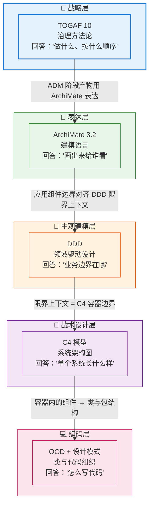
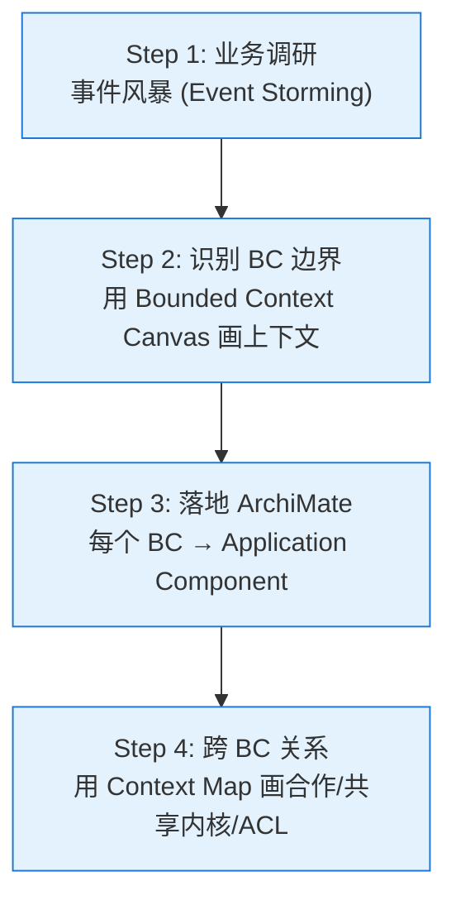
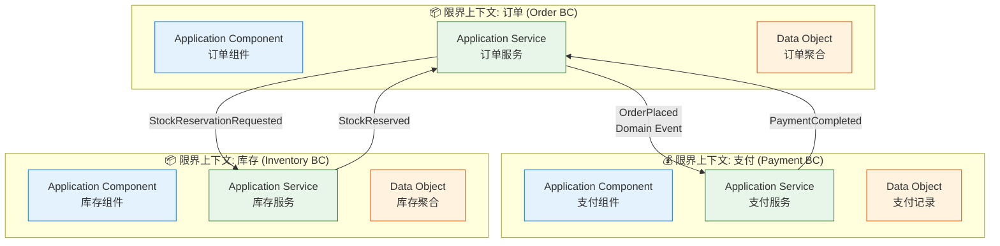

# 第三章：落地：ArchiMate × TOGAF × C4 × DDD

> ⬅️ [返回目录](README.md) | 上一篇：[视点：给不同人看不同的图](viewpoints.md)

---

## 🎯 一句话定位

**ArchiMate 解决"画什么"，TOGAF 解决"按什么流程画"，C4 解决"画到代码级多细"，DDD 解决"画出来的边界对不对"**——四者组合起来，才是企业架构的"完整工具箱"。本章给出一套**已经经过验证的工程实践模板**，让你在新项目里能直接照着用。

---

## 一、四件套定位：不要再问"用哪个"

### 1.1 长期被问错的问题

```
❌ "我应该用 ArchiMate 还是 C4？"
❌ "TOGAF 和 DDD 哪个更对？"
```

这类问题本质是**用错**了——四者不是**竞争关系**而是**互补关系**。真正的提问方式是：

```
✅ "在这个场景下，ArchiMate 画企业层、C4 画系统层、DDD 建模、TOGAF 跑流程，
    四个工具的边界怎么切、产出物怎么串？"
```

### 1.2 四件套全景对照



### 1.3 速查表

| 工具 | 解决的问题 | 产出物 | 谁来看 | 工具支持 |
|------|----------|--------|-------|---------|
| **TOGAF** | 治理流程 | ADM 阶段报告、治理章程 | CIO、架构委员会 | 项目管理工具 |
| **ArchiMate** | 可视化表达 | 30+ 视点图、模型库 | 全员（按视点） | Archi (开源) / BiZZdesign / MEGA / VS Code 插件 |
| **DDD** | 业务建模 | 限界上下文、聚合、领域事件 | 业务+架构+开发 | 任何工具，甚至 PPT |
| **C4** | 单系统架构 | Context/Container/Component/Code 4 层图 | 开发团队、Tech Lead | draw.io / PlantUML / Mermaid / Structurizr |
| **UML** | 详细设计 | 类图、时序图、状态图 | 开发者 | StarUML / PlantUML / Visual Paradigm |

---

## 二、ArchiMate × TOGAF：从"流程"到"图"

### 2.1 标准结合模式

TOGAF 10 ADM 的每个阶段都有对应的 ArchiMate 视点作为**交付物模板**。这是 Open Group 官方推荐的"双标准"实践。

**项目启动前 4 周的标准动作清单：**

| 周次 | TOGAF 动作 | ArchiMate 动作 | 产出物 |
|:---:|-----------|---------------|--------|
| W1 | 预备阶段 + 架构愿景 (A) | Stakeholder 视点 + Goal Realization 视点 + Layered 视点 | 干系人清单 + 目标树 + 系统全貌图 |
| W2 | 业务架构 (B) | Organization 视点 + Business Process Cooperation 视点 + Business Function 视点 | 组织/角色图 + 流程协作图 + 业务功能地图 |
| W3 | 信息系统架构 (C) + 技术架构 (D) | Application Cooperation/Structure 视点 + Information Structure 视点 + Infrastructure 视点 | 应用组件图 + 数据模型 + 部署拓扑图 |
| W4 | 机会与解决方案 (E) + 迁移规划 (F) | Strategy 视点 + Project 视点 + Implementation & Migration 视点 | 方案组合 + 路线图 + 阶段产物 |

> 📌 **坑点**：不要在 W1 试图把 7 个层全画完——会陷入"建模瘫痪"。**先画 Stakeholder + Goal + Layered 三个基础视点**，业务侧确认后再往下走。

### 2.2 实战模板：ArchiMate 视点库（推荐 7 张图）

对一个中型系统（5-20 个应用、3-5 个团队）做企业架构治理，**最少需要这 7 张图**：

```
01_组织协作图.architecture     →  Organization 视点
02_业务流程协作图.architecture →  Business Process Cooperation 视点
03_业务能力地图.architecture   →  Capability Map 视点
04_应用协作图.architecture     →  Application Cooperation 视点
05_应用结构图.architecture     →  Application Structure 视点
06_基础设施图.architecture     →  Infrastructure 视点
07_实施迁移图.architecture     →  Implementation & Migration 视点
```

**配套文档**（每图 1 页 A4 解读）：

| 文档 | 模板内容 |
|------|---------|
| 图名 + 视点类型 | 一行说明 |
| 目标读者 | 谁来看 |
| 核心结论 | 这张图想说明的 3 件事 |
| 阅读引导 | 1-2-3 的阅读顺序 |
| 维护责任人 | 谁负责更新 |
| 最近更新日期 | 防止"千年不更新" |

---

## 三、ArchiMate × DDD：限界上下文与 ArchiMate 元素对齐

### 3.1 概念映射

DDD 的核心概念（限界上下文、聚合、领域事件）与 ArchiMate 元素有**精确对应关系**。这是两者结合的关键。

| DDD 概念 | ArchiMate 对应元素 | 备注 |
|---------|-------------------|------|
| **限界上下文 (Bounded Context)** | **Application Component**（应用组件） | 一个 BC ≈ 一个应用组件，或一个应用组件对应一个 BC |
| **聚合 (Aggregate)** | **Data Object**（数据对象） + **Application Service** | 聚合根对应服务入口 |
| **实体 (Entity)** | **Data Object** | 实体 = 数据对象 |
| **值对象 (Value Object)** | **Data Object**（弱） | 不一定独立建模 |
| **领域服务 (Domain Service)** | **Application Service** | 与应用服务对齐 |
| **领域事件 (Domain Event)** | **Application Event** | 用于跨 BC 通信 |
| **上下文映射 (Context Map)** | **Application Cooperation 视点** + Flow 关系 | 表达 BC 间关系 |
| **通用语言 (Ubiquitous Language)** | **业务对象 / 应用服务命名** | 强制业务方与开发同词同义 |
| **防腐层 (ACL)** | **Application Component**（专门做适配） | 隔离外部模型 |

### 3.2 限界上下文 → ArchiMate 建模 4 步法



**示例**：电商订单域识别出 3 个 BC，落到 ArchiMate：



> 📌 **关键点**：BC 间的连接用 **Application Event**（领域事件），不要直接用 Flow 连 Application Service——领域事件具有"语义"和"可追溯"，比裸 Flow 信息量大得多。

---

## 四、ArchiMate × C4：企业层与系统层的"接力"

### 4.1 何时用 ArchiMate、何时用 C4？

| 场景 | 用 ArchiMate | 用 C4 |
|------|:----------:|:----:|
| 画**跨多个系统**的企业架构 | ✅ | ❌ |
| 画**单个系统**的内部架构 | ❌ | ✅ |
| 给**业务高管/IT 治理委员会**看 | ✅ | ❌ |
| 给**开发团队**看 | ❌ | ✅ |
| 表达**业务/应用/技术三层关系** | ✅ | ❌ |
| 表达**代码结构/类关系** | ❌ | ✅ |
| 表达**部署拓扑** | ✅（Infrastructure 视点） | ✅（Deployment 视图） |
| 表达**业务/技术动机/原则** | ✅ | ❌ |

> 📌 **判断口诀**：**"画在多个系统之间"用 ArchiMate，"画在系统内部"用 C4**。

### 4.2 接力示例：ArchiMate 找系统 → C4 看系统

```
Step 1: ArchiMate 应用协作图 (Application Cooperation 视点)
        ↓ 找到订单服务 是 8 个核心系统之一
Step 2: ArchiMate 应用结构图 (Application Structure 视点)
        ↓ 看到订单服务 = 订单API + 订单Worker + 订单DB
Step 3: 切到 C4 - Level 2 (Container 视图)
        ↓ 看订单API 的技术栈: Spring Boot + Redis
Step 4: 切到 C4 - Level 3 (Component 视图)
        ↓ 看 OrderController / OrderService / OrderRepository 类结构
Step 5: 切到 C4 - Level 4 (Code 视图)
        ↓ 看 OrderService.createOrder() 方法的详细时序
```

### 4.3 工具链协同

| 工具 | 建模内容 | 输出格式 |
|------|---------|---------|
| **Archi (开源)** | ArchiMate 全模型 | .archimate 文件、HTML 报告 |
| **draw.io / diagrams.net** | C4 各层图 | .drawio、PNG、SVG |
| **PlantUML + C4-PlantUML** | C4 文本化 | .puml、PNG、SVG |
| **Mermaid** | 简单 C4 + ArchiMate 摘要 | .md 内嵌 |
| **Structurizr DSL** | C4 4 层 + 部署视图 | .dsl、HTML |

> 💡 **推荐组合**：
> - **企业层（>3 个系统）** → Archi（.archimate 模型 + Archi 导出的 HTML 报告）
> - **单系统层（1-3 个系统）** → C4-PlantUML（.puml 文件 + CI 自动出图）
> - **代码级 / 时序** → PlantUML 原生语法

---

## 五、ArchiMate 落地 5 个反模式（避坑）

### 5.1 模型沉睡（Model Graveyard）

**症状**：花 3 个月画了 200 个元素的 ArchiMate 大模型，**没人看、没人用、没人更新**。

**根因**：为建模而建模，没嵌入到治理流程。

**对策**：
- 模型必须**有 Owner**（架构组 + 应用负责人双 Owner）
- 模型必须**绑定到决策**（每个 ADM 阶段评审时必看）
- 模型必须**自动化**（从 Archi 导出到 Confluence / Wiki，避免手动维护）

### 5.2 元素爆炸（Element Explosion）

**症状**：1000+ 元素的大模型，画图时一个视点塞 50+ 元素。

**根因**：不分层，细节、概要混在一个模型。

**对策**：
- **分层建模**：战略层 / 业务层 / 应用层 / 技术层 分 4 个子模型
- **按"概念粒度"分文件**：一个子领域一个 .archimate 文件
- **视点过滤**：用 Archi 的 View 机制只显示当前关注的元素

### 5.3 关系滥用（Relationship Spaghetti）

**症状**：连线纵横交错，关系种类 > 10 个，读者迷路。

**根因**：试图在一张图里表达所有结构。

**对策**：
- **单视点 ≤ 5 种关系**，多了就拆视点
- **结构关系 vs 依赖关系** 分图画，不要混
- **跨层桥接**只保留 1-2 条主线

### 5.4 标准漂移（Standard Drift）

**症状**：团队用 ArchiMate 半年后开始自由发挥，造出 5 个非标符号。

**根因**：没有视点规范文档。

**对策**：
- 建立 **ArchiMate 应用规范**（公司级 Wiki，1-2 页）
- 选 **5-7 个核心视点** 作为公司标准
- **培训 + Review**：新员工建模前必过 1 小时培训

### 5.5 工具切换（Tool Migration）

**症状**：用 Archi 一年后公司买了 BiZZdesign，又花半年重画。

**根因**：没有"模型导出为标准格式"。

**对策**：
- Archi 导出为 **Open Exchange XML**（标准格式）
- **模型与工具解耦**：用 Open Exchange XML 做长期归档
- 选工具时优先支持 **The Open Group 认证** 的（BiZZdesign、MEGA、Visual Paradigm）

---

## 六、3 步启动模板（最快落地）

如果你想**本季度**就在团队里把 ArchiMate 用起来，按这 3 步走：

```
┌─────────────────────────────────────────────┐
│  Step 1: 建模型（2 周）                       │
├─────────────────────────────────────────────┤
│  - 选 Archi 工具（免费开源）                   │
│  - 选 3 个核心视点：                          │
│    · Organization 组织协作                    │
│    · Application Cooperation 应用协作         │
│    · Infrastructure 基础设施                  │
│  - 画出现有系统的 3 张图                       │
│  - 邀请 2-3 个关键利益相关者评审              │
└─────────────────────────────────────────────┘
            ↓
┌─────────────────────────────────────────────┐
│  Step 2: 接流程（2 周）                       │
├─────────────────────────────────────────────┤
│  - 把 3 张图嵌入到现有架构评审流程            │
│  - 新项目立项时强制要求提交 Application      │
│    Cooperation 视点图                         │
│  - 模型 Owner 制度：每个图都有专人维护        │
└─────────────────────────────────────────────┘
            ↓
┌─────────────────────────────────────────────┐
│  Step 3: 扩规模（持续）                       │
├─────────────────────────────────────────────┤
│  - 增加 Motivation / Strategy 视点           │
│  - 与 DDD 限界上下文对齐                      │
│  - 推广到所有新项目                           │
│  - 半年一次回顾，更新视点模板库               │
└─────────────────────────────────────────────┘
```

---

## 七、本章小结

1. **ArchiMate / TOGAF / C4 / DDD** 是互补关系，不是竞争关系
2. **TOGAF 流程 + ArchiMate 视点** = Open Group 双标准实践，落地最稳
3. **DDD 限界上下文 = ArchiMate Application Component**，4 步法对齐
4. **企业层用 ArchiMate，系统层用 C4**，工具链自动协同
5. **5 大反模式要避**：模型沉睡、元素爆炸、关系滥用、标准漂移、工具切换
6. **3 步启动模板**：2 周建模 → 2 周接流程 → 持续扩规模

---

> 🎯 **实战建议**：先回到 [README 总览](README.md) 的"Top 8 高频视点"选 1-2 个最贴你当前项目的视点，**今天就开始画**。比读完整本笔记再动手重要得多。
