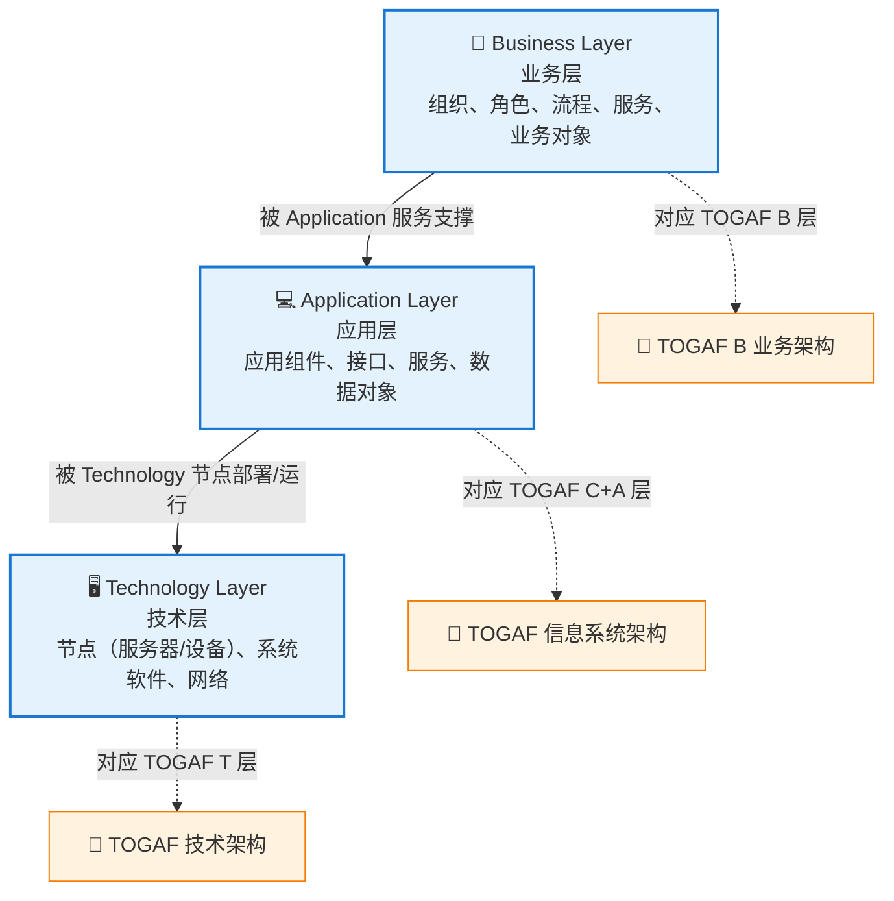
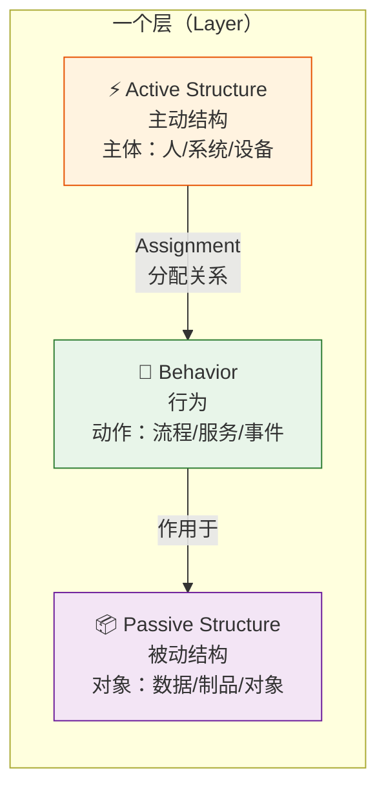
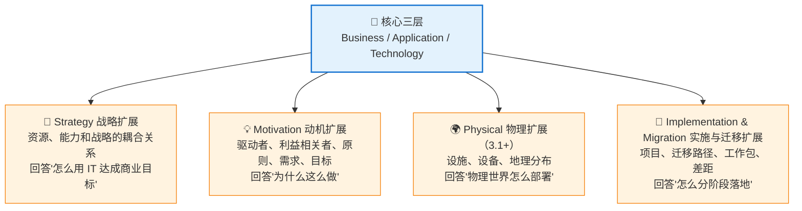

# 第一章：建模语言：层、方面、关系

> ⬅️ [返回目录](README.md) | 下一篇：[视点：给不同人看不同的图](viewpoints.md)

---

## 🎯 一句话定位

**ArchiMate 的语言只有三个"轴"**——**层（Layer）**告诉你"画在哪一层"，**方面（Aspect）**告诉你"画的是主动结构 / 行为 / 被动结构"，**关系（Relationship）**告诉你"用什么线连起来"。把三个轴弄清楚，就能读懂 90% 的 ArchiMate 图。

---

## 一、核心三层（Core Layers）：架构图的"地基"

ArchiMate 3.x 的核心层是三段式——**业务 → 应用 → 技术**，自上而下依赖、自下而上支撑。这与 TOGAF 的 **B-C-A-T**（业务 / 数据应用 / 应用 / 技术）四层几乎对应（ArchiMate 把 TOGAF 的"数据+应用"合在 Application 层用被动结构表达）。

### 1.1 三层全景

### 1.2 三层核心元素速查

| 层 | 主动结构（谁） | 行为（做什么） | 被动结构（被作用） |
|----|--------------|---------------|-------------------|
| **业务层** | Business Actor（业务角色/部门）、Business Role（业务角色）、Business Collaboration（业务协作）、Business Interface（业务接口） | Business Process（业务流程）、Business Function（业务功能）、Business Interaction（业务交互）、Business Service（业务服务）、Business Event（业务事件） | Business Object（业务对象）、Contract（合同）、Product（产品）、Representation（表征） |
| **应用层** | Application Component（应用组件）、Application Collaboration（应用协作）、Application Interface（应用接口） | Application Service（应用服务）、Application Function（应用功能）、Application Interaction（应用交互）、Application Process（应用流程）、Application Event（应用事件） | Data Object（数据对象） |
| **技术层** | Node（节点：服务器/设备）、Device（设备）、System Software（系统软件：OS/中间件）、Technology Collaboration、Technology Interface、Path（通信路径） | Technology Service（技术服务）、Technology Function（技术功能）、Technology Interaction、Technology Process、Technology Event | Artifact（制品：可执行文件、库、文档） |

> 📌 **记忆口诀**：**"谁做、做什么、对谁做"**——主动结构是主语、行为是谓语、被动结构是宾语。

---

## 二、四个方面（Aspects）：每个层里的"三视角"

每层内部都分为 **3 个方面**（ArchiMate 3.1+ 把 Composite Element 独立出来）。任何元素都属于其中一个：

### 2.1 三方面详解

| 方面 | 一句话 | 业务层示例 | 应用层示例 | 技术层示例 |
|------|--------|-----------|-----------|-----------|
| **⚡ 主动结构** | 做事的主体 | 业务角色（客户经理） | 应用组件（订单服务） | 节点（订单服务器） |
| **🔄 行为** | 主体做的动作 | 业务流程（开立账户） | 应用服务（账户查询 API） | 技术服务（数据库连接池） |
| **📦 被动结构** | 被作用的对象 | 业务对象（客户） | 数据对象（账户记录） | 制品（订单服务 jar） |

### 2.2 复合元素（Composite Element）

3.1+ 起，**Composite Element** 是显式可同时承担多面身份的"复合单元"——例如：
- 一个**应用组件**（主动）**实现**了一个**应用服务**（行为）**并操作**了一个**数据对象**（被动），用 Composite 表达三者绑定关系
- 在工具中常以"圆角矩形带 Active/Behavior/Passive 标记"显示

---

## 三、四个扩展层（Extension Layers）：补上"为什么、做什么、何时做"

三层骨架之外，ArchiMate 用**扩展层**补足企业架构关心的另外三个问题：

### 3.1 Strategy 战略扩展

| 元素 | 一句话 | 业务场景 |
|------|--------|---------|
| **Resource（资源）** | 组织可调用的资产（人/钱/系统） | 风险控制团队、CRM 系统 |
| **Capability（能力）** | 组织"能做什么"（与"如何做"解耦） | 客户洞察能力、风险评估能力 |
| **Value（价值）** | 对内/对外的可货币化或非货币化价值 | 客户留存价值、监管合规价值 |
| **Strategy（战略）** | 实现目标的计划 | 数字化转型战略 |

### 3.2 Motivation 动机扩展

| 元素 | 一句话 | 业务场景 |
|------|--------|---------|
| **Stakeholder（利益相关者）** | 受架构影响或影响架构的角色 | CFO、监管机构、客户 |
| **Driver（驱动者）** | 推动变革的根因 | 监管新规、竞品压力 |
| **Goal（目标）** | 想达到的高阶目的 | 提升客户 NPS 20% |
| **Principle（原则）** | 指导决策的通用规则 | 数据安全优先于成本 |
| **Requirement（需求）** | 具体可衡量的诉求 | 关键交易 RTO < 5min |
| **Constraint（约束）** | 不可妥协的硬限制 | 必须等保三级 |

### 3.3 Physical 物理扩展（3.1+）

| 元素 | 一句话 |
|------|--------|
| **Facility（设施）** | 物理场所：机房、办公地点 |
| **Equipment（设备）** | 物理硬件：服务器机柜、网络设备 |
| **Distribution Network（分布网络）** | 设施间的物理连接 |
| **Material（物资）** | 物理流转的实物 |

> 📌 **与 Technology 层的区别**：Technology 层是**逻辑**的（节点/服务），Physical 层是**物理**的（机房/机柜/线缆）。一个应用组件（Application）跑在节点（Technology）上，节点（Technology）装在机柜（Physical）里。

### 3.4 Implementation & Migration 实施与迁移扩展

| 元素 | 一句话 |
|------|--------|
| **Work Package（工作包）** | 可交付的变更单元 |
| **Deliverable（交付物）** | 工作包的产出 |
| **Gap（差距）** | 基线与目标架构之间的差异 |
| **Plateau（平台期）** | 过渡架构的某个稳定状态 |
| **Project（项目）** | 一组工作包的有序执行 |
| **Migration Path（迁移路径）** | 从基线 → 目标的多步过渡 |

---

## 四、关系（Relationships）：连接元素的"线"

ArchiMate 3.2 共有 **8 大关系 + 1 辅助关联**，按用途可分为**结构关系**和**依赖关系**两大类。

### 4.1 关系全景

```mermaid
graph TB
    Rel["🔗 ArchiMate 关系全集"]

    Rel --> Str["🧱 结构关系<br/>Structural"]
    Rel --> Dep["🔀 依赖关系<br/>Dependency"]
    Rel --> Oth["🌀 其他关系<br/>Other"]

    Str --> S1["Composition 组合（实心菱形）<br/>强生命周期绑定，删父则子亡"]
    Str --> S2["Aggregation 聚合（空心菱形）<br/>弱生命周期绑定，子可独立"]
    Str --> S3["Assignment 分配（实线箭头）<br/>主动结构 '做' 行为/持有被动结构"]
    Str --> S4["Realization 实现（虚线空心三角）<br/>具体实现抽象，如组件实现服务"]
    Str --> S5["Specialization 特化（虚线空心三角）<br/>父子类型关系"]

    Dep --> D1["Serving 服务（实线空心三角）<br/>一个元素 '为' 另一个提供功能"]
    Dep --> D2["Access 访问（虚线实心箭头）<br/>行为访问被动结构"]
    Dep --> D3["Influence 影响（虚线 + 字）<br/>一个元素 '影响' 另一个的决策"]
    Dep --> D4["Triggering 触发（虚线 + 字）<br/>一个事件/流程 触发 另一个事件/流程"]

    Oth --> O1["Association 关联（最弱，仅表示存在）"]
    Oth --> O2["Flow 流（主动结构间的信息流）"]
    Oth --> O3["Junction 汇合（AND/OR 多输入汇合）"]

    classDef str fill:#e3f2fd,stroke:#1976d2
    classDef dep fill:#fff3e0,stroke:#e65100
    classDef oth fill:#e8f5e9,stroke:#2e7d32
    class Str,S1,S2,S3,S4,S5 str
    class Dep,D1,D2,D3,D4 dep
    class Oth,O1,O2,O3 oth
```

### 4.2 关系选型决策表

| 你想表达 | 用什么关系 | 典型句式 | 画法 |
|---------|-----------|---------|------|
| 父组件由子组件**组成**，子不能独立 | **Composition** | "订单服务 = [订单API + 订单DB]" | 实心菱形 |
| 父对象**包含**子对象，子可独立 | **Aggregation** | "订单服务集群 = [节点1, 节点2, ...]" | 空心菱形 |
| 主体**做**行为 / **持有**对象 | **Assignment** | "客户经理 履行 受理流程" | 实线箭头 |
| 具体**实现**抽象 | **Realization** | "订单组件 实现 订单服务" | 虚线空心三角 |
| 子类型是父类型的**特例** | **Specialization** | "VIP客户经理 是一种 客户经理" | 虚线空心三角（带尖角） |
| A **为** B 提供功能 | **Serving** | "订单服务 服务于 订单API" | 实线空心三角 |
| 行为**操作**对象 | **Access** | "订单流程 访问 订单数据" | 虚线实心箭头 |
| A **影响** B 的实现方式 | **Influence** | "GDPR 影响 客户数据服务" | 虚线箭头 + "Influences+" |
| A **触发** B | **Triggering** | "下单事件 触发 支付流程" | 虚线箭头 + "Triggers" |
| 主动结构间有**信息流** | **Flow** | "订单服务 流向 库存服务" | 虚线箭头 |
| 仅表示**有关** | **Association** | （实在想不出时再用） | 虚线 |

> ⚠️ **常见错误**：用 Serving 表达"调用关系"——这是**反模式**。Serving 的语义是"提供功能价值"，不是"消息调用"。表达"调用"应使用 Flow + Triggering 组合。

### 4.3 关系使用铁律

1. **结构关系**（Composition/Aggregation/Assignment/Realization）只用于**同层内**或**相邻层**之间
2. **依赖关系**（Serving/Access/Influence/Triggering）才能跨**任意层**
3. **同名关系**才能出现在同一条线段上，**多层关系**用"链式连接"（如业务服务 → 应用服务 → 技术服务）
4. **不允许**业务对象直接组合到数据对象（跨层要经过 Application Service 桥接）

---

## 五、ArchiMate vs C4 vs UML：建模语言定位对比

| 维度 | **ArchiMate** | **C4 模型** | **UML 2.5** |
|------|--------------|-----------|-------------|
| **层级** | 三层 + 四扩展（7 个领域） | 四层（Context/Container/Component/Code） | 14 种图（结构 7 + 行为 7） |
| **关系** | 8+1 标准化关系 | 11 种箭头（部分自定义语义） | 多种关系，语义复杂 |
| **标准化** | The Open Group 国际标准 | 社区最佳实践（Simon Brown） | OMG 国际标准 |
| **目标受众** | 业务+架构师+技术 全栈 | 主要是开发团队 | 软件工程师 |
| **使用门槛** | 中（要记图符） | 低（箭头 + 文字标签） | 高（记 14 种图） |
| **表达范围** | 业务+应用+技术+动机+战略 | 仅软件系统（含人员） | 仅软件系统（含业务模型） |
| **典型场景** | 企业级治理 + 跨团队对齐 | 单一系统的多视角沟通 | 详细设计 + 模式表达 |
| **关系** | 表达"业务→IT"完整价值链 | 表达"一个系统长什么样" | 表达"一个类/流程/状态长什么样" |

> 📌 **实操建议**：用 **ArchiMate** 画"企业/平台层"的图，用 **C4** 画"单个系统/服务"的图，用 **UML** 画"代码/状态/时序"细节。三者**互补**，不互斥。

---

## 六、本章小结

1. **3 个核心层**（业务/应用/技术）+ **4 个扩展层**（战略/动机/物理/实施与迁移）= ArchiMate 的全部"地盘"
2. **3 个方面**（主动/行为/被动）= 每层内部的"三种视角"
3. **8 大关系**（5 结构 + 4 依赖）= 元素之间唯一的"连接方式"
4. **ArchiMate 与 TOGAF 是"语法与语法书"**：TOGAF 流程 + ArchiMate 表达 = 完整企业架构实践
5. **ArchiMate / C4 / UML** 各有定位，组合使用最强

---

> 下一篇：[第二章：视点：给不同人看不同的图](viewpoints.md) →
