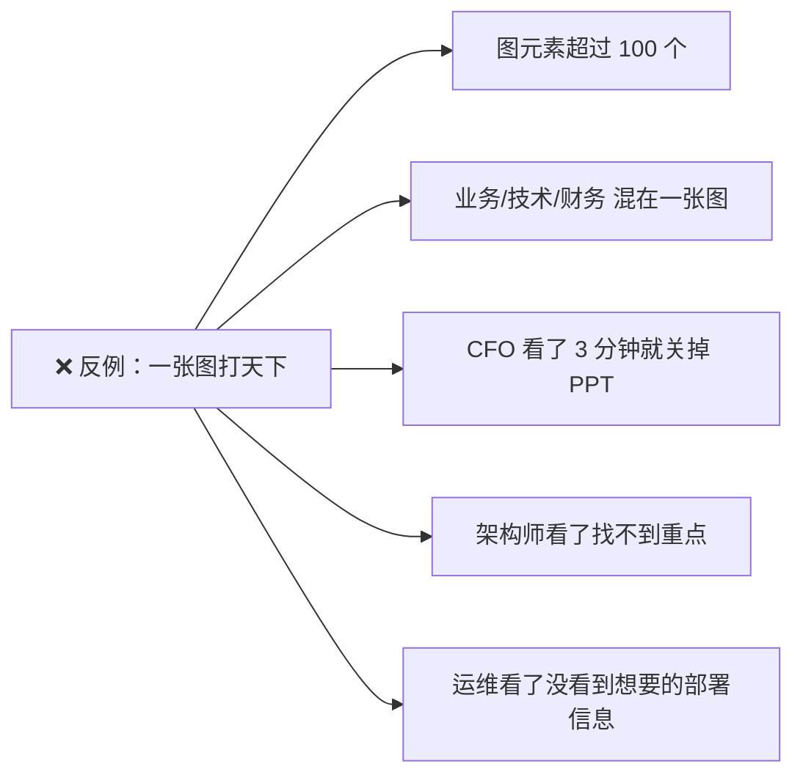
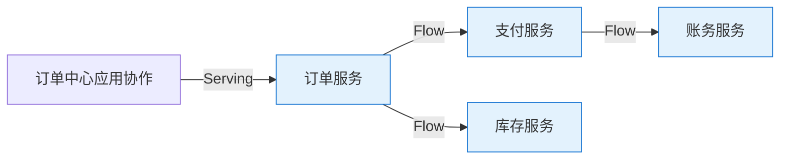
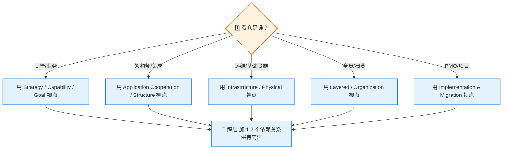

# 第二章：视点：给不同人看不同的图

> ⬅️ [返回目录](README.md) | 上一篇：[建模语言：层、方面、关系](language.md) | 下一篇：[落地：ArchiMate × TOGAF × C4 × DDD](in-practice.md)

---

## 🎯 一句话定位

**视点（Viewpoint）= 一张图的"取景框"**——它从完整模型里裁出一个特定切片给特定受众看。同一个企业架构模型，CIO 看"组织能力地图"，架构师看"应用协作图"，运维看"技术部署图"，本质是**给同一群人不同人开不同的窗**。ArchiMate 3.2 提供了 30+ 预定义视点，本章帮你建立"按需选点"的能力。

---

## 一、为什么需要视点？

### 1.1 没有视点的悲剧

假设你把 ArchiMate 全量元素（业务/应用/技术/战略/动机/物理/实施）一股脑画在一张大图里，会发生什么？



**结果**：画图的人很努力，看图的人很痛苦。这不是 ArchiMate 的失败，是**没用对**的失败。

### 1.2 视点的本质

视点的本质是**3 个约束**的组合：

| 约束 | 含义 | 例子 |
|------|------|------|
| **受众 (Stakeholder)** | 这张图给谁看？ | CIO / 架构师 / 运维 / 业务方 |
| **关注 (Concern)** | 受众关心什么？ | 投资回报 / 集成关系 / 部署拓扑 / 流程瓶颈 |
| **取舍 (Selection)** | 从模型里选哪些元素/关系呈现？ | 只画业务服务到应用服务的 Serving |

> 📌 **Archimate 3.2 的核心信条**：**一张图只讲一件事，讲清楚一件事再换图**。

---

## 二、视点分类（3 大类 × 30+ 视点）

```mermaid
graph TB
    V["👁️ ArchiMate 3.2 视点全集<br/>~30 个"]

    V --> F["🧱 Foundation 基础视点<br/>~8 个<br/>跨层通用、关注基本结构"]
    V --> C["💎 Core 核心视点<br/>~14 个<br/>三层内部、聚焦架构本体"]
    V --> E["🧩 Extension 扩展视点<br/>~8 个<br/>覆盖动机/战略/实施"]

    F --> F1["Organization 视点"]
    F --> F2["Information Structure 视点"]
    F --> F3["Technology 视点"]
    F --> F4["Layered 视点"]
    F --> F5["Strategy 视点"]
    F --> F6["Capability Map 视点"]
    F --> F7["Goal Realization 视点"]
    F --> F8["Stakeholder 视点"]

    C --> C1["Application Cooperation 视点"]
    C --> C2["Application Structure 视点"]
    C --> C3["Application Usage 视点"]
    C --> C4["Application Realization 视点"]
    C --> C5["Application Migration 视点"]
    C --> C6["Data Migration 视点"]
    C --> C7["Infrastructure 视点"]
    C --> C8["Infrastructure Usage 视点"]
    C --> C9["Infrastructure Realization 视点"]
    C --> C10["Business Process Cooperation 视点"]
    C --> C11["Business Process 视点"]
    C --> C12["Product 视点"]
    C --> C13["Service Realization 视点"]
    C --> C14["Resource Map 视点"]

    E --> E1["Motivation 视点"]
    E --> E2["Project 视点"]
    E --> E3["Migraton 视点"]
    E --> E4["Implementation & Deployment 视点"]
    E --> E5["Physical 视点"]
    E --> E6["Geographical 视点"]
    E --> E7["Outcome Realization 视点"]
    E --> E8["Value 视点"]

    classDef f fill:#e3f2fd,stroke:#1976d2
    classDef c fill:#e8f5e9,stroke:#2e7d32
    classDef e fill:#fff3e0,stroke:#e65100
    class V f
    class F,F1,F2,F3,F4,F5,F6,F7,F8 f
    class C,C1,C2,C3,C4,C5,C6,C7,C8,C9,C10,C11,C12,C13,C14 c
    class E,E1,E2,E3,E4,E5,E6,E7,E8 e
```



---

## 三、Top 8 高频视点详解

实战中 80% 的场景用这 8 个视点就够了：

### 3.1 Organization 视点（组织视点）

| 项 | 内容 |
|----|------|
| **受众** | 业务高管、组织发展部、HR |
| **关注** | 组织结构、角色分工、协作关系 |
| **包含元素** | Business Actor、Business Role、Business Collaboration、Business Interface |
| **包含关系** | Composition、Aggregation、Assignment、Triggering |
| **典型问题** | "客服中心由哪些角色组成？跨部门协作关系？" |
| **使用频率** | ⭐⭐⭐⭐⭐ |

```text
                ┌─────────────────────────┐
                │  呼叫中心业务协作         │
                │  Call Center Collab.     │
                └────────────┬────────────┘
                             │ Assignment
            ┌────────────────┼────────────────┐
            │                │                │
    ┌───────▼──────┐ ┌──────▼───────┐ ┌──────▼──────┐
    │ 业务角色      │ │ 业务角色      │ │ 业务角色      │
    │ 客服专员      │ │ 质检员        │ │ 班组长        │
    └───────┬──────┘ └──────┬───────┘ └──────┬──────┘
            │Assignment      │Assignment      │Assignment
    ┌───────▼──────┐ ┌──────▼───────┐ ┌──────▼──────┐
    │ 业务流程      │ │ 业务流程      │ │ 业务流程      │
    │ 工单受理      │ │ 通话质检      │ │ 排班管理      │
    └──────────────┘ └──────────────┘ └─────────────┘
```

### 3.2 Application Cooperation 视点（应用协作视点）

| 项 | 内容 |
|----|------|
| **受众** | 应用架构师、集成架构师 |
| **关注** | 系统间如何交互、调用关系 |
| **包含元素** | Application Component、Application Collaboration、Application Service、Application Interface |
| **包含关系** | Composition、Assignment、Serving、Flow |
| **典型问题** | "订单服务和支付服务怎么连？同步还是异步？" |
| **使用频率** | ⭐⭐⭐⭐⭐ |



### 3.3 Application Structure 视点（应用结构视点）

| 项 | 内容 |
|----|------|
| **受众** | 应用架构师、技术负责人 |
| **关注** | 应用的内部组成、数据对象、接口 |
| **包含元素** | Application Component、Application Service、Data Object、Application Interface |
| **包含关系** | Realization、Assignment、Access |
| **典型问题** | "订单服务由哪些子组件组成？操作哪些数据？" |
| **使用频率** | ⭐⭐⭐⭐ |

### 3.4 Infrastructure 视点（基础设施视点）

| 项 | 内容 |
|----|------|
| **受众** | 运维、SRE、基础设施架构师 |
| **关注** | 服务器、网络、部署拓扑 |
| **包含元素** | Node、Device、System Software、Path、Artifact |
| **包含关系** | Composition、Assignment、Serving、Flow |
| **典型问题** | "应用部署在哪些服务器？网络怎么连？" |
| **使用频率** | ⭐⭐⭐⭐⭐ |

### 3.5 Layered 视点（分层视点）

| 项 | 内容 |
|----|------|
| **受众** | 全员（最容易懂的概览图） |
| **关注** | 架构全貌的分层结构 |
| **包含元素** | 所有层的核心元素（简化版） |
| **包含关系** | 跨层 Serving、Assignment |
| **典型问题** | "整个系统大概长什么样？" |
| **使用频率** | ⭐⭐⭐⭐⭐ |

> 📌 **首次汇报/项目立项**用这个视点最稳：信息密度低、结构清晰、受众广。

### 3.6 Strategy / Capability Map 视点（战略/能力地图视点）

| 项 | 内容 |
|----|------|
| **受众** | CIO、战略部门、董事会 |
| **关注** | 战略目标如何被业务能力支撑 |
| **包含元素** | Resource、Capability、Value、Strategy、Goal、Driver |
| **包含关系** | Composition、Influence、Realization |
| **典型问题** | "数字化战略需要哪些能力？现有能力差距在哪？" |
| **使用频率** | ⭐⭐⭐⭐ |

### 3.7 Goal Realization 视点（目标实现视点）

| 项 | 内容 |
|----|------|
| **受众** | 高管、PMO、需求分析师 |
| **关注** | 目标如何被需求、原则、组件层层落实 |
| **包含元素** | Goal、Requirement、Principle、Constraint、Stakeholder |
| **包含关系** | Influence、Realization、Aggregation |
| **典型问题** | "提升客户 NPS 20% 这个目标怎么落地到系统？" |
| **使用频率** | ⭐⭐⭐ |

### 3.8 Implementation & Migration 视点（实施与迁移视点）

| 项 | 内容 |
|----|------|
| **受众** | PMO、架构委员会、项目经理 |
| **关注** | 现状→目标的多阶段迁移路径 |
| **包含元素** | Work Package、Project、Plateau、Deliverable、Gap |
| **包含关系** | Triggering、Composition、Flow |
| **典型问题** | "从单体到微服务的 3 年迁移路径怎么排？" |
| **使用频率** | ⭐⭐⭐⭐ |

---

## 四、视点选型决策树

面对一个具体场景，怎么选视点？按下面 4 步走：



### 4.1 选视点的 3 个原则

1. **一图一受众**：同一张图只给一类人看，不要试图在 CIO 汇报图里加部署细节
2. **一图一关注**：同一张图只回答一个问题（如"应用间集成"），不要"系统架构 + 部署 + 人员"全画
3. **3-7 个元素原则**：单视点元素超过 10 个就拆分；少于 3 个说明没信息量

### 4.2 反模式：视点滥用

| 反模式 | 表现 | 危害 |
|--------|------|------|
| **"一图全画"** | 在 Layered 视点里塞 50 个元素 | 谁也看不懂 |
| **"伪视点"** | 自己造一个 ArchiMate 不认的视点 | 失去标准化价值 |
| **"PPT 视点"** | 只画给领导看的"漂亮图"、缺支撑元素 | 落地时发现对不上 |
| **"千年不更新"** | 视点图 5 年没变，代码已迭代 10 个版本 | 视点变成"谎言图" |

---

## 五、ArchiMate 3.2 × TOGAF 10 ADM：视点与阶段的对应

TOGAF 10 ADM 的每个阶段都推荐了 1-2 个标准视点作为**产物模板**。下表是落地时最常用的对应关系：

| TOGAF 10 ADM 阶段 | 推荐视点 | 输出目标 |
|------------------|---------|---------|
| **A. 架构愿景** | Stakeholder + Goal Realization + Layered | 干系人诉求、目标层次、整体轮廓 |
| **B. 业务架构** | Organization + Business Process Cooperation + Business Process | 组织/角色/流程 |
| **C. 信息系统架构 - 数据** | Information Structure + Application Structure（数据视角） | 数据对象模型 |
| **C. 信息系统架构 - 应用** | Application Cooperation + Application Structure | 应用组件与服务 |
| **D. 技术架构** | Infrastructure + Technology + Physical + Geographical | 部署拓扑与物理布局 |
| **E. 机会与解决方案** | Strategy + Goal Realization + Project | 方案组合与项目群 |
| **F. 迁移规划** | Implementation & Migration + Plateau | 路线图与阶段产物 |
| **G. 实施治理** | Application Realization + Infrastructure Realization | 实现对照、合规检查 |
| **H. 架构变更管理** | Gap + Implementation & Migration | 变更影响分析 |
| **需求管理（贯穿）** | Motivation + Goal Realization | 需求追溯链 |

> 📌 **实操建议**：用 Archi 工具建模时，建立**视点模板库**——每个 ADM 阶段对应一个模板视点，拖拽式出图。

---

## 六、视点模板编写 5 步法

写一个新视点（自定义）时，按 5 步走：

```text
Step 1: 明确受众      →  CIO？架构师？开发？运维？业务？
Step 2: 列出关注      →  这群人最关心哪 3-5 件事？
Step 3: 选择元素      →  在主模型里筛出对应的 ArchiMate 元素
Step 4: 选择关系      →  只保留回答"关注"必需的关系，删其余
Step 5: 标注呈现规则  →  颜色/分组/标注/示例数据
```

**示例：自定义"API 治理视点"**

| Step | 决策 | 内容 |
|------|------|------|
| 1. 受众 | 平台架构师 + API 网关负责人 | 关心服务治理 |
| 2. 关注 | API 拥有者、调用方、SLA、安全等级 | 3 件事 |
| 3. 元素 | Application Service + Application Interface + Data Object | 限 3 类 |
| 4. 关系 | Serving + Flow + Realization | 限 3 种 |
| 5. 规则 | 服务按 owner 团队分组、安全等级用颜色 | 清晰可读 |

---

## 七、本章小结

1. **视点 = 取景框**，从完整模型里切出特定切片给特定受众
2. **3 大类视点**：Foundation（基础）/ Core（核心）/ Extension（扩展）
3. **Top 8 高频视点**：Organization、Application Cooperation、Application Structure、Infrastructure、Layered、Strategy/Capability、Goal Realization、Implementation & Migration
4. **选视点 3 原则**：一图一受众、一图一关注、3-7 元素
5. **TOGAF 10 ADM 9 阶段**与 ArchiMate 视点一一对应，是落地最稳的组合
6. **自定义视点 5 步法**：明确受众 → 列出关注 → 选择元素 → 选择关系 → 标注规则

---

> 下一篇：[第三章：落地：ArchiMate × TOGAF × C4 × DDD](in-practice.md) →
