<!--
module:
  parent: system-design
  slug: system-design/it4it
  type: article
  category: 主模块子文章
  summary: **IT4IT**（Information Technology Infrastructure Library for IT, "IT 的 ITIL"）是 Th...
-->

# IT 价值流参考架构（IT4IT 3.0）

> **IT4IT**（Information Technology Infrastructure Library for IT, "IT 的 ITIL"）是 The Open Group 维护的**IT 运营价值流参考架构**。  
> 与 TOGAF（治理方法论）、ArchiMate（建模语言）并列为"数字开放标准组合"第三件套。  
> 最新版本是 **IT4IT 3.0**（2024 年发布），相比 2.x 强化了**数字产品交付**和**云原生**适配。  
> 最后更新: 2026-06-10

---
## 引言：架构困境（[AUTO] 自动生成，待人工 review）

IT 价值流参考架构（IT4IT 3.0） 的**IT4IT**（Information Technology Infrastructure Library for IT, "IT 的 ITIL"）是 The Open Group 维护的**IT 运营价值流参考架构**

**但实际**：常被问起'这种方案我怎么选'/'大厂怎么做'。本篇用'决策困境'切入，比较几种主流路径并讲清取舍。

> 📌 本段由 `note/scripts/add-intro.py` 自动生成（场景模板 + README 摘录）。**下次 review 时请改为真实场景 + 数字 + 反思**，目前仅满足'有引言'的最低要求。

---


## 🎯 一句话定位

**IT4IT 是一套"以价值流为骨架"的 IT 运营参考架构**——它不管企业整体怎么治理（那是 TOGAF 的事），也不管架构图怎么画（那是 ArchiMate 的事），**它只回答一个问题："IT 部门怎么把业务请求高效、可控、可追溯地变成运行中的服务"**。如果说 TOGAF 是"做架构的方法论"，ArchiMate 是"表达架构的语法"，那 IT4IT 就是"IT 部门自身的业务模型"。

---

## 🆕 IT4IT 3.0 速览（vs 2.x）

| 维度 | IT4IT 2.x | **IT4IT 3.0** |
|------|----------|--------------|
| **发布** | 2015-2017 | 2024 |
| **维护方** | IT4IT Forum → The Open Group | The Open Group 正式标准 |
| **核心结构** | 4 价值流 + 7 功能组件 | **4 价值流 + 9 功能组件**（新增 Strategy、Governance） |
| **数据对象** | 12 个 | **18 个**（新增 Project、Release、Service Level Objective 等） |
| **参考架构层** | Information / Functional / Integration | **4 层**（新增 Implementation Layer） |
| **DevOps 适配** | 隐含 | **显式**：Plan to Deliver 价值流强化 CI/CD 集成 |
| **云原生** | 部分 | **完整**：Service Backbone、Product Model |
| **认证** | IT4IT Foundation/Practitioner | **IT4IT 3.0 Certified**（与 TOGAF 10、ArchiMate 3.2 互通） |

### IT4IT 3.0 全景结构

```mermaid
graph TB
    I3["🏭 IT4IT 3.0<br/>IT 价值流参考架构"]

    I3 --> VS["🌀 价值流 (Value Streams)<br/>4 条端到端流"]
    I3 --> FC["⚙️ 功能组件 (Functional Components)<br/>9 个核心 IT 能力"]
    I3 --> DO["📦 数据对象 (Data Objects)<br/>18 个关键 IT 资产"]
    I3 --> RA["🏗️ 参考架构 (Reference Architecture)<br/>4 层：信息/功能/集成/实现"]

    VS --> V1["📋 R2F<br/>Request to Fulfill<br/>从业务请求到服务交付"]
    VS --> V2["🎧 R2S<br/>Request to Service<br/>从用户请求到服务使用"]
    VS --> V3["🔍 D2C<br/>Detect to Correct<br/>从事件检测到故障恢复"]
    VS --> V4["🚀 P2D<br/>Plan to Deliver<br/>从计划到持续交付"]

    FC --> F1["Strategy 战略"]
    FC --> F2["Governance 治理"]
    FC --> F3["Demand 需求"]
    FC --> F4["Portfolio 组合"]
    FC --> F5["Catalog 目录"]
    FC --> F6["Requirement 需求规格"]
    FC --> F7["Design 设计"]
    FC --> F8["Transition 转换"]
    FC --> F9["Operation 运营"]

    RA --> R1["📊 Information Layer<br/>信息层（数据对象）"]
    RA --> R2["⚙️ Functional Layer<br/>功能层（做什么）"]
    RA --> R3["🔌 Integration Layer<br/>集成层（如何连）"]
    RA --> R4["🖥️ Implementation Layer<br/>实现层（用什么技术）"]

    classDef std fill:#e3f2fd,stroke:#1976d2,stroke-width:2px
    classDef vs fill:#fff3e0,stroke:#e65100
    classDef fc fill:#e8f5e9,stroke:#2e7d32
    classDef ra fill:#f3e5f5,stroke:#6a1b9a
    class I3 std
    class VS,V1,V2,V3,V4 vs
    class FC,F1,F2,F3,F4,F5,F6,F7,F8,F9 fc
    class RA,R1,R2,R3,R4 ra
```



---

## 📚 章节导航

| 章节 | 文件 | 核心问题 | 建议时长 |
|:----:|:-----|:---------|:--------:|
| **第一章** | [价值流：从请求到服务的 4 条路](value-streams.md) | 4 大价值流如何覆盖 IT 运营全链路？ | 50 min |
| **第二章** | [功能组件：9 大 IT 能力 + 数据对象](functional-components.md) | 9 大功能组件与 18 个数据对象如何协作？ | 45 min |
| **第三章** | [落地：IT4IT × ITIL × DevOps](in-practice.md) | 真实项目里 IT4IT 怎么与现有运维体系配合？ | 35 min |

### 推荐阅读顺序

```
README（你在这里）  →  第一章（4 价值流）
        ↓
        第二章（9 功能组件）→ 第三章（落地组合）
```

- **时间紧张**（30 分钟）：先读本章"核心概念速查" + 第一章 1.1
- **IT 管理者视角**：三章通读 + 第三章的"IT4IT × ITIL"对照
- **架构师视角**：重点看第二章 2.1（功能组件 + 数据对象） + 第三章的"IT4IT × ArchiMate"
- **DevOps 工程师**：重点看第一章 1.4（P2D 价值流） + 第三章的"IT4IT × DevOps"

---

## ⚡ 核心概念速查

| 概念 | 一句话定义 | 章节 |
|------|----------|:----:|
| **IT4IT** | IT 价值流参考架构，The Open Group 标准 | 全部 |
| **价值流 (Value Stream)** | 从某种触发到产出的端到端流——IT 价值的"主干道" | [第一章](value-streams.md) |
| **R2F (Request to Fulfill)** | 业务需求 → 投资决策 → 解决方案上线 | [第一章](value-streams.md) |
| **R2S (Request to Service)** | 用户请求 → 服务消费 → 价值兑现 | [第一章](value-streams.md) |
| **D2C (Detect to Correct)** | 事件检测 → 故障定位 → 恢复交付 | [第一章](value-streams.md) |
| **P2D (Plan to Deliver)** | 计划 → 设计 → 持续交付 → 部署 | [第一章](value-streams.md) |
| **功能组件 (Functional Component)** | IT 部门的"职能单位"——一组相关的 IT 活动 | [第二章](functional-components.md) |
| **数据对象 (Data Object)** | 价值流之间流转的"IT 资产"——Brief, Demand, Service, Incident 等 | [第二章](functional-components.md) |
| **服务骨干 (Service Backbone)** | IT4IT 3.0 新增的"数据贯通总线"——打通各价值流的数据交换 | [第一章](value-streams.md) |
| **参考架构 (Reference Architecture)** | 4 层模型（信息/功能/集成/实现）——描述 IT 系统的"架构维" | [第二章](functional-components.md) |
| **ITIL** | IT 基础设施库——IT4IT 的"前辈"，偏流程实践 | [第三章](in-practice.md) |

---

## 🧭 IT4IT 在系统设计中的位置

```
企业治理层：TOGAF（企业架构） → 决定"做什么系统、由谁做、怎么治理"
        ↓
架构表达层：ArchiMate（建模语言） → 决定"怎么把架构画出来"  ★ 上一章
        ↓
IT 运营层：IT4IT（IT 价值流）  → 决定"IT 部门怎么交付服务"  ★ 本章
        ↓
        ├→ ITSM / ITIL（流程实践）
        └→ DevOps（工程实践）
        ↓
中观层：DDD（领域驱动设计） → 决定"系统边界在哪、业务是什么"
        ↓
战术层：OOD（面向对象设计） → 决定"类如何组织、方法如何分配"
        ↓
编码层：设计模式 + 编码规范  → 决定"常见问题如何优雅解决"
```

> **TOGAF / ArchiMate / IT4IT 三件套的角色分工**：
> - **TOGAF**：管"做架构"的流程（What & When）
> - **ArchiMate**：管"画架构"的语法（How to Express）
> - **IT4IT**：管"用架构"的运营（How to Run & Evolve）

### 三件套对照（TOGAF / ArchiMate / IT4IT）

| 维度 | TOGAF 10 | ArchiMate 3.2 | **IT4IT 3.0** |
|------|----------|---------------|--------------|
| **本质** | 治理方法论（流程） | 建模语言（语法） | 价值流参考架构（IT 运营） |
| **回答的问题** | 怎么做企业架构？ | 怎么把架构画出来？ | IT 部门怎么交付服务？ |
| **核心输出** | ADM 9 阶段、治理流程 | 架构图、视点、模型 | 价值流、功能组件、数据对象 |
| **目标读者** | CIO / 架构委员会 | 全员（但不同视点） | IT 部门 / ITSM 团队 |
| **使用方式** | 流程化裁剪运行 | 建模工具中画图 | 工具链选型参考 |
| **抽象层次** | 战略层 | 表达层 | 运营层 |
| **标准化进展** | 2009→2022 持续演进 | 2016→2022 持续演进 | 2015→2024 持续演进 |
| **与 DevOps 关系** | 弱关联 | 弱关联 | **强集成**（P2D 价值流） |

---

## 📂 相关章节

- [第一章：价值流：从请求到服务的 4 条路](value-streams.md) — IT4IT 的"主干道"
- [第二章：功能组件：9 大 IT 能力 + 数据对象](functional-components.md) — IT 部门的"职能图"
- [第三章：落地：IT4IT × ITIL × DevOps](in-practice.md) — 真实项目里的工程实践
- [企业架构 TOGAF 10](../togaf/README.md) — 战略层 + 治理方法论
- [架构描述语言 ArchiMate 3.2](../archimate/README.md) — 表达层 + 建模语言
- [可观测性](../../../07-deployment/observability/README.md) — D2C 价值流的关键支撑
- [混沌工程](../../../03-high-availability/chaos-engineering/README.md) — D2C 价值流中的故障注入
- [服务注册与发现](../../../02-distributed/service-discovery/README.md) — R2S 价值流的服务消费入口
- [部署架构](../../../07-deployment/deploy/README.md) — P2D 价值流的最终落地

---

## 📖 外部参考

- [The Open Group IT4IT 官方页](https://www.opengroup.org/it4it-forum)
- [IT4IT 3.0 规范下载](https://pubs.opengroup.org/it4it/it4it-v3-doc/)
- [IT4IT vs ITIL 关系白皮书](https://pubs.opengroup.org/it4it/it4it-vs-itil/)
- [BiZZdesign IT4IT 实施指南](https://www.bizzdesign.com/blog/it4it-reference-architecture/)

---

> 🚀 从 [第一章：价值流：从请求到服务的 4 条路](value-streams.md) 开始
