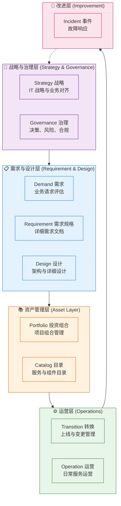
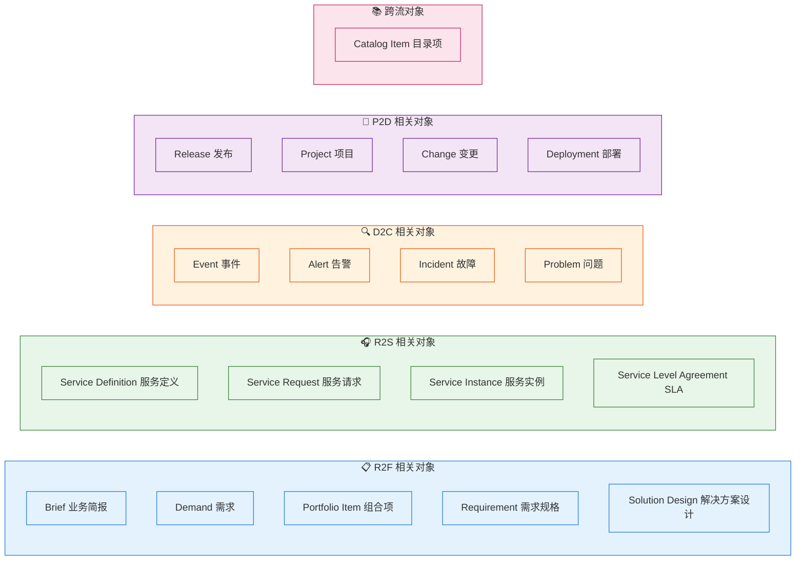
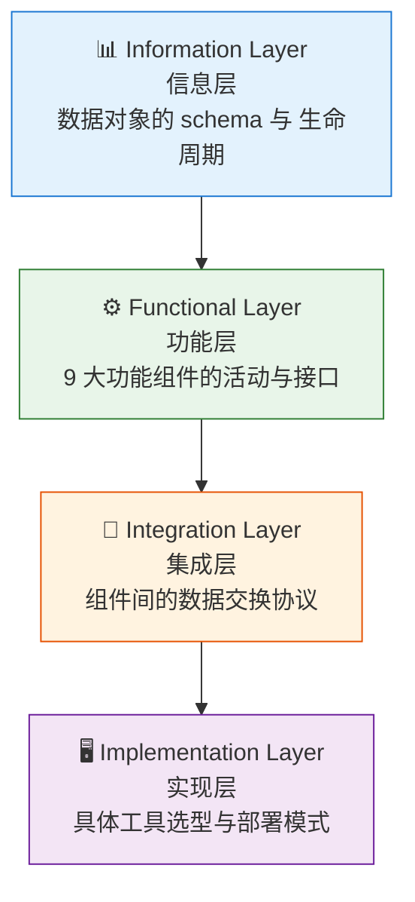

# 第二章：功能组件：9 大 IT 能力 + 数据对象

> 最后更新: 2026-06-10
> ⬅️ [返回目录](README.md) | 上一篇：[价值流：从请求到服务的 4 条路](value-streams.md) | 下一篇：[落地：IT4IT × ITIL × DevOps](in-practice.md)

---

## 🎯 一句话定位

**IT4IT 的 9 大功能组件是 IT 部门的"职能图"**——每个组件对应一组"做什么"的活动，组件之间通过**数据对象**流转。**价值流是"端到端主干道"，功能组件是"沿主干道分布的职能部门"，数据对象是"在部门之间传递的资产"**。三者结合，IT4IT 才有"骨架 + 肌肉 + 血液"。

---

## 一、9 大功能组件全景

> ⚠️ **注**：IT4IT 3.0 的 9 大组件在不同文档里有 2 种编号方式（7+2 或 9 平铺）。本章采用 **9 平铺 + 5 层分组** 方式（Strategy、Governance、Demand、Requirement、Design、Portfolio、Catalog、Transition、Operation + Incident 改进层），更便于工程理解。

---

## 二、9 大功能组件详解

### 2.1 Strategy 战略组件

| 项 | 内容 |
|----|------|
| **一句话** | "IT 该往哪走？怎么和业务对齐？" |
| **核心活动** | IT 战略制定、能力规划、技术趋势分析、预算分配 |
| **输入** | 业务战略、市场分析、技术评估 |
| **输出** | IT 战略文档、能力路线图、年度预算 |
| **责任方** | CIO + IT 战略团队 |
| **成熟度标志** | 有书面的、年度更新的 IT 战略；与业务战略显式关联 |
| **对应价值流** | R2F（顶层）、贯穿 |

> 📌 **常见误区**：把 Strategy 当成"IT 部门年度汇报"。真正的 IT 战略回答的是"未来 3 年我们要建/淘汰什么能力"。

### 2.2 Governance 治理组件

| 项 | 内容 |
|----|------|
| **一句话** | "IT 决策怎么做？风险怎么控？合规怎么达？" |
| **核心活动** | 架构评审、变更审批、合规审计、风险登记 |
| **输入** | 决策请求、变更请求、风险事件 |
| **输出** | 架构决策记录 (ADR)、审计报告、风险登记册 |
| **责任方** | 架构委员会 + PMO + 合规团队 |
| **成熟度标志** | 有清晰的决策矩阵；ADR 在 Confluence/Wiki 可查 |
| **对应价值流** | 贯穿 4 流 |

> 📌 **与 TOGAF 的关系**：Governance 直接对应 TOGAF 第四章"架构治理"——TOGAF 讲治理的"why"，IT4IT 讲治理的"how to operate"。

### 2.3 Demand 需求组件

| 项 | 内容 |
|----|------|
| **一句话** | "业务提了什么请求？值不值得做？" |
| **核心活动** | 业务 Brief 接收、初步评估、ROI 估算、价值打分 |
| **输入** | 业务 Brief、市场信号、客户反馈 |
| **输出** | Demand 记录（包含价值/成本/风险评分） |
| **责任方** | 业务关系经理 (BRM) + 业务分析师 |
| **成熟度标志** | 所有业务请求都进入统一 Demand Pool；用统一模板打分 |
| **对应价值流** | R2F（早期） |

### 2.4 Portfolio 投资组合组件

| 项 | 内容 |
|----|------|
| **一句话** | "在有限资源下做什么/不做什么/先做什么？" |
| **核心活动** | 组合优先级排序、容量平衡、投资回报跟踪 |
| **输入** | 多个 Demand 记录、资源约束、战略目标 |
| **输出** | 排序后的 Roadmap、组合视图 |
| **责任方** | PMO + 投资委员会 |
| **成熟度标志** | 有公开的组合看板（80% 公司没有）；季度复盘 |
| **对应价值流** | R2F（中期） |

> 📌 **核心心法**：组合管理不是"做所有想做的事"，而是"放弃 70% 的想法，集中资源做 30% 高价值的事"。

### 2.5 Catalog 目录组件

| 项 | 内容 |
|----|------|
| **一句话** | "我们有什么服务？用户怎么找到？" |
| **核心活动** | 服务登记、目录维护、版本管理、状态跟踪 |
| **输入** | 上线服务、下线服务、版本变更 |
| **输出** | 服务目录条目 (Catalog Entry) |
| **责任方** | 服务所有者 + 服务台 |
| **成熟度标志** | 用户能通过门户/微信/钉钉 30 秒找到服务 |
| **对应价值流** | R2S、R2F（成果） |

### 2.6 Requirement 需求规格组件

| 项 | 内容 |
|----|------|
| **一句话** | "需求到底要做什么？验收标准是什么？" |
| **核心活动** | 需求细化、用户故事编写、验收标准定义、需求追溯 |
| **输入** | 已批准的 Demand |
| **输出** | 需求规格说明书 (SRS)、用户故事、验收标准 |
| **责任方** | 产品经理 + 业务分析师 + 架构师 |
| **成熟度标志** | 100% 需求可追溯（需求→设计→测试→上线） |
| **对应价值流** | R2F（中期） |

### 2.7 Design 设计组件

| 项 | 内容 |
|----|------|
| **一句话** | "怎么用技术实现需求？" |
| **核心活动** | 架构设计、详细设计、技术选型、接口定义 |
| **输入** | 需求规格 |
| **输出** | 架构图、详细设计文档、API 契约、ADR |
| **责任方** | 架构师 + Tech Lead |
| **成熟度标志** | 关键决策都有 ADR；架构图与代码同步 |
| **对应价值流** | R2F（后期）→ P2D（前期） |

### 2.8 Transition 转换组件

| 项 | 内容 |
|----|------|
| **一句话** | "设计怎么平滑变成生产？" |
| **核心活动** | 实施、测试、灰度、上线、回滚预案 |
| **输入** | 设计文档、需求规格 |
| **输出** | 上线 Release、Runbook、培训材料 |
| **责任方** | Tech Lead + SRE + Release Manager |
| **成熟度标志** | 全自动化部署 + 一键回滚 |
| **对应价值流** | P2D（核心） |

### 2.9 Operation 运营组件

| 项 | 内容 |
|----|------|
| **一句话** | "服务上线后怎么稳定运行？" |
| **核心活动** | 监控告警、容量管理、变更实施、SLA 监控 |
| **输入** | 上线服务 |
| **输出** | 运行报告、SLA 报告、容量规划 |
| **责任方** | SRE + 运维 + 服务所有者 |
| **成熟度标志** | 关键指标实时看板；SLA 自动计算 |
| **对应价值流** | R2S（持续） |

### 2.10 Incident 事件组件（改进层）

| 项 | 内容 |
|----|------|
| **一句话** | "出问题了怎么快速恢复 + 防止再发？" |
| **核心活动** | 事件响应、根因分析、问题管理、改进措施跟踪 |
| **输入** | 监控告警、用户报障 |
| **输出** | Incident 记录、Problem 记录、Postmortem 报告 |
| **责任方** | SRE + Incident Commander |
| **成熟度标志** | 有 blameless postmortem 机制；改进措施闭环率 > 80% |
| **对应价值流** | D2C（核心） |

---

## 三、18 个核心数据对象

数据对象是**价值流之间、功能组件之间流转的"IT 资产"**。每个数据对象有明确的 schema、生命周期、责任人。

### 3.1 数据对象分类全景

### 3.2 Top 10 高频数据对象详解

| 数据对象 | 所在流 | 关键字段 | 生命周期 | 责任人 |
|---------|:-----:|---------|---------|--------|
| **Brief** | R2F | 标题、发起人、业务价值、初步成本 | 创建→评估→转化/驳回 | BRM |
| **Demand** | R2F | 价值评分、成本评分、风险评分、状态 | 创建→评估→批准/驳回→归档 | 业务分析师 |
| **Requirement** | R2F | 用户故事、验收标准、优先级、追溯 | 创建→评审→冻结→实现→验证 | 产品经理 |
| **Service Definition** | R2S | 名称、描述、SLA、版本、所有者 | 创建→发布→更新→下线 | 服务所有者 |
| **Service Request** | R2S | 用户、申请的服务、申请时间、状态 | 创建→审批→执行→完成 | 服务台 |
| **Service Instance** | R2S | 用户、服务、配置、计费信息 | 创建→消费→退订 | 平台 |
| **SLA** | R2S | 服务、可用性目标、响应时间、违约条款 | 创建→签订→监控→续约 | 服务所有者 |
| **Incident** | D2C | 严重度、影响范围、状态、负责人 | 创建→响应→诊断→恢复→关闭 | Incident Commander |
| **Problem** | D2C | 根因、影响、临时方案、永久方案 | 创建→调查→修复→关闭 | 问题经理 |
| **Release** | P2D | 版本、变更范围、部署计划、回滚方案 | 创建→评审→部署→完成 | Release Manager |

### 3.3 数据对象的"ID 与状态"是 IT 集成的命脉

| 集成场景 | 涉及对象 | 必须保证 |
|---------|---------|---------|
| "上线一个新服务" | Service Definition + Catalog Item + SLA | 三者 ID 关联，可双向追溯 |
| "业务方提了新需求" | Brief → Demand → Requirement → Design | 四者 ID 关联，可双向追溯 |
| "故障影响了哪些服务" | Incident ← Service Instance ← Service Definition | 故障 → 服务的反向追溯 |
| "上线版本影响哪些需求" | Release ← Deployment ← Change ← Requirement | 上线 → 需求的反向追溯 |

> 📌 **IT4IT 3.0 Service Backbone 的本质**：把所有数据对象的 ID 关联打通，实现**全链路双向追溯**。

---

## 四、4 层参考架构（Reference Architecture）

IT4IT 3.0 引入了**第 4 层实现层**，把抽象的功能组件映射到具体技术实现：

### 4.1 4 层关系

| 层 | 关注问题 | 产出物 | 谁关心 |
|----|---------|--------|-------|
| **信息层** | 数据对象是什么？长什么样？ | 数据 schema、生命周期图、状态机 | 数据架构师、BA |
| **功能层** | 每个功能组件做什么？输入输出？ | 功能接口、事件流、SLA | IT 部门负责人 |
| **集成层** | 组件之间怎么连？用什么协议？ | API 契约、消息格式、集成模式 | 集成架构师 |
| **实现层** | 用什么工具落地？ | 工具选型、部署架构、运维手册 | SRE、运维 |

### 4.2 实现层是 IT4IT 3.0 的关键升级

| 实现层关键主题 | 描述 |
|---------------|------|
| **服务网格 (Service Mesh)** | R2S 价值流的服务消费基础设施 |
| **可观测性 (Observability)** | D2C 价值流的监控告警统一平台 |
| **GitOps** | P2D 价值流的持续部署模式 |
| **多云/混合云** | 实现层的部署模式选择 |
| **AIOps** | D2C 价值流的智能告警与根因分析 |
| **平台工程 (Platform Engineering)** | 内部开发者平台 (IDP)，支撑 R2S 与 P2D |

> 📌 **记忆口诀**：**"信息层定数据、功能层定行为、集成层定协议、实现层定工具"**。

---

## 五、组件与价值流的对应关系

| 功能组件 | 主要价值流 | 支撑价值流 | 备注 |
|---------|:---------:|:---------:|------|
| Strategy | 贯穿 | - | 顶层 |
| Governance | 贯穿 | - | 横切 |
| Demand | R2F | - | R2F 入口 |
| Portfolio | R2F | - | R2F 中期 |
| Catalog | R2S | R2F | 服务登记/查询 |
| Requirement | R2F | P2D | R2F 规格化 |
| Design | R2F | P2D | R2F 设计 → P2D 实施 |
| Transition | P2D | - | P2D 核心 |
| Operation | R2S | D2C | R2S + D2C 双支撑 |
| Incident | D2C | R2S | D2C 核心 |

---

## 六、本章小结

1. **9 大功能组件 = IT 部门的"职能图"**：Strategy / Governance / Demand / Portfolio / Catalog / Requirement / Design / Transition / Operation / Incident
2. **18 个数据对象 = 价值流之间的"资产"**：每条价值流的"流动的血液"是数据对象
3. **4 层参考架构 = "自上而下看 IT"**：信息层 → 功能层 → 集成层 → 实现层
4. **组件 + 数据对象 + 参考架构** = IT4IT 的完整结构
5. **核心创新是 Service Backbone**：打通所有数据对象的 ID 关联，实现全链路双向追溯

---

> 下一篇：[第三章：落地：IT4IT × ITIL × DevOps](in-practice.md) →
