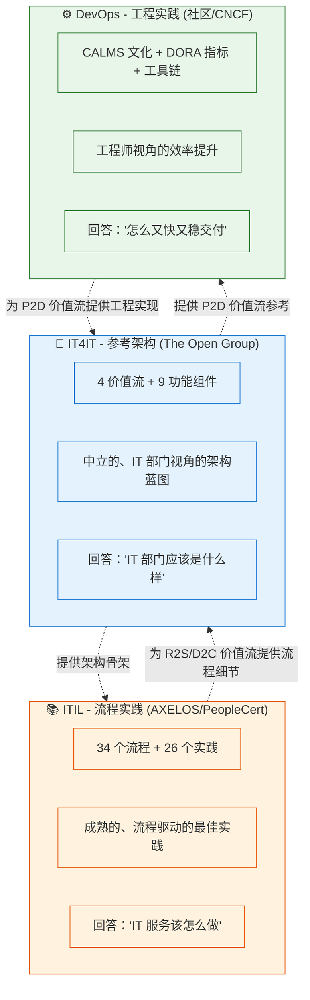
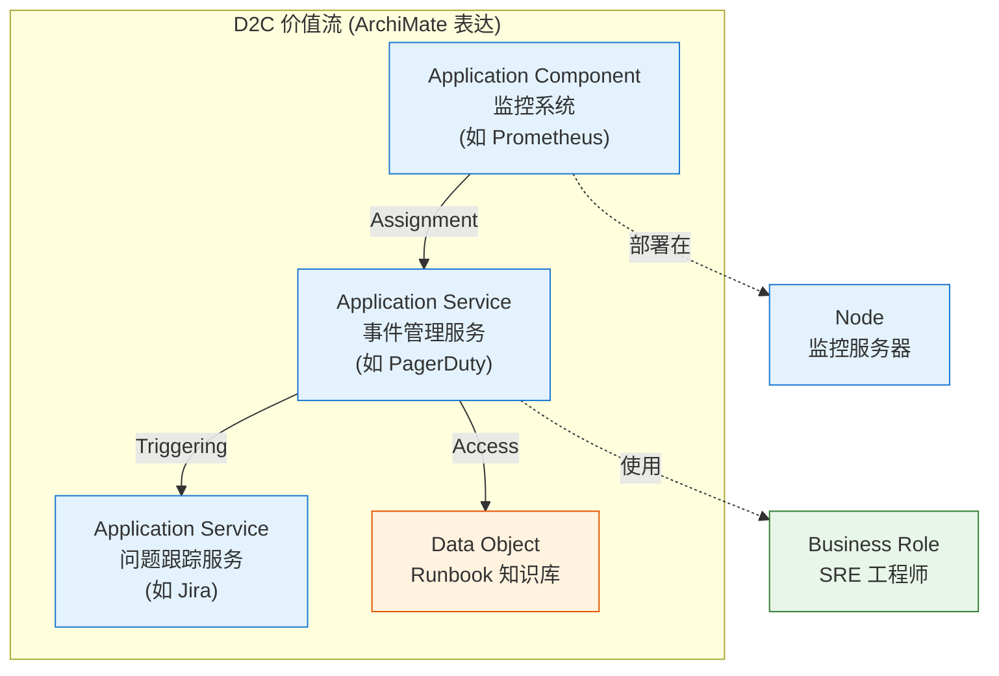

# 第三章：落地：IT4IT × ITIL × DevOps

> 最后更新: 2026-06-10
> ⬅️ [返回目录](README.md) | 上一篇：[功能组件：9 大 IT 能力 + 数据对象](functional-components.md)

---

## 🎯 一句话定位

**IT4IT 解决"IT 部门的参考架构"，ITIL 解决"IT 服务的流程实践"，DevOps 解决"工程效率的工程实践"**——三者组合起来，才是"现代 IT 运营"的全貌。本章给出 3 套已经经过验证的工程实践模板：IT4IT × ITIL（理论框架 + 流程细节）、IT4IT × DevOps（价值流 + 工程实践）、IT4IT × ArchiMate（IT4IT 模型 + ArchiMate 可视化）。

---

## 一、IT4IT vs ITIL vs DevOps：不要再问"用哪个"

### 1.1 三者长期被混为一谈

| 误解 | 事实 |
|------|------|
| "IT4IT = ITIL 的新版" | ❌ IT4IT 是参考架构，ITIL 是流程实践 |
| "DevOps 会取代 ITIL" | ❌ DevOps 偏 P2D 价值流，ITIL 偏 R2S + D2C |
| "IT4IT 是给大企业的" | ❌ 中小公司也能用，只是裁剪范围不同 |
| "实施 IT4IT 必须上 ServiceNow" | ❌ IT4IT 是中立标准，可自研工具链 |

### 1.2 三件套定位对照



### 1.3 三大体系速查表

| 维度 | **IT4IT 3.0** | **ITIL 4** | **DevOps** |
|------|--------------|-----------|-----------|
| **发布方** | The Open Group（标准组织） | AXELOS → PeopleCert（认证机构） | 社区（DORA、State of DevOps） |
| **本质** | 参考架构 | 流程实践 | 工程实践 + 文化 |
| **抽象层次** | 架构层 | 流程层 | 工程层 |
| **核心元素** | 价值流、功能组件、数据对象 | 实践（Practice）、流程 | 文化（CULTURE）、自动化、度量、共享 |
| **目标读者** | IT 部门负责人、架构师 | 服务台、SRE、流程经理 | 开发者、SRE、运维 |
| **学习曲线** | 陡（需理解价值流） | 中（流程+角色） | 平（直接上手） |
| **标准/认证** | IT4IT 3.0 Certified | ITIL 4 Foundation/MP/SL | 无统一认证 |
| **诞生年代** | 2014 (1.0) | 1989 (v1) → 2019 (v4) | 2009 (Flickr/IM 演讲) |
| **核心目标** | "IT 部门自身的业务模型" | "IT 服务管理最佳实践" | "消除开发与运维的鸿沟" |

---

## 二、IT4IT × ITIL：理论框架 × 流程细节

### 2.1 对应关系

IT4IT 4 价值流 与 ITIL 4 的 34 个实践/流程有清晰的对应：

| IT4IT 价值流 | ITIL 4 对应实践 | 详细流程 |
|:----------:|-------------|---------|
| **R2F** | • 关系管理<br/>• 战略管理<br/>• 组合管理<br/>• 业务分析<br/>• 架构管理<br/>• 供应商管理 | 业务关系 → 战略对齐 → 组合 → 需求 → 设计 |
| **R2S** | • 服务请求管理<br/>• 服务台<br/>• 服务目录管理<br/>• 服务级别管理 | 用户请求 → 目录查找 → 审批 → 供给 → 消费 |
| **D2C** | • 事件管理<br/>• 故障管理<br/>• 问题管理<br/>• 监控与事态管理 | 监控 → 事件 → 故障 → 根因 → 修复 |
| **P2D** | • 变更管理<br/>• 发布管理<br/>• 部署管理<br/>• 验证与测试 | 计划 → 评审 → 构建 → 测试 → 部署 |

### 2.2 实战组合：用 ITIL 流程填充 IT4IT 价值流

```mermaid
graph LR
    subgraph "R2F 价值流（IT4IT）"
        R2F1["业务请求"] --> R2F2["组合管理<br/>(ITIL: Portfolio)"]
        R2F2 --> R2F3["业务分析<br/>(ITIL: Business Analysis)"]
        R2F3 --> R2F4["架构管理<br/>(ITIL: Architecture)"]
    end

    subgraph "R2S 价值流（IT4IT）"
        R2S1["服务请求<br/>(ITIL: Request)"] --> R2S2["服务目录<br/>(ITIL: Catalog)"]
        R2S2 --> R2S3["SLA 管理<br/>(ITIL: SLM)"]
    end

    subgraph "D2C 价值流（IT4IT）"
        D2C1["事件监控<br/>(ITIL: Monitoring)"] --> D2C2["事件管理<br/>(ITIL: Incident)"]
        D2C2 --> D2C3["问题管理<br/>(ITIL: Problem)"]
    end

    subgraph "P2D 价值流（IT4IT）"
        P2D1["变更请求<br/>(ITIL: Change)"] --> P2D2["发布管理<br/>(ITIL: Release)"]
        P2D2 --> P2D3["部署管理<br/>(ITIL: Deployment)"]
    end

    R2F4 -.->|"新服务进入"| R2S1
    R2S3 -.->|"服务运行事件"| D2C1
    D2C3 -.->|"修复需变更"| P2D1
    P2D3 -.->|"新版本回填"| R2S2

    classDef r2f fill:#e3f2fd,stroke:#1976d2
    classDef r2s fill:#e8f5e9,stroke:#2e7d32
    classDef d2c fill:#fff3e0,stroke:#e65100
    classDef p2d fill:#f3e5f5,stroke:#6a1b9a
    class R2F1,R2F2,R2F3,R2F4 r2f
    class R2S1,R2S2,R2S3 r2s
    class D2C1,D2C2,D2C3 d2c
    class P2D1,P2D2,P2D3 p2d
```



### 2.3 落地建议

| 阶段 | 行动 |
|------|------|
| **0-3 个月** | 选 1-2 个 ITIL 实践（推荐：事件管理 + 变更管理）打通 IT4IT 的 D2C 价值流 |
| **3-6 个月** | 引入服务目录 + 服务请求管理，覆盖 IT4IT 的 R2S 价值流 |
| **6-12 个月** | 引入组合管理 + 业务分析，覆盖 IT4IT 的 R2F 价值流 |
| **12+ 个月** | 完善 P2D 价值流的发布与部署管理 |

> 📌 **不要一次性全上**：先做"事件+变更"两个最高频的实践（占 IT 工作量 50%+），跑通再扩。

---

## 三、IT4IT × DevOps：价值流 × 工程实践

### 3.1 强对应关系：P2D 价值流 = DevOps 工程化

IT4IT 3.0 的 P2D 价值流是**与 DevOps 直接对应**的——这也是 IT4IT 3.0 相比 2.x 最显著的升级。

| IT4IT P2D 阶段 | DevOps 对应 | 工具示例 |
|---------------|------------|---------|
| 发布计划 | 敏捷迭代规划 | Jira、GitHub Projects |
| 设计评审 | 架构评审 / 同行评审 | ADR、Pull Request Review |
| 构建打包 | CI（持续集成） | GitHub Actions、GitLab CI、Jenkins |
| 自动化测试 | 持续测试 | SonarQube、Selenium、Postman |
| 持续部署 | CD（持续部署） | ArgoCD、Spinnaker、Flux |
| 运营移交 | 平台工程 / IDP | Backstage、Crossplane |
| 价值度量 | DORA 指标 | LinearB、Faros、Swarmia |

### 3.2 DORA 4 指标 × IT4IT 9 组件

DORA 4 指标（部署频率、变更前置时间、变更失败率、MTTR）**精确映射到 IT4IT 的 4 个功能组件**：

| DORA 指标 | 主要相关功能组件 | 改进方法 |
|----------|----------------|---------|
| **部署频率 ↑** | P2D (Transition) | 自动化 CI/CD、特性开关 |
| **变更前置时间 ↓** | P2D (Transition) + R2F (Design) | 小批量、Trunk Based Development |
| **变更失败率 ↓** | P2D (Transition) + D2C (Incident) | 灰度发布、可观测性、混沌工程 |
| **MTTR ↓** | D2C (Incident) | 可观测性、应急 Runbook、On-call 培训 |

### 3.3 文化层面：CAMS 模型

DevOps 的核心文化是 **CAMS**：Culture（文化）、Automation（自动化）、Measurement（度量）、Sharing（共享）。

| CAMS 维度 | IT4IT 对应 | 落地动作 |
|----------|-----------|---------|
| **Culture** | Governance 组件 | 建立 blameless postmortem 文化、跨团队共享改进 |
| **Automation** | Transition 组件 | 一切重复工作自动化（部署、测试、扩缩容） |
| **Measurement** | Operation 组件 | 仪表盘自动化、DORA 指标每周 review |
| **Sharing** | Catalog 组件 + Service Backbone | 内部知识库、Runbook 共享、服务目录统一 |

### 3.4 实战模板：IT4IT P2D 价值流的 DevOps 化

```
阶段 1: 手工 P2D（典型传统企业）
  - 计划: Excel
  - 评审: 会议
  - 构建: 手动 Maven/Gradle
  - 测试: 手动
  - 部署: 手动 SSH
  - 度量: 无

阶段 2: 引入 CI（DevOps 入门）
  - 计划: Jira
  - 评审: PR
  - 构建: Jenkins 自动
  - 测试: 单元 + 集成自动
  - 部署: 手动 SSH（但有脚本）
  - 度量: 构建成功率

阶段 3: 引入 CD（DevOps 进阶）
  - 计划: Jira + 自动同步
  - 评审: PR + 自动 lint
  - 构建: GitHub Actions 自动
  - 测试: 全链路自动
  - 部署: ArgoCD 自动（GitOps）
  - 度量: DORA 4 指标

阶段 4: 平台化（DevOps 成熟）
  - 计划: 自研平台
  - 评审: 自助
  - 构建: 平台
  - 测试: 平台
  - 部署: 平台
  - 度量: 平台 + 改进建议
```

---

## 四、IT4IT × ArchiMate：IT4IT 模型 + ArchiMate 可视化

### 4.1 对应关系

ArchiMate 3.2 的 30+ 视点可以**精确表达** IT4IT 的 9 大功能组件与 4 大价值流。

| IT4IT 元素 | ArchiMate 表达 | 视点示例 |
|----------|---------------|---------|
| **价值流** | Motivation 扩展 + 业务协作 | Goal Realization 视点 |
| **功能组件** | Application Component | Application Structure 视点 |
| **数据对象** | Data Object | Information Structure 视点 |
| **数据对象关系** | Access / Realization | Data Migration 视点 |
| **IT 服务** | Application Service | Service Realization 视点 |
| **基础设施** | Node / System Software | Infrastructure 视点 |
| **物理设施** | Facility / Equipment | Physical 视点（3.1+） |

### 4.2 实战：用 ArchiMate 画 IT4IT 价值流图



### 4.3 落地建议

1. **用 Archi 工具建模 IT4IT 价值流**：ArchiMate 3.2 是 Open Group 官方工具，可直接画 IT4IT
2. **每个价值流对应 1 张 ArchiMate 视点图**：4 价值流 × 1 图 = 4 张图，覆盖 IT 运营全貌
3. **Service Backbone 单独画一张图**：表达 4 流之间的数据对象流转

---

## 五、IT4IT 落地的 5 个反模式（避坑）

### 5.1 "流程图海洋"（Process Ocean）

**症状**：把 IT4IT 4 价值流 + 9 组件 + 18 对象全画成 30+ 张流程图，**没人看**。

**根因**：把"参考架构"当"流程图"。

**对策**：
- IT4IT 是**参考架构**，不是流程图
- 用 ArchiMate 视点表达（一图一受众），不要画 30 张 BPMN
- 每个功能组件 1 页 A4 文档足以

### 5.2 "工具崇拜"（Tool Worship）

**症状**：买了 ServiceNow / BMC 工具，然后**让流程迁就工具**，最后发现用了 20% 功能却付 100% 钱。

**根因**：把 IT4IT 当"工具实施"而不是"架构治理"。

**对策**：
- IT4IT 选工具是**最后一步**，不是第一步
- 先用白板 + Wiki 跑通价值流（3-6 个月）
- 再选工具映射到 IT4IT 组件

### 5.3 "组织僵化"（Organizational Rigidity）

**症状**：把 IT4IT 9 组件变成 9 个部门，**部门墙比价值流还厚**。

**根因**：把"功能组件"当"组织结构"。

**对策**：
- IT4IT 9 组件是**职能**，不是**组织**
- 真实组织应该围绕**价值流**组建跨职能团队（如一个 Squad 覆盖 D2C 全程）
- 服务所有权（Service Ownership）是关键，每个服务有一个明确的所有者

### 5.4 "标准漂移"（Standard Drift）

**症状**：用 IT4IT 一年后开始自由发挥，造出 5 个非标价值流。

**根因**：没有 IT4IT 应用规范文档。

**对策**：
- 建立**IT4IT 应用规范**（公司级 Wiki，1-2 页）
- 选 **3-4 个核心价值流**作为公司标准（不要全上）
- **培训 + Review**：新员工必过 1 小时培训

### 5.5 "Service Backbone 失血"（Service Backbone Failure）

**症状**：Service Backbone 概念有了，但数据对象 ID 关联打不通，**追溯断裂**。

**根因**：各系统各管各的 ID，没有统一的元数据。

**对策**：
- **强制使用全局唯一 ID**（UUID、ULID 等）
- **API 设计规范**强制要求对象 ID 字段
- **CI/CD 检查**包含数据对象 ID 关联校验

---

## 六、3 步启动模板（最快落地）

```
┌─────────────────────────────────────────────┐
│  Step 1: 跑通 1 条价值流 (4 周)               │
├─────────────────────────────────────────────┤
│  - 选 D2C 价值流（事件管理）作为试点          │
│    · 最高频、痛点最明显、易见效              │
│  - 打通 1 个数据对象: Incident               │
│  - 选 1 个工具: PagerDuty / 自研 / 飞书     │
│  - 定义 Incident schema + 状态机            │
│  - 跑通: 监控告警 → 故障 → 恢复              │
└─────────────────────────────────────────────┘
            ↓
┌─────────────────────────────────────────────┐
│  Step 2: 扩到 4 价值流 (3 个月)              │
├─────────────────────────────────────────────┤
│  - 引入 R2S (服务目录 + 服务请求)            │
│  - 引入 P2D (CI/CD + 部署管理)               │
│  - 引入 R2F (需求与组合管理)                 │
│  - 打通 Service Backbone 关键 ID 关联        │
└─────────────────────────────────────────────┘
            ↓
┌─────────────────────────────────────────────┐
│  Step 3: 整合 ITIL + DevOps (持续)           │
├─────────────────────────────────────────────┤
│  - 用 ITIL 4 实践填充价值流细节              │
│  - 用 DevOps 工具链工程化 P2D 价值流         │
│  - DORA 4 指标 + 服务 SLA 仪表盘            │
│  - 半年一次回顾，更新功能组件配置            │
└─────────────────────────────────────────────┘
```

### 6.1 3 步启动的"工具最小集"

| 步骤 | 推荐工具（开源/低成本） |
|------|----------------------|
| **Step 1** | Prometheus + Alertmanager + 飞书/钉钉机器人 + Wiki |
| **Step 2** | + Backstage（服务目录）+ Jira（需求/事件）+ ArgoCD（CD）|
| **Step 3** | + ServiceNow / Jira Service Management（ITSM）+ Datadog（APM）|

---

## 七、IT4IT × 本知识库其他章节

| IT4IT 价值流 | 本知识库对应章节 | 重点交叉点 |
|:-----------:|----------------|-----------|
| **R2F** | [01-foundation/system-design-basics/ddd/](../ddd/README.md) | 业务能力 → 限界上下文 → 服务的需求映射 |
| **R2F** | [01-foundation/system-design-basics/togaf/](../togaf/README.md) | ADM 阶段 A、B 是 R2F 的标准化输入 |
| **R2S** | [02-distributed/service-discovery/](../../../02-distributed/service-discovery/README.md) | 服务注册与发现是 R2S 的技术底座 |
| **D2C** | [03-high-availability/chaos-engineering/](../../../03-high-availability/chaos-engineering/README.md) | 混沌工程是 D2C 的"主动防御" |
| **D2C** | [07-deployment/observability/](../../../07-deployment/observability/README.md) | 可观测性是 D2C 的"眼睛" |
| **P2D** | [07-deployment/deploy/](../../../07-deployment/deploy/README.md) | 部署架构是 P2D 的"最后一公里" |
| **P2D** | [03-high-availability/circuit-break/](../../../03-high-availability/circuit-break/README.md) | 熔断/降级是 P2D 上线时的"安全网" |

---

## 八、本章小结

1. **IT4IT / ITIL / DevOps** 是**互补**关系——参考架构 × 流程实践 × 工程实践
2. **IT4IT × ITIL**：用 ITIL 4 的 34 个实践填充 IT4IT 4 价值流的细节
3. **IT4IT × DevOps**：P2D 价值流直接对应 DevOps 工程化，DORA 4 指标已纳入 IT4IT 3.0
4. **IT4IT × ArchiMate**：用 ArchiMate 视点表达 IT4IT 价值流与功能组件
5. **5 反模式要避**：流程图海洋、工具崇拜、组织僵化、标准漂移、Service Backbone 失血
6. **3 步启动模板**：先打通 D2C（4 周）→ 扩到 4 价值流（3 个月）→ 整合 ITIL + DevOps（持续）

---

> 🎯 **实战建议**：先回到 [README 总览](README.md) 的"4 价值流速查"选 1 条**最痛**的流（90% 团队是 D2C），**今天就开始打通数据对象 ID 关联**。Service Backbone 不需要工具，只需要先有"ID 关联的意识"。
