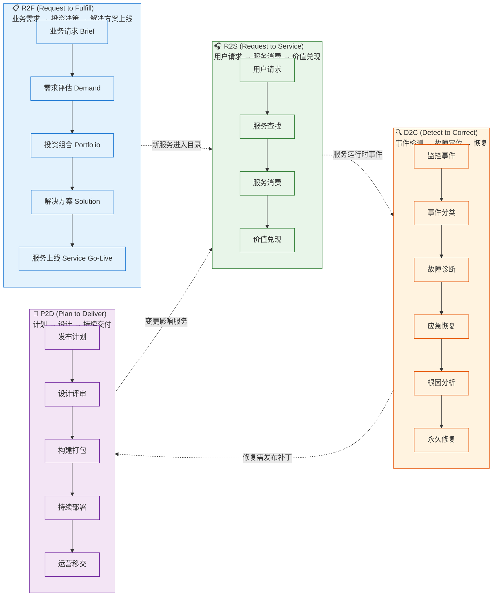
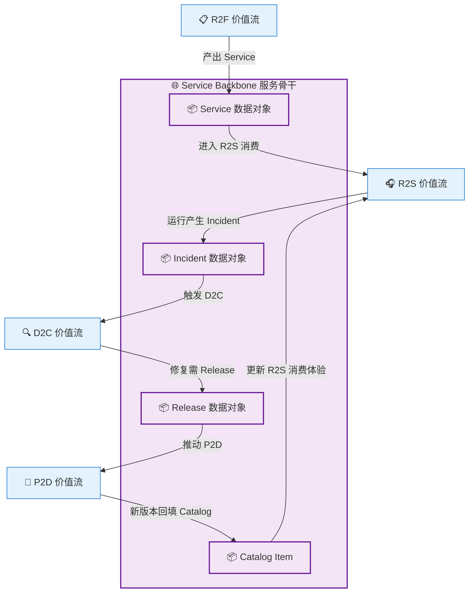

# 第一章：价值流：从请求到服务的 4 条路

> 最后更新: 2026-06-10
> ⬅️ [返回目录](README.md) | 下一篇：[功能组件：9 大 IT 能力 + 数据对象](functional-components.md)

---

## 🎯 一句话定位

**IT4IT 的 4 大价值流是 IT 部门的"4 条主干道"**——R2F 负责"做出来"、R2S 负责"用起来"、D2C 负责"救回来"、P2D 负责"改起来"。**任何 IT 工作都能在 4 条流里找到位置**。当你说"我们要建一个工单系统"时，本质上是在问"它属于哪条流、跨几条流"。

---

## 一、为什么是"价值流"而不是"流程"？

### 1.1 流程视角 vs 价值流视角

| 视角 | 起点 | 终点 | 关注点 | 例子 |
|------|------|------|--------|------|
| **流程视角**（传统） | 部门职责 | 部门职责 | 步骤、责任人 | "故障管理流程" = 客服接单 → 一线处理 → 二线升级 → 关闭 |
| **价值流视角**（IT4IT） | 客户/业务需求 | 客户/业务价值 | 端到端价值交付 | "从用户感受到问题到问题彻底解决" = 监控告警 → 应急响应 → 根因分析 → 永久修复 → 服务恢复 |

> 📌 **核心区别**：流程视角是"我做什么"（部门中心），价值流视角是"为客户创造什么"（价值中心）。IT4IT 强制你**从触发事件（业务需求）出发**，端到端看到价值兑现。

### 1.2 4 大价值流全景



> 📌 **4 流之间的"接续关系"**就是 IT4IT 3.0 强调的 **Service Backbone（服务骨干）**——价值流之间通过共享数据对象（Service、Incident、Release）形成闭环，不是割裂的。

---

## 二、R2F：Request to Fulfill（从业务请求到服务交付）

### 2.1 一句话

> "业务说'我想要 X' → IT 说'我们能做到 Y' → X 与 Y 在某天对齐上线"

R2F 是 IT 部门与业务部门**最重要的对话通道**——把模糊的业务诉求转化为可投资的 IT 解决方案。

### 2.2 R2F 价值流阶段

| 阶段 | 关键活动 | 主要数据对象 | 责任方 |
|------|---------|-------------|--------|
| **1. 业务请求接收** | 收集业务 Brief、初步分类、明确发起人 | Brief | 业务关系经理 (BRM) |
| **2. 需求评估** | 评估业务价值、技术可行性、成本估算 | Demand | 架构师 + 业务分析师 |
| **3. 投资组合管理** | 优先级排序、组合平衡、ROI 分析 | Portfolio Item | PMO + 投资委员会 |
| **4. 需求规格** | 编写详细需求、定义验收标准 | Requirement | 业务分析师 + 产品经理 |
| **5. 解决方案设计** | 架构设计、详细设计、技术选型 | Solution Design | 架构师 + Tech Lead |
| **6. 转换上线** | 实施、测试、灰度发布 | Release, Service | P2D 价值流（接续） |
| **7. 服务交付** | 上线后交接、纳入目录 | Service, Catalog Item | 服务管理 |

### 2.3 R2F 典型场景

**场景 A**：业务部门提新需求"开通会员积分系统"
```
业务 Brief → 需求评估 (3 周) → 组合优先级排序 → 需求规格
  → 解决方案设计 (4 周) → 实施 (8 周) → 上线 (1 周)
```

**场景 B**：法规驱动"等保三级改造"
```
法规 Brief → 强制优先级 (无需 ROI) → 安全需求规格
  → 安全架构设计 → 分阶段实施 → 持续合规
```

### 2.4 R2F 关键产出

| 产出物 | 描述 | 何时交付 |
|--------|------|---------|
| **Service Brief** | 业务请求的正式记录 | T+1 周 |
| **Business Case** | ROI 分析、成本估算、风险评估 | T+3 周 |
| **Service Design Package** | 服务的完整设计文档（架构、接口、SLA） | T+10 周 |
| **Service in Catalog** | 上线的服务进入服务目录 | 上线日 |

---

## 三、R2S：Request to Service（从用户请求到服务使用）

### 3.1 一句话

> "用户说'我需要用 X' → 平台说'这是 X 的入口' → 用户用上 X"

R2S 是 IT 部门与最终用户**日常接触**的主通道——确保用户**找得到、申请得了、用得起来**服务。

### 3.2 R2S 价值流阶段

| 阶段 | 关键活动 | 主要数据对象 | 责任方 |
|------|---------|-------------|--------|
| **1. 服务发现** | 用户在服务目录搜索、浏览服务 | Service Catalog Entry | 用户 |
| **2. 服务请求** | 用户提交申请、填写必要信息 | Service Request | 用户 + 服务台 |
| **3. 请求审批** | 自动化/人工审批（按服务政策） | Service Approval | 服务所有者 |
| **4. 服务供给** | 自动化开通 / 人工交付 | Service Instance | 服务台 + 自动化 |
| **5. 服务消费** | 用户实际使用服务、调用 API | Usage Record | 用户 |
| **6. 价值兑现** | 用户通过服务达成业务目标 | Value Metric | 业务方 + 服务所有者 |
| **7. 反馈与续约** | 满意度、续费/退订 | Service Review | 服务所有者 |

### 3.3 R2S 典型场景

**场景 A**：员工申请虚拟机
```
服务目录搜索 "VM" → 选规格 → 提交申请
  → 自动审批 (按 RBAC) → IaC 自动开通
  → 收到连接信息 → 使用 VM → 月度计费/退订
```

**场景 B**：业务方调用支付 API
```
API 门户注册 → 申请 API 凭证 → 审批 (1 个工作日)
  → 收到 API Key → 阅读文档 → 调用 API
  → 调用计量 → 月度账单 → 用量分析
```

### 3.4 R2S 关键设计原则

| 原则 | 含义 | 实现机制 |
|------|------|---------|
| **自助化优先** | 90% 请求无需人工 | 服务目录 + 自动化工作流 |
| **标准 SLA** | 所有服务有明确响应时间 | 服务等级协议 (SLA) 模板 |
| **可计费透明** | 用户清楚成本 | 计量 + 计费 + 用量看板 |
| **反馈闭环** | 用户能提意见、能看到改进 | 评价系统 + 季度回顾 |

---

## 四、D2C：Detect to Correct（从事件检测到故障恢复）

### 4.1 一句话

> "系统说'我有事' → 运维说'我处理' → 系统说'我好了'"

D2C 是 IT 部门与生产环境**最严酷的对话通道**——把监控告警转化为可衡量的服务恢复时间。

### 4.2 D2C 价值流阶段

| 阶段 | 关键活动 | 主要数据对象 | 责任方 |
|------|---------|-------------|--------|
| **1. 事件检测** | 监控告警、用户反馈、自动探测 | Event, Alert | 监控系统 |
| **2. 事件分类** | 按严重度/类别/影响范围分级 | Incident (新建) | 监控 + 一线 |
| **3. 故障诊断** | 日志分析、链路追踪、假设验证 | Incident Update, Diagnosis | 二线 / SRE |
| **4. 应急恢复** | 应用止血、流量切换、应急方案 | Incident (Mitigation) | 二线 / SRE |
| **5. 根因分析** | 5 Why、鱼骨图、Postmortem | Problem Record | 三线 / 架构师 |
| **6. 永久修复** | 补丁、配置变更、架构调整 | Change Request, Release | P2D 价值流（接续） |
| **7. 故障关闭** | 复盘、归档、改进措施跟踪 | Incident (Resolved) | 值班经理 |

### 4.3 D2C 关键指标

| 指标 | 缩写 | 含义 | 行业基准 |
|------|------|------|---------|
| **MTTD** | Mean Time To Detect | 平均检测时间 | < 5min（关键服务） |
| **MTTA** | Mean Time To Acknowledge | 平均响应时间 | < 15min |
| **MTTR** | Mean Time To Resolve | 平均恢复时间 | 30min - 4h（按级别） |
| **MTTF** | Mean Time To Failure | 平均故障间隔 | 数小时 - 数天 |
| **MTBF** | Mean Time Between Failures | 故障间隔（同样） | 越长越好 |

### 4.4 D2C 典型场景

**场景**：订单服务数据库连接池耗尽

```
[T+0min]    Prometheus 告警：订单服务 DB 连接使用率 95%
[T+2min]    告警升级到 SRE 群
[T+5min]    SRE 接手，开始诊断（看慢 SQL、看流量）
[T+8min]    定位：慢 SQL 拖累连接池
[T+12min]   应急：临时 kill 慢 SQL + 扩容连接池
[T+15min]   服务恢复，记录 Incident
[T+24h]     根因分析：缺少 SQL 审核，导致劣质 SQL 上线
[T+1 周]    永久修复：上线 SQL 审核工具 + 慢 SQL 监控
```

### 4.5 D2C 与"事件分级"模式

| 级别 | 影响范围 | 响应时间 | 升级路径 |
|------|---------|---------|---------|
| **P0 / Sev-1** | 全站不可用 | 5min | 一线 → SRE → CTO |
| **P1 / Sev-2** | 核心功能受损 | 15min | 一线 → SRE |
| **P2 / Sev-3** | 非核心功能受损 | 1h | 一线 |
| **P3 / Sev-4** | 体验问题，无功能影响 | 4h | 下一工作日 |

---

## 五、P2D：Plan to Deliver（从计划到持续交付）

### 5.1 一句话

> "计划说'什么时候改' → 工程说'怎么改' → 运维说'已经改完了'"

P2D 是 IT 部门与**工程效率**最紧密的对话通道——把"想改"变成"改得又快又稳"。**它是 IT4IT 与 DevOps 直接对应的价值流**。

### 5.2 P2D 价值流阶段

| 阶段 | 关键活动 | 主要数据对象 | 责任方 |
|------|---------|-------------|--------|
| **1. 发布计划** | 版本规划、变更窗口、依赖梳理 | Release Plan | PMO + Release Manager |
| **2. 设计评审** | 架构评审、安全评审、性能评审 | Design Review Record | 架构师 + SRE |
| **3. 构建打包** | 代码编译、镜像构建、依赖打包 | Build Artifact, Container Image | CI 系统 |
| **4. 自动化测试** | 单元、集成、端到端、性能测试 | Test Report | CI 系统 + QA |
| **5. 持续部署** | 多环境灰度、金丝雀、蓝绿发布 | Deployment Record | CD 系统 |
| **6. 运营移交** | 文档移交、Runbook 编写、值班培训 | Operational Handover | Tech Lead + SRE |
| **7. 价值度量** | 发布频率、变更前置时间、变更失败率 | DORA Metrics | 研发效能团队 |

### 5.3 P2D 与 DevOps 4 大指标（DORA Metrics）

| 指标 | 含义 | 精英级 | 高 | 中 | 低 |
|------|------|:---:|:---:|:---:|:---:|
| **部署频率 (Deployment Frequency)** | 代码多久上线一次 | 按需/天 | 周-月 | 月-季度 | > 季度 |
| **变更前置时间 (Lead Time for Changes)** | 提交到上线多久 | < 1h | 1d-1w | 1w-1m | > 1m |
| **变更失败率 (Change Failure Rate)** | 上线导致故障的比例 | 0-15% | 16-30% | 31-45% | > 45% |
| **故障恢复时间 (MTTR)** | 上线后修好要多久 | < 1h | < 1d | < 1w | > 1w |

> 📌 **IT4IT 3.0 的关键升级**：P2D 价值流**首次把 DORA Metrics 纳入标准指标**——以前是工程实践的"软指标"，现在是 IT 价值流的标准度量。

### 5.4 P2D 典型场景：月度版本发布

```
[W-4] 需求冻结 + 发布分支创建
[W-3] 集成测试 + 安全扫描 + 性能基准
[W-2] 预生产环境灰度 + 业务方验收
[W-1] 生产灰度（5% → 25% → 50% → 100%）+ 监控
[W+0] 全量发布 + Runbook 移交 + 复盘
```

### 5.5 P2D 的"反模式"识别

| 反模式 | 表现 | 危害 |
|--------|------|------|
| **"手工部署"** | 每次上线人工操作 | 慢、错、不可追溯 |
| **"大爆炸发布"** | 1 个季度 1 次大版本 | 风险集中、回滚难 |
| **"审核阻塞"** | 设计评审卡 2 周 | Lead Time 拉长到月级 |
| **"无 Runbook"** | 上线后没人会运营 | 故障恢复时间翻倍 |
| **"指标缺失"** | 不知道 DORA 4 指标 | 改进无方向 |

---

## 六、4 价值流的核心交叉

### 6.1 4 流不孤立：服务骨干（Service Backbone）

IT4IT 3.0 的关键创新是引入 **Service Backbone**——一个**贯穿所有价值流的数据交换总线**：



> 📌 **Service Backbone 的本质**：打通 IT 数据的"任督二脉"，让一个 Service 的全生命周期（诞生→消费→故障→变更→升级）在数据层闭环。**不再有"工单系统、监控、CMDB、CI/CD 各管一摊"的问题**。

### 6.2 4 流对应的工具链

| 价值流 | 工具链（典型） |
|--------|--------------|
| **R2F** | Jira / ServiceNow / Azure DevOps Boards（需求与组合管理） |
| **R2S** | 自研服务门户 / Backstage / 企业微信服务台 / ServiceNow |
| **D2C** | Prometheus / Grafana / Datadog / PagerDuty / OpsGenie + ITSM 工具 |
| **P2D** | GitLab / GitHub Actions / ArgoCD / Spinnaker / Jenkins X |

### 6.3 4 流对应的组织角色

| 价值流 | 主要责任团队 | 关键角色 |
|--------|------------|---------|
| **R2F** | PMO + 架构师 + 产品经理 | BRM、PMO、Solution Architect |
| **R2S** | 服务台 + 服务所有者 | Service Owner、Service Desk |
| **D2C** | SRE + 运维 + 一线 | SRE、Incident Commander、On-call |
| **P2D** | DevOps 团队 + QA + SRE | Release Manager、Platform Engineer、QA |

---

## 七、4 价值流实战对照表

把常见的 IT 工作放到 4 流里：

| 工作场景 | 属于哪条流 | 主要阶段 |
|---------|:---------:|---------|
| "业务方提了新需求" | **R2F** | Brief → 评估 → 组合 → 设计 → 实施 → 上线 |
| "员工申请开账号" | **R2S** | 目录搜索 → 申请 → 审批 → 开通 |
| "线上服务挂了" | **D2C** | 监控告警 → 诊断 → 应急 → 恢复 |
| "开发提交了新功能" | **P2D** | 设计评审 → 构建 → 测试 → 灰度 → 发布 |
| "用户反馈功能不好用" | 跨流 | R2S（接收反馈）→ R2F（转化为新需求） |
| "P0 故障需要紧急修复" | 跨流 | D2C（应急）→ P2D（热修复）→ R2S（更新服务） |
| "上线了 3 个月的服务要下线" | 跨流 | R2F（决策）→ P2D（执行下线）→ R2S（停用） |

> 📌 **判断口诀**：**R2F 决定"做不做"，R2S 决定"用没用"，D2C 决定"稳不稳"，P2D 决定"快不快"**。

---

## 八、本章小结

1. **4 价值流 = IT 部门的 4 条主干道**：R2F（做出来）/ R2S（用起来）/ D2C（救回来）/ P2D（改起来）
2. **每条流是端到端的**——从触发事件到价值兑现，而不是部门内流程
3. **Service Backbone（服务骨干）** 贯穿 4 条流，是 IT4IT 3.0 的关键创新
4. **R2F 偏"业务对话"、R2S 偏"用户对话"、D2C 偏"系统对话"、P2D 偏"工程对话"**
5. **真实工作 70% 跨流**——IT4IT 价值在于看到端到端，而不是孤立优化一条流

---

> 下一篇：[第二章：功能组件：9 大 IT 能力 + 数据对象](functional-components.md) →
