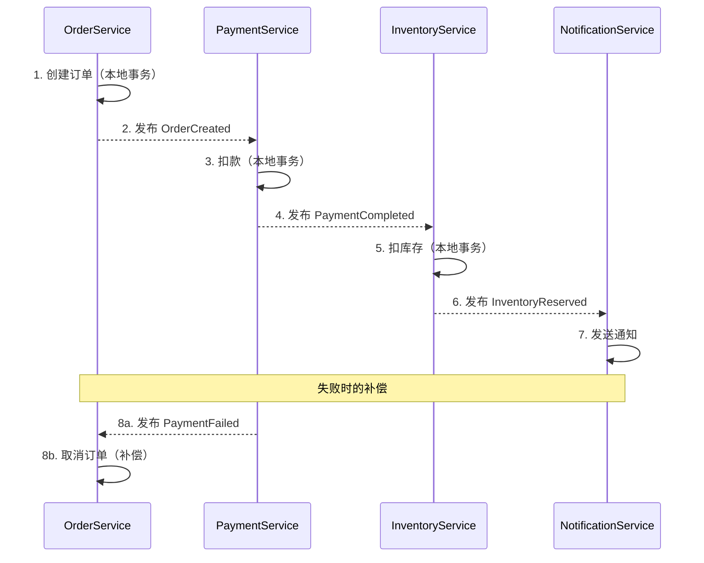
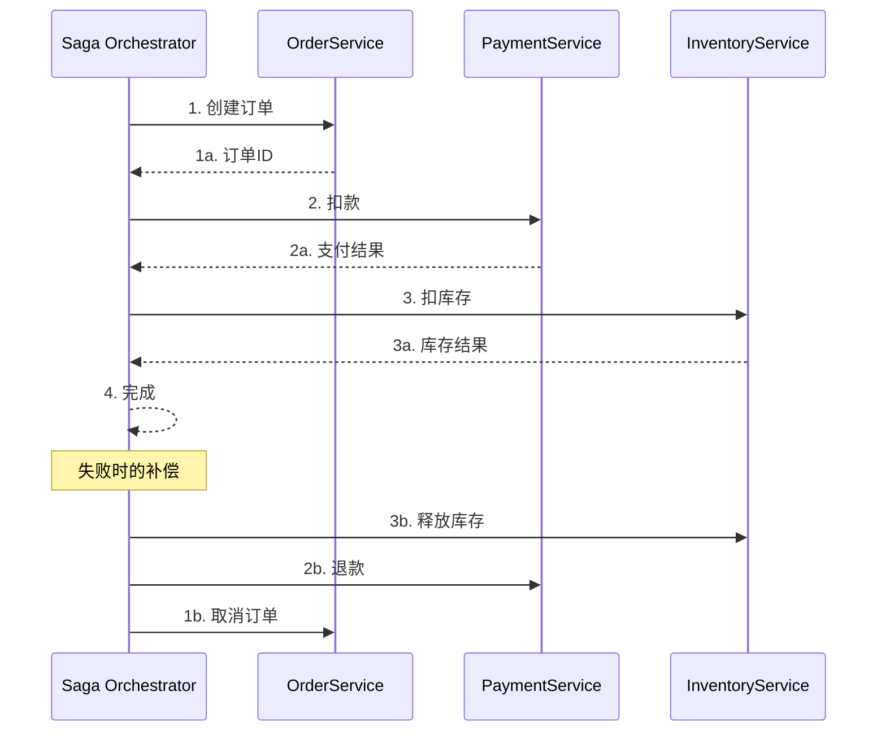
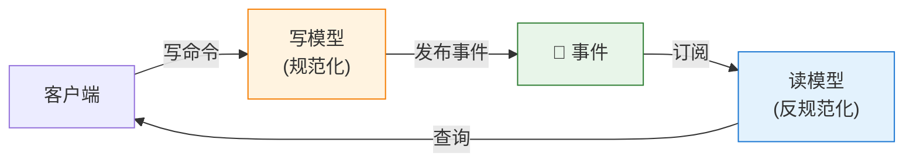
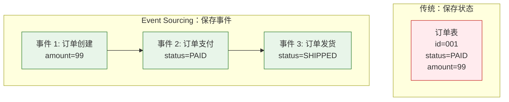

# 数据一致性

> 最后更新: 2026-06-09
> ⬅️ [返回微服务](../README.md) | ⬅️ [服务契约](../service-contract/README.md) | ➡️ [演进与组织](../migration-and-organization/README.md)

---

## 🎯 一句话定位

**数据一致性是微服务设计中最难的问题**——单体时代的 ACID 事务不再适用，必须拥抱**最终一致性**。本章讲 4 个核心：①Database per Service ②Saga ③CQRS ④Event Sourcing。

---

## 一、分布式数据管理的核心挑战

### 1.1 单体时代

```
单进程 + 单数据库 → 强 ACID 事务
- 原子性：要么全成功，要么全失败
- 一致性：数据始终满足约束
- 隔离性：并发事务互不干扰
- 持久性：提交后永久保存
```

### 1.2 微服务时代

```
多服务 + 多数据库 → 无法 ACID
- 跨服务无法用数据库事务（XA 协议在微服务中已淘汰）
- 网络调用可能失败（超时、错误、重复）
- 性能与一致性矛盾（CAP 定理）
```

### 1.3 解决思路

| 思路 | 适用 |
|------|------|
| **避免分布式事务** | 重新设计边界，事务不跨服务 |
| **最终一致性 + Saga** | 允许短暂不一致，业务补偿 |
| **强一致但限场景** | 仅对核心关键数据（如账户余额） |
| **事件驱动 + 异步同步** | 跨服务数据通过事件流同步 |

---

## 二、Database per Service（每服务独立数据库）

### 2.1 原则

> **每个微服务拥有自己的数据库，不与其他服务共享。**

### 2.2 共享数据库 vs 独立数据库

| 维度 | 共享数据库 | 独立数据库 |
|------|----------|----------|
| **耦合度** | 高（改表影响所有） | 低 |
| **独立部署** | ❌ | ✅ |
| **独立扩展** | ❌ | ✅ |
| **技术异构** | ❌ | ✅（PG/Mongo/Redis） |
| **事务** | 单库事务简单 | 需跨服务协调 |

### 2.3 数据隔离级别

| 级别 | 说明 | 例子 |
|------|------|------|
| **每个服务一库** | 物理隔离 | 订单库、支付库独立 |
| **每个服务一 schema** | 逻辑隔离，物理共享 | 同一数据库不同 schema |
| **每个服务一表** | 弱隔离，不推荐 | 共享表用 owner_id 区分 |

> **推荐**：完全独立数据库（或 schema）。**避免"共享数据库"反模式**。

---

## 三、Saga 模式：跨服务事务

### 3.1 核心思想

> **Saga 把跨服务事务拆分为**「**多个本地事务 + 补偿操作**」**，失败时回滚（补偿）已完成的步骤。**

### 3.2 两种实现方式

#### 方式 1：编排式 Saga（Choreography）

> **无中心协调器**，每个服务监听事件并发布自己的事件。



**优点**：
- ✅ 简单、服务自治
- ✅ 无单点故障

**缺点**：
- ❌ 流程分散在多个服务，难以追踪
- ❌ 循环依赖风险（A 监听 B，B 监听 A）
- ❌ 测试复杂

#### 方式 2：协调式 Saga（Orchestration）

> **有中心协调器（Orchestrator）**，按步骤调用各服务。



**优点**：
- ✅ 流程集中，易于理解和追踪
- ✅ 易于测试
- ✅ 易于添加监控

**缺点**：
- ❌ 协调器成为关键路径
- ❌ 可能成为"智能中心 + 哑服务"反模式

### 3.3 选型

| 场景 | 推荐 |
|------|------|
| **步骤 ≤ 3 个** | 编排式（Choreography） |
| **步骤 > 3 个** | 协调式（Orchestration） |
| **流程经常变化** | 协调式（更易调整） |
| **服务高度自治** | 编排式 |

### 3.4 补偿操作设计

> **补偿 = 撤销已完成步骤的影响**。注意：补偿不等于回滚（数据可能已变更）。

| 操作 | 补偿 |
|------|------|
| 创建订单 | 取消订单 |
| 扣款 | 退款 |
| 扣库存 | 加回库存 |
| 发送邮件 | 发送道歉邮件（不可逆） |
| 调用第三方 API | 调对方的取消 API |

### 3.5 Saga 实战示例

```python
# 订单 Saga（协调式）
class OrderSaga:
    async def execute(self, order_data):
        # 步骤 1：创建订单
        order = await self.order_service.create(order_data)
        if not order:
            return {"status": "FAILED", "step": "create_order"}

        try:
            # 步骤 2：扣款
            payment = await self.payment_service.charge(
                user_id=order_data['user_id'],
                amount=order.total,
                idempotency_key=f"order-{order.id}"
            )
        except Exception as e:
            # 补偿：取消订单
            await self.order_service.cancel(order.id, reason="payment_failed")
            return {"status": "FAILED", "step": "payment", "error": str(e)}

        try:
            # 步骤 3：扣库存
            await self.inventory_service.reserve(
                items=order.items,
                idempotency_key=f"order-{order.id}"
            )
        except Exception as e:
            # 补偿：退款 + 取消订单
            await self.payment_service.refund(payment.id)
            await self.order_service.cancel(order.id, reason="inventory_failed")
            return {"status": "FAILED", "step": "inventory", "error": str(e)}

        return {"status": "SUCCESS", "order": order}
```

---

## 四、CQRS：命令查询职责分离

### 4.1 核心思想

> **读写分离**——写模型（Command）和读模型（Query）使用不同的数据模型。



### 4.2 解决的问题

| 单体痛点 | CQRS 解法 |
|---------|----------|
| 读慢（复杂 JOIN） | 读模型预聚合，按需反规范化 |
| 写读争用 | 读写分离，互不干扰 |
| 多种查询需求 | 多个读模型（每个场景一份） |
| 性能瓶颈 | 读模型可独立扩展 |

### 4.3 实战场景

#### 场景 1：订单查询视图

| 视图 | 用途 | 数据 |
|------|------|------|
| **写模型（PostgreSQL）** | 创建/修改订单 | 规范化表（order, order_item, payment） |
| **读模型 1（Elasticsearch）** | 全文搜索 | 反规范化订单文档 |
| **读模型 2（Redis）** | 实时订单状态 | 缓存 + 物化视图 |
| **读模型 3（数仓）** | 业务报表 | 聚合统计 |

#### 场景 2：读写数据同步

```python
# 写侧：发布事件
async def update_order(order_id, status):
    order = await db.update_order(order_id, status)
    await event_bus.publish("order.updated", {
        "order_id": order_id,
        "status": status,
        "updated_at": order.updated_at
    })
    return order

# 读侧：监听事件，更新读模型
@event_bus.subscribe("order.updated")
async def update_search_index(event):
    order = await fetch_full_order(event["order_id"])
    await elasticsearch.index("orders", order.id, {
        "id": order.id,
        "status": event["status"],
        "items": order.items,
        "user_name": order.user.name,  # 反规范化
        "total": order.total,
        "updated_at": event["updated_at"]
    })
```

### 4.4 CQRS 的代价

| 代价 | 说明 |
|------|------|
| **复杂度** | 维护多份数据 |
| **最终一致性** | 写后立即读可能不一致 |
| **数据同步** | 需要可靠的事件管道 |
| **测试复杂** | 读写两侧要分别测试 |

> **建议**：仅在**读写比例严重失衡**（如 1:1000）或**查询需求多样**时使用 CQRS。简单 CRUD 系统不必引入。

---

## 五、Event Sourcing：事件溯源

### 5.1 核心思想

> **不保存当前状态，而是保存"导致状态变化的事件序列"**。通过重放事件得到当前状态。

### 5.2 传统 vs Event Sourcing



### 5.3 事件溯源的关键概念

| 概念 | 说明 |
|------|------|
| **事件（Event）** | 不可变的事实（已发生的事） |
| **命令（Command）** | 用户的意图（可能失败） |
| **聚合（Aggregate）** | 一组相关事件的应用对象 |
| **快照（Snapshot）** | 定期保存状态，避免全量重放 |
| **投影（Projection）** | 从事件流构建读模型 |

### 5.4 实战示例

```python
# 事件定义
class OrderCreated:
    order_id: str
    user_id: str
    items: list
    created_at: datetime

class OrderPaid:
    order_id: str
    payment_id: str
    paid_at: datetime

# 事件存储
events = [
    OrderCreated("ORD-001", "user-1", [...], t1),
    OrderPaid("ORD-001", "PAY-001", t2)
]

# 重放得到当前状态
class Order:
    @staticmethod
    def from_events(events):
        order = None
        for event in events:
            if isinstance(event, OrderCreated):
                order = {"id": event.order_id, "status": "PENDING", ...}
            elif isinstance(event, OrderPaid):
                order["status"] = "PAID"
        return order
```

### 5.5 Event Sourcing 的优势

| 优势 | 说明 |
|------|------|
| **完整审计** | 所有变更都有事件记录 |
| **时间旅行** | 可重放任意时间点的状态 |
| **天然审计日志** | 调试、回溯、合规 |
| **天然事件流** | 与 Kafka 等天然集成 |
| **天然 CQRS 集成** | 事件可投影到多种读模型 |

### 5.6 Event Sourcing 的挑战

| 挑战 | 说明 |
|------|------|
| **查询复杂** | 需要从事件构建状态（需投影） |
| **schema 演进** | 事件结构变化需兼容处理 |
| **性能** | 长事件流需快照 |
| **学习曲线** | 思维模式与 CRUD 截然不同 |
| **数据迁移** | 改事件结构比改表结构难 |

> **建议**：仅在**强审计需求**（金融、医疗）或**复杂业务规则**（多次状态变更）时使用。

---

## 六、模式选型速查

| 场景 | 推荐模式 |
|------|---------|
| 简单 CRUD，无跨服务事务 | 单一服务 + 数据库 |
| 跨服务 2-3 步，强最终一致性 | Saga（编排式） |
| 读写比例 1:100+ | CQRS |
| 复杂业务规则 + 强审计 | Event Sourcing |
| Saga + 复杂查询 | Saga + CQRS |
| 金融/医疗合规 | Event Sourcing + CQRS |

---

## 七、最终一致性的工程实践

### 7.1 一致性窗口

| 业务 | 可接受窗口 |
|------|----------|
| 社交点赞数 | 数分钟 |
| 订单状态 | 数秒 |
| 支付结果 | < 1 秒（用户期望即时） |
| 账户余额 | 强一致 |
| 库存 | 强一致（避免超卖） |

### 7.2 用户感知

- **明确告知**：付款中、转账处理中、稍后到账
- **乐观 UI**：先显示成功，后台异步处理，失败时再提示
- **状态查询**：提供"订单详情"链接，让用户主动查询

### 7.3 监控关键指标

| 指标 | 说明 |
|------|------|
| **同步延迟** | 写完成到读一致的时间 |
| **Saga 完成率** | 成功完成 vs 中途失败 |
| **补偿触发率** | 补偿操作触发的频率 |
| **最终一致窗口** | 95% 数据同步所需时间 |
| **重复事件** | 同一事件被处理次数 |

---

## 🤔 思考

1. **你的跨服务事务**：当前项目里跨服务事务有几类？用 Saga 还是其他方式？
2. **数据一致性的代价**：你在哪些地方用了"最终一致性"？业务方能接受吗？
3. **CQRS 适用性**：你的系统读写比例是多少？查询是否拖累写入？
4. **Event Sourcing 决策**：你的业务有强审计需求吗？是否值得引入？

---

## 相关章节

- ⬅️ [返回微服务](../README.md)
- ⬅️ [服务契约](../service-contract/README.md)
- ➡️ [演进与组织](../migration-and-organization/README.md)
- [分布式事务](../../../02-distributed/distributed-transaction/README.md) — Saga 2PC TCC 模式对比
- [CAP 定理](../../../02-distributed/cap-and-base/cap/README.md) — 一致性理论
- [服务间通信](../service-communication/README.md) — 异步通信与事件驱动
- [演进与组织](../migration-and-organization/README.md) — 从单体迁移到分布式
