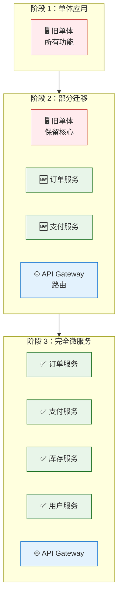
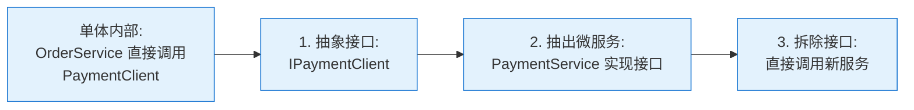
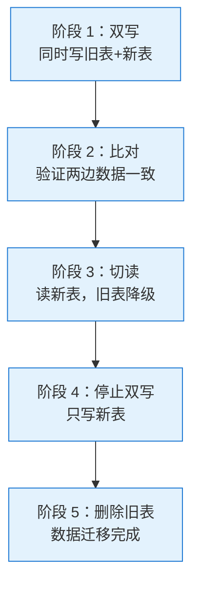

<!--
module:
  parent: system-design
  slug: system-design/migration-and-organization
  type: article
  category: 主模块子文章
  summary: ⬅️ [返回微服务](../README.md) | ⬅️ [数据一致性](../data-consistency/README.md)
-->

# 演进与组织

> 最后更新: 2026-06-09
> ⬅️ [返回微服务](../README.md) | ⬅️ [数据一致性](../data-consistency/README.md)

---
## 引言：架构困境（[AUTO] 自动生成，待人工 review）

演进与组织 的最后更新: 2026-06-09

**但实际**：常被问起'这种方案我怎么选'/'大厂怎么做'。本篇用'决策困境'切入，比较几种主流路径并讲清取舍。

> 📌 本段由 `note/scripts/add-intro.py` 自动生成（场景模板 + README 摘录）。**下次 review 时请改为真实场景 + 数字 + 反思**，目前仅满足'有引言'的最低要求。

---


## 🎯 一句话定位

**微服务不是"重写"出来的，是"演进"出来的**——同时，**组织结构决定了架构能否落地**。本章讲三个核心：①何时不该微服务 ②从单体到微服务的演进路径 ③团队与组织对齐。

---

## 一、何时不该微服务

### 1.1 7 个"不做微服务"信号

| 信号 | 说明 |
|------|------|
| **团队 < 10 人** | 微服务运维/治理成本超过收益 |
| **业务早期/频繁变** | 边界未稳定，频繁返工 |
| **流量小且稳定** | 单体足够，何必复杂化 |
| **强事务一致性** | 跨服务事务复杂度爆表 |
| **无 DevOps 能力** | 缺 CI/CD、监控、追踪，撑不住微服务 |
| **业务不复杂** | 几百个表、几万行代码，单体性能没问题 |
| **"技术驱动"** | 别人做了我也做——这种动机必死 |

### 1.2 Sam Newman 的"微服务前提"

> 来自《Building Microservices》作者 Sam Newman：

```
微服务前需要：
✅ 模块化单体已成功
✅ 业务复杂度到了临界点
✅ 团队规模能独立维护多个服务
✅ 有自动化部署能力
✅ 业务边界相对稳定
```

### 1.3 黄金法则：Monolith First

> **先做模块化单体，再拆分微服务**（Monolith First，由 Simon Brown 提出）。

**理由**：
- ✅ 早期业务不稳定，单体快速迭代
- ✅ 强制模块化（包/命名空间隔离）→ 后续拆分更简单
- ✅ 避免过早拆分导致返工
- ✅ 微服务"不是目标，是手段"

---

## 二、从单体到微服务的演进路径

### 2.1 3 大模式

#### 模式 1：绞杀者模式（Strangler Fig Pattern）

> **新服务逐步"绞杀"旧单体**——通过 API Gateway 把新功能路由到新服务，旧功能保留在单体，最终整个单体被替换。



**步骤**：
1. 在 API Gateway 把"特定功能"路由到新服务
2. 旧单体逐渐变薄
3. 新功能直接在新服务实现
4. 旧功能按优先级逐个迁移
5. 单体最终退役

**优点**：
- ✅ 渐进式，风险可控
- ✅ 业务不中断
- ✅ 每个服务可独立验证

**缺点**：
- ❌ 长期维护两套系统（单体 + 新服务）
- ❌ 数据需要同步
- ❌ 治理复杂度

#### 模式 2：抽象分支模式（Branch by Abstraction）

> **不新建服务，而是把单体内部模块抽象为"接口"，再逐步替换实现**。



**适用**：单体内部模块边界清晰，改造范围可控。

#### 模式 3：修缮模式（Repair）

> **修补单体的"问题区域"**——解决单体的具体痛点（如性能、扩展性），暂不拆分。

**适用**：单体尚可，主要痛点是局部问题。

### 2.2 模式选型

| 场景 | 推荐 |
|------|------|
| 单体庞大、性能/团队瓶颈 | 绞杀者模式 |
| 单体内部模块清晰 | 抽象分支 |
| 局部问题（某模块） | 修缮 |
| 重写整套 | ❌ 不推荐（风险极高） |

### 2.3 演进时间表

```
T0 (现在):    模块化单体，识别边界
  ↓
T+3 月:      拆分 1-2 个高价值服务（如订单、支付）
  ↓
T+6 月:      拆分 3-5 个核心服务，建立 CI/CD、监控
  ↓
T+12 月:     拆分 6-10 个服务，引入 API Gateway、服务网格
  ↓
T+24 月:     10-20 个服务，完整治理体系
```

> **节奏原则**：**每 3-6 个月审视一次**业务边界，**每年拆 3-5 个服务**。不要一次性拆分全部。

---

## 三、迁移实施步骤（绞杀者模式详解）

### 3.1 第 1 步：识别候选服务

**从单体中识别"最适合先拆"的服务**：

| 候选 | 优先级依据 |
|------|----------|
| **变更频率最高** | 影响业务迭代速度 |
| **扩展需求最强** | 单体难以扩展该模块 |
| **故障域最独立** | 拆分后故障隔离好 |
| **业务边界最清晰** | 拆分沉没成本低 |
| **团队最完整** | 有团队可独立负责 |

### 3.2 第 2 步：建立基础设施

**先建设微服务依赖的基础设施**：
- [ ] API Gateway（路由、限流、认证）
- [ ] 服务注册与发现
- [ ] CI/CD 流水线
- [ ] 监控告警（Prometheus + Grafana）
- [ ] 日志收集（ELK / Loki）
- [ ] 分布式追踪（Jaeger / SkyWalking）
- [ ] 部署平台（K8s / 容器）

> **重要原则**：**基础设施先于服务拆分**。没有 CI/CD 就拆服务 = 灾难。

### 3.3 第 3 步：第一个服务拆分

**选择 1-2 个"低风险高价值"的服务**：

**示例：拆出"通知服务"**

```
原单体:  OrderService.sendEmail()  [内部调用]
         ↓
第一步:  抽象为 NotificationClient 接口
         ↓
第二步: 抽出 NotificationService 微服务
         ↓
第三步: OrderService 改为 HTTP/gRPC 调用
```

**验证清单**：
- [ ] 数据迁移完成（双写、比对、切换）
- [ ] 监控告警正常
- [ ] 性能可接受（增加一次网络调用）
- [ ] 故障切换测试通过

### 3.4 第 4 步：数据迁移策略

> **数据迁移是单体到微服务最难的一步**。

| 策略 | 适用 | 风险 |
|------|------|------|
| **双写**（Dual Write） | 关键数据 | 一致性问题 |
| **事件同步**（CDC） | 大数据量 | 延迟 |
| **一次性 ETL** | 历史数据 | 停机 |
| **影子表**（Shadow Table） | 验证场景 | 资源消耗 |

**双写 + 切换标准流程**：



### 3.5 第 5 步：持续演进

**每 3-6 个月审视**：
- 业务能力图是否变化？
- 服务边界是否仍然合理？
- 是否有新服务需要拆分？
- 是否有服务需要合并？

---

## 四、组织对齐：康威定律与团队拓扑

### 4.1 康威定律再强调

> **系统结构 = 组织沟通结构**  
> 期望的微服务架构 = 期望的团队结构。

详见 [TOGAF 第三章：康威定律 + 团队拓扑](../../togaf/conway-and-team-topology.md)。

### 4.2 微服务团队类型

| 团队类型 | 数量 | 职责 |
|---------|:----:|------|
| **🚢 流式团队** | 多数 | 端到端负责一个或多个微服务 |
| **🏗️ 平台团队** | 1-2 | 提供 K8s/CI/CD/Service Mesh 等基础设施 |
| **🛠️ 赋能团队** | 1 | 提升其他团队能力（DevOps、架构） |
| **🧠 复杂子系统团队** | 视情况 | 处理推荐/风控/AI 等复杂领域 |

### 4.3 团队规模

| 团队类型 | 推荐规模 |
|---------|:-------:|
| 流式团队 | 3-9 人 |
| 平台团队 | 5-12 人 |
| 赋能团队 | 3-6 人 |

> **Amazon "Two Pizza Team"**——一个团队两张披萨喂得饱（5-9 人）。一个流式团队负责 1-3 个微服务。

### 4.4 团队与服务的对应

```
理想:  1 个流式团队 → 1-3 个微服务
反例1: 1 个团队 → 10+ 个服务（人手不足）
反例2: 5 个团队 → 1 个服务（多团队改同一服务，沟通成本高）
```

### 4.5 "你构建，你运行"（You Build It, You Run It）

> **Amazon 原则**：团队对自己的服务**从开发到生产运维全权负责**。

**优点**：
- ✅ 团队对生产质量有强动机
- ✅ 反馈循环快（问题立即修）
- ✅ 减少"开发丢给运维"的推诿

**要求**：
- ✅ 团队有 SRE/DevOps 能力
- ✅ 监控告警自助配置
- ✅ 故障响应 7x24 机制

---

## 五、DevOps 能力建设

### 5.1 微服务的工程要求

| 能力 | 说明 |
|------|------|
| **CI/CD** | 自动构建、测试、部署 |
| **容器化** | Docker 标准化环境 |
| **编排** | K8s 自动化部署、扩缩容 |
| **可观测性** | Metrics + Logging + Tracing |
| **配置管理** | 集中化配置、环境隔离 |
| **密钥管理** | Vault 等安全存储 |
| **灰度发布** | 蓝绿/金丝雀/滚动 |
| **故障演练** | Chaos Engineering |

### 5.2 团队能力雷达图

```
        业务理解
          |
          |
开发 ◐----●----◑ 运维
          |
          |
        架构 ←→ 数据
```

**理想**：开发 = 运维 = 业务 ≈ 数据 ≈ 架构

**常见偏差**：
- ❌ 开发 >> 运维 → 大量手工运维
- ❌ 业务 >> 技术 → 不能落地
- ❌ 架构 >> 其他 → "PPT 架构师"

### 5.3 从 0 到 1 建设路径

| 阶段 | 时间 | 重点 |
|------|------|------|
| **0** | — | 手工部署 |
| **1** | 1-2 月 | 自动化脚本 |
| **2** | 3-6 月 | CI/CD 流水线 |
| **3** | 6-12 月 | 容器化 + K8s |
| **4** | 12+ 月 | 服务网格 + 灰度 + Chaos |

---

## 六、演进中的反模式

### 6.1 "Big Bang" 重写

> **试图一次性重写整套单体**——失败率极高。

**反例**：Amazon 早期尝试过"Big Bang"重写，发现 18 个月内无法完成，最终放弃，转向绞杀者模式。

### 6.2 拆分过度

> **业务未稳定就拆服务**——频繁返工。

**对策**：Monolith First，先模块化单体，再拆分。

### 6.3 拆分不足

> **业务复杂、团队多，但仍是单体**——协调成本指数增长。

**对策**：识别瓶颈服务，优先拆出。

### 6.4 缺乏自动化

> **手动部署、手动测试、手动监控**——撑不住微服务。

**对策**：基础设施先行（CI/CD、监控、追踪）。

### 6.5 团队未对齐

> **按技术职能划分（前端/后端/DB）**——康威定律失败，微服务变分布式单体。

**对策**：按业务能力划分团队。

---

## 七、迁移检查清单

### 7.1 准备阶段

- [ ] 业务复杂度到了临界点？
- [ ] 模块化单体已做好？
- [ ] 团队规模 ≥ 50 人？
- [ ] 有 DevOps 能力（CI/CD、监控）？
- [ ] 高层支持（业务部门配合）？

### 7.2 基础设施

- [ ] API Gateway 已部署
- [ ] 服务注册与发现
- [ ] CI/CD 流水线
- [ ] 监控告警
- [ ] 日志收集
- [ ] 分布式追踪
- [ ] 部署平台（K8s）

### 7.3 服务拆分

- [ ] 候选服务已识别（高价值、低风险）
- [ ] 数据迁移方案（双写+比对）
- [ ] 灰度发布方案
- [ ] 回滚方案
- [ ] 性能基准

### 7.4 团队组织

- [ ] 团队按业务能力划分
- [ ] 团队规模 3-9 人
- [ ] 团队有 SRE/DevOps 能力
- [ ] "你构建，你运行"机制

---

## 🤔 思考

1. **微服务时机**：你的项目到了微服务的临界点吗？满足"前提清单"几个？
2. **演进模式**：你的迁移会用绞杀者、抽象分支、还是修缮？
3. **基础设施完备度**：你的 CI/CD、监控、追踪齐备吗？
4. **团队组织**：你的团队是按业务能力划分还是技术职能？

---

## 相关章节

- ⬅️ [返回微服务](../README.md)
- ⬅️ [数据一致性](../data-consistency/README.md)
- [TOGAF 第三章：康威定律 + 团队拓扑](../../togaf/conway-and-team-topology.md) — 团队拓扑 4 类型
- [微服务拆分策略](../service-decomposition/README.md) — 拆什么、怎么拆
- [架构认知的演进](../../architecture-evolution/README.md) — Level 1-7 成熟度
- [可观测性](../../../../07-deployment/observability/README.md) — 微服务必备
- [Chaos Engineering](../../../../03-high-availability/chaos-engineering/README.md) — 故障演练
