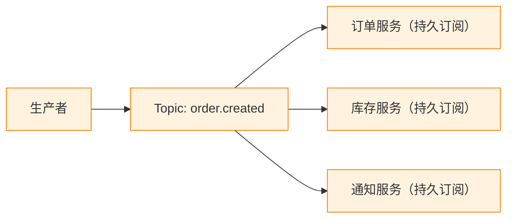
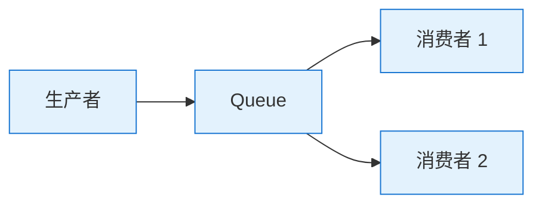
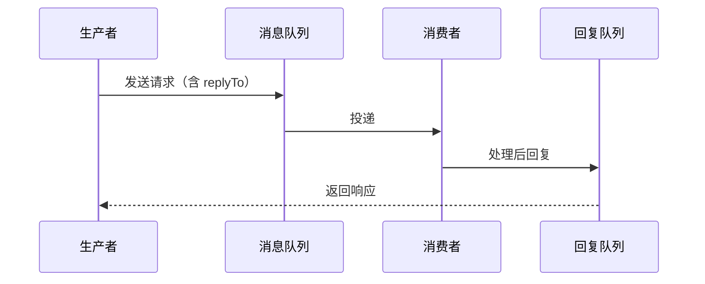

<!--
module:
  parent: system-design
  slug: system-design/service-communication
  type: article
  category: 主模块子文章
  summary: ⬅️ [返回微服务](../README.md) | ⬅️ [服务拆分策略](../service-decomposition/README.md) | ➡️...
-->

# 服务间通信

> 最后更新: 2026-06-09
> ⬅️ [返回微服务](../README.md) | ⬅️ [服务拆分策略](../service-decomposition/README.md) | ➡️ [服务契约](../service-contract/README.md)

---
## 引言：反直觉代码

服务间通信 的关键不是语法——是**看起来对**的代码背后那些'踩坑点'。

本篇用 3 个反直觉片段切入，把面试/生产中常被问起、但一深入就漏馅的点摆出来。

---

## 🎯 一句话定位

**服务间通信是微服务协作的"神经系统"**——通信方式的选择决定了**性能、可靠性、可扩展性**。本章讲三个核心问题：①同步 vs 异步？②协议选型？③API 版本管理？

---

## 一、同步 vs 异步：通信范式选择

### 1.1 同步通信（Request-Response）

> 调用方发出请求，**阻塞等待**响应。

```mermaid
sequenceDiagram
    participant C as 调用方
    participant S as 被调服务

    C->>S: HTTP/gRPC 请求
    Note over C,S: 阻塞等待
    S-->>C: 响应结果
    Note over C: 继续执行

    classDef sync fill:#e3f2fd,stroke:#1976d2
    classDef async fill:#fff3e0,stroke:#f57c00
```

**协议**：
- **REST/HTTP**（OpenAPI）—— 通用、可读性高、生态全
- **gRPC**（Protobuf）—— 高性能、强类型、流式支持
- **GraphQL**—— 客户端灵活查询

**优点**：
- ✅ 简单直观，易于理解和调试
- ✅ 实时响应，适合查询类操作
- ✅ 强一致性（调用即看到结果）

**缺点**：
- ❌ 调用方阻塞，性能与可靠性受被调方影响
- ❌ 服务间紧耦合（A 故障 → B 不可用）
- ❌ 同步等待浪费资源

### 1.2 异步通信（Event-Driven / Message）

> 调用方发出消息，**不等待**响应，被调方后续处理。

```mermaid
sequenceDiagram
    participant P as 生产者
    participant MQ as 消息队列
    participant C1 as 消费者 1
    participant C2 as 消费者 2

    P->>MQ: 发布事件
    Note over P: 立即返回
    MQ->>C1: 投递事件
    C1-->>MQ: ACK
    MQ->>C2: 投递事件
    C2-->>MQ: ACK

    classDef sync fill:#e3f2fd,stroke:#1976d2
    classDef async fill:#fff3e0,stroke:#f57c00
```

**协议**：
- **消息队列**：Kafka、RabbitMQ、RocketMQ、Pulsar
- **事件流**：Kafka（典型）、Pulsar
- **Pub/Sub**：Redis Pub/Sub（轻量）、Google Pub/Sub

**优点**：
- ✅ 解耦——生产者和消费者不需同时在线
- ✅ 削峰填谷——突发流量通过队列缓冲
- ✅ 可靠性——消息持久化、重试、死信队列
- ✅ 性能——异步不阻塞

**缺点**：
- ❌ 复杂度——需要消息中间件、监控、消息顺序保证
- ❌ 最终一致性——调用方不能立即获得结果
- ❌ 调试复杂——需要追踪消息链路

### 1.3 选型决策

| 场景 | 推荐 | 理由 |
|------|------|------|
| **查询类**（GET 资源） | 同步（REST/gRPC） | 简单、低延迟 |
| **命令类**（创建/修改） | 同步（写主流程） + 异步（后续处理） | 写主流程同步保证一致性，后续异步解耦 |
| **跨服务事务** | 异步（Saga） | 避免长事务占用资源 |
| **通知类**（邮件/推送） | 异步 | 完全解耦 |
| **数据同步** | 异步（CDC/事件） | 不影响主流程 |
| **高频低延迟** | 同步（gRPC） | 性能优先 |

> 🎯 **黄金法则**：**同步用于"必须立即知道结果"的场景，异步用于"可以稍后处理"的场景**。**默认异步**已成为主流微服务设计原则。

---

## 二、同步协议选型：REST vs gRPC vs GraphQL

### 2.1 对比

| 维度 | REST/HTTP | gRPC | GraphQL |
|------|-----------|------|---------|
| **数据格式** | JSON（文本） | Protobuf（二进制） | JSON |
| **性能** | 中 | ⭐⭐⭐⭐⭐ | 中 |
| **类型安全** | 弱（需 OpenAPI） | ⭐⭐⭐⭐⭐（强类型） | 中（需 schema） |
| **可读性** | ⭐⭐⭐⭐⭐ | ⭐⭐ | ⭐⭐⭐⭐⭐ |
| **浏览器友好** | ⭐⭐⭐⭐⭐ | ❌（需代理） | ⭐⭐⭐⭐⭐ |
| **流式支持** | ❌ | ⭐⭐⭐⭐⭐ | ⭐⭐⭐（订阅） |
| **代码生成** | 中 | ⭐⭐⭐⭐⭐ | 中 |
| **工具生态** | ⭐⭐⭐⭐⭐ | ⭐⭐⭐⭐ | ⭐⭐⭐ |
| **适用场景** | 外部 API、CRUD | 内部服务、高性能 | 灵活查询、前端聚合 |

### 2.2 选型决策

| 场景 | 推荐 | 理由 |
|------|------|------|
| **对外公开 API** | REST | 通用、工具多、跨语言 |
| **内部服务调用（高性能）** | gRPC | 性能 5-10x REST，强类型 |
| **多端聚合（移动/Web）** | GraphQL | 一次查询拿所需字段 |
| **微服务内部** | gRPC 为主 | 性能、生态（服务网格集成好） |
| **REST 替代为 gRPC** | 渐进式 | 通过 API Gateway 转换 |

### 2.3 gRPC 实战要点

```protobuf
// order.proto
syntax = "proto3";
package order.v1;

service OrderService {
  rpc CreateOrder(CreateOrderRequest) returns (CreateOrderResponse);
  rpc GetOrder(GetOrderRequest) returns (Order);
  rpc UpdateOrderStatus(UpdateOrderStatusRequest) returns (Order);
  // 流式：监听订单状态变化
  rpc WatchOrder(WatchOrderRequest) returns (stream Order);
}

message CreateOrderRequest {
  string user_id = 1;
  repeated OrderItem items = 2;
}

message Order {
  string id = 1;
  string user_id = 2;
  OrderStatus status = 3;
  double total_amount = 4;
  repeated OrderItem items = 5;
  int64 created_at = 6;
}

enum OrderStatus {
  ORDER_STATUS_UNSPECIFIED = 0;
  ORDER_STATUS_PENDING = 1;
  ORDER_STATUS_PAID = 2;
  ORDER_STATUS_SHIPPED = 3;
  ORDER_STATUS_DELIVERED = 4;
  ORDER_STATUS_CANCELLED = 5;
}
```

**gRPC 4 种通信模式**：

| 模式 | 说明 | 场景 |
|------|------|------|
| **Unary** | 一元调用 | 普通 RPC |
| **Server Streaming** | 服务端流式推送 | 实时数据推送 |
| **Client Streaming** | 客户端流式上传 | 大文件上传 |
| **Bidirectional** | 双向流式 | 实时通信、聊天 |

---

## 三、异步通信深入

### 3.1 消息队列选型

| 队列 | 吞吐量 | 延迟 | 适用 |
|------|:------:|:----:|------|
| **Kafka** | 极高（百万/秒） | 低 | 日志、事件流、CDC |
| **RocketMQ** | 高 | 低 | 阿里系、金融 |
| **RabbitMQ** | 中 | 极低 | 任务队列、RPC 风格 |
| **Pulsar** | 极高 | 低 | 多租户、地理复制 |
| **Redis Streams** | 中 | 极低 | 轻量场景 |

### 3.2 消息模式

#### 模式 1：发布-订阅（Pub/Sub）



- **特点**：一个事件可被多个消费者处理
- **典型场景**：领域事件（订单创建后多个下游反应）

#### 模式 2：点对点（Queue）



- **特点**：一条消息只被一个消费者处理
- **典型场景**：任务分发、负载均衡

#### 模式 3：请求-响应（Request-Reply）



- **特点**：异步 RPC 风格
- **典型场景**：长时间任务、不阻塞调用方

### 3.3 消息可靠性保障

| 问题 | 解法 |
|------|------|
| **消息丢失** | 生产者确认（ACK）+ 持久化 + 消费者 ACK |
| **重复消费** | 幂等消费 + 业务唯一键去重 |
| **消息顺序** | 单一 Partition + 按 key 路由 |
| **消息积压** | 监控 + 自动扩容消费者 |
| **死信** | 死信队列 + 人工/自动重试 |

### 3.4 消息顺序与一致性

**问题**：订单创建（10:00:00）→ 订单支付（10:00:01），如果支付事件先到会怎样？

**解法**：
1. **按业务 key 路由到同一 partition**（如 `orderId`）
2. **单消费者顺序处理**该 partition
3. **业务侧幂等检查**（最终防御）

---

## 四、API 版本管理

### 4.1 为什么需要版本管理

```
v1: GET /orders
v2: GET /orders（参数变化）
v3: GET /orders（结构变化）

问题：客户端使用 v1，服务端已升级 v2，如何共存？
```

### 4.2 4 种版本策略

| 策略 | 示例 | 优点 | 缺点 |
|------|------|------|------|
| **URI 版本** | `/v1/orders` | 简单清晰 | URI 膨胀 |
| **Header 版本** | `Accept: application/vnd.api.v2+json` | URI 干净 | 调试不直观 |
| **参数版本** | `/orders?version=2` | 灵活 | 违反 REST 原则 |
| **内容协商** | `Accept` Header | 标准 REST | 实现复杂 |

**推荐**：**URI 版本** 用于对外 API，**Header 版本** 用于内部服务。

### 4.3 版本演进原则

| 变更类型 | 处理 |
|---------|------|
| **新增字段** | ✅ 向后兼容（v2 客户端能忽略新字段） |
| **新增端点** | ✅ 兼容（不影响旧客户端） |
| **删除字段** | ⚠️ 标记为 deprecated，下个大版本移除 |
| **修改字段类型** | ❌ 破坏性变更，必须新版本 |
| **修改端点行为** | ⚠️ 谨慎，优先考虑新端点 |
| **删除端点** | ❌ 必须新版本 |

### 4.4 弃用流程

```yaml
## API 弃用时间表
- 2026-01: 标记 v1 为 deprecated（在响应 Header 中提示）
- 2026-03: 在文档中明确标注，给出迁移指南
- 2026-06: 监控 v1 调用量，联系未迁移用户
- 2026-09: 关闭 v1（返回 410 Gone 或 301 重定向到 v2）
```

---

## 五、超时、重试与幂等

### 5.1 超时设置

| 层级 | 超时原则 |
|------|---------|
| **客户端总超时** | 用户可接受时间（如 3s） |
| **单次 RPC 超时** | 略低于总超时（2.5s） |
| **数据库超时** | 远低于 RPC 超时（500ms） |
| **网络层超时** | 最低层 |

**公式**：
```
客户端总超时 > 单次 RPC 超时 > 数据库超时
```

### 5.2 重试策略

**不重试**：写操作、支付、可能产生副作用的操作 → **用幂等键解决**

**重试条件**：
- ✅ 读操作（GET）
- ✅ 幂等写操作（带幂等键）
- ❌ 非幂等写操作

**重试模式**：

| 模式 | 说明 | 公式 |
|------|------|------|
| **固定间隔** | 简单但不优 | 1s, 1s, 1s |
| **指数退避** | 推荐 | 1s, 2s, 4s, 8s |
| **抖动退避** | 防止雪崩 | 1s±0.5, 2s±0.5, 4s±0.5 |
| **最多重试次数** | 防止无限重试 | 3-5 次 |

### 5.3 幂等设计

> **幂等性**：同一操作执行一次和多次，结果相同。

**实现方法**：

| 方法 | 场景 |
|------|------|
| **幂等键（Idempotency Key）** | 客户端生成 UUID，服务端去重 |
| **业务唯一键** | 订单号、流水号（数据库唯一约束） |
| **状态机** | 订单状态流转，"已支付" 不可重复 |
| **乐观锁** | version 字段，更新前检查 |

**示例**：

```http
POST /api/v1/payments
Idempotency-Key: 7c4e8a3b-1f2d-4e5a-9b6c-7d8e9f0a1b2c
Content-Type: application/json

{
  "orderId": "ORD-2026-001",
  "amount": 99.00
}
```

服务端处理：
```python
def process_payment(idem_key, order_id, amount):
    # 1. 检查幂等键
    if cache.exists(f"idem:{idem_key}"):
        return cache.get(f"idem:{idem_key}")  # 返回上次结果

    # 2. 处理支付
    result = do_payment(order_id, amount)

    # 3. 缓存幂等结果（24h）
    cache.set(f"idem:{idem_key}", result, ex=86400)
    return result
```

---

## 六、服务通信的反模式

### 6.1 同步链路过长

```
A → B → C → D → E（5 跳同步调用）
```

**问题**：
- 延迟：5 × 50ms = 250ms+
- 故障传播：任一故障拖垮全链
- 资源占用：线程/连接堆积

**对策**：
- 异步化（事件驱动）
- 服务聚合（用 BFF 把多次调用合并为 1 次）
- 缓存热点数据

### 6.2 缺乏超时设置

```
A 调用 B，无超时 → A 永久等待
```

**问题**：单服务故障拖垮上游所有调用方。

**对策**：所有远程调用**必须**设置超时（建议 ≤ 3s）。

### 6.3 无重试或盲目重试

```
不重试：单次网络抖动就失败
盲目重试：支付 5 次扣款 5 次
```

**对策**：
- 读操作重试 + 指数退避
- 写操作幂等（避免重复扣款）
- 设置最大重试次数（3-5 次）

### 6.4 缺乏熔断

```
A → B（故障），A 持续重试 → A 资源耗尽
```

**对策**：熔断器（[03-high-availability/circuit-break/](../../../../03-high-availability/circuit-break/)）——B 故障时，A 快速失败而非持续重试。

---

## 七、通信模式选型速查表

| 业务场景 | 通信模式 | 协议/中间件 |
|---------|---------|------------|
| 查询用户信息 | 同步 | REST/gRPC |
| 创建订单 | 同步 + 异步 | REST 写主流程，Kafka 发事件 |
| 订单支付 | 同步 | gRPC（实时扣款） |
| 支付结果通知 | 异步 | Kafka / RocketMQ |
| 库存扣减 | 同步 | gRPC（强一致） |
| 物流追踪 | 异步 | Kafka（持续推送） |
| 邮件/短信发送 | 异步 | RabbitMQ |
| 数据同步（订单→数仓） | 异步 | Kafka + CDC |
| 服务监控 | 异步 | Kafka + Prometheus |

---

## 🤔 思考

1. **你的同步 vs 异步配比**：项目里同步调用占多少？是否过度同步？
2. **gRPC vs REST 决策**：内部服务用什么？外部 API 用什么？
3. **API 版本管理**：你的 API 有版本吗？弃用流程清晰吗？
4. **幂等设计**：所有写操作都有幂等保护吗？特别是支付类？

---

## 相关章节

- ⬅️ [返回微服务](../README.md)
- ⬅️ [服务拆分策略](../service-decomposition/README.md)
- ➡️ [服务契约](../service-contract/README.md)
- [数据一致性](../data-consistency/README.md) — 异步通信的最终一致性挑战
- [RPC vs REST 对比](../../../../02-distributed/rpc/rpc-and-rest/README.md) — 同步通信选型
- [RPC 总览](../../../../02-distributed/rpc/README.md) — RPC 协议与框架
- [服务发现](../../../../02-distributed/service-discovery/README.md) — 动态寻址
- [API 网关](../../../../02-distributed/api-gateway/README.md) — 统一入口
- [分布式锁](../../../../02-distributed/distributed-lock/README.md) — 异步通信的去重机制
- [限流/熔断/重试](../../../../03-high-availability/) — 通信的可靠性保障
- [消息队列](../../../../04-high-performance/mq/) — 异步通信的基础设施
