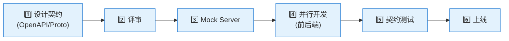

<!--
module:
  parent: system-design
  slug: system-design/service-contract
  type: article
  category: 主模块子文章
  summary: ⬅️ [返回微服务](../README.md) | ⬅️ [服务间通信](../service-communication/README.md) | ➡️ [...
-->

# 服务契约

> ⬅️ [返回微服务](../README.md) | ⬅️ [服务间通信](../service-communication/README.md) | ➡️ [数据一致性](../data-consistency/README.md)

---
---

## 🎯 一句话定位

**服务契约是服务间协作的"法律协议"**——它定义了接口的**格式、行为、版本、测试**，让服务自治的同时保持兼容。本章讲四个核心：①契约设计 ②OpenAPI/Protobuf ③契约测试 ④契约演进。

---

## 一、为什么需要服务契约

### 1.1 没有契约的协作

```text
服务 A：我觉得"用户"应该有 name 和 email
服务 B：我觉得"用户"应该有 id 和 phone

→ 接口定义混乱、集成测试失败、版本管理失控
```

### 1.2 契约的 4 大作用

| 作用 | 说明 |
|------|------|
| **📜 接口规范化** | 统一的 schema 语言（OpenAPI/Protobuf） |
| **🧪 自动化测试** | 消费者按契约验证，脱离真实服务 |
| **🔄 版本管理** | 兼容 vs 破坏性变更的判定依据 |
| **📚 自动文档** | 文档从代码生成，避免过期 |

---

## 二、API 优先设计（API-First）

### 2.1 设计流程



> 🎯 **核心原则**：**先有契约，再有实现**。契约是团队协作的"宪法"。

### 2.2 API-First 的好处

- ✅ **前后端并行**：前端用 Mock Server 先行开发
- ✅ **跨语言协作**：.proto 文件就是契约，Go/Java/Python 都能生成代码
- ✅ **测试驱动**：消费者按契约写测试，无需等真实服务
- ✅ **减少返工**：设计阶段暴露分歧，避免实现后才发现

---

## 三、OpenAPI / Swagger（REST API 契约）

### 3.1 OpenAPI 示例

```yaml
# order-service.openapi.yaml
openapi: 3.0.3
info:
  title: Order Service API
  version: 1.2.0
  description: 订单服务 REST API 契约

servers:
  - url: https://api.example.com/v1
    description: 生产环境
  - url: https://api.staging.example.com/v1
    description: 测试环境

paths:
  /orders:
    post:
      summary: 创建订单
      operationId: createOrder
      tags: [orders]
      requestBody:
        required: true
        content:
          application/json:
            schema:
              $ref: '#/components/schemas/CreateOrderRequest'
      responses:
        '201':
          description: 订单创建成功
          content:
            application/json:
              schema:
                $ref: '#/components/schemas/Order'
        '400':
          $ref: '#/components/responses/BadRequest'
        '401':
          $ref: '#/components/responses/Unauthorized'

    get:
      summary: 查询订单列表
      operationId: listOrders
      tags: [orders]
      parameters:
        - name: userId
          in: query
          required: true
          schema:
            type: string
        - name: status
          in: query
          schema:
            $ref: '#/components/schemas/OrderStatus'
        - name: limit
          in: query
          schema:
            type: integer
            default: 20
            maximum: 100
      responses:
        '200':
          description: 订单列表
          content:
            application/json:
              schema:
                type: array
                items:
                  $ref: '#/components/schemas/Order'

  /orders/{orderId}:
    get:
      summary: 获取订单详情
      operationId: getOrder
      tags: [orders]
      parameters:
        - name: orderId
          in: path
          required: true
          schema:
            type: string
      responses:
        '200':
          description: 订单详情
          content:
            application/json:
              schema:
                $ref: '#/components/schemas/Order'
        '404':
          $ref: '#/components/responses/NotFound'

components:
  schemas:
    Order:
      type: object
      required: [id, userId, status, totalAmount, items]
      properties:
        id:
          type: string
          example: ORD-2026-001
        userId:
          type: string
        status:
          $ref: '#/components/schemas/OrderStatus'
        totalAmount:
          type: number
          format: double
        items:
          type: array
          items:
            $ref: '#/components/schemas/OrderItem'
        createdAt:
          type: string
          format: date-time

    OrderStatus:
      type: string
      enum: [PENDING, PAID, SHIPPED, DELIVERED, CANCELLED]

    CreateOrderRequest:
      type: object
      required: [userId, items]
      properties:
        userId:
          type: string
        items:
          type: array
          minItems: 1
          items:
            $ref: '#/components/schemas/OrderItem'

    OrderItem:
      type: object
      required: [productId, quantity, unitPrice]
      properties:
        productId:
          type: string
        quantity:
          type: integer
          minimum: 1
        unitPrice:
          type: number
          format: double

  responses:
    BadRequest:
      description: 请求参数错误
    Unauthorized:
      description: 未认证
    NotFound:
      description: 资源未找到
```

### 3.2 OpenAPI 工具链

| 工具 | 用途 |
|------|------|
| **Swagger Editor** | 在线编辑/预览 OpenAPI 文档 |
| **Swagger UI** | 生成交互式 API 文档 |
| **Redoc** | 更美观的 API 文档 |
| **OpenAPI Generator** | 从 OpenAPI 生成客户端 SDK |
| **Stoplight** | API 设计协作平台 |
| **Spectral** | OpenAPI Linter，检查规范 |

### 3.3 从 OpenAPI 生成代码

```bash
# 生成 TypeScript 客户端
openapi-generator-cli generate \
  -i order-service.openapi.yaml \
  -g typescript-axios \
  -o ./clients/typescript

# 生成 Java Server Stub
openapi-generator-cli generate \
  -i order-service.openapi.yaml \
  -g spring \
  -o ./servers/java-spring

# 生成 Python 客户端
openapi-generator-cli generate \
  -i order-service.openapi.yaml \
  -g python \
  -o ./clients/python
```

---

## 四、Protocol Buffers（gRPC 契约）

### 4.1 .proto 示例

```protobuf
syntax = "proto3";

package order.v1;

option go_package = "github.com/example/order-service/proto";
option java_package = "com.example.order";

// 订单服务
service OrderService {
  // 创建订单
  rpc CreateOrder(CreateOrderRequest) returns (CreateOrderResponse);
  // 获取订单
  rpc GetOrder(GetOrderRequest) returns (Order);
  // 列出订单
  rpc ListOrders(ListOrdersRequest) returns (ListOrdersResponse);
  // 更新订单状态
  rpc UpdateOrderStatus(UpdateOrderStatusRequest) returns (Order);
  // 订阅订单事件（流式）
  rpc WatchOrders(WatchOrdersRequest) returns (stream OrderEvent);
}

// 消息定义
message Order {
  string id = 1;
  string user_id = 2;
  OrderStatus status = 3;
  double total_amount = 4;
  repeated OrderItem items = 5;
  google.protobuf.Timestamp created_at = 6;
  google.protobuf.Timestamp updated_at = 7;
}

message OrderItem {
  string product_id = 1;
  int32 quantity = 2;
  double unit_price = 3;
}

enum OrderStatus {
  ORDER_STATUS_UNSPECIFIED = 0;  // 必须有零值（默认）
  ORDER_STATUS_PENDING = 1;
  ORDER_STATUS_PAID = 2;
  ORDER_STATUS_SHIPPED = 3;
  ORDER_STATUS_DELIVERED = 4;
  ORDER_STATUS_CANCELLED = 5;
}

// 请求/响应消息
message CreateOrderRequest {
  string user_id = 1;
  repeated OrderItem items = 2;
  string idempotency_key = 3;  // 幂等键
}

message CreateOrderResponse {
  Order order = 1;
}

message GetOrderRequest {
  string order_id = 1;
}

message ListOrdersRequest {
  string user_id = 1;
  OrderStatus status = 2;
  int32 page_size = 3;
  string page_token = 4;
}

message ListOrdersResponse {
  repeated Order orders = 1;
  string next_page_token = 2;
}

message UpdateOrderStatusRequest {
  string order_id = 1;
  OrderStatus status = 2;
}

message WatchOrdersRequest {
  string user_id = 1;
}

message OrderEvent {
  string order_id = 1;
  OrderStatus new_status = 2;
  google.protobuf.Timestamp event_time = 3;
}
```

### 4.2 Protobuf 工具链

| 工具 | 用途 |
|------|------|
| **protoc** | 编译器 |
| **buf** | 现代化 Protobuf 工具（lint、breaking change 检测、依赖管理） |
| **grpc-gateway** | gRPC 转 REST 代理 |
| **grpc-swagger** | gRPC 自动生成 Swagger 文档 |
| **grpcurl** | 命令行 gRPC 客户端 |

### 4.3 buf 的 breaking change 检测

```bash
# 检测 main 与上一个 git tag 之间的 breaking changes
buf breaking --against ".git#tag=v1.0.0"

# 输出示例：
# order/v1/order.proto:45:1:Field "6" on message "Order" changed type from "string" to "int64".
# ❌ 破坏性变更：字段类型变更
```

---

## 五、契约测试（Contract Testing）

### 5.1 三种测试层次

| 层次 | 说明 | 工具 |
|------|------|------|
| **单元测试** | 测试单个函数 | JUnit、pytest |
| **集成测试** | 测试服务集成 | Testcontainers |
| **契约测试** | 验证服务间接口 | Pact、Spring Cloud Contract |

### 5.2 Pact（消费者驱动的契约测试）

> **Pact 核心理念**：**消费者定义契约，提供者验证**。消费者按期望写"预期响应"，提供者在 CI 中验证自己满足这些预期。

#### 流程

```mermaid
sequenceDiagram
    participant C as 消费者
    participant P as Pact Broker
    participant PR as 提供者

    C->>C: 1. 写消费者测试<br/>(含 mock 提供者)
    C->>P: 2. 发布契约
    PR->>P: 3. 拉取契约
    PR->>PR: 4. 验证契约<br/>(真实服务 vs 契约)
    PR-->>P: 5. 发布验证结果

    classDef consumer fill:#e3f2fd
    classDef provider fill:#fff3e0
    classDef broker fill:#e8f5e9
    class C consumer
    class PR provider
    class P broker
```

#### 消费者侧测试（前端示例）

```python
# tests/contract/test_order_consumer.py
from pact import Consumer, Provider

pact = Consumer('FrontendApp').has_pact_with(Provider('OrderService'))

def test_get_order():
    expected = {
        'id': 'ORD-001',
        'userId': 'user-123',
        'status': 'PAID',
        'totalAmount': 99.00,
        'items': [
            {'productId': 'prod-1', 'quantity': 2, 'unitPrice': 49.50}
        ]
    }

    (pact
     .given('order ORD-001 exists')
     .upon_receiving('a request for order ORD-001')
     .with_request('GET', '/orders/ORD-001')
     .will_respond_with(200, body=expected))

    with pact:
        result = frontend_api.get_order('ORD-001')
        assert result.id == 'ORD-001'
        assert result.status == 'PAID'
```

#### 提供者侧验证（后端示例）

```python
# tests/contract/test_order_provider.py
import pytest
from pact import Provider

pact = Provider('OrderService')

@pytest.mark.pact_verifier
def test_order_service_honors_contract():
    # 从 Pact Broker 拉取所有消费者的契约
    # 用真实服务验证
    pact.verify()
```

### 5.3 契约测试 vs 集成测试

| 维度 | 契约测试 | 集成测试 |
|------|---------|---------|
| **测试对象** | 接口契约 | 完整业务流 |
| **速度** | 快（无网络） | 慢（需启动服务） |
| **覆盖** | 接口边界 | 业务逻辑 |
| **依赖** | Mock 服务 | 真实服务 |
| **维护** | 消费者驱动 | 提供者侧 |

> **推荐**：契约测试 + 少量 E2E 集成测试 = 最佳平衡。

---

## 六、契约演进

### 6.1 兼容性原则

> **服务契约应保持向后兼容**——新增字段、端点是兼容的；删除或修改则是破坏性变更。

### 6.2 兼容 vs 破坏性变更

| 变更 | 是否兼容 | 做法 |
|------|:--------:|------|
| **新增字段（请求）** | ✅ | 旧客户端忽略新字段 |
| **新增字段（响应）** | ✅ | 旧客户端忽略新字段 |
| **新增端点** | ✅ | 不影响 |
| **新增可选参数** | ✅ | 旧客户端不传 |
| **删除字段（响应）** | ❌ | 破坏性，需 v2 |
| **删除端点** | ❌ | 破坏性，需 v2 |
| **修改字段类型** | ❌ | 破坏性，需 v2 |
| **必填字段变为可选** | ✅ | 兼容 |
| **可选字段变为必填** | ❌ | 破坏性，需 v2 |
| **修改 HTTP 方法** | ❌ | 破坏性，需 v2 |

### 6.3 演进策略

#### 策略 1：版本共存（推荐）

```text
/v1/orders（保留 12-18 个月）
/v2/orders（新版本）
```

#### 策略 2：渐进式迁移

```text
1. v2 上线，v1 标 deprecated
2. 监控 v1 调用量
3. 推动消费者迁移
4. v1 调用量 < 5% 时关闭
```

#### 策略 3：语义化版本（SemVer）

```text
v1.0.0 → v1.1.0（兼容新增） → v2.0.0（破坏性）
```

### 6.4 弃用通知机制

```http
HTTP/1.1 200 OK
Deprecation: true
Sunset: Sat, 01 Sep 2026 00:00:00 GMT
Link: <https://api.example.com/v2/orders>; rel="successor-version"

{
  "data": {...},
  "_meta": {
    "deprecation_notice": "This API will be removed on 2026-09-01. Please migrate to v2."
  }
}
```

---

## 七、契约治理

### 7.1 契约的所有权

| 类型 | 所有权 |
|------|-------|
| **对外 API（公开）** | API 治理团队 + 业务方 |
| **服务间 API** | 服务提供方（消费者协商） |
| **事件契约** | 事件所有者（Producer） |

### 7.2 契约评审清单

- [ ] 字段命名一致（snake_case 或 camelCase 全局统一）？
- [ ] 时间字段使用标准格式（ISO 8601 / Unix 时间戳）？
- [ ] 错误码体系一致？
- [ ] 必填/可选字段明确标注？
- [ ] 枚举值有完整定义？
- [ ] 文档示例完整？
- [ ] 兼容 vs 破坏性变更判定？

### 7.3 契约存储与共享

| 方式 | 适用 |
|------|------|
| **Git 仓库** | 内部服务，monorepo 模式 |
| **Pact Broker** | 跨团队契约管理 |
| **API 网关** | 集中式 API 目录 |
| **API 设计平台**（Stoplight/Apicurio） | 设计协作 + 文档化 |

---

## 🤔 思考

1. **你的 API 优先吗**：是先有实现再补文档，还是先有契约再写代码？
2. **你有契约测试吗**：消费者按契约写测试，还是等真实服务集成？
3. **你的 API 版本管理**：版本共存还是单版本？弃用流程清晰吗？
4. **契约演进**：过去 6 个月里，你的 API 有过破坏性变更吗？是如何处理的？

---

## 相关章节

- ⬅️ [返回微服务](../README.md)
- ⬅️ [服务间通信](../service-communication/README.md)
- ➡️ [数据一致性](../data-consistency/README.md)
- [Pact 官方文档](https://docs.pact.io/) — 契约测试工具
- [OpenAPI 规范](https://swagger.io/specification/) — REST API 契约
- [Protocol Buffers](https://protobuf.dev/) — gRPC 契约语言

← [返回微服务](../README.md)
