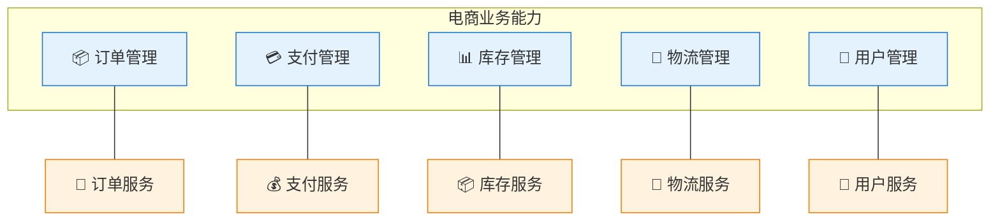

# 服务拆分策略

> 最后更新: 2026-06-09
> ⬅️ [返回微服务](../README.md) | ➡️ [服务间通信](../service-communication/README.md)

---
## 引言：反直觉代码（[AUTO] 自动生成，待人工 review）

服务拆分策略 本应该很简单，最后更新: 2026-06-09

**但实际**：面试/生产中常被问起或踩坑的是——
代码看着对、跑起来对，但仔细一问深一层就漏馅。本篇就从'反直觉'这个角度切入，把踩坑点和根因摆出来。

> 📌 本段由 `note/scripts/add-intro.py` 自动生成（场景模板 + README 摘录）。**下次 review 时请改为真实场景 + 数字 + 反思**，目前仅满足'有引言'的最低要求。

---


## 🎯 一句话定位

**服务拆分是微服务设计的第一难题**——拆错比不拆更糟。本章讲三个核心问题：①按什么拆？②拆多细？③常见反模式。

---

## 一、按什么拆：3 大原则

### 1.1 按业务能力拆（Business Capability）

> **最常用、最稳定**——按 TOGAF 业务能力图划分服务（[../togaf/business-capability.md](../../togaf/business-capability.md)）。



**优点**：
- ✅ 业务能力稳定（5-10 年不变），服务边界随之稳定
- ✅ 团队组织与服务一致，符合康威定律
- ✅ 业务域清晰，需求变更影响范围可控

**示例（电商）**：

| 业务能力 | 微服务 | 关键聚合 |
|---------|-------|---------|
| 商品管理 | `product-service` | `Product` 聚合 |
| 订单管理 | `order-service` | `Order` 聚合 |
| 支付管理 | `payment-service` | `Payment` 聚合 |
| 库存管理 | `inventory-service` | `Stock` 聚合 |
| 物流管理 | `logistics-service` | `Shipment` 聚合 |
| 用户管理 | `user-service` | `User` 聚合 |

### 1.2 按 DDD 限界上下文拆

> **业务能力的精细化**——把每个业务能力进一步细分为**限界上下文**（[../ddd/](../../ddd/README.md)）。

**关系链**：
```
业务能力（TOGAF L1/L2）→ 限界上下文（DDD 战略设计）→ 微服务
```

**示例（订单管理 → 限界上下文 → 服务）**：

| 业务能力 | 限界上下文 | 微服务 |
|---------|----------|-------|
| 订单管理 | 订单生命周期 | `order-service` |
| 订单管理 | 订单价格计算 | `pricing-service`（独立演化） |
| 订单管理 | 订单查询视图 | `order-query-service`（CQRS 读侧） |

### 1.3 按业务变化频率拆

> **同一业务能力内，变化频率不同的部分拆分**——减少高频变更对低频的影响。

**判断维度**：

| 维度 | 高频变化 | 低频变化 |
|------|---------|---------|
| **业务规则** | 促销、定价、活动 | 物流、支付通道 |
| **集成** | 第三方 API 频繁更新 | 内部系统 |
| **监管** | 频繁变化的合规要求 | 稳定的法律框架 |

**示例**：
- 支付服务的"**支付通道**"高频变化（新增/替换支付方式）→ 拆为 `payment-gateway-service`
- 支付服务的"**账户/对账**"低频变化 → 保留在 `payment-core-service`

---

## 二、拆多细：粒度判断

### 2.1 粒度判断的 3 维度

| 维度 | 拆得太细 | 拆得正好 | 拆得太粗 |
|------|---------|---------|---------|
| **代码量** | < 500 行 | 2000-10000 行 | > 50000 行 |
| **团队** | 1-2 人维护 | 3-9 人 | > 15 人 |
| **变更频率** | 每天多次部署 | 每周 1-3 次 | 每月/季度 |
| **领域复杂度** | 单一功能 | 完整业务能力 | 多个业务域 |

> 🎯 **核心经验**：**Amazon "Two Pizza Team"**——一个团队两张披萨喂得饱（5-9 人）。这意味着服务应能由一个 3-9 人团队独立维护。

### 2.2 粒度判断的"两个不应该"

- **不应该 1**：**一个服务 = 一个类**——这是"纳米服务反模式"
- **不应该 2**：**一个服务 = 一个完整业务域**（如"电商服务"）——这又退化为单体

### 2.3 服务数量参考

| 团队规模 | 推荐服务数 | 备注 |
|---------|:---------:|------|
| 10-30 人 | 3-8 个 | 早期不应过多 |
| 50-100 人 | 10-20 个 | 演进至适度粒度 |
| 100-500 人 | 30-80 个 | 严格按业务能力 |
| 500+ 人 | 100+ 个 | 服务网格治理 |

> **判断标准**：当服务数量超过**团队数 × 1.5** 时，应考虑合并；当服务数量少于**团队数 × 0.5** 时，应考虑拆分。

---

## 三、拆分方法

### 3.1 业务能力映射法

```
步骤 1：画出业务能力地图（TOGAF L1 + L2）
步骤 2：每个能力 = 一个候选服务
步骤 3：检查"过粗"能力（> 50000 行 / 团队 > 15 人）→ 进一步拆分
步骤 4：检查"过细"能力（< 500 行 / 团队 < 2 人）→ 合并
步骤 5：检查服务依赖图，强耦合服务合并
```

### 3.2 事件风暴法（Event Storming）

> **DDD 战略设计推荐方法**——通过识别领域事件、命令、聚合来推导限界上下文。

**步骤**：
1. **识别领域事件**（橙色便签）——"订单已创建"、"支付已成功"等
2. **识别命令**（蓝色便签）——触发事件的动作（"下单"、"支付"）
3. **识别聚合**（黄色便签）——事件的载体
4. **识别限界上下文**（棕色便签）——业务概念自然聚类
5. **识别上下文映射**——上下文之间的关系（合作关系、上下游、防腐层等）

**输出**：
- 限界上下文图
- 上下文映射关系
- 微服务候选列表

### 3.3 现有单体分析

| 数据来源 | 用法 |
|---------|------|
| **代码结构** | 模块/包/命名空间 → 自然边界 |
| **依赖图** | 强依赖 = 同一服务；弱依赖 = 可拆 |
| **数据库表关联** | 频繁 JOIN 的表 → 同一服务；独立表 → 可拆 |
| **Git 提交历史** | 同一组文件频繁改动 → 同一团队/服务 |
| **故障域** | 同一类故障影响的模块 → 同一服务 |

---

## 四、5 大反模式

### 4.1 纳米服务（Nanoservices）

> **症状**：一个服务只做一件事（< 200 行），过度拆分。

**问题**：
- 运维成本指数级增长（部署、监控、追踪）
- 跨服务调用成为瓶颈（5+ 跳的调用链）
- 分布式事务复杂度爆炸

**对策**：
- 按"3 维度"判断（代码/团队/变更频率）
- 一个服务承担一个完整业务能力，而非一个类
- 遵循"5-9 人/团队"原则

### 4.2 分布式单体（Distributed Monolith）

> **症状**：拆分了多个服务，但服务间强耦合，必须一起部署。

**问题**：
- 拆分的好处（独立部署）完全消失
- 增加了网络调用的复杂度和延迟
- 反而比单体更糟糕

**典型征兆**：

| 征兆 | 说明 |
|------|------|
| 改一个服务需要同时改其他 3+ 个 | 接口频繁变化 |
| 服务间使用共享数据库 | 数据耦合 |
| 团队沟通频率 > 服务内沟通 | 康威定律失败 |
| 同步调用链 > 5 跳 | 调用链过长 |

**对策**：
- 重新合并强耦合服务
- 引入防腐层隔离外部依赖
- 用 Saga/事件驱动解耦同步调用

### 4.3 共享数据库（Shared Database）

> **症状**：多个服务共享同一个数据库。

**问题**：
- 服务间隐性耦合（一个改表结构影响所有）
- 无法独立扩展
- 违反"自治"原则

**对策**：
- **Database per Service**：每个服务独立数据库
- 跨服务数据通过 **API/事件** 同步（数据复制）
- 必要时用 **数据网格（Data Mesh）** 或 **数据中台**

### 4.4 同步调用链（Sync Chain）

> **症状**：A → B → C → D 同步调用，链路过长。

**问题**：
- 延迟累积：4 跳 × 50ms = 200ms
- 故障传播：任一服务故障拖垮全链
- 资源占用：线程/连接池在等待中耗尽

**对策**：
- 同步调用 ≤ 2 跳（理想 1 跳）
- 异步化（事件驱动 + 消息队列）
- 批量请求合并
- 缓存热点数据

### 4.5 性能低于单体（Worse Than Monolith）

> **症状**：拆完之后性能反而下降。

**根因**：
- 网络调用开销（序列化/反序列化/网络 RTT）
- 多次数据库调用替代原本的 JOIN
- 分布式事务补偿逻辑

**对策**：
- 内部 API 合并（同一聚合根的不同操作一次调用）
- 读写分离 + CQRS（写侧合并，读侧拆分）
- 引入缓存减少跨服务调用
- 重新评估粒度

---

## 五、拆分实战：电商订单域

### 5.1 初始结构（单体）

```
ecommerce-monolith/
├── order/         # 订单模块
├── payment/       # 支付模块
├── inventory/     # 库存模块
├── delivery/      # 物流模块
├── user/          # 用户模块
└── product/       # 商品模块
```

### 5.2 第一轮拆分（按业务能力）

```
services/
├── order-service/         # 订单 CRUD
├── payment-service/       # 支付
├── inventory-service/     # 库存
├── delivery-service/      # 物流
├── user-service/          # 用户
└── product-service/       # 商品
```

### 5.3 第二轮拆分（按限界上下文）

```
services/
├── order-service/         # 订单生命周期
├── pricing-service/       # 价格计算（独立演化）⭐
├── payment-service/
├── inventory-service/
├── delivery-service/
├── user-service/
└── product-service/
```

### 5.4 第三轮拆分（按变化频率）

```
services/
├── order-service/
├── pricing-service/
├── payment-core/          # 支付核心
├── payment-gateway/       # 支付通道（高频变化）⭐
├── inventory-service/
├── delivery-service/
├── user-service/
└── product-service/
```

> **拆分节奏**：**每 6-12 个月审视一次**，避免过早拆分（业务未稳定时拆分导致返工）。

---

## 六、拆分检查清单

拆分前 / 拆分后必查：

- [ ] 服务边界是否对应稳定业务能力？
- [ ] 服务粒度是否符合"5-9 人/团队"原则？
- [ ] 服务间是否有共享数据库？（不应有）
- [ ] 同步调用链是否 ≤ 2 跳？
- [ ] 每个服务有独立 CI/CD 流水线？
- [ ] 每个服务有独立监控和告警？
- [ ] 服务间接口有版本管理？
- [ ] 团队组织与服务边界对齐？（康威定律）

---

## 🤔 思考

1. **你的服务边界稳定吗**：6 个月前拆的服务，今天的边界还合理吗？
2. **你的粒度合适吗**：用"3 维度"自评——是纳米服务、分布式单体、还是合适粒度？
3. **拆分依据是什么**：业务能力 / DDD / 变化频率？哪个更适合你的项目？
4. **强耦合服务合并了吗**：识别强耦合服务对，考虑合并或用 Saga 解耦？

---

## 相关章节

- ⬅️ [返回微服务](../README.md)
- ➡️ [服务间通信](../service-communication/README.md)
- ➡️ [服务契约](../service-contract/README.md) — 拆分后的接口契约
- ➡️ [数据一致性](../data-consistency/README.md) — 拆分后的一致性挑战
- [微服务与 DDD](../microservices-and-ddd/README.md) — 业务能力 → 限界上下文
- [TOGAF 业务能力](../../togaf/business-capability.md) — 业务能力地图
- [DDD 限界上下文](../../ddd/README.md) — 服务边界的业务依据
- [演进与组织](../migration-and-organization/README.md) — 拆分的实施路径
