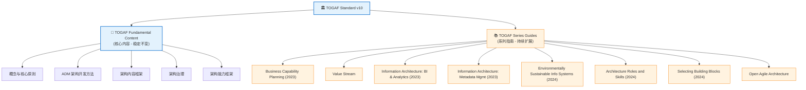

<!--
module:
  parent: system-design
  slug: system-design/togaf
  type: article
  category: 主模块子文章
  summary: 企业架构（Enterprise Architecture，EA）是从全局视角规划和治理组织 IT 结构的系统性方法。
-->

# 企业架构（TOGAF 10）

> 企业架构（Enterprise Architecture，EA）是从全局视角规划和治理组织 IT 结构的系统性方法。  
> **TOGAF**（The Open Group Architecture Framework）是目前最主流的企业架构框架，由 The Open Group 维护。最新版本是 **TOGAF 10**（2022 年 4 月发布）。

---
## 引言：架构困境

企业架构（TOGAF 10） 的关键不是'选型'——是**选完之后怎么在 5 个 trade-off 里活下来**。

本篇用'决策困境'切入，比较几种主流路径并讲清取舍。

---

## 🎯 一句话定位

**TOGAF 10 是一套用于"将业务战略转化为可执行 IT 蓝图"的标准化治理框架**——它不教你如何设计一个类，而是教你如何让数百个系统、数十个团队在统一的方向下协同工作。TOGAF 10 在 9.x 的基础上做了**模块化重构**，并整合进 The Open Group 的"数字开放标准组合"。

---

## 🆕 TOGAF 10 速览（vs 9.x）

| 维度 | TOGAF 9.x | **TOGAF 10** |
|------|-----------|--------------|
| **发布** | 2009（9.0）/ 2018（9.2） | 2022 年 4 月 |
| **结构** | 单体文档 | **模块化**：Fundamental Content（核心内容）+ Series Guides（系列指南） |
| **敏捷适配** | 偏瀑布 | 内置敏捷/数字化转型支持 |
| **文档源** | Word + DocBook | **AsciiDoc + Git**（版本可控、协作友好） |
| **标准组合** | 独立标准 | 纳入 The Open Group **数字开放标准组合**（含 IT4IT、ArchiMate 3.2、Open Agile Architecture） |
| **认证** | TOGAF 9 Certified | **TOGAF Enterprise Architecture Foundation / Practitioner**（TOGAF 10 认证已超 16,000+） |
| **总认证数** | 150,000+（171 个国家） | 持续增长（2025） |

### TOGAF 10 模块化结构



---

## 📚 章节导航

| 章节 | 文件 | 核心问题 | 建议时长 |
|:----:|:-----|:---------|:--------:|
| **第一章** | [核心思想 + ADM 详解](adm.md) | ADM 的 9 阶段如何系统化把战略变成 IT？ | 50 min |
| **第二章** | [BCAT + 业务能力 + 价值流](business-capability.md) | 如何用"业务能力"和"价值流"连接业务与 IT？ | 45 min |
| **第三章** | [康威定律 + 团队拓扑](conway-and-team-topology.md) | 组织结构如何决定系统架构？ | 35 min |
| **第四章** | [架构治理 + 落地实践](architecture-governance.md) | 架构设计完如何保证执行不走样？ | 40 min |

### 推荐阅读顺序

```text
README（你在这里）  →  第一章（ADM 全貌）
        ↓
        第二章（业务能力建模 + 价值流）→ 第三章（组织对齐）
        ↓
        第四章（治理 + 落地实践）
```

- **时间紧张**（30 分钟）：先读本章"核心概念速查"+ 第一章前 3 节
- **架构师视角**：四章通读 + 第四章的"按规模裁剪"
- **工程实践者**：重点看第二章（业务能力→DDD 映射）+ 第三章（康威定律→微服务）

---

## ⚡ 核心概念速查

| 概念 | 一句话定义 | 章节 |
|------|----------|:----:|
| **TOGAF** | The Open Group Architecture Framework，企业架构框架 | 全部 |
| **ADM** | Architecture Development Method，9 阶段循环迭代方法 | [第一章](adm.md) |
| **BCAT** | Business / Information Systems(数据+应用) / Technology 四层 | [第二章](business-capability.md) |
| **业务能力** | 组织"做什么"（而非"怎么做"）的能力单元 | [第二章](business-capability.md) |
| **价值流** | 端到端为客户创造价值的活动序列 | [第二章](business-capability.md) |
| **康威定律** | 系统结构 = 组织的沟通结构 | [第三章](conway-and-team-topology.md) |
| **团队拓扑** | 4 种团队类型（流式/赋能/复杂子系统/平台） | [第三章](conway-and-team-topology.md) |
| **架构治理** | 6 维度（合规/合同/决策/沟通/能力/控制） | [第四章](architecture-governance.md) |
| **ADR** | Architecture Decision Record，轻量级架构决策记录 | [第四章](architecture-governance.md) |

---

## 🧭 TOGAF 在系统设计中的位置

```text
战略层：TOGAF（企业架构） → 决定"做什么系统、由谁做、怎么治理"
        ↓
中观层：DDD（领域驱动设计）→ 决定"系统边界在哪、业务是什么"
        ↓
战术层：OOD（面向对象设计） → 决定"类如何组织、方法如何分配"
        ↓
编码层：设计模式 + 编码规范  → 决定"常见问题如何优雅解决"
```

> TOGAF + DDD + OOD 不是竞争关系，而是**从战略到战术到编码的三层递进**，分别解决"做什么 → 怎么拆 → 怎么写"的问题。

---

## 📂 相关章节

- [第一章：核心思想 + ADM 详解](adm.md) — 从业务战略到 IT 实现的系统化方法
- [第二章：BCAT + 业务能力 + 价值流](business-capability.md) — 连接业务与 IT 的核心建模
- [第三章：康威定律 + 团队拓扑](conway-and-team-topology.md) — 组织结构与系统架构的对齐
- [第四章：架构治理 + 落地实践](architecture-governance.md) — 6 维治理 + 不同规模裁剪
- [架构认知的演进](../architecture-evolution/README.md) — OOD → DDD → TOGAF 的认知升级之路
- [架构描述语言 ArchiMate 3.2](../archimate/README.md) — TOGAF 的"标准搭档"，30+ 视点给不同人看不同的图
- [IT 价值流参考架构 IT4IT 3.0](../it4it/README.md) — Open Group 标准组合第三件套，4 价值流 + 9 功能组件
- [领域驱动设计 DDD](../ddd/README.md) — 以业务领域为核心的建模方法
- [面向对象设计 OOD](../ood/README.md) — SOLID 原则、GRASP 职责分配
- [微服务架构](../microservices/README.md) — 康威定律与团队拓扑

---

## 📖 外部参考

- [The Open Group TOGAF 官方页](https://www.opengroup.org/togaf)
- [The Open Group 中国：TOGAF 10 更新与洞察](https://www.opengroup.org.cn/node/12411)
- [TOGAF Standard v10 在线文档](https://pubs.opengroup.org/togaf-standard/)
- [Visual Paradigm：TOGAF 10 概览](https://guides.visual-paradigm.com/cn/overview-of-the-togaf-standard-10th-edition/)

---

> 🚀 从 [第一章：核心思想 + ADM 详解](adm.md) 开始

← [返回系统设计基础](../README.md)
