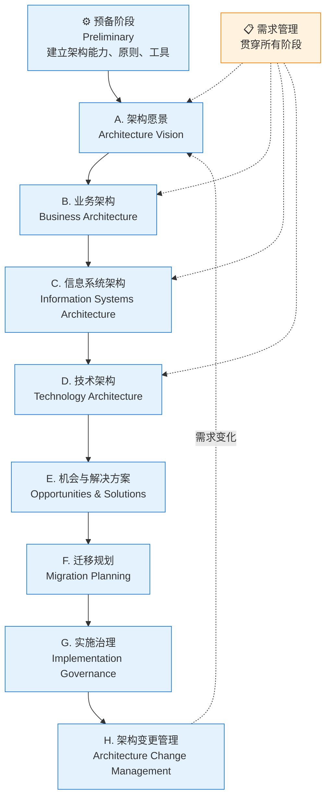
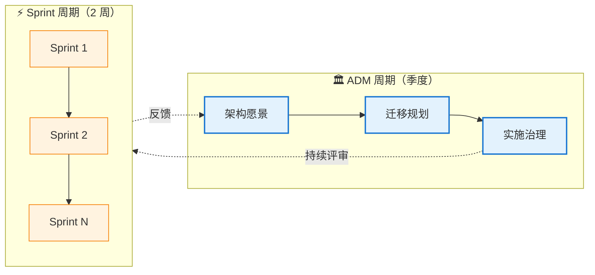

# 第一章：核心思想 + ADM 详解

> ⬅️ [返回目录](README.md) | 下一篇：[BCAT + 业务能力 + 价值流](business-capability.md)

---

## 🎯 一句话定位

**ADM（Architecture Development Method，架构开发方法）是 TOGAF 的核心引擎**——一个 9 阶段的循环迭代流程，把"业务战略"系统化地拆解为"可执行的 IT 蓝图"。TOGAF 10 在保留 9.x ADM 主体结构的基础上，强化了**敏捷适配**与**模块化裁剪**。

---

## 一、核心思想：从业务战略到技术实现的全链路对齐

当系统规模从"一个应用"扩展到"一个企业的数百个系统"时，单纯的技术设计已不够。企业架构回答的不是"这个类怎么设计"，而是：

```
业务战略 → 需要什么业务能力？ → 需要哪些数据支撑？
    ↓           ↓                    ↓
  价值链      业务能力地图         数据资产规划
    ↓           ↓                    ↓
  需要哪些应用？ → 用什么技术实现？ → 团队怎么组织？
    ↓              ↓                    ↓
  应用架构         技术架构            治理体系
```

**TOGAF 10 的核心贡献**：
1. **标准化的流程**（ADM）—— 9 阶段循环迭代
2. **统一的语言**（BCAT 四层 + 内容元模型）—— 跨团队沟通的基础
3. **治理体系**（6 维治理）—— 设计不被执行打折
4. **可配置的方法**（Series Guides）—— 适配不同行业与规模

---

## 二、ADM：架构开发方法详解

### 2.1 ADM 全景图



### 2.2 九阶段详解

#### ⚙️ 预备阶段（Preliminary）

| 项目 | 内容 |
|------|------|
| **目标** | 建立组织的架构能力、定义架构原则、选择工具 |
| **关键活动** | 1. 识别利益相关方 2. 定义架构原则 3. 选择 ADM 裁剪方案 4. 建立架构治理结构 5. 选型工具 |
| **输入** | 业务战略、IT 现状、约束条件 |
| **输出** | 架构原则清单、治理框架、ADM 裁剪计划 |
| **常见错误** | 跳过此阶段直接进入 A；不定义原则导致后续争议 |

#### A. 架构愿景（Architecture Vision）

| 项目 | 内容 |
|------|------|
| **目标** | 获得高管对架构项目的支持，定义范围与约束 |
| **关键活动** | 1. 业务场景（Business Scenarios）分析 2. 识别利益相关方关切 3. 草拟架构愿景声明 4. 评估业务能力差距 5. 风险与约束识别 |
| **输入** | 架构原则、业务战略、IT 战略 |
| **输出** | 架构愿景文档、Stakeholder Map、范围声明 |
| **工具提示** | Business Scenarios 是 TOGAF 10 推荐的开场方法 |

#### B. 业务架构（Business Architecture）

| 项目 | 内容 |
|------|------|
| **目标** | 描绘组织的业务能力、价值流、组织结构、信息流 |
| **关键活动** | 1. 业务能力地图 2. 价值流建模 3. 组织映射 4. 业务数据建模 5. 业务流程 |
| **输入** | 架构愿景、业务现状 |
| **输出** | 业务能力地图、价值流图、组织图、业务数据模型 |
| **关键产出物** | **业务能力地图**（详见[第二章](business-capability.md)） |

#### C. 信息系统架构（Information Systems Architecture）

| 项目 | 内容 |
|------|------|
| **目标** | 设计支持业务的数据架构 + 应用架构 |
| **关键活动** | 1. 数据架构（实体、关系、生命周期） 2. 应用架构（应用组合、服务目录） 3. 应用间接口与依赖 |
| **输入** | 业务架构、数据现状 |
| **输出** | 概念数据模型、逻辑数据模型、应用目录、服务依赖图 |
| **与 DDD 关系** | **数据架构 ≈ DDD 限界上下文划分**；**应用架构 ≈ 微服务边界** |

#### D. 技术架构（Technology Architecture）

| 项目 | 内容 |
|------|------|
| **目标** | 设计技术基础设施（硬件、软件、中间件、网络） |
| **关键活动** | 1. 技术选型（云/IaaS/PaaS） 2. 中间件与平台选型 3. 网络与部署拓扑 4. 安全架构 5. 可观测性方案 |
| **输入** | 应用架构、非功能需求 |
| **输出** | 技术栈清单、部署拓扑图、技术决策记录 |
| **与 OOD 关系** | OOD 设计模式在此层**编码实现**——技术架构决定了哪些模式可行 |

#### E. 机会与解决方案（Opportunities & Solutions）

| 项目 | 内容 |
|------|------|
| **目标** | 评估实现方案、识别项目组合、形成候选工作包 |
| **关键活动** | 1. 解决方案构建块（ABB/SBB）识别 2. 工作包（Work Package）定义 3. 项目依赖分析 4. 成本/收益初评 |
| **输入** | BCAT 四层架构、约束条件 |
| **输出** | 工作包清单、项目组合、依赖图 |
| **关键概念** | **ABB（Architecture Building Block）** vs **SBB（Solution Building Block）**——前者是架构层抽象，后者是具体产品/技术 |

#### F. 迁移规划（Migration Planning）

| 项目 | 内容 |
|------|------|
| **目标** | 制定从现状到目标架构的迁移路线图 |
| **关键活动** | 1. 实施项目排序 2. 风险与价值评估 3. 阶段性里程碑 4. 资源与预算规划 |
| **输入** | 工作包清单、约束条件 |
| **输出** | 实施与迁移计划、阶段性目标、ROI 评估 |

#### G. 实施治理（Implementation Governance）

| 项目 | 内容 |
|------|------|
| **目标** | 确保实施项目符合架构定义 |
| **关键活动** | 1. 架构合规性评审 2. 偏差影响评估 3. 变更请求管理 4. 项目复盘 |
| **输入** | 架构契约（Architecture Contract） |
| **输出** | 合规报告、变更授权、偏差纠正 |
| **关键机制** | **架构评审委员会（ARB）**——详见[第四章](architecture-governance.md) |

#### H. 架构变更管理（Architecture Change Management）

| 项目 | 内容 |
|------|------|
| **目标** | 持续监控架构变更、滚动更新架构基线 |
| **关键活动** | 1. 变更影响评估 2. 架构基线更新 3. 与业务需求管理对接 4. 定期架构健康检查 |
| **输入** | 变更请求、实际运行数据 |
| **输出** | 更新后的架构基线、变更趋势报告 |

### 2.3 需求管理（贯穿始终）

> **需求管理不是单独阶段，而是与所有阶段并行的横向活动**。它确保业务需求在 ADM 每个阶段都被持续追溯与验证。

---

## 三、ADM 迭代循环：现代实践

### 3.1 传统误区 vs 现代实践

| 误区 | 真相 |
|------|------|
| "ADM 必须从 A 到 H 顺序走完" | TOGAF 10 明确：**ADM 是迭代的**，可从任意阶段切入 |
| "必须完成所有阶段才能产生价值" | **MVP 思路**：先 A+B 出最小可用架构，再迭代 |
| "ADM 是一次性大型项目" | **持续节奏**：每个迭代周期 1-3 个月 |
| "只有大型企业才用 ADM" | **裁剪后**也适用于 10 人小团队（详见[第四章](architecture-governance.md)） |

### 3.2 与 Agile 融合



**关键原则**：

| 原则 | 含义 |
|------|------|
| **ADM 节奏** | 季度/半年——做架构决策、定原则 |
| **Sprint 节奏** | 双周/周——做实现、收集反馈 |
| **架构在 Sprint 中的角色** | Architecture Owner（参考 Team Topologies）参与关键 Sprint Review |
| **轻量文档** | 用 ADR 替代厚重的架构文档（详见[第四章](architecture-governance.md)） |

### 3.3 TOGAF 10 强调的"应用 TOGAF 方法"

TOGAF 10 引入了 **"Applying the TOGAF Approach"**（应用 TOGAF 方法）这一**实用指导篇章**，核心变化是：

- 减少对"严格按 ADM 顺序走"的强制
- 增加**对小型组织、敏捷团队的指导**
- 把 9.x 时代的"合规导向"调整为**"价值导向"**——架构不为了合规而存在，而是为了支撑业务敏捷

---

## 四、章节思考

1. **你的项目应该走完整 ADM 吗**：评估组织规模、变更幅度、时间窗口。大多数项目可以裁剪。
2. **MVP 架构愿景**：如果只做 ADM 的 A+B 两阶段，能产出什么价值？哪些"看起来重要但其实可后置"的环节被你忽略了？
3. **需求管理的难点**：需求从哪来？如何避免"需求池"变成无人维护的垃圾场？
4. **架构师与 Sprint 的关系**：你的架构师在 Sprint Review 中的角色是什么？是被动响应还是主动塑造？

---

## 相关章节

- ⬅️ [返回目录](README.md)
- ➡️ [第二章：BCAT + 业务能力 + 价值流](business-capability.md)
- 🏛️ [ADM 与需求管理（TOGAF 10 官方）](https://pubs.opengroup.org/togaf-standard/)
