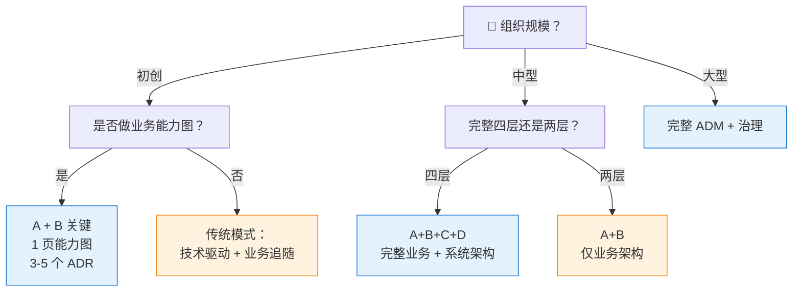

# 第四章：架构治理 + 落地实践

> ⬅️ [返回目录](README.md) | 上一篇：[康威定律 + 团队拓扑](conway-and-team-topology.md)

---

## 🎯 一句话定位

**架构设计只是开始，能否落地才是关键**。本章讲三件事：①架构治理 6 维度 ②ADR 实践 ③不同规模企业的**轻量级裁剪**。最后给出 TOGAF 的优势局限与总结。

---

## 一、架构治理：6 维治理体系

### 1.1 为什么需要治理

> 没有治理的架构 = **纸面架构（As-Designed）** 与 **实际架构（As-Built）** 严重偏离。  
> 治理的目标不是限制创新，而是**让设计决策可追溯、可复盘、可传承**。

### 1.2 六维治理框架

| 维度 | 关注点 | 实践方法 | 工具示例 |
|------|-------|---------|---------|
| **🔒 合规**（Compliance） | 项目符合架构标准 | 架构评审委员会（ARB）、架构契约 | 评审 checklist、ADR 模板 |
| **📜 合同**（Contracts） | 外部供应商的架构约束 | 架构条款写入采购合同 | 合同模板、技术标准附件 |
| **📋 决策**（Decisions） | 架构决策的记录与追踪 | **ADR（架构决策记录）** | Markdown 文件 + Git |
| **📢 沟通**（Communications） | 架构信息的分发与理解 | 架构 Wiki、架构看板、分享会 | Confluence、Notion、Obsidian |
| **🎓 能力**（Capabilities） | 架构人员的技能发展 | 架构师认证、培训体系、内部学习 | TOGAF 10 Foundation/Practitioner |
| **⚙️ 控制**（Controls） | 架构变更的管理 | 变更请求流程、影响评估、ARB 审批 | 变更管理系统 |

### 1.3 治理成熟度模型

| 等级 | 名称 | 特征 |
|:----:|------|------|
| **L1** | 初始级 | 架构决策靠个人，无记录 |
| **L2** | 反应级 | 有 ADR，但流程不规范 |
| **L3** | 已定义级 | 有清晰的治理流程和角色 |
| **L4** | 量化管理级 | 治理指标可度量（如合规率、决策周期） |
| **L5** | 优化级 | 治理本身持续改进 |

---

## 二、ADR：轻量级架构决策记录

### 2.1 什么是 ADR

> **ADR（Architecture Decision Record）**——记录**一个**重要的架构决策的轻量级文档。  
> 核心思想：**决策比文档重要，理由比结论重要**。

### 2.2 ADR 模板（TOGAF 10 推荐）

```markdown
# ADR-{编号}：{决策标题}

- **状态**：Proposed / Accepted / Deprecated / Superseded
- **日期**：YYYY-MM-DD
- **决策者**：{姓名/角色}
- **影响范围**：{受影响的系统/团队}

## 背景（Context）
我们面临什么问题？约束条件是什么？

## 决策（Decision）
我们决定做什么？

## 备选方案（Considered Options）
1. 方案 A：...
2. 方案 B：...
3. 方案 C：...

## 结果（Consequences）
### 正面
- ...

### 负面
- ...

## 参考
- 相关 ADR：ADR-{编号}
- 外部资料：...
```

### 2.3 ADR 示例

```markdown
# ADR-001：订单服务使用 PostgreSQL 而非 MongoDB

- 状态：Accepted
- 日期：2024-03-15
- 决策者：架构评审委员会
- 影响范围：订单服务、订单团队

## 背景
订单服务需要事务一致性（订单、支付、库存强关联），
且查询模式以"按订单 ID 查"为主，复杂报表查询较少。

## 决策
订单服务使用 PostgreSQL 16，配合 CITUS 扩展支持水平扩展。

## 备选方案
1. **PostgreSQL**（已选）：事务强一致、生态成熟
2. **MongoDB**：文档型、水平扩展强，但事务支持弱
3. **TiDB**：分布式 SQL，但运维成本高

## 结果
### 正面
- 事务一致性强，订单/支付/库存强一致
- 团队 PostgreSQL 经验成熟
- 后续可平滑迁移到 CITUS

### 负面
- 水平扩展需提前规划（CITUS）
- 大宽表性能需持续监控

## 参考
- 业务能力：订单管理
- 价值流：下单履约
```

### 2.4 ADR 落地的关键纪律

| 纪律 | 说明 |
|------|------|
| **每个重要决策一个 ADR** | 1 个决策 1 个文件，不混在一起 |
| **状态要更新** | Proposed → Accepted 后不再改；如被推翻，标 Superseded 而不是删除 |
| **理由比结论重要** | 5 年后看 ADR 的人不知道当时背景，记录"为什么"比"是什么"重要 10 倍 |
| **Git 托管** | 用 Git 版本控制，配合 PR/MR 评审 |
| **轻量级** | 1-2 页足够，不要写成长篇报告 |

---

## 三、按规模裁剪 ADM：轻量级落地

### 3.1 裁剪总览

| 组织规模 | 推荐裁剪 | ADM 重点 | 治理强度 |
|---------|---------|---------|---------|
| **初创团队**（< 50 人） | A + B 部分 | 架构愿景 + 业务能力图 | 极轻：1-2 个 ADR |
| **中型公司**（50-500 人） | A + B + C | 愿景 + 业务架构 + 信息系统架构 | 中等：ADR + 简单评审 |
| **大型企业**（> 500 人） | 完整 ADM | 全 9 阶段 | 完整：ARB + 治理委员会 |

### 3.2 初创团队：极简 TOGAF

```
适用阶段：架构愿景 (A) + 业务架构 (B) 关键部分
核心产出：
  - 1 页纸业务能力地图（L1 + L2）
  - 价值流图（1-2 条核心价值流）
  - 关键决策的 ADR（3-5 个）
```

**实操模板**：

```markdown
## 业务能力地图（1 页纸）
- L1 业务域：5-8 个
- L2 业务能力：20-30 个

## 价值流图（1-2 条）
- 核心价值流：客户从进入到转化的端到端路径

## 关键 ADR（3-5 个）
- 技术栈选型
- 关键架构决策
- 第三方依赖选型
```

### 3.3 中型公司：四阶段 TOGAF

```
适用阶段：A + B + C + D（不完整 D）
核心产出：
  - 完整业务能力地图
  - 2-3 条核心价值流
  - 信息系统架构（数据 + 应用）
  - 简版技术栈决策
  - ADR 库（持续维护）
```

### 3.4 大型企业：完整 ADM

```
适用阶段：全 9 阶段
核心产出：
  - 完整四层架构（BCAT）
  - 架构契约 + 实施治理
  - 架构评审委员会（ARB）
  - 架构师团队 + 角色分工
  - 治理成熟度 L3-L4
```

### 3.5 裁剪决策树



---

## 四、TOGAF 10 工具链

### 4.1 架构建模与协作

| 工具 | 用途 | TOGAF 兼容性 |
|------|------|------------|
| **Archi** | 开放开源 ArchiMate 建模 | ⭐⭐⭐⭐⭐ |
| **Visual Paradigm** | TOGAF 引导流程（Guide-Through） | ⭐⭐⭐⭐⭐ |
| **BiZZdesign** | 企业级 EA 平台 | ⭐⭐⭐⭐⭐ |
| **Avolution (ABACUS)** | 能力建模与价值流 | ⭐⭐⭐⭐ |
| **Sparx EA** | 通用 EA 工具 | ⭐⭐⭐⭐ |
| **ArchiMate 3.2** | 架构建模语言（与 TOGAF 10 配套） | ⭐⭐⭐⭐⭐ |

### 4.2 敏捷 + 治理

| 工具/标准 | 用途 |
|---------|------|
| **Open Agile Architecture™ v2.0** | TOGAF 10 配套敏捷架构标准（2025 发布） |
| **IT4IT™** | IT 价值链管理（The Open Group 数字标准组合） |
| **Digital Practitioner Body of Knowledge™** | 数字化转型知识体系 |

### 4.3 文档与决策

| 工具 | 用途 |
|------|------|
| **Git + Markdown** | ADR 托管（推荐：adr-tools / log4brains） |
| **Confluence / Notion** | 架构 Wiki、决策记录 |
| **Mermaid / PlantUML** | 架构图绘制（与 Markdown 集成） |

---

## 五、TOGAF 10 vs 9.x：解决了哪些痛点

| TOGAF 9.x 痛点 | TOGAF 10 改进 |
|---------------|---------------|
| 文档厚重、难以快速入门 | 模块化：Fundamental Content 清晰、Series Guides 按需 |
| 偏瀑布式，不适配敏捷 | "Applying the TOGAF Approach" + Open Agile Architecture 配套 |
| 文档源 Word 难协作 | AsciiDoc + Git 仓库，PR/MR 评审 |
| 缺乏配套标准 | 数字开放标准组合（IT4IT、ArchiMate、Open Agile Architecture） |
| 体系庞大学习成本高 | 认证分 Foundation / Practitioner 两级，分层降本 |

---

## 六、优势与局限

### 6.1 优势

| 优势 | 说明 |
|------|------|
| **🌍 全球最主流** | 150,000+ 认证，171 个国家，工具链与社区最全 |
| **🔗 完整方法论** | 从战略到治理的全链路，9 阶段循环 |
| **🧩 高度模块化**（v10） | 基础内容稳定，Series Guides 持续扩展 |
| **🤝 跨组织沟通** | 统一语言 + BCAT 模型，降低跨团队沟通成本 |
| **🛠️ 工具链成熟** | ArchiMate、Visual Paradigm 等工具深度支持 |

### 6.2 局限

| 局限 | 说明 |
|------|------|
| **⚖️ 偏重量级** | 完整实施需大量文档与流程，不适合小团队 |
| **📚 学习曲线** | 概念体系庞大，需专职架构师角色 |
| **🏢 文化依赖** | 治理 6 维度需要组织文化支持，否则流于形式 |
| **💰 认证成本** | TOGAF 10 认证培训费用较高 |
| **🔄 与敏捷的张力** | 即使 v10 加强了敏捷，仍需调适（详见[第三章](conway-and-team-topology.md)） |

---

## 七、总结：TOGAF 在系统设计中的位置

```
战略层：TOGAF（企业架构） → 决定"做什么系统、由谁做、怎么治理"
        ↓
中观层：DDD（领域驱动设计）→ 决定"系统边界在哪、业务是什么"
        ↓
战术层：OOD（面向对象设计） → 决定"类如何组织、方法如何分配"
        ↓
编码层：设计模式 + 编码规范  → 决定"常见问题如何优雅解决"
```

### 7.1 一句话总结

> **TOGAF 10 是一套"治理"框架**——它不教你设计类，但教你让数百个系统、数十个团队在统一方向下协同工作；它不规定答案，但提供结构化流程；它不强制瀑布，但通过裁剪适配任何规模。  
> **选不选 TOGAF，取决于你需要的不是"做架构"，而是"治架构"**。

### 7.2 何时学 TOGAF

| 你的角色 | 建议 |
|---------|------|
| **业务架构师 / EA** | 必学，且要拿 TOGAF 10 认证 |
| **资深后端工程师** | 选学，理解 ADM 与业务能力即可 |
| **前端/移动端工程师** | 了解概念，重点是理解康威定律与团队拓扑 |
| **技术负责人 / CTO** | 必学，重点是治理 6 维度 + 按规模裁剪 |

---

## 🤔 全课程思考

1. **你所在组织处于哪个阶段**：初创 / 中型 / 大型？对应应该用哪个裁剪级别？
2. **你的业务能力图 vs 组织结构图**：两者是否匹配？不匹配带来的"沟通债"有多大？
3. **ADR 库现状**：你做过几个 ADR？是否被团队 review？是否在新成员 onboarding 中使用？
4. **TOGAF 10 升级意愿**：你当前的 TOGAF 9.x 实践，是否有动力升级到 10？障碍是什么？

---

## 相关章节

- ⬅️ [返回目录](README.md)
- ⬅️ [上一篇：康威定律 + 团队拓扑](conway-and-team-topology.md)
- ⬅️ [上第一章：核心思想 + ADM 详解](adm.md)
- ⬅️ [上第二章：BCAT + 业务能力 + 价值流](business-capability.md)
- [架构认知的演进](../architecture-evolution/README.md) — OOD → DDD → TOGAF 的认知升级
- [领域驱动设计 DDD](../ddd/README.md) — TOGAF 业务能力 → DDD 限界上下文
- [面向对象设计 OOD](../ood/README.md) — SOLID 原则、GRASP
- [微服务架构](../microservices/README.md) — 康威定律与微服务

## 📖 外部参考

- [The Open Group TOGAF 10 官方文档](https://pubs.opengroup.org/togaf-standard/)
- [The Open Group 中国：TOGAF 10 更新与洞察](https://www.opengroup.org.cn/node/12411)
- [Open Agile Architecture v2.0](https://pubs.opengroup.org/standards/open-agile-architecture/)
- [ArchiMate 3.2 规范](https://pubs.opengroup.org/architecture/archimate3-doc/)
- [Team Topologies](https://teamtopologies.com/)
- [ADR 模板：log4brains](https://github.com/fundon/adr-tools)
