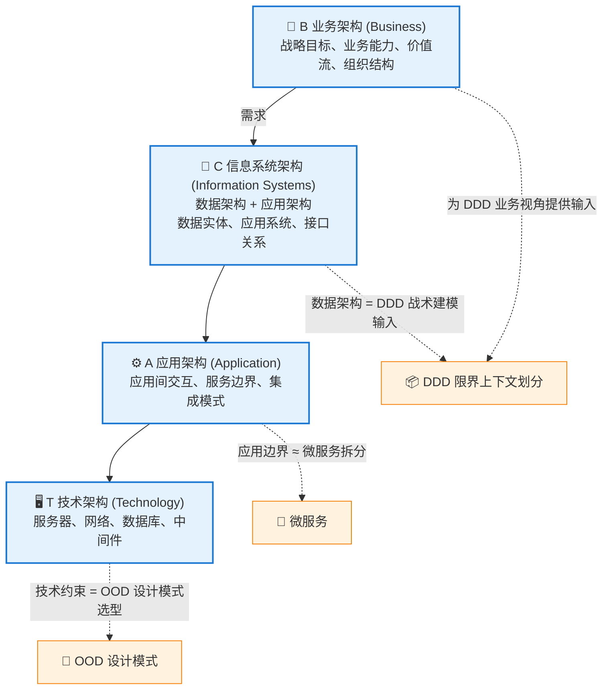

# 第二章：BCAT + 业务能力 + 价值流

> 最后更新: 2026-06-09
> ⬅️ [返回目录](README.md) | 上一篇：[核心思想 + ADM 详解](adm.md) | 下一篇：[康威定律 + 团队拓扑](conway-and-team-topology.md)

---

## 🎯 一句话定位

**业务能力 + 价值流是 TOGAF 10 的核心建模工具**——它们把"业务战略"翻译成"IT 可以支撑的事"。**BCAT 四层**则把这些事按层次落地。本章是 TOGAF 与 DDD、OOP 之间的**翻译层**。

---

## 一、BCAT：四个架构层次

### 1.1 BCAT 全景



> 📌 **注**：BCAT 的字母排序是历史遗留（来自 TOGAF 9 早期），实际理解顺序应是 **B → C → A → T**（业务先行）。

### 1.2 四层与 DDD/OOD 的关系

| 层次 | 关注点 | 核心产出物 | 与 DDD/OOD 的关系 |
|------|-------|-----------|------------------|
| **B 业务架构** | 战略目标、业务能力、价值流、组织结构 | 业务能力地图、价值流图 | 为 DDD 的领域划分提供**业务视角** |
| **C 信息系统架构** | 数据实体、应用系统、接口关系 | 数据模型、应用目录、接口规范 | **DDD 限界上下文**在此层落地 |
| **A 应用架构** | 应用间交互、服务边界、集成模式 | 服务依赖图、集成架构 | **微服务拆分**、**事件驱动设计** |
| **T 技术架构** | 服务器、网络、数据库、中间件选型 | 技术栈清单、部署拓扑 | **OOD 设计模式**在此层编码实现 |

---

## 二、业务能力：组织的"做什么"

### 2.1 业务能力定义

> **业务能力（Business Capability）**——一个组织**做什么**的能力单元，**与组织结构、流程、人员无关**。  
> 它回答的是"组织为了实现战略目标，需要具备什么能力"，而不是"现在由谁、怎么实现"。

| 特征 | 说明 |
|------|------|
| ✅ **稳定性** | 业务能力比组织结构稳定——能力持续 5-10 年，组织变动 1-2 年 |
| ✅ **完整性** | 业务能力图覆盖组织所有能力，构成完整的"能力地图" |
| ✅ **可衡量** | 能力有"成熟度等级"（L1-L5），可评估、可投资 |
| ✅ **可映射** | 业务能力 → 应用 → 技术，构成完整追溯链 |

### 2.2 业务能力 vs 业务流程 vs 组织结构

| 概念 | 关注点 | 稳定性 | 例子 |
|------|-------|:------:|------|
| **业务能力** | 做什么 | 高（5-10 年） | 订单管理、库存管理 |
| **业务流程** | 怎么做 | 中（2-5 年） | 订单处理流程、库存盘点流程 |
| **组织结构** | 由谁做 | 低（1-2 年） | 订单团队、库存团队 |

> 🎯 **关键洞察**：业务流程和组织结构会变，但业务能力相对稳定。**架构应该围绕稳定的"能力"设计，而不是不稳定的"流程"或"组织"**。

---

## 三、价值流：端到端为客户创造价值

### 3.1 价值流定义

> **价值流（Value Stream）**——从客户视角出发，端到端为客户创造价值的一系列活动的序列。  
> TOGAF 10 将价值流作为独立的 Series Guide 推出，**与业务能力并列**为核心建模工具。

### 3.2 业务能力 vs 价值流

| 维度 | 业务能力（Capability） | 价值流（Value Stream） |
|------|---------------------|---------------------|
| **视角** | 资产视角——组织**有什么** | 流程视角——组织**怎么交付** |
| **关注点** | 稳定的能力单元 | 动态的端到端活动 |
| **时间维度** | 横切（同一时间存在） | 时序（一段时间内完成） |
| **映射关系** | 价值流**穿越**业务能力 | 业务能力**支撑**价值流 |
| **典型用途** | 投资决策、能力差距分析 | 流程优化、瓶颈识别 |

### 3.3 价值流示例（电商下单）


每一步**穿越**多个业务能力（商品管理、订单管理、支付管理、物流管理、客服管理）。

---

## 四、业务能力地图绘制

### 4.1 电商企业业务能力地图

```
战略层：     ┌─ 商品管理 ─┐  ┌─ 订单履约 ─┐  ┌─ 客户服务 ─┐
            │  商品目录   │  │  订单处理   │  │  售后支持   │
核心能力：   │  价格管理   │  │  库存管理   │  │  投诉处理   │
            │  类目管理   │  │  物流调度   │  │  用户反馈   │
            └─────────────┘  └─────────────┘  └─────────────┘
                                    ↓
支撑层：     ┌─ 财务管理 ─┐  ┌─ 人力资源 ─┐  ┌─ IT 基础 ─┐
            │  预算控制   │  │  人员管理   │  │  运维管理   │
            │  成本核算   │  │  绩效考核   │  │  安全合规   │
            └─────────────┘  └─────────────┘  └─────────────┘
```

### 4.2 能力地图的"三层结构"

| 层级 | 性质 | 数量级 | 例子 |
|------|------|:------:|------|
| **战略层（L1）** | 业务域 | 5-10 | 营销、销售、供应链、财务 |
| **核心能力层（L2）** | 业务能力 | 20-50 | 商品管理、价格管理、订单管理 |
| **子能力层（L3）** | 细粒度能力 | 50-200 | 商品目录维护、商品上下架、商品分类 |

> **实操建议**：L1 + L2 已足够支撑架构决策。L3 可在需要时展开。

### 4.3 能力地图 + 价值流的叠加视图

```
            业务能力地图（资产视角）
            ┌──────────┐  ┌──────────┐  ┌──────────┐
            │ 商品管理 │  │ 订单管理 │  │ 物流管理 │
            └──────────┘  └──────────┘  └──────────┘
                    ↘           ↓           ↙
价值流（流程视角）       价值流: 下单履约
                    ↗           ↓           ↖
            ┌──────────┐  ┌──────────┐  ┌──────────┐
            │ 支付管理  │  │ 客户管理 │  │ 评价管理 │
            └──────────┘  └──────────┘  └──────────┘
```

**价值流穿越业务能力**——任何环节的能力缺失都会阻塞价值流。

---

## 五、业务能力 → DDD 限界上下文

### 5.1 映射关系

```
业务能力地图（TOGAF 业务架构层）
    ↓ 每个能力 = 一个限界上下文
限界上下文划分（DDD 战略设计）
    ↓ 每个上下文 = 一组聚合
聚合与实体设计（DDD 战术设计 / OOD）
    ↓ 每个聚合 = 一组协作的类
类与方法设计（OOD + 设计模式）
```

### 5.2 映射示例（电商）

| TOGAF 业务能力 | DDD 限界上下文 | 关键聚合 |
|--------------|---------------|---------|
| 商品管理 | `Product` Context | `Product` 聚合 |
| 订单管理 | `Order` Context | `Order` 聚合（含 `OrderItem`） |
| 支付管理 | `Payment` Context | `Payment` 聚合 |
| 物流管理 | `Logistics` Context | `Shipment` 聚合 |
| 客户管理 | `Customer` Context | `Customer` 聚合 |

> 🎯 **关键洞察**：**业务能力是微服务/限界上下文的"金标准来源"**。  
> 按业务能力拆分 → 自然形成清晰边界 → 团队规模与能力匹配 → 符合康威定律（[第三章](conway-and-team-topology.md)）。

### 5.3 业务能力规划的常见错误

| 错误 | 说明 | 解法 |
|------|------|------|
| ❌ 按组织结构划分 | 跟着组织变，组织变架构就得变 | 按能力划分，能力稳定 |
| ❌ 按技术分层划分 | 出现"数据服务/业务服务"等横向服务 | 按业务纵向切分 |
| ❌ 一个能力 = 一个服务 | 过度拆分，产生纳米服务 | 一个能力可能对应 1-3 个服务 |
| ❌ 能力地图一成不变 | 战略调整后能力地图不更新 | 每年重新审视能力地图 |

---

## 六、TOGAF 10 Series Guide：Business Capability Planning

> **来源**：TOGAF Series Guide: Business Capability Planning（2023 年发布）

### 6.1 业务能力规划的 4 步法


### 6.2 能力成熟度等级（参考 CMMI）

| 等级 | 名称 | 特征 |
|:----:|------|------|
| **L1** | 初始级（Initial） | 能力存在但不可控、依赖个人 |
| **L2** | 可重复级（Repeatable） | 基本流程已建立 |
| **L3** | 已定义级（Defined） | 流程标准化、文档化 |
| **L4** | 量化管理级（Managed） | 数据驱动、可度量 |
| **L5** | 优化级（Optimizing） | 持续改进、自动化 |

### 6.3 能力差距分析矩阵

| 业务能力 | 当前成熟度 | 目标成熟度 | 差距 | 投资优先级 |
|---------|:---------:|:---------:|:----:|:---------:|
| 商品管理 | L3 | L4 | L4-L3 = 1 | 高 |
| 订单管理 | L4 | L5 | L5-L4 = 1 | 中 |
| 物流管理 | L2 | L4 | L4-L2 = 2 | 高 |
| 客服管理 | L2 | L3 | L3-L2 = 1 | 中 |
| 数据治理 | L1 | L3 | L3-L1 = 2 | 极高 |

> **投资优先级 = 战略价值 × 差距**——高价值 + 大差距 = 优先投资。

---

## 七、章节思考

1. **你的业务能力图能画出来吗**：先尝试列出 L1（5-10 个业务域）。如果列不出，组织的战略对齐有问题。
2. **能力 vs 组织**：你的能力图是否被组织结构"污染"了？例如出现"产品部-研发部"这种"非能力"。
3. **能力差距分析**：你对每个能力的成熟度有数吗？还是只能凭感觉说"这块不行"？
4. **价值流 vs 流程图**：你的流程图是从客户价值出发，还是从部门职责出发？

---

## 相关章节

- ⬅️ [返回目录](README.md)
- ⬅️ [上一篇：核心思想 + ADM 详解](adm.md)
- ➡️ [下一篇：康威定律 + 团队拓扑](conway-and-team-topology.md)
- [领域驱动设计 DDD](../ddd/README.md) — 业务能力 → 限界上下文的落地
- [微服务架构](../microservices/README.md) — 能力拆分的服务化映射
