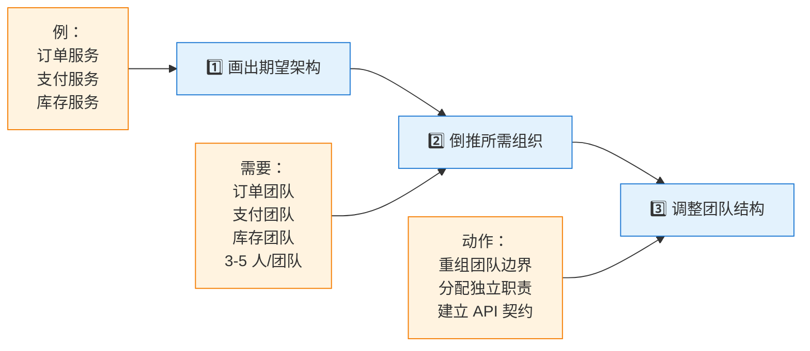
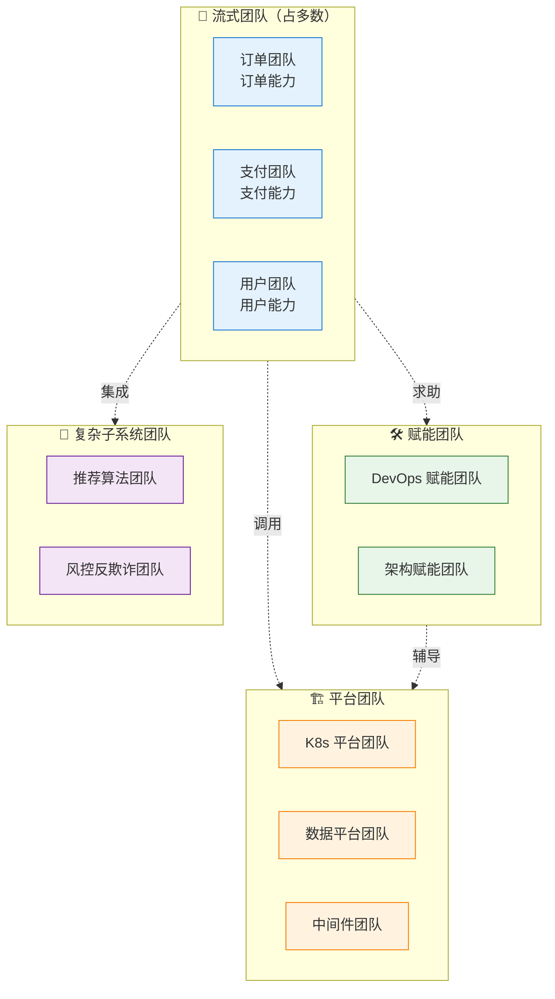

# 第三章：康威定律 + 团队拓扑

> ⬅️ [返回目录](README.md) | 上一篇：[BCAT + 业务能力 + 价值流](business-capability.md) | 下一篇：[架构治理 + 落地实践](architecture-governance.md)

---

## 🎯 一句话定位

**康威定律告诉我们"组织决定架构"，但我们可以反过来：用架构设计组织**——这就是**逆康威定律**。本章讲两个工具：**康威定律**（理解现实）+ **团队拓扑**（设计未来）。

---

## 一、康威定律：组织决定架构

### 1.1 原始定义

> **Any organization that designs a system... will inevitably produce a design whose structure is a copy of the organization's communication structure.**  
> （任何设计系统的组织...最终产生的设计在结构上都等同于该组织的沟通结构。）  
> — Melvin Conway, 1968

### 1.2 康威定律的现代解读

| 层次 | 含义 | 体现 |
|------|------|------|
| **L1：组织结构** | 部门/团队的划分 | 出现"前端组 / 后端组 / DBA 组" → 系统按"前端 / 后端 / 数据库"分层 |
| **L2：沟通路径** | 团队间的协作频率 | 团队沟通少 → 系统模块耦合低；沟通多 → 模块强耦合 |
| **L3：认知带宽** | 团队成员的理解能力 | 团队规模小 → 关注一个模块；规模大 → 分裂为多个服务 |

### 1.3 康威定律的现实案例

| 现实 | 反映的康威定律 |
|------|--------------|
| 前端团队抱怨"后端接口改不动" | L1：前后端组织分隔 → 系统按技术层分隔 |
| 微服务团队出现"分布式单体" | L2：服务团队间频繁沟通 → 服务边界强耦合 |
| 100 人团队做"一个应用" | L3：认知带宽不足 → 实际产生 3-5 个子应用 |

---

## 二、逆康威定律：用架构设计组织

### 2.1 核心理念

> **既然组织决定架构，那么反过来，调整组织就能调整架构。**  
> — J. Bates / "Inverse Conway Maneuver"

**实操三步**：



### 2.2 逆康威定律的实践示例

```
期望的微服务架构：     对应的组织调整：
┌─────────┐          ┌──────────┐
│ 用户服务 │  ←对应→  │ 用户团队  │  3-5 人，独立部署
├─────────┤          ├──────────┤
│ 订单服务 │  ←对应→  │ 订单团队  │  3-5 人，独立部署
├─────────┤          ├──────────┤
│ 支付服务 │  ←对应→  │ 支付团队  │  3-5 人，独立部署
└─────────┘          └──────────┘
   接口边界              沟通协议
```

**关键原则**：

| 原则 | 含义 |
|------|------|
| **3-5 人/团队** | Amazon "Two Pizza Team"——一个团队两张披萨喂得饱 |
| **独立部署** | 团队对自己的服务有完整所有权（你 build，你 run） |
| **长期稳定** | 团队不解散，对所辖服务长期负责 |
| **小沟通面** | 团队间的接口（API）数量要少、要稳定 |

### 2.3 逆康威 vs 顺康威

| 维度 | 顺康威（被动） | 逆康威（主动） |
|------|--------------|--------------|
| **因果链** | 组织 → 架构 | 架构 → 组织 |
| **时机** | 架构出现后才看组织 | 架构设计前先调组织 |
| **难度** | 容易 | 难（涉及人事变动） |
| **适用场景** | 短期项目 | 长期演进的企业架构 |

---

## 三、团队拓扑：4 种团队类型

### 3.1 Team Topologies 核心模型

> **来源**：M. Skelton & M. Pais，2019 年提出。TOGAF 10 将其与 Open Agile Architecture 标准深度融合。

四种核心团队类型：

| 团队类型 | 职责 | 典型规模 | 示例 |
|---------|------|:-------:|------|
| **🚢 流式团队** (Stream-aligned) | 端到端交付业务价值 | 3-9 人 | 订单团队（从下单到履约全链路） |
| **🛠️ 赋能团队** (Enabling) | 提升其他团队的能力 | 3-6 人 | 平台工程团队（提供 CI/CD 工具链） |
| **🧠 复杂子系统团队** (Complicated-subsystem) | 处理高技术领域难题 | 3-7 人 | 推荐算法团队、密码学团队 |
| **🏗️ 平台团队** (Platform) | 提供自服务内部平台 | 5-12 人 | 云平台团队（K8s、中间件、自服务 API） |

### 3.2 团队类型与 TOGAF 业务能力的对应



### 3.3 团队间交互模式

| 交互模式 | 含义 | 典型场景 |
|---------|------|---------|
| **协作** (Collaboration) | 紧密合作，共同开发 | 订单 + 支付 联合开发新支付方式 |
| **服务提供** (X-as-a-Service) | 平台向流式团队提供自服务 | 平台团队提供 K8s 集群自助申请 |
| **赋能** (Facilitating) | 赋能团队帮助流式团队掌握新技能 | DevOps 团队辅导业务团队使用 GitOps |
| **阻碍** ❌ | 团队互相推诿、阻塞 | 平台团队响应慢、流式团队抱怨 |

> 🎯 **健康组织** = 团队类型清晰 + 交互模式明确 + 阻碍情况罕见。

---

## 四、微服务 vs 康威定律

### 4.1 微服务失败的常见根因

| 失败模式 | 康威定律解释 |
|---------|------------|
| "**分布式单体**" | 服务间调用链长 → 反映团队间频繁沟通（强耦合） |
| "**纳米服务**" | 过度拆分 → 反映团队规模过小（认知带宽不足） |
| "**数据不一致**" | 共享数据库 → 反映组织未真正解耦 |
| "**改一行代码全链路失败**" | 强耦合链 → 反映团队间的依赖未治理 |

### 4.2 健康微服务的康威检验

| 检验项 | 健康标准 |
|--------|---------|
| **团队-服务对应** | 1 个服务 ≈ 1 个流式团队 |
| **沟通面** | 服务 A 改动不需通知服务 B → 团队沟通少 |
| **独立部署** | 服务 A 可独立发布，不依赖其他团队 |
| **认知可承受** | 单个服务代码量团队 1-2 周可读完 |

---

## 五、TOGAF 10 与团队拓扑的融合

TOGAF 10 通过 **Open Agile Architecture™** 标准（2025 年发布 2.0）与团队拓扑深度融合：

| 融合维度 | 体现 |
|---------|------|
| **角色** | ADM 中加入 "Architecture Owner"（类似 Team Topologies） |
| **节奏** | ADM 季度循环 + Team Topologies 团队感知 |
| **组织** | 业务能力 → 流式团队；基础设施 → 平台团队 |
| **文档** | TOGAF 内容元模型 + Team Topologies 团队 API 文档 |

---

## 六、章节思考

1. **你的组织结构决定了你当前的架构吗**：画一张当前团队组织图，再画当前系统架构图。两者相似度有多高？
2. **3-5 人/团队规则**：你团队里有超过 9 人的组吗？这些大团队是否应该拆分？
3. **团队类型诊断**：你的组织里，4 种团队类型（流式/赋能/复杂子系统/平台）各有多少？有没有类型错位（让流式团队做平台）？
4. **逆康威实践**：如果重新设计组织，会怎么切分？先画期望架构，再倒推组织。

---

## 相关章节

- ⬅️ [返回目录](README.md)
- ⬅️ [上一篇：BCAT + 业务能力 + 价值流](business-capability.md)
- ➡️ [下一篇：架构治理 + 落地实践](architecture-governance.md)
- [微服务架构](../microservices/README.md) — 康威定律与微服务边界
- [Team Topologies 官网](https://teamtopologies.com/) — 团队拓扑原始资料
