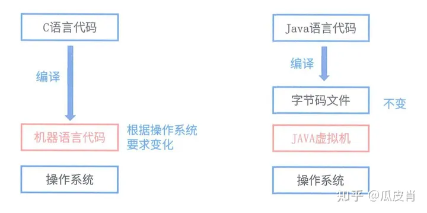
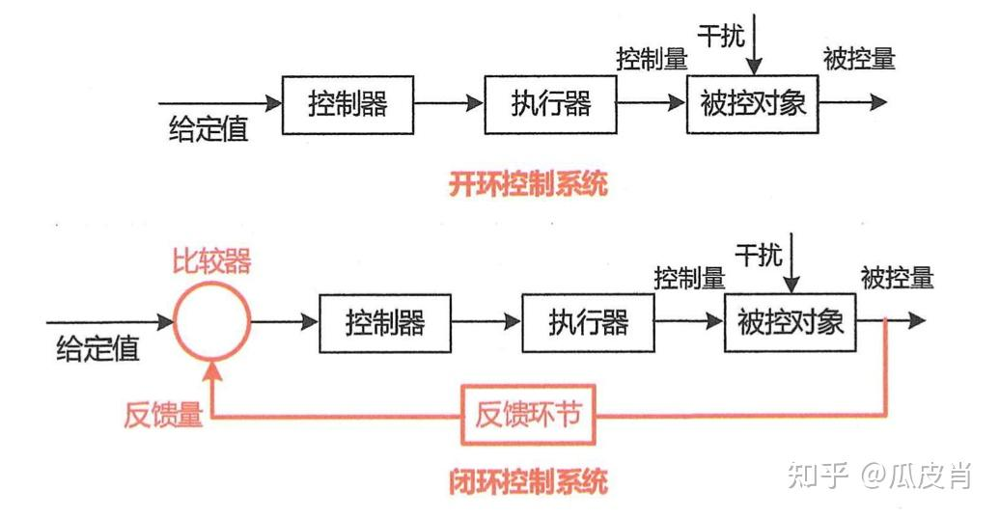

# 软件架构的风格

## 数据流风格

### 分类

> - **批处理序列**：大量整体数据、无用户交互。  
    > 
>
> - **管道/过滤器**：流式数据、弱用户交互。  
    > 

### 优缺点和典型场景

#### 优点

> - 良好的隐蔽性、可维护性。
> - 支持并行提升性能。
> - 松耦合。
> - 良好的可扩展性、可重用性。

#### 缺点

> - 灵活性较差，处理流程确定后不易改变。
> - 性能较差，每个过滤器构件都需要解析和合成数据。
> - 交互性较差，全局变量的共享很困难。
> - 复杂性较高，引入并行处理机制增加了系统复杂度。

#### 典型实例

> - 传统编译器网络报文处理

## 调用/返回风格

> 在系统中采用了调用与返回机制

### 分类

> - **主程序/子程序**：传统的函数调用机制。  
    > 
>
> - **面向对象-对象的方法调用**  
    > 
>
> - **层次架构-层与层之间的调用**  
    >   
    > [更多层次架构的风格介绍](#层次架构的风格)

### 优缺点和特点

#### 优点

> - 良好的重用性，只要接口不变可用在其他处
> - 可维护性好
> - 可扩展性好，支持递增设计

#### 缺点

> - 并不是每个系统都方便分层
> - 很难找到一个合适的、正确的层次抽象方法
> - 不同层次之间耦合度高的系统很难实现

### 特点

> - 各个层次的组件形成不同功能级别的虚拟机
> - 多层相互协同工作，而且实现透明

## 独立构件风格

> 独立构件风格主要强调系统中的每个构件都是相对独立的个体，它们之间不直接通信，以降低耦合度，提升灵活性。

### 分类

> - **进程通信**：不同进程之间的通信。
> 
> - **事件系统**：隐式调用、广播机制等。  
> 

### 优缺点和特点

#### 优点

> - 松耦合
> - 良好的重用性、可修改性、可扩展性

#### 缺点

> - 构件放弃了对系统计算的控制，一个构件触发一个构件时，不能确定其他构件是否会响应它，而且即使它知道事件注册了哪些构件过程，它也不能保证这些过程被调用的顺序；
> - 数据交换的问题；
> - 既然过程的语义必须依赖于被触发事件的上下文约束，关于正确性的推理就存在问题

#### 特点

> - 系统由若干子系统构成且成为一个整体，系统有统一的目标，子系统有主从之分，每一子系统有自己的事件收集和处理机制

## 虚拟机风格

### 分类

> - **解释器**：如Java虚拟机。  
> 
>
> - **基于规则的系统**：如专家系统。

### 优缺点、特点和场景

<table>
<thead>
<tr><th>子分类</th><th>优点</th><th>缺点</th><th>特点</th><th>场景</th></tr>
</thead>
<tbody>
<tr><td>解释器</td><td rowspan="2">可以灵活应对自定义场景</td><td rowspan="2">复杂度较高</td><td></td><td>适用于需要“自定义规则”的场合</td></tr>
<tr><td>规则为中心</td><td>在解释器的基础上增加经验规则</td><td>适用于专家系统</td></tr>
</tbody>
</table>

## 仓库风格

> 以数据为中心的软件架构风格

### 分类

> - **数据库系统**  
> 
>
> - **超文本系统**：超文本系统是基于超文本和超媒体的信息管理和展示系统，它允许文档之间通过链接相互关联，支持文本、图片、视频等多种媒体格式。
>
> - **黑板系统**：在以数据为中心的基础上，使用中心数据触发业务逻辑部件，常用于人工智能、信号处理等领域。  
> 

### 优缺点

#### 优点

> - 解决问题的多方法性
> - 具有可更改性和可维护性
> - 有可重用的知识源
> - 支持容错性和健壮性

#### 缺点

> - 测试困难。由于黑板模式的系统有中央系统构件来描述系统的体现系统的状态，所以系统的执行没有确定的顺序，其结果的再现性差，难于测试
> - 不能保证有好的解决方案
> - 效率低
> - 开发成本高
> - 缺少对并行机的支持

## 闭环控制架构（过程控制）

> 适用于嵌入式系统，用于解决简单闭环控制问题。  
>   
> 场景：空调温控，定速巡航

## C2风格（客户/协同者风格）

> 适用于嵌入式系统，用于解决简单闭环控制问题。  
> 